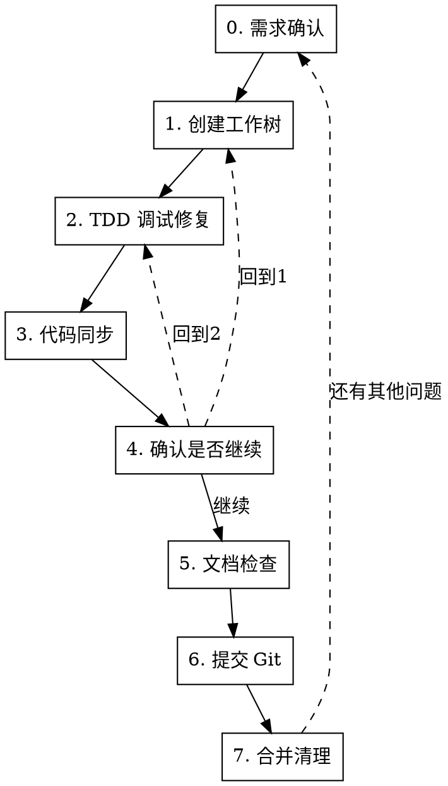

# Bug 修复工作流

## 概述

8 步严格顺序工作流：需求确认 → 隔离环境 → TDD 调试 → 代码同步 → 确认是否继续 → 文档检查 → 提交 → 合并清理。每步必须在前一步成功后才能继续。

## 何时使用

- 修复 bug 且需要隔离环境
- 用户提到"修bug流程"或"bug fix workflow"
- 需要系统化调试而非快速修补

**不适用：** 简单文本修改、新功能开发、纯文档修改

## 流程



<HARD-GATE>
严格按 0→1→2→3→4→5→6→7 顺序执行。禁止跳步、禁止省略步骤、禁止并行执行不同步骤。步骤 4 可回到步骤 1 或 2 重新执行。
</HARD-GATE>

### 步骤 0：需求确认

- 复述用户描述的 bug 需求（现象、复现条件、期望行为），确认理解是否有偏差
- 使用 `AskUserQuestion` 工具给出 2~4 个结构化选项（如"确认理解正确"/"需要补充细节"/"理解有误，重新描述"）供用户选择
- 推荐选项顺序：第一个为推荐项（标注"Recommended"）
- 收到用户选择后才可继续执行，不得自行跳过
- **不调用 `brainstorming`**：bug 修复是定位+修复问题，无需规格化设计文档与实现计划。`brainstorming` 留给真正需要设计的新功能

> **全局会话规则**：本工作流所有步骤中涉及用户决策的问题（步骤 2 失败询问、步骤 3 变基选择、步骤 4 是否继续、步骤 5 文档修复失败、步骤 6 失败、步骤 7 合并选择等）**都必须使用 `AskUserQuestion` 工具给出结构化选项**，不得用纯文本提问中断会话。

### 步骤 1：创建工作树

**必需技能：** `using-git-worktrees`

- 调用 `using-git-worktrees` 创建隔离工作树
- 后续所有操作在该工作树目录中进行
- **必须记录创建工作树前所在分支名**（如 `BASE_BRANCH`）供后续步骤使用：`git rev-parse --abbrev-ref HEAD`（在工作树创建前执行）
- **成功标准：** 工作树目录存在且可操作
- **失败：** 报错并停止，不继续
- **边界：** 已在 worktree 中 → 仍需新建工作树，确保隔离环境

### 步骤 2：TDD 调试修复

**必需技能：** `my-test-driven-debug`

- 调用 `my-test-driven-debug` 分析并修复 bug（执行到第四步重构为止，**不包含 lint 检查与 git 提交**——这两项由本工作流步骤 6 统一执行，避免重复）
- 修复前必须先写失败测试验证 bug 存在
- 调试期间可添加相关日志辅助排查问题（如关键变量值、坐标转换前后对比、条件分支走向等），日志应带功能标签前缀（如 `[F1.10]`）以便检索和清理
- **成功标准：** 失败测试转绿灯 + 重构完成（其他测试未被破坏）
- **失败：** 使用 `AskUserQuestion` 询问用户：继续调试 / 放弃并清理工作树

### 步骤 3：代码同步

本步骤拉取并变基到基线分支最新代码，确保在最终代码上执行后续步骤。

#### 3.1 拉取远端最新代码
- `git fetch origin` 同步远端最新状态
- 若 `BASE_BRANCH`（步骤 1 记录的原始分支）有更新：后续 rebase 会基于最新代码

#### 3.2 变基到 BASE_BRANCH 并解决冲突

- **先使用 `AskUserQuestion` 询问用户是否变基**：
  - 选项 1（推荐）：变基到 `origin/<BASE_BRANCH>`（基于远端最新）
  - 选项 2：变基到 `<BASE_BRANCH>`（仅本地）
  - 选项 3：不变基，跳过本子步，直接进入步骤 4
- **选择变基时**：执行 `git rebase origin/<BASE_BRANCH>` 或 `git rebase <BASE_BRANCH>`
  - **冲突处理流程：**
    1. `git status` 查看冲突文件列表
    2. 手动逐个文件解决冲突（保留正确逻辑、删除冲突标记 `<<<<<<<` `=======` `>>>>>>>`）
    3. `git add <已解决文件>` 标记冲突已解决
    4. `git rebase --continue` 继续 rebase
    5. 若 rebase 过程中有多个冲突 commit，重复步骤 1-4
    6. **成功标准：** `git status` 显示 `rebase in progress` 已结束，无冲突文件
  - **失败处理：** rebase 冲突无法解决 → 使用 `AskUserQuestion` 询问用户：
    - 选项 1（推荐）：使用 `git rebase --abort` 中止，提交当前状态（不包含本次 rebase 集成），回到步骤 2 在 BASE_BRANCH 最新代码上重新修复
    - 选项 2：继续手动解决冲突（提供具体冲突位置和上下文）
    - 选项 3：放弃本次修复，清理工作树
  - **禁止：** 强制 `--no-edit` 跳过冲突处理、使用 `git rebase --skip` 丢弃提交
- **选择不变基时**：直接进入步骤 4

#### 步骤 4：确认是否继续修复

在代码同步完成后、进入文档检查之前，询问用户是否需要回到早期步骤继续修复。

- 使用 `AskUserQuestion` 工具给出结构化选项：
  - 选项 1（推荐）：继续进入步骤 5 检查测试文档
  - 选项 2：回到步骤 1 创建新工作树重新修复（当前工作树保留或清理由用户决定）
  - 选项 3：回到步骤 2 重新 TDD 调试修复（在同一工作树中继续）
- **用户选择继续**：进入步骤 5
- **用户选择回到步骤 1 或 2**：跳转到对应步骤重新执行，后续步骤顺序推进

#### 步骤 5：检查测试文档

**可选技能：** `my_test_doc_update`（项目级技能，可能不存在）

- **先检测技能是否存在**：在工作目录的 `.trae/skills/my_test_doc_update/SKILL.md` 或全局技能目录中查找
  - **存在**：调用 `my_test_doc_update` 检查并同步测试文档
  - **不存在**：跳过，输出提示"未找到 my_test_doc_update 技能，跳过测试文档同步"，继续步骤 6
- **成功标准：** 文档与代码变更一致（技能存在时）；技能不存在时直接通过
- **失败：** 自动修复后继续；修复失败则使用 `AskUserQuestion` 询问用户

### 步骤 6：提交 Git

**必需技能：** `git-commit`

**流程顺序：lint → commit → push，缺一不可。**（fetch/rebase 已移至步骤 3）

#### 6.1 代码质量检查
- Swift 项目必须先通过 `swiftlint lint --strict`
- 运行项目对应的 lint / typecheck 命令
- **失败：** 修复 lint 错误后重新检查，不得跳过

#### 6.2 提交
- 调用 `git-commit` 技能提交变更
- **成功标准：** commit 成功
- **失败：** 回到步骤 2 修复问题，不跳过

#### 6.3 Push 到远端
- 先 `git remote -v` 确认远端仓库存在
- 若分支无 upstream：`git push -u origin <当前分支>`
- 若分支已有 upstream：`git push`
- **push 失败处理：** push 失败（如无网络、远端拒绝、权限不足等）→ 使用 `AskUserQuestion` 询问用户：重试 / 跳过 push 继续 / 停止工作流
- **禁止使用 `git push --force` / `git push -f`**（除非用户明确要求）
- **禁止推送到 main/master**（除非用户明确要求）

#### 6.4 同步 AI-test 测试工作树

确保 AI-test 测试工作树复位到最新修复分支，便于测试验证最新代码。

**必须完成本步骤后方可进入步骤 7**（用户选择"不同步"视为 6.4 完成，可直接进入步骤 7）。

- **先询问用户是否需要同步 AI-test 工作树**：使用 `AskUserQuestion` 工具给出结构化选项
  - 选项 1（推荐）：同步 AI-test 工作树 → 继续以下流程
  - 选项 2：不同步，结束 6.4
- **获取当前修复分支名**：`FIX_BRANCH=$(git rev-parse --abbrev-ref HEAD)`（当前工作树所在分支，即步骤 1 创建的修复分支）
- **AI-test 工作树路径**：`<worktree_dir>/AI-test`，其中 `<worktree_dir>` 为 `<project-name>-worktrees`（步骤 1 工作树目录的上级）
- **不存在则创建**：基于当前修复分支创建 AI-test 工作树（分支 `AI/test`）
  ```bash
  git worktree add <worktree_dir>/AI-test -b AI/test $FIX_BRANCH
  ```
- **已存在则同步**：使用 `git reset --hard` 将 `AI/test` 分支同步到新修复分支最新 commit
  ```bash
  git -C <worktree_dir>/AI-test reset --hard $FIX_BRANCH
  ```
- **成功标准**：AI-test 工作树 HEAD 等于当前修复分支最新 commit，工作区干净
- **失败**：使用 `AskUserQuestion` 询问用户：重试 / 跳过继续 / 停止工作流

### 步骤 7：合并清理

- 使用 `AskUserQuestion` 询问用户是否需要合并到创建工作树前的分支
  - **必须包含"还有其他问题吗？"选项**（如"合并"/"不合并"/"还有其他问题"），让用户在合并/不合并之外可选择反馈新问题
- 如合并：执行 `git rebase <原分支> <工作树分支>` 变基到最新，再 `git checkout <原分支> && git merge --no-ff <工作树分支>` 合并
- 清理工作树：删除工作树目录
- **用户选择不合并：** 仅清理工作树，保留原分支不变
- **用户选择"还有其他问题"：** 接收用户提出的新问题描述，**重新从步骤 0 开始**（需求确认 → 创建新工作树 → TDD 调试修复 → ...），工作流循环执行
  - 注意：每轮问题应不再使用新的独立工作树，除非明确要求
- **用户中途中断：** 使用 `AskUserQuestion` 询问是否保留工作树

## 红线 — 停下来重新开始

- 跳过步骤 2 直接写修复代码
- 步骤 6 lint 不通过时强行提交
- 没有失败测试就写修复
- 技能存在时跳过步骤 5 不检查文档（技能不存在而跳过属于正常流程）

**以上所有都意味着：回到违规步骤重新执行。**
