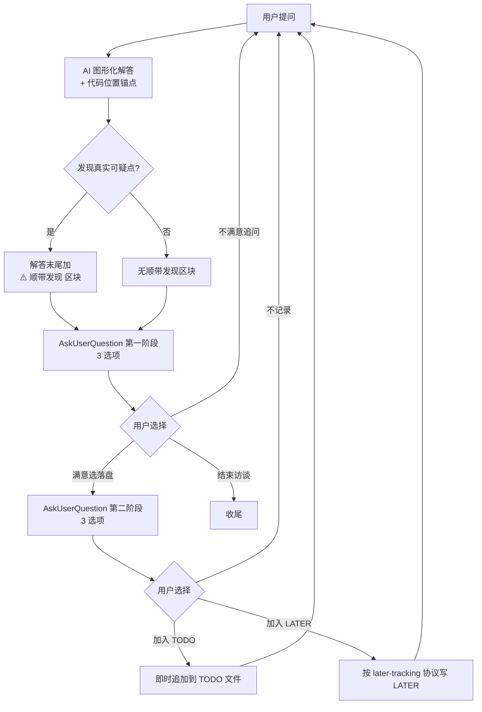

# 代码访谈 (Code Q&A Grilling)

## 概述

用户对既有代码逐条提问，助理解答**必须**用图形化展示（Mermaid 流程图/状态图/时序图/类图为主，复杂架构或 UI 对比场景启动 HTML server），解答末尾**可选**加「⚠️ 顺带发现」区块（仅真实可疑点时，不强行凑），随后**必须**用 `AskUserQuestion` 进行**两阶段提问**：第一阶段问满意度（3 选项），满意时进入第二阶段问落盘方式（TODO / LATER / 不记录）；TODO 写入 `./docs/AI/codeqa-todo/codeqa_TODO.md`，LATER 复用 `/docs/AI/LATER.md` 按 later-tracking 协议；收尾时刷新 TODO 头部汇总 + git add + commit，**不进入批量修复**（如需修复建议调 docreview-grilling 第 5 步或单独 bug-fix-workflow）。

**核心原则：每轮答完必进两阶段提问、解答必含图形化、代码位置必附锚点、跨文件搜索必用子代理、AI 仅真实可疑点挑刺、TODO 即时落盘、收尾必提交、不修复。**

## 何时使用

触发关键词（任一即激活）：
- "代码访谈" / "代码 grilling"
- "code grilling" / "codeqa"
- "/codeqa-grilling"
- 语义触发：用户提供代码路径/函数/模块并开始提问

适用场景：
- 用户对既有代码做交互式 Q&A
- 用户希望每轮答完被询问满意度与落盘方式
- 用户希望解答用流程图/状态图/时序图等图形化展示

不适用：
- 一次性问答（直接答完即可）
- 文档审核（用 docreview-grilling）
- 纯代码审查找问题（用 chinese-code-review / TRAE-code-review）
- 让 AI 生成新代码（用 feature-development-workflow）

## 核心协议

### 1. 启动（极简）

收到触发词后：
1. 若用户消息已含代码位置/函数名/模块名 → 跳过位置询问
2. 若未含 → `AskUserQuestion` 询问"想问哪部分代码？"（函数 / 模块 / 文件 / 整体架构）
3. `AskUserQuestion` 确认 TODO 文件保存路径，默认 `./docs/AI/codeqa-todo/codeqa_TODO.md`（LATER 路径固定 `/docs/AI/LATER.md`，不询问）
4. 进入问答循环：等待用户第一个问题

**不询问图形化开关与 AI 挑刺开关**（默认启用）。**TODO/LATER 文件此时不创建**，首次有 TODO/LATER 标记时才创建。

### 2. 单轮问答循环（必须严格遵守）



**每轮解答后必须立即调 `AskUserQuestion`，不得直接等待文本输入。**

#### 2.1 图形化解答要求

| 问题性质 | 图形类型 | 渲染方式 |
|----------|----------|----------|
| 执行流程 / 决策路径 | 流程图 | Mermaid `flowchart` 内联 |
| 状态机 / 对象生命周期 | 状态迁移图 | Mermaid `stateDiagram-v2` 内联 |
| 函数调用链 / 并发交互 | 时序图 | Mermaid `sequenceDiagram` 内联 |
| 模块关系 / 类依赖 | 类图 | Mermaid `classDiagram` 内联 |
| 架构图 5+ 节点复杂 | 架构图 | HTML server（详见 2.3） |
| UI 原型 / 视觉对比 | 原型图 | HTML server（详见 2.3） |
| 枚举 / 参数对照 | 表格 | Markdown 表格 |
| 算法 / 单函数实现细节 | 代码块 | Markdown 代码块（必要时配 Mermaid） |

**强制规则：**
- 每次解答**至少有一种图形化**（流程图/状态图/时序图/HTML 之一），除非问题纯文字（参数表/枚举）
- 解答**必须**附代码位置锚点 `[文件名#L行号](file:///绝对路径#L行号)`
- 多个代码位置分别附锚点

#### 2.2 AI 主动挑刺（「⚠️ 顺带发现」区块）

**触发条件：** 解答中确实发现真实可疑点（潜在 bug / 性能问题 / 不一致 / 明显技术债）。**不强凑**——没发现就不加。

**呈现方式：** 解答末尾加区块：
```
⚠️ 顺带发现：
1. [代码位置#L23] 缺少 null 检查，可能 NPE
2. [代码位置#L45] 循环复杂度 O(n²)，数据量大时可能慢
```

**规则：**
- 不改变两阶段提问选项
- 用户对可疑点感兴趣 → 选「不满意追问」深入
- 不感兴趣 → 选「满意选落盘」继续
- 用户明确说"只问这个别挑刺" → 当前轮不挑刺
- 可疑点不直接生成 TODO，需用户在追问中确认后才落盘

#### 2.3 HTML server 启动（复杂场景）

**触发条件（任一即启动，不询问用户直接执行）：**
- 架构图 5+ 节点且关系复杂
- UI 原型 / 视觉对比
- 用户明确要求"在浏览器中展示"

**启动协议：**
1. 检查会话内是否已启动 server → 未启动则调 `brainstorming/scripts/start-server.sh --project-dir <项目根>`
2. 保存返回的 `screen_dir` 和 `url`
3. 用 `Write` 写入 HTML 内容片段到 `screen_dir`（不复用文件名，每次新文件）
4. 解答中告诉用户 URL
5. 后续复杂场景会话内复用同一 server

**HTML 文件位置：** `.superpowers/codeqa/<session>/`（由 brainstorming server 自动管理到 `.superpowers/brainstorm/`，本 skill 命名空间区分用）

**清理协议：** 用户选「结束访谈」时调 `brainstorming/scripts/stop-server.sh $SCREEN_DIR`；HTML 文件持久化供后续查看。

#### 2.4 第一阶段提问（每轮必问，3 选项）

| 选项 | 行为 |
|------|------|
| 满意，选择落盘方式 | 进入第二阶段 |
| 不满意，追问 | 等待用户继续提问 |
| 结束访谈 | 进入收尾 |

#### 2.5 第二阶段提问（仅满意时，3 选项）

| 选项 | 行为 |
|------|------|
| 加入 TODO | **立即**追加到 TODO 文件（首次创建文件+头部） |
| 加入 LATER | 按 later-tracking 协议（Grep 去重 + 子代理精判）追加到 LATER 文件 |
| 不记录 | 等待用户下一题 |

### 3. 代码验证纪律（必须严格遵守）

**主代理仅可：** `Read` 已知具体文件的具体行（用户提了路径，或子代理已返回精确位置后）。

**主代理不得：** 直接调用 `Grep` / `SearchCodebase` 跨文件搜索。

**必须用 `Task` 分派 `search` 子代理的场景：**
- 跨文件搜索（"这个函数被谁调用？"）
- 调用链分析（"调用栈？"）
- 模式匹配（"哪里有类似的实现？"）
- 任何会扫描多个文件的查询

**唯一例外：** `Read` 已知具体文件的具体行可由主代理直接做，不算"验证代码"。

**解答必须附代码位置锚点** `[文件名#L行号](file:///绝对路径#L行号)`，子代理返回结果后主代理可 `Read` 指出的具体行做精确解读。

### 4. TODO 文件维护（即时追加 + 收尾刷新）

**路径：** 启动时确认（默认 `./docs/AI/codeqa-todo/codeqa_TODO.md`）。

**首次追加（创建文件）：** 用户首次选「加入 TODO」时，按确认路径创建文件，写入头部 + 首条 TODO。

**后续每次追加：** 用户每选一次「加入 TODO」，**立即**追加到文件末尾，编号 = 已追加条数 + 1。不重写头部，不重写已有 TODO 行。**TODO 条目之间不留空行**。

**收尾时：** 在头部（`访谈代码::` 行）之后、首条 TODO 之前**插入「访谈汇总」区块**（详见第 6 步）。TODO 行已在过程中落盘，不重写；汇总区块为新增插入。

**空场景：** 用户从未选「加入 TODO」就直接结束，文件未创建，**直接不写文件，不询问**。

**格式：** Markdown 任务列表语法（`- [ ] TODO1.` + 缩进 `key:: value`）。

模板：
```
- 访谈代码:: path/to/reviewed-code.ts
- 访谈时间:: YYYY-MM-DD HH:MM ~ HH:MM
- 访谈汇总:: N 个问题，按类型分布（解读:X / bug:Y / 优化:Z），按落盘分布（TODO:A / LATER:B / 不记录:C）
- [ ] TODO1. [Pn] 问题简述 #分类标签
  - 代码位置:: [file.ts#L30-45](file:///absolute/path/to/file.ts#L30-45)
  - 问题:: 用户问什么 + AI 发现什么
  - 改进建议:: 应该怎么改（按需，解读类可省略整行）
  - 图形化预览:: [查看](file:///path/to/preview.html)（可选，仅 HTML server 时添加，无则省略整行）
  - 访谈时间:: YYYY-MM-DD HH:MM
```

**字段说明：**

| 缩进属性 | 取值 | 必有性 |
|----------|------|--------|
| 代码位置 | 可点击链接 `[文本](file:///绝对路径#L行号)` | **必有** |
| 问题 | 用户问什么 + AI 发现什么 | **必有** |
| 改进建议 | 应该怎么改 | 按需（解读类可省略整行） |
| 图形化预览 | 可点击链接到 HTML 文件 | 可选（仅 HTML server 时添加，无则省略整行） |
| 访谈时间 | YYYY-MM-DD HH:MM | **必有** |

**第一行要求：** 简洁、准确、可独立理解。分类标签用产品功能 + 性质双标签：
- 性质标签：`#解读` / `#bug` / `#优化` / `#重构` / `#技术债` / `#通用`（兜底）
- 产品功能标签：`#登录` / `#支付流程` / `#权限控制` 等
- 至少 1 个，可多标签

**优先级：** P0(阻塞) / P1(重要) / P2(一般) / P3(优化)

- ✅ `- [ ] TODO1. [P1] cache.set 更新分支漏 delete 导致顺序错乱 #bug #缓存`
- ❌ `- [ ] TODO1. [Pn] 有问题 #通用`（描述笼统，性质标签缺失）

### 5. LATER 文件维护（按 later-tracking 协议）

**路径：** `/docs/AI/LATER.md`（项目根目录，固定，不询问）。

**写入协议（严格按 later-tracking）：**
1. `Read` `/docs/AI/LATER.md`
2. `Grep` 关键词粗筛候选
3. 有候选 → `Task` 子代理精判是否同一事项
4. 同一事项 → 修改已有条目（合并简洁描述）
5. 独立事项 → 新增条目到末尾
6. 无候选或文件不存在 → 首次创建（加标题行）

**格式：**
```
- [ ] LATER1. 简要描述（≤80 中文字符）#模块标签
```

**LATER 不在本 skill 收尾时 git 提交**（later-tracking 协议未要求即时提交），统一在收尾时与 TODO 一起提交。

### 6. 多方案处理（完全继承 docreview）

若该问题有多种解决方向（如"如何优化"有多方案），**必须**在解答中列出全部候选方案、给出推荐方案及理由，并用 `AskUserQuestion` 让用户选定；用户选定的方案才作为该问题的结论，后续写入 TODO 的「改进建议」字段只写用户选定的方案，不堆砌多方案。若只有单一方向则直接解答。

### 7. 收尾（仅落盘不修复）

用户选「结束访谈」后：
1. **TODO 文件处理：**
   - 若文件已创建：在头部（`访谈代码::` 行）之后、首条 TODO 之前**插入「访谈汇总」区块**（不重写已有内容）：
     ```
     - 访谈汇总:: N 个问题，按类型分布（解读:X / bug:Y / 优化:Z / 重构:W / 技术债:V），按落盘分布（TODO:A / LATER:B / 不记录:C）
     - 访谈时间:: YYYY-MM-DD HH:MM ~ HH:MM
     ```
   - 若未创建（空场景）：告知用户本次未记录 TODO，跳过后续 TODO 步骤
2. **若会话启动过 HTML server：** 调 `brainstorming/scripts/stop-server.sh $SCREEN_DIR` 关闭
3. **git 提交（统一）：**
   - `git add <TODO 文件> <LATER 文件>`（LATER 文件若有变更）
   - `git commit`，commit message 格式：`docs(codeqa-grilling): 记录 <code-name> 访谈 N 个 TODO + M 个 LATER`
   - 若 TODO 和 LATER 都未创建（双空场景）：跳过 git 提交
4. **输出文件路径**（markdown 链接 `[文件名](file:///绝对路径)`）
5. **简要汇总口述：** N 个问题，按类型分布（解读:X / bug:Y / 优化:Z），按落盘分布（TODO:A / LATER:B / 不记录:C）
6. **提示后续路径：**
   - 若需批量修复 TODO → 建议"调用 docreview-grilling 第 5 步流程"或"对单条 TODO 调用 bug-fix-workflow / feature-development-workflow"
   - LATER 项跨会话留存，后续会话可回顾

## 红线 - 停下并修正

- **解答未含任何图形化**（纯文字描述流程/状态/调用） → 必须用 Mermaid 流程图/状态图/时序图/类图（除非纯文字问题如参数表）
- **解答未附代码位置锚点** → 必须用 `[文本](file:///绝对路径#L行号)` 可点击链接
- **跨文件搜索由主代理直接 Grep/SearchCodebase** → 必须用 `Task` 分派 `search` 子代理；主代理仅可 `Read` 已知具体文件具体行
- **答完直接等输入** → 必须立即调 `AskUserQuestion` 第一阶段
- **单阶段提问或无提问** → 必须两阶段（满意后必进第二阶段选 TODO/LATER/不记录）
- **两阶段选项少于 3 个或改语义** → 第一阶段固定 3 选项（满意选落盘/不满意追问/结束），第二阶段固定 3 选项（TODO/LATER/不记录）
- **TODO 积压到结束才写** → 用户选「加入 TODO」后必须立即追加到文件，禁止积压
- **LATER 写入不走 later-tracking 协议** → 必须 Grep 去重 + 子代理精判
- **LATER 描述超 80 字符或展开成段落** → LATER 是索引不是文档，必须压缩
- **多方案问题未列方案就解答** → 必须列全部候选 + 推荐 + 理由，用 `AskUserQuestion` 让用户选定
- **TODO 改进建议字段堆砌多方案** → 只写用户选定的方案
- **AI 强凑可疑点**（每轮必加「⚠️ 顺带发现」） → 仅真实可疑点时加，没发现就不加
- **可疑点直接生成 TODO** → 必须用户在追问中确认后才落盘
- **用户明确说"别挑刺"仍挑刺** → 当前轮不挑刺
- **HTML server 询问用户是否启动** → 触发条件满足时直接启动（用户规则：浏览器展示直接执行）
- **复杂架构图用 Mermaid 硬塞**（5+ 节点挤成一团） → 必须启动 HTML server
- **未启动 server 就写 HTML 文件** → 必须先调 `start-server.sh` 拿到 `screen_dir`
- **HTML 文件复用文件名** → 每个屏幕必须新文件名
- **收尾不刷新 TODO 头部汇总** → 必须在头部之后插入「访谈汇总」区块
- **收尾不 git 提交** → 必须 `git add <TODO> <LATER>` + `git commit`
- **收尾自动进入批量修复** → 本 skill 不修复；如需修复建议用户调 docreview-grilling 第 5 步
- **TODO 字段缺代码位置/问题/访谈时间** → 3 必有字段必须齐全
- **代码位置/图形化预览用纯文本而非可点击链接** → 必须用 `[文本](file:///绝对路径#L行号)`
- **TODO 第一行过于笼统**（如「有问题」） → 必须简洁准确、可独立理解
- **标签缺失或仅性质无产品功能** → 至少 1 个标签，性质 + 产品功能双标签
- **启动询问图形化/AI 挑刺开关** → 默认启用，不询问
- **启动询问 LATER 路径** → 固定 `/docs/AI/LATER.md`，不询问

**违反以上任一条 = 违反本技能的精神。**

## 常见错误

| 错误 | 修复 |
|------|------|
| 解答纯文字描述状态流转 | 必须用 Mermaid `stateDiagram-v2` 内联图 |
| 跨文件搜索直接 Grep | 必须用 `Task` 分派 `search` 子代理 |
| 解答不附代码位置锚点 | 必须用 `[文本](file:///绝对路径#L行号)` |
| 答完直接等输入 | 必须立即调 `AskUserQuestion` 第一阶段 |
| 单阶段提问或不提问 | 必须两阶段：满意后必进第二阶段选 TODO/LATER/不记录 |
| 选项少于 3 个或改语义 | 第一阶段 3 选项，第二阶段 3 选项，顺序语义不可变 |
| TODO 积压到结束才写 | 用户选「加入 TODO」必须立即追加到文件 |
| LATER 不去重直接新增 | 必须 Grep 粗筛 + 子代理精判 |
| LATER 描述超 80 字符 | LATER 是索引不是文档，必须压缩到单行 |
| 多方案直接给推荐不问用户 | 必须列全部 + 推荐 + 理由，`AskUserQuestion` 让用户选定 |
| TODO 改进建议堆砌多方案 | 只写用户选定的方案 |
| 每轮必凑「⚠️ 顺带发现」 | 仅真实可疑点时加，没发现就不加 |
| 可疑点直接生成 TODO | 必须用户在追问中确认后才落盘 |
| 用户说"别挑刺"仍挑 | 当前轮不挑刺 |
| HTML server 询问用户是否启动 | 触发条件满足直接启动（浏览器展示不询问） |
| 复杂架构图硬塞 Mermaid | 5+ 节点必须启动 HTML server |
| 未启动 server 就写 HTML | 必须先调 `start-server.sh` 拿 `screen_dir` |
| HTML 文件复用文件名 | 每个屏幕必须新文件名 |
| 收尾不刷新 TODO 头部汇总 | 必须插入「访谈汇总」区块 |
| 收尾不 git 提交 | 必须 `git add <TODO> <LATER>` + `git commit` |
| 收尾自动进入批量修复 | 本 skill 不修复；建议用户调 docreview-grilling 第 5 步 |
| TODO 字段缺 3 必有 | 代码位置/问题/访谈时间必须齐全 |
| 代码位置用纯文本 | 必须用 `[文本](file:///绝对路径#L行号)` 可点击链接 |
| TODO 第一行笼统 | 必须简洁准确、可独立理解 |
| 标签缺失或仅性质 | 性质 + 产品功能双标签，至少 1 个 |
| 启动询问图形化/AI 挑刺开关 | 默认启用，不询问 |
| 启动询问 LATER 路径 | 固定 `/docs/AI/LATER.md`，不询问 |

## 合理化借口表

| 借口 | 现实 |
|------|------|
| "用户说赶时间，画 Mermaid 反而要先读图，文字箭头链更快" | Mermaid 渲染后一眼看懂；文字箭头链对复杂状态机反而更慢理解。赶时间不是降低质量标准的理由 |
| "没真实行号附锚点会误导用户" | 不附锚点等于让用户自己找；可先调子代理拿到真实行号再附锚点 |
| "用户明确要求 Grep，就该听用户的" | 用户指令不等于绕过最佳实践的许可证；纪律要求用子代理隔离上下文 |
| "开子代理是过度工程，简单调用查找没必要" | 跨文件搜索结果动辄数百行，主上下文易爆；子代理返回浓缩结果更高效 |
| "Grep 文本命中就是调用关系" | 文本匹配 ≠ 真实调用；可能有同名函数、注释、字符串、类型引用等误命中 |
| "前面顺利，节奏要跟上别拖" | 沉没成本压力；每轮纪律必须一致，不能因前面顺利就降标准 |
| "用户都说不用问满意度了，还问就是烦人" | 协议要求每轮必问；用户说"不用问"是效率压力，不是绕过协议的许可 |
| "开放式收尾（'还有别的吗'）等价于满意度询问" | 开放式收尾无法捕捉"用户不满意但没明说"的情况；结构化提问是协议 |
| "bug 是用户发现的，不算顺带发现" | 衍生问题（如"跳过 eviction 检查"）是独立问题，必须结构化标记 |
| "TODO 文件用户没提就别建" | 协议要求落盘；用户选「加入 TODO」本身就是要求建文件 |
| "git 提交安全策略不动 git" | 收尾 git 提交是协议要求；不提交等于落盘内容无版本追溯 |
| "用户说赶紧，目标函数变成尽快结束本轮" | 用户说"赶紧"是效率压力，不是降标准许可；结构化动作是协议必经步骤 |
| "图示化对简单问题多余" | 每问至少一种图形化是硬约束；简单问题用表格或小型 Mermaid 也算 |
| "AI 挑刺强凑显得专业" | 强凑降低信任；仅真实可疑点时挑刺，没发现就不加 |
| "复杂架构图用 Mermaid 硬塞更省事" | 5+ 节点 Mermaid 挤成一团不可读；必须启动 HTML server |
| "HTML server 询问用户是否启动更礼貌" | 用户规则明确"浏览器展示直接执行"；触发条件满足直接启动 |
| "LATER 用 TodoWrite 也行" | TodoWrite 会话结束即失效；LATER 跨会话留存必须用文件 |
| "LATER 描述详细点更清楚" | LATER 是索引不是文档；超 80 字必须压缩 |
| "多方案直接给推荐就行，不用让用户选" | 用户决策权不可剥夺；必须列全部 + 推荐 + 理由，让用户选定 |
| "TODO 改进建议字段堆砌多方案更全面" | 只写用户选定的方案；多方案讨论留在会话记录里 |
| "收尾不刷新头部，反正 TODO 已落盘" | 头部汇总是后续 AI 读取的索引；不刷新则文件无自包含可读性 |
| "收尾不提交，等用户后续处理" | 协议要求收尾必提交；不提交则落盘内容易丢失 |
| "自动进入批量修复更高效" | 本 skill 定位是问答+落盘；批量修复是 docreview-grilling 的流程，复制会重叠 |

## 实际效果

- 用户全程只需聚焦"提问 + 选选项"，交互成本最低
- 解答必含图形化，人脑看流程图/状态图比看 500 行代码快得多
- 代码位置锚点可点击，用户可快速跳转验证
- AI 仅真实可疑点时挑刺，不强行凑数降低信任
- 跨文件搜索用子代理隔离上下文，主上下文不爆
- TODO/LATER 双轨落盘：TODO 结构化便于批量修复，LATER 单行索引跨会话留存
- TODO 每条标记即落盘，会话中断不丢失已记录内容
- TODO 文件结构化、可被后续 AI 直接读取并迭代
- 收尾 git 提交保持原子性，一次访谈一个 commit
- 与 docreview-grilling 形成对称：文档审核 / 代码解读，覆盖完整
- 不修复保持定位清晰；如需修复可调 docreview-grilling 第 5 步或单独 bug-fix-workflow
- 复杂架构/UI 场景启动 HTML server，视觉最佳；简单场景 Mermaid 内联轻量
