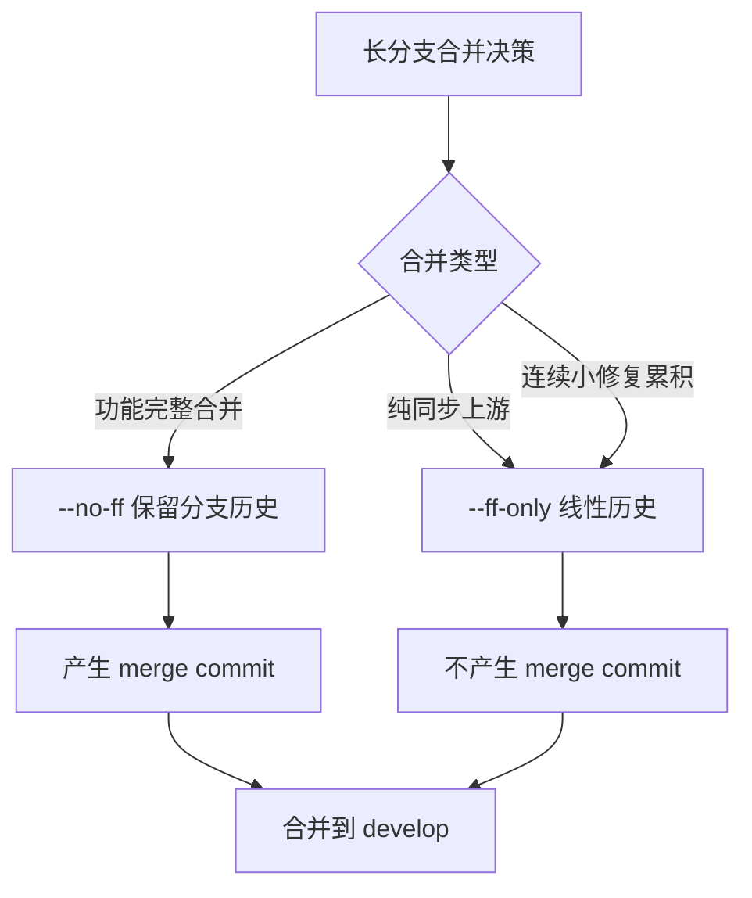
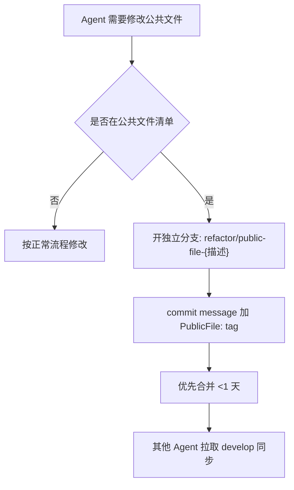
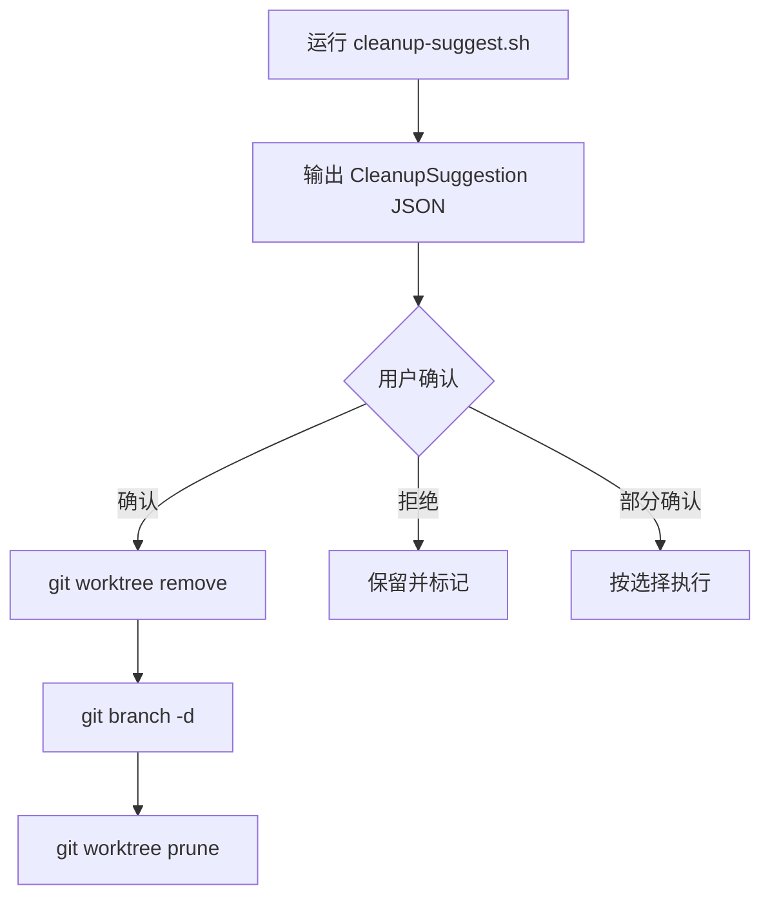

# AI Coding Git 工作流规范

## 概述

AI Coding 场景下的 Git 工作流守护技能，适用于 Cursor、Codex、Claude Code、Trae 等 AI Agent 在多分支并行开发时的版本管理。

**核心原则：** 一个分支一个功能；每天必须有合并动作（不只是同步）；merge-only，不引入 rebase。

## 分支模型

```text
main
 └── develop
      ├── feature/{F编号}-{描述}
      ├── fix/{F编号}-{描述}
      ├── docs/{主题}
      └── refactor/{模块}
```

### 三层模型

- `main`：仅用于正式发布，永远保持可发布状态
- `develop`：开发主干，始终保持可编译、测试通过
- `feature/*` / `fix/*` / `docs/*` / `refactor/*`：工作分支，一个功能一个分支，一个 AI Agent 一个分支

### 分支命名规则

| 前缀 | 用途 | 命名格式 | 示例 |
|------|------|---------|------|
| `feature/` | 新功能开发 | `feature/{F编号}-{描述}` | `feature/F3.1-ocr-acceleration` |
| `fix/` | 缺陷修复 | `fix/{F编号}-{描述}` | `fix/F2.4-hotkey-conflict` |
| `docs/` | 文档变更 | `docs/{主题}` | `docs/ai-git-workflow` |
| `refactor/` | 重构 | `refactor/{模块}` | `refactor/core-state-machine` |

命名约束：

- 描述部分使用小写英文与连字符，避免下划线、空格、中文
- 一个分支只承载一个职责，禁止在 `feature/` 分支混入 `fix/` 内容
- 分支名总长度建议不超过 50 字符

## 多 worktree 工作流

### worktree 创建规则

- **一个分支一个 worktree**：禁止跨分支共享工作区
- **路径位置**：worktree 创建在仓库同级目录下，便于统一管理
- **基线分支**：基于 `origin/develop` 最新提交创建
- **创建即同步**：创建后立即 `git fetch origin` 确保基线最新

**创建脚本**：`scripts/create-worktree.sh`

```bash
# 用法
./scripts/create-worktree.sh feature F3.1 ocr-acceleration
./scripts/create-worktree.sh fix F3.1 hotkey-conflict
./scripts/create-worktree.sh docs ai-git-workflow
./scripts/create-worktree.sh refactor core-state-machine
```

### worktree 命名规则

- worktree 目录名 = 分支名（斜杠 `/` 替换为连字符 `-`）
- 示例：分支 `feature/F3.1-ocr-acceleration` → worktree 目录 `feature-F3.1-ocr-acceleration`
- worktree 目录与仓库根目录同级，便于 `ls` 一目了然

### worktree 状态同步

worktree 之间**不共享工作区状态**，每个 worktree 是独立的 git 工作目录：

- 每个 worktree 需要独立执行 `git fetch origin`
- worktree A 的未提交改动不会出现在 worktree B 中
- stash 不跨 worktree 共享
- 推荐使用 commit 而非 stash 保存中间状态

### worktree 清理规则

- **合并后立即清理**：分支合并到 develop 后，立即执行 `git worktree remove`
- **避免腐烂**：超过 7 天无活动的 worktree 进入清理建议清单
- **清理顺序**：先 `git worktree remove <path>`，再 `git branch -d <branch>`
- **强制清理**：worktree 目录被手动删除时，使用 `git worktree prune` 修复元数据

## 开发原则

### 核心原则

1. 一个分支只做一个功能
2. AI Coding 场景下分支每天必须有合并动作，无固定天数上限
3. AI Coding 场景优先使用 **merge**，而不是长期使用 **rebase**

### 每天必须合并

"每天同步"升级为"每天必须合并"：AI Coding 场景下，分支每天必须有合并动作。

**含义**：

- **拉取上游**：`git fetch origin && git merge origin/develop` 同步上游改动
- **推送可合并部分**：将已完成且通过自检的部分合并回 develop

**为什么"必须合并"而不只是"同步"**：

- 同步只拉取上游，不回馈下游，分支仍然是单向流动
- 必须合并强制 AI Agent 把可合并的成果及时回到主干，避免分支长期独立
- 长分支即使每天同步，冲突也会随分支存活时间指数增长

**每日同步脚本**：`scripts/daily-sync.sh`

```bash
# 用法：在 feature 分支上执行
./scripts/daily-sync.sh
# 冲突时输出冲突文件清单并以退出码 2 退出
```

### Push 流程（每天可合并部分回 develop）

**触发条件**：本分支有可独立验证的提交（如修复 bug、完成子功能、补充文档）

**操作流程**：

1. 先执行 `pre-merge-check.sh` 自检，确认 `all_pass=true`
2. 推送本分支到远端：`git push origin <branch>`
3. 选择合并方式：
   - 远端 PR：在远端开 PR，审查通过后合并到 develop
   - 本地直合并：`git checkout develop && git pull origin develop && git merge --no-ff <branch> && git push origin develop`
4. 合并完成后回到原分支：`git checkout <branch>`

**不可合并情况**：

- 功能未完成（仅部分模块就绪，未达到验收标准）
- 测试未通过（含 SwiftLint strict 未通过）
- 文档未同步（修改了用户可见行为、技术架构、UI 行为但未同步对应文档）

上述情况下仅执行 pull 同步上游，不执行 push 合并，避免污染 develop。

### merge-only 原则与混合模式

坚持 merge-only 原则，不引入 rebase。在 merge 基础上引入混合模式：

| 模式 | 命令 | 适用场景 | 历史保留 |
|------|------|---------|---------|
| 默认 | `git merge --no-ff origin/develop` | 常规合并、功能分支合并 | 保留分支历史（merge commit） |
| 简化 | `git merge --ff-only origin/develop` | 连续小修复、纯同步操作 | 线性历史，无 merge commit |

**使用约束**：

- `--ff-only` 仅用于"分支已无独立提交"或"纯同步上游"场景
- 功能合并到 develop 一律使用 `--no-ff`，保留分支边界
- 禁止用 `--ff-only` 替代功能合并以"简化历史"

## 长分支合并策略

### 全部使用 merge

长分支合并**不引入 rebase**，原因：

- rebase 改写历史，多 Agent 协作时易导致 force push 冲突
- merge 保留真实开发轨迹，便于追溯
- AI Agent 不需要处理 rebase 引入的交互式冲突

### 混合模式应用



### 长分支冲突处理流程

长分支冲突必须按以下顺序处理，**禁止直接在 develop 上解决冲突**：

```text
1. 在 feature 分支上执行 git merge origin/develop
2. 在 feature 分支解决冲突
3. 在 feature 分支提交冲突解决
4. 在 feature 分支运行合并前自检
5. 将 feature 分支合并到 develop（此时 develop 端无冲突）
```

#### 冲突解决优先级

| 优先级 | 文件类型 | 处理方式 |
|--------|---------|---------|
| P0 | 公共文件（见下文） | 必须开独立分支，优先合并 |
| P1 | 跨模块接口文件 | 按模块边界拆分，分别合并 |
| P2 | 单模块内部文件 | 在 feature 分支内解决 |
| P3 | 文档、配置 | 最后合并，避免阻塞代码 |

## AI Agent 并行协作

### 公共文件锁机制

**公共文件定义**：被多个模块或多个 AI Agent 共同依赖的文件，修改会引发跨分支冲突。

典型公共文件：

- 项目级配置：`Package.swift`、`*.xcworkspace/contents.xcworkspacedata`、`project.yml`
- 共享协议：`Sources/*/Protocols.swift`、`Sources/*/Contracts.swift`
- 共享模型：`Sources/*/Models.swift`、`Sources/*/SharedTypes.swift`
- 依赖清单：`Package.resolved`、`Podfile.lock`
- 路由/注册表：`Sources/*/Router.swift`、`Sources/*/ModuleRegistry.swift`

#### 公共文件清单维护

公共文件锁机制依赖可查询的清单，避免依赖 AI Agent 主观判断：

- **清单来源**：项目根目录 `.trae/public-files.txt`（若存在），每行一个 glob 模式
- **查询方式**：脚本中遍历当前修改的文件路径，对每个文件用 `git ls-files` 配合清单中的 glob 模式判断是否命中
- **默认清单**（清单文件不存在时回退）：
  - 项目级配置文件：`*.xcodeproj/project.pbxproj`、`Package.swift`、`Package.resolved`、`*.xcworkspace/contents.xcworkspacedata`、`*.entitlements`、`project.yml`
  - 共享代码与规则：`DependencyContainer.swift`、`AGENTS.md`、`CLAUDE.md`、`.trae/rules/*.md`
- **维护机制**：清单文件由项目维护者管理，AI Agent 不直接修改；新增公共文件需提 PR 由维护者审核后追加

#### 公共文件修改流程



**约束**：

- 公共文件修改必须开独立分支，分支名 `refactor/public-file-{描述}`
- commit message 必须包含 `PublicFile: <文件路径>` tag
- 公共文件分支生命周期必须 <1 天，优先合并到 develop
- 禁止在 feature 分支中夹带公共文件修改

### 按模块拆分边界

按项目架构边界划分 AI Agent 职责，每个 Agent 主要负责一个模块：

| 模块类型 | Agent 职责 | 跨模块协作方式 |
|---------|-----------|---------------|
| Core 层 | 核心逻辑、协议定义 | 通过协议抽象，避免反向依赖 |
| UI 层 | 界面、交互 | 依赖 Core 层接口，不修改 Core |
| App 层 | 生命周期、依赖注入 | 组装 Core + UI，不修改业务逻辑 |
| 测试 | 测试代码 | 仅依赖公共接口，不修改实现 |

**跨模块修改规则**：

- 发现需要跨模块修改时，先在当前模块分支提交 issue 或任务记录
- 跨模块修改必须开独立分支，按模块顺序合并（Core → UI → App）
- 禁止单个 Agent 同时修改 3 个以上模块

### 冲突预测报告

每个 AI Agent 开工前必须输出冲突预测报告，包含：

1. **本分支预计修改的文件清单**（基于任务范围预估）
2. **与其他活跃分支的文件交集**（基于 `git diff` 比对）
3. **高冲突风险文件**（出现在多个活跃分支的修改清单中）
4. **建议处理顺序**（公共文件优先、按模块拆分）

**冲突预检脚本**：`scripts/conflict-predict.sh`

```bash
# 用法：输出 ConflictPredictionReport JSON
./scripts/conflict-predict.sh [base-branch]
# severity: high（>5文件）禁止合并
# severity: medium（3-5文件）需人工确认
# severity: low（≤2文件）可合并但需标注
```

## 分支健康度检查

### 四类指标

| 指标 | 含义 | 数据来源 | 告警阈值 |
|------|------|---------|---------|
| 陈旧度 | 自最近一次与 develop 同步后的天数 | `git log --merges` | >1 天告警 |
| 冲突难度 | merge-tree 检测到的冲突文件数 | `git merge-tree --write-tree` | >5 文件告警 |
| 变更规模 | 分支相对 develop 的变更文件数 | `git diff --name-only` | >20 文件告警 |
| 可合并性 | merge-tree 是否成功 | `git merge-tree --write-tree` 退出码 | 失败告警 |

### 健康度评分模型

每类指标 0-100 分，总分加权平均：

| 指标 | 权重 | 评分公式 |
|------|------|---------|
| 陈旧度 | 30% | `max(0, 100 - stale_days × 20)` |
| 冲突难度 | 30% | `max(0, 100 - conflict_count × 15)` |
| 变更规模 | 20% | `max(0, min(100, 100 - (changed_files - 5) × 3))` |
| 可合并性 | 20% | 可合并=100，不可合并=0 |
| **总分** | 100% | 加权平均 |

**健康度等级**：

| 总分 | 等级 | 建议动作 |
|------|------|---------|
| ≥80 | 健康 | 正常合并 |
| 60-79 | 关注 | 同步 develop 后合并 |
| 40-59 | 警告 | 必须先解决冲突再合并 |
| <40 | 危险 | 立即干预，考虑拆分分支 |

### 检查频率

- **每日开工前**：运行健康度检查，确认分支状态
- **合并前必检**：合并到 develop 前必须运行，总分 <60 禁止合并
- **CI 触发**：PR 创建时自动运行

**健康度检查脚本**：`scripts/branch-health.sh`

```bash
# 用法：输出 BranchHealthReport JSON
./scripts/branch-health.sh [base-branch]
```

## 合并前检查

### 基础检查

```bash
git fetch origin
git merge-tree --write-tree origin/develop HEAD
```

随后执行：Build、Unit Test、UI Test。全部通过后再合并。

### SwiftLint strict

包含 Swift 代码变更时**必检**：

```bash
swiftlint lint --strict
```

未通过禁止合并。仅文档、配置等非代码改动可跳过。

### 文档同步检查

修改以下内容时**必检**文档同步：

| 修改类型 | 需同步的文档 |
|---------|-------------|
| 用户可见行为 | 设计规范、视觉原型 |
| 技术架构、接口、数据模型 | 实施草案 |
| 实施步骤、测试策略 | 实现计划 |
| UI 行为 | 视觉原型 |
| 关键架构决策 | historys/ 目录追加记录 |

### 冲突预检报告

合并前必须运行冲突预检，输出 `ConflictPredictionReport`：

- `severity: high`（>5 文件冲突）禁止合并，必须先解决冲突
- `severity: medium`（3-5 文件）需人工确认后合并
- `severity: low`（≤2 文件）可合并，但需在 PR 描述中标注

### AI Agent 自检清单

合并前 AI Agent 必须自检：

| 自检项 | 检查方式 | 失败处理 |
|--------|---------|---------|
| 未提交文件 | `git status --porcelain` | 提交或 stash |
| 未跑测试 | 检查测试脚本执行记录 | 补跑测试 |
| 未同步文档 | 对照文档同步检查表 | 同步文档 |
| 未同步 develop | `git log HEAD..origin/develop` | 执行 daily-sync |
| 公共文件未隔离 | 检查 commit 是否含 PublicFile tag | 拆分到独立分支 |
| 公共文件分支超期 | `git log --format=%cd --date=short <merge-base>..HEAD` 与今天对比，>1 天且含 PublicFile tag | 立即合并或拆分 |
| 跨模块修改未声明 | 检查修改文件是否跨多个顶层模块目录且无 `CrossModule:` tag | 补充 CrossModule: tag 或拆分 |

**合并前自检脚本**：`scripts/pre-merge-check.sh`

```bash
# 用法：输出 PreMergeChecklist JSON
./scripts/pre-merge-check.sh
# all_pass=false 时禁止合并
```

## Merge 流程

### 完整 5 步流程

| 步骤 | 动作 | 命令/工具 | 失败处理 |
|------|------|----------|---------|
| ① | merge develop 到 feature | `git merge --no-ff origin/develop` | 解决冲突后继续 |
| ② | merge-tree 预检 | `git merge-tree --write-tree origin/develop HEAD` | severity=high 禁止合并 |
| ③ | Build / Tests / SwiftLint | 项目测试脚本 | 修复后重新执行 |
| ④ | AI 自检 | `pre-merge-check.sh` | all_pass=false 禁止合并 |
| ⑤ | PR / Merge | `git merge --no-ff` 到 develop | PR 审查通过后合并 |

### 合并后动作

- 立即清理 worktree：`git worktree remove <path>`
- 立即删除本地分支：`git branch -d <branch>`
- 通知其他活跃 Agent 拉取 develop

## Commit 规范

### type 列表

- `feat:` 新功能
- `fix:` 缺陷修复
- `refactor:` 重构（不改变行为）
- `test:` 测试相关
- `docs:` 文档相关
- `style:` 格式调整（不改逻辑）
- `chore:` 构建、依赖、配置等杂项

### 规范约束

- 避免使用 `update`、`modify` 等无意义提交信息
- subject 使用简洁祈使语气，不超过 50 字符
- 一个 commit 只做一件事，禁止混合多个独立改动
- 公共文件修改必须加 `PublicFile: <路径>` tag

### 示例

```text
feat(F3.1): add two-stage OCR acceleration

PublicFile: Sources/MacimCore/OCR/OCREngine.swift
```

## Feature Flag

未完成功能建议通过 Feature Flag 合并到 develop，而不是长期保留分支。

### 适用场景

- 功能开发周期超过 1 天，但已有可合并的部分实现
- 需要提前集成到 develop 验证架构兼容性
- 多人协作的功能，部分模块先行

### 实现方式

- 通过配置开关控制功能启用
- 默认关闭，验证通过后开启
- Feature Flag 必须在功能完成后移除，避免长期残留

## 废弃分支清理

### 自动检测项

| 检测项 | 判定条件 | 处理建议 |
|--------|---------|---------|
| 已合并分支 | `git branch --merged origin/develop` | 直接删除 |
| 陈旧 worktree | 超过 7 天无活动 commit | 提示清理 |
| 孤儿 worktree | worktree 目录已删除但元数据残留 | `git worktree prune` |
| 远程已删除分支 | 本地 tracking 分支远程已不存在 | `git remote prune origin` |

### 清理流程



### 清理约束

- **必须用户确认**：自动检测仅输出建议，不自动删除
- **保护活跃分支**：当前 checkout 的分支、develop、main 永不清理
- **保留历史**：合并过的分支删除后，merge commit 仍保留开发轨迹

**废弃清理脚本**：`scripts/cleanup-suggest.sh`

```bash
# 用法：输出 CleanupSuggestion JSON
./scripts/cleanup-suggest.sh [stale-days]
```

## 推荐 Git Alias

```bash
# 基础 alias
git config alias.sync "!git fetch origin && git merge origin/develop"
git config alias.checkmerge "merge-tree --write-tree origin/develop HEAD"
git config alias.graph "log --graph --oneline --decorate --all"

# 技能脚本 alias（需设置 SKILL_DIR 环境变量）
SKILL_DIR="$HOME/.trae-cn/skills/dd-ai-git-workflow/scripts"
git config alias.health-check "!bash $SKILL_DIR/branch-health.sh"
git config alias.conflict-predict "!bash $SKILL_DIR/conflict-predict.sh"
git config alias.cleanup-suggest "!bash $SKILL_DIR/cleanup-suggest.sh"
git config alias.pre-merge-check "!bash $SKILL_DIR/pre-merge-check.sh"
```

**脚本位置**：所有脚本位于技能目录 `scripts/` 子目录下。可直接执行 `bash <脚本路径>` 或通过 alias 调用。

## 推荐 CI

CI 流水线推荐包含以下步骤：

1. **Compile**：编译检查
2. **SwiftLint**：代码规范检查（含 strict 模式）
3. **Unit Test**：单元测试
4. **UI Test**：UI 测试（如适用）
5. **merge-tree 检查**：合并冲突预检
6. **Merge 到 develop**：PR 审查通过后自动合并

### CI 触发时机

- PR 创建时：步骤 1-5
- PR 合并时：步骤 6
- 定时任务（每日）：健康度检查 + 废弃清理建议

## 禁止事项

- 长期未同步 develop 的分支（超过 1 天未合并视为陈旧）
- 一个分支多个独立功能
- Merge 前不测试
- 修改大量公共文件
- 已共享分支频繁 Rebase
- **禁止 worktree 跨分支共享工作区**：一个 worktree 只属于一个分支
- **禁止公共文件长期独立修改**：公共文件分支必须 <1 天合并
- **禁止跨模块边界修改**：单个 Agent 不得同时修改 3 个以上模块
- **禁止用 `--ff-only` 替代功能合并**：功能合并必须 `--no-ff` 保留分支历史
- **禁止跳过 AI 自检直接合并**：合并前必须运行 `pre-merge-check.sh`
- **禁止自动清理未确认分支**：清理脚本仅输出建议，必须用户确认
- **禁止用固定 sleep 掩盖合并竞态**：合并冲突必须显式解决

## 输出格式规范

所有自动化脚本输出 JSON，便于其他 skill 解析引用。

### BranchHealthReport

```json
{
  "BranchHealthReport": {
    "branch": "feature/F3.1-ocr-acceleration",
    "base": "origin/develop",
    "stale_days": 2,
    "conflict_files": 3,
    "changed_files": 12,
    "mergeable": true,
    "scores": { "stale": 60, "conflict": 55, "scale": 79, "mergeable": 100, "total": 70 },
    "grade": "watch",
    "warnings": "stale>2d; conflict>3files; "
  }
}
```

### ConflictPredictionReport

```json
{
  "ConflictPredictionReport": {
    "branch": "feature/F3.1-ocr-acceleration",
    "base": "origin/develop",
    "has_conflict": true,
    "conflict_files": ["Sources/MacimCore/OCR/OCREngine.swift", "Package.swift"],
    "conflict_count": 2,
    "severity": "low"
  }
}
```

### PreMergeChecklist

```json
{
  "PreMergeChecklist": {
    "branch": "feature/F3.1-ocr-acceleration",
    "base": "origin/develop",
    "all_pass": false,
    "checks": {
      "uncommitted_files": {"status": "pass", "count": 0},
      "swiftlint": {"status": "pass", "files_checked": 5},
      "doc_sync": {"status": "warn", "reason": "swift changes without docs update", "swift_files": 5, "docs_files": 0},
      "conflict_predict": {"status": "pass", "conflict_files": 0},
      "sync": {"status": "pass", "ahead": 8, "behind": 0},
      "build": {"status": "manual", "reason": "run xcodebuild or project test script"},
      "tests": {"status": "manual", "reason": "run project test script"},
      "public_file": {"status": "pass", "commits": 0},
      "public_file_age": {"status": "pass", "age_days": 0},
      "cross_module": {"status": "pass", "modules": 1, "declared_commits": 0}
    }
  }
}
```

### CleanupSuggestion

```json
{
  "CleanupSuggestion": {
    "merged_branches": ["feature/F2.0-multi-monitor", "fix/F2.4-hotkey"],
    "stale_worktrees": [
      {"path": "/repo/../W-F2.0", "branch": "feature/F2.0-multi-monitor", "age_days": 10, "merged": true}
    ],
    "orphan_worktrees": 0,
    "stale_threshold_days": 7,
    "current_branch": "feature/F3.1-ocr-acceleration"
  }
}
```

JSON 是脚本的权威输出格式，调用方（AI Agent、CI、其他 skill）可基于 JSON 自行渲染 Markdown 报告。

## 被其他 skill 引用方式

### 语义触发

其他 skill 通过 description 字段语义触发本技能：

- `dd-writing-design-specs`：编写设计规范涉及分支创建时引用
- `dd-feature-development-workflow`：功能开发流程涉及合并检查时引用
- `dd-bug-fix-workflow`：bug 修复流程涉及分支管理时引用
- `finishing-a-development-branch`：分支收尾涉及合并检查时引用

### 调用入口

| 时机 | 调用入口 | 输出 |
|------|---------|------|
| 分支创建 | `scripts/create-worktree.sh` | 分支名 + worktree 路径 |
| 日常同步 | `scripts/daily-sync.sh` | 同步结果 + 冲突清单 |
| 合并前检查 | `scripts/pre-merge-check.sh` | PreMergeChecklist JSON |
| 冲突处理 | `scripts/conflict-predict.sh` | ConflictPredictionReport JSON |
| 健康监控 | `scripts/branch-health.sh` | BranchHealthReport JSON |
| 废弃清理 | `scripts/cleanup-suggest.sh` | CleanupSuggestion JSON |

### 输出引用

其他 skill 可读取本技能输出的结构化数据：

- `PreMergeChecklist.all_pass` 为 `false` 时，调用方必须阻止合并
- `BranchHealthReport.grade` 为 `dangerous` 时，调用方必须提示干预
- `ConflictPredictionReport.severity` 为 `high` 时，调用方必须提示先解决冲突
- `CleanupSuggestion.stale_worktrees` 非空时，调用方可提示用户清理

### 协同约定

- 本技能**不替代**项目文档同步技能，仅在合并前检查中引用其能力
- 本技能**不替代**项目编码规范，仅在 SwiftLint 检查中调用
- 本技能**不重复**项目规则，只在分支管理维度补充
