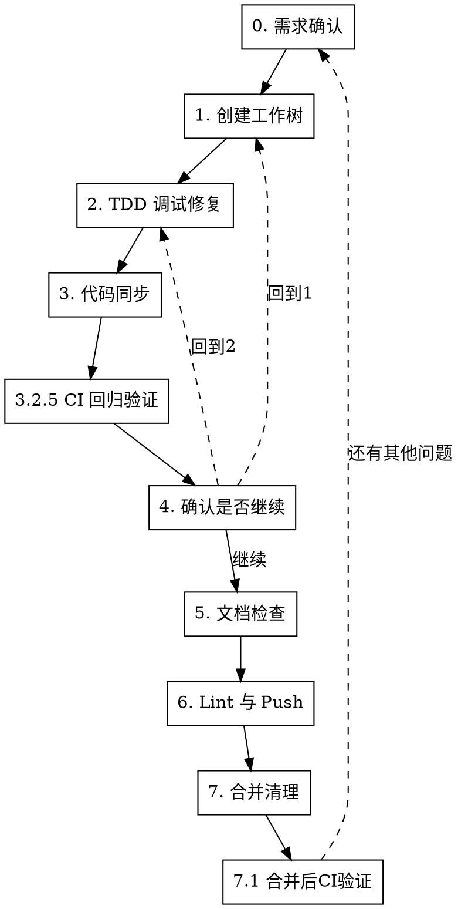

# Bug 修复工作流

## 概述

8 步严格顺序工作流：需求确认 → 隔离环境 → TDD 调试 → 代码同步(含提交) → 确认是否继续 → 文档检查 → Lint与Push → 合并清理。每步必须在前一步成功后才能继续。

## 何时使用

- 修复 bug 且需要隔离环境
- 用户提到"修bug流程"或"bug fix workflow"
- 需要系统化调试而非快速修补

**不适用：** 简单文本修改、新功能开发、纯文档修改

## 流程



<HARD-GATE>
严格按 0→1→2→3→4→5→6→7 顺序执行。禁止跳步、禁止省略步骤、禁止并行执行不同步骤。步骤 4 可回到步骤 1 或 2 重新执行。
</HARD-GATE>

## 上下文恢复机制

状态持久化遵循 [dd-shared-state](../dd-shared-state/SKILL.md)，参数 `WORKFLOW_TYPE=bug-fix`，`BRANCH_FIELD=fix_branch`。

- **状态文件**：`$(git rev-parse --git-dir)/bug-fix-state.json`
- **写入**：步骤 1（工作树创建/验证成功后）
- **更新 `current_step`**：**每个步骤出口判定成功后必须立即更新**（步骤 0/1/2/3/4/5/6 均强制更新；步骤 7.1 在 `git merge` 成功后更新 `current_step=7.2`，再删除状态文件）
- **删除**：步骤 7 合并成功后（须在 `git merge --no-ff` 成功后执行，禁止合并前删除）

### 强制更新规则（HARD-GATE）

每个步骤的「出口判定」章节必须包含更新状态文件的要求。智能体若发现状态文件 `current_step` 与实际进度不符，必须先更新再继续下一步，不得跳过。

更新模板（在每个步骤出口执行）：

```bash
git_dir=$(git rev-parse --git-dir)
python3 -c "
import json
state_file = '$git_dir/bug-fix-state.json'
with open(state_file) as f:
    state = json.load(f)
state['current_step'] = '<新步骤号或子步骤>'
with open(state_file, 'w') as f:
    json.dump(state, f, indent=2)
"
```

### 状态文件不存在时的恢复策略

会话恢复时若状态文件不存在，**禁止默认从步骤 0 重启**。必须先按以下顺序判断：

1. 检查当前目录是否在 worktree 中（`git rev-parse --is-inside-work-tree`）
2. 获取当前分支名（`git rev-parse --abbrev-ref HEAD`）
3. 若分支名匹配 `fix/F<N>-<描述>` 格式，对比 `git log origin/<BASE_BRANCH>..HEAD` 判断是否有已提交的修复
4. 若已有修复 commit：识别为「步骤 7.1 合并中」状态，询问用户是否继续合并或开新一轮
5. 若无修复 commit：识别为「步骤 2 TDD 中」状态，询问用户是否继续修复或重新开始
6. 仅当无法判断进度时，才从步骤 0 重新开始

> **通用规则**：结构化询问、null 输入重问遵循 [dd-shared-ask](../dd-shared-ask/SKILL.md)。

---

## 步骤 0：需求确认

### 0.1 前置准备：先获取日志候选

进入步骤 0 立即扫描两个 logs 目录，拿到最新文件信息（不询问用户）：

```bash
# 计算 worktree_dir（基于主仓库，避免在 worktree 内调用时识别错误）
common_dir=$(git rev-parse --git-common-dir)
main_root=$(cd "$(dirname "$common_dir")" && pwd)
project=$(basename "$main_root")
worktree_dir=$(dirname "$main_root")/${project}-worktrees

# 扫描 AI-test logs（按修改时间倒序）
ls -t "$worktree_dir/AI-test/logs/" 2>/dev/null | head -5

# 扫描当前 worktree logs（按修改时间倒序）
ls -t "$(pwd)/logs/" 2>/dev/null | head -5
```

- 合并文件列表，标注来源与修改时间
- 目录不存在或为空则跳过该来源

### 0.2 连续提问（一次性集中问完）

**AskUserQuestion 问 1：理解确认**

复述 bug 现象/复现条件/期望行为供用户确认。

- 选项 1（推荐）：确认理解正确
- 选项 2：需要补充细节
- 选项 3：理解有误，重新描述

**AskUserQuestion 问 2：工作环境**
- 选项 1（推荐）：新建隔离工作树
- 选项 2：在当前 worktree 工作

**AskUserQuestion 问 3：日志来源（动态选项）**
基于 0.1 扫描结果填充：
- 选项 1（推荐）：AI-test: `<最新文件名>`（`<修改时间>`）
- 选项 2：当前: `<最新文件名>`（`<修改时间>`）
- 选项 3：无日志，跳过日志获取
- 选项 4：其他文件（用户自行输入路径）

### 0.3 处理用户选择

- **问 1** → 理解偏差则重新描述，循环直到确认
- **问 2** → 决定步骤 1 是否创建工作树。**选中工作环境后，后续所有工作都在选中的工作树中执行**
- **问 3** → 读取对应日志，提取错误信息/警告/异常堆栈，作为步骤 2 调试依据

**不调用 brainstorming**：bug 修复是定位+修复问题，无需规格化设计文档与实现计划。

- 用户选"新建" → 步骤 1 走完整创建流程
- 用户选"当前 worktree" → 步骤 1 仅做验证

> **状态文件更新**：步骤 0 完成后无需更新（状态文件尚未创建，将在步骤 1 创建后写入 `current_step=1`）。

---

## 步骤 1：创建工作树

### 1.1 若步骤 0 选"当前 worktree"

跳过创建，仅做验证：

```bash
# 并发检查：遵循 dd-shared-state 并发检查
git_dir=$(git rev-parse --git-dir)
for f in "$git_dir"/bug-fix-state.json "$git_dir"/feature-development-state.json; do
  if [ -f "$f" ]; then
    existing_type=$(python3 -c "import json; print(json.load(open('$f')).get('workflow_type','unknown'))")
    echo "❌ 当前 worktree 已有活跃的 ${existing_type} 工作流，禁止并发"
    exit 1
  fi
done

# 记录基线分支
BASE_BRANCH=$(git rev-parse --abbrev-ref HEAD)

# 验证工作区状态
git status  # 必须干净，有未提交变更需先处理

# 验证基线测试：CI 验证遵循 dd-shared-ci 场景 1（基线 CI 验证）
```

- 成功标准：工作区干净 + 基线测试通过
- 失败：报错并停止

**写入状态文件**（验证成功后，遵循 [dd-shared-state](../dd-shared-state/SKILL.md) 写入模板，参数 `WORKFLOW_TYPE=bug-fix`，`BRANCH_FIELD=fix_branch`，`current_step=1`）：

### 1.2 若步骤 0 选"新建"

#### 1.2.1 记录基线分支

遵循 [dd-git-branch](../dd-git-branch/SKILL.md)，基线分支默认为 `develop`：

```bash
# 默认基线分支为 develop（遵循 dd-git-branch）
# 若步骤 0 用户明确指定其他基线分支，则使用用户指定的分支
BASE_BRANCH="${BASE_BRANCH:-develop}"
git fetch origin "$BASE_BRANCH"
```

#### 1.2.2 计算工作树路径

基于主仓库位置计算（避免在 worktree 内调用时项目名识别错误）：

```bash
common_dir=$(git rev-parse --git-common-dir)
main_root=$(cd "$(dirname "$common_dir")" && pwd)
project=$(basename "$main_root")
worktree_dir=$(dirname "$main_root")/${project}-worktrees
```

**关键**：必须基于主仓库，而非当前工作树——否则项目名会被误识别为分支名，导致工作树目录嵌套。

#### 1.2.3 创建工作树

遵循 [dd-git-branch](../dd-git-branch/SKILL.md) 的分支命名规则，bug 修复分支使用 `fix/{F编号}-{描述}` 格式。推荐使用 [dd-git-worktree](../dd-git-worktree/SKILL.md) 提供的脚本：

```bash
# 使用 dd-ai-git-workflow 脚本创建（推荐）
# 用法：./scripts/create-worktree.sh fix <F编号> <描述>
SKILL_DIR="$HOME/.trae-cn/skills/dd-ai-git-workflow"
bash "$SKILL_DIR/scripts/create-worktree.sh" fix <F编号> <描述>
# 示例：bash "$SKILL_DIR/scripts/create-worktree.sh" fix F3.1 hotkey-conflict
```

或手动创建（基于 origin/develop 最新提交）：

```bash
BRANCH="fix/<F编号>-<描述>"  # 示例：fix/F3.1-hotkey-conflict
git fetch origin develop
path="$worktree_dir/$BRANCH"
git worktree add "$path" -b "$BRANCH" origin/develop
cd "$path"
```

**基线分支**：默认基于 `origin/develop` 最新提交创建（遵循 dd-git-branch）。若需基于其他分支，需在步骤 0 明确说明并获得用户确认。

#### 1.2.4 运行项目设置

自动检测并运行相应设置命令：

```bash
# Node.js
[ -f package.json ] && npm install

# Rust
[ -f Cargo.toml ] && cargo build

# Python
[ -f requirements.txt ] && pip install -r requirements.txt
[ -f pyproject.toml ] && poetry install

# Go
[ -f go.mod ] && go mod download

# Swift (Xcode 项目)
[ -f Package.swift ] && swift build
```

#### 1.2.5 验证基线测试干净

CI 验证遵循 [dd-shared-ci](../dd-shared-ci/SKILL.md) 场景 1（基线 CI 验证）。按 test-location-strategy skill 决策测试位置。

- 测试失败：报告失败情况，询问是否继续或排查
- 测试通过：报告就绪

#### 1.2.6 报告位置

```
工作树已就绪：<full-path>
测试通过（<N> 个测试，0 个失败）
准备实现 <feature-name>
```

**重要**：调用后会话工作目录必须始终位于该工作树路径下，不得切换回主仓库目录。

#### 1.2.7 红线

CI 相关红线（跳过基线测试、未 push 降级本地、CI 不可用宽泛措辞、用户要求凌驾 CI 优先）遵循 [dd-shared-ci](../dd-shared-ci/SKILL.md) 红线章节。

**本步骤特有红线**：
- 在项目内部创建工作树目录（污染 git status）

#### 1.2.8 写入状态文件

工作树创建并验证成功后，持久化关键状态供上下文恢复。遵循 [dd-shared-state](../dd-shared-state/SKILL.md) 写入模板，参数 `WORKFLOW_TYPE=bug-fix`，`BRANCH_FIELD=fix_branch`，`current_step=1`。

---

## 步骤 2：TDD 调试修复

### 2.1 第一步：编写失败测试（TDD 红灯）

**目标：用测试用例稳定复现问题。**

- 阅读步骤 0 获取的日志，确认复现条件（输入、环境、前置状态）
- 编写最小复现测试（只测一件事，使用真实代码，避免不必要 mock）
- **按测试类型决定红灯验证位置**：
  - **XCTest（单元测试）**：可本地验证红灯（快速反馈，无 GUI 依赖），确认测试因正确原因失败而非拼写错误
  - **XCUITest（UI 测试）**：禁止本地验证红灯，延迟到步骤 3.2.5 走 CI（UI 测试依赖 GUI 会话、Accessibility 权限、窗口焦点等环境状态，本地环境不可靠）
- 编写时通过代码审查确保测试逻辑正确（断言反映功能缺失，非拼写错误；测试覆盖预期失败路径）
- 记录到日志文件：`debug-logs/YYYY-MM-DD-<简短问题描述>.md`

### 2.2 第二步：系统化调试（根因调查）

**铁律：不做根因调查，不许提修复方案。**

- **收集证据**：完整阅读错误信息与堆栈跟踪、稳定复现问题、检查近期变更（git diff、最近提交）、多组件系统对组件边界添加诊断埋点
- **跟踪数据流**：错误值从哪里产生？谁用错误值调用了这里？持续向上追踪直到找到源头
- **模式分析**：找到同一代码库中正常工作的类似代码，逐行对比，列出每一个差异
- **假设与验证**：提出单一假设"X 是根本原因，因为 Y"，做最小改动验证，每次只改一个变量；生效 → 进入修复；没生效 → 提出新假设
- **调试期间可添加诊断日志辅助排查**：关键变量值、坐标转换前后对比、条件分支走向等，日志带功能标签前缀（如 `[F1.10]`）便于检索和清理。此处为临时诊断，验证假设后可移除
- 记录到日志文件：错误信息/复现步骤/近期变更/数据流/假设验证/根本原因

### 2.3 第三步：实施修复（TDD 绿灯）

**目标：修复根本原因，让测试通过。**

- 实施单一修复（每次只改一处，不做"顺便改改"的优化，不捆绑重构）

**按测试类型决定验证位置，必须严格区分：**

- **XCTest（单元测试）**：
  - **单测试文件绿灯验证**（本地执行，TDD 快速反馈）：仅运行步骤 2.1 编写的新 XCTest，确认因修复而通过。无 GUI 依赖，本地快速反馈合理
  - **不在本地跑全量 XCTest 回归**——全量回归延迟到步骤 3.2.5 提交并 push 后走 CI
- **XCUITest（UI 测试）**：
  - **禁止本地执行任何 XCUITest**（包括单测试文件、包括红灯和绿灯验证）——UI 测试依赖 GUI 会话、Accessibility 权限、窗口焦点、TCC 授权弹窗等环境状态，本地环境不可靠。所有 XCUITest 验证延迟到步骤 3.2.5 走 CI
  - 修复是否让 UI 测试通过，由步骤 3.2.5 的 CI 结果判断。在 CI 结果出来前，不声明"UI 测试已验证"

> **为什么 XCUITest 禁止本地执行？** UI 测试对运行环境高度敏感：GUI 会话状态、Accessibility 权限、窗口焦点、系统弹窗（TCC 授权）都会影响结果，本地通过不能替代 CI 验证。XCTest 无 GUI 依赖，本地快速反馈是合理的。步骤 3.2.5 提交后由 CI 给出最终验证（XCTest 全量回归 + XCUITest）。

- **回归测试失败需修改时**：必须使用 `AskUserQuestion` 说明失败原因和修改理由，获得用户确认后方可修改。禁止未经确认直接修改回归测试
- 如果修复不起作用（XCTest 本地绿灯未通过，或 CI 结果显示 XCUITest/全量回归失败）：
  - 少于 3 次：回到根因调查，用新信息重新分析
  - 3 次或以上：停下来质疑架构 → **AskUserQuestion**：
    - 选项 1（推荐）：继续调试（回到根因调查）
    - 选项 2：放弃并清理工作树
- 记录到日志文件：修复方案/修改文件/XCTest 本地绿灯结果/XCUITest + 全量回归延迟到步骤 3.2.5

### 2.4 第四步：重构（TDD 重构）

**目标：在 XCTest 绿灯基础上清理代码（XCUITest 验证延迟到步骤 3.2.5）。**

- 消除重复
- 改善命名
- 提取辅助函数
- 保持 XCTest 绿灯，不添加行为（XCUITest 验证延迟到 CI）

### 2.5 调试日志文件规范

- **位置**：项目根目录 `debug-logs/`
- **命名**：`YYYY-MM-DD-<简短问题描述>.md`
- **内容**：问题描述 / [前置] 步骤0 获取的运行日志信息 / [红灯] 测试用例 / [根因调查] 调查过程 / [绿灯] 修复实施 / 总结

### 2.6 出口判定

- 成功（XCTest 绿灯 + 重构完成，XCUITest 验证延迟到步骤 3.2.5）→ 进入步骤 3
- 失败（3 次以上修复无效）→ AskUserQuestion（见 2.3）

> **状态文件更新（HARD-GATE）**：进入步骤 3 前**必须**更新 `bug-fix-state.json` 的 `current_step="3"`。使用「上下文恢复机制」章节的更新模板。会话压缩后智能体凭此字段判断已进入步骤 3，避免从步骤 2 重复 TDD。

---

## 步骤 3：代码同步

### 3.1 同步上游 BASE_BRANCH 并解决冲突（merge-only，禁止 rebase）

merge-only 原则、混合模式（`--no-ff` / `--ff-only`）遵循 [dd-git-merge](../dd-git-merge/SKILL.md) merge-only 原则与混合模式章节。**禁止使用 rebase** 同步上游。

#### 3.1.1 前置检查：对比本地与远端 BASE_BRANCH 新旧

```bash
# 精确拉取 BASE_BRANCH
git fetch origin "$BASE_BRANCH"

LOCAL_SHA=$(git rev-parse "$BASE_BRANCH")
REMOTE_SHA=$(git rev-parse "origin/$BASE_BRANCH")

if [ "$LOCAL_SHA" = "$REMOTE_SHA" ]; then
    # 本地与远端一致，无需合并上游
    SKIP_MERGE=true
else
    # 远端更新，需要合并 origin/<BASE_BRANCH>
    SKIP_MERGE=false
fi
```

- `SKIP_MERGE=true`（本地与远端一致）→ **跳过 3.1.2**，直接进入 3.2
- 否则进入 3.1.2 询问合并策略

#### 3.1.2 询问合并策略（仅当需要同步上游时）

合并策略选项遵循 [dd-git-merge](../dd-git-merge/SKILL.md) merge-only 原则与混合模式表（默认 `--no-ff` 保留合并历史；`--ff-only` 仅限纯同步场景）。

**AskUserQuestion 问 1**：
- 选项 1（推荐）：`git merge --no-ff origin/$BASE_BRANCH`（保留合并历史，产生 merge commit）
- 选项 2：`git merge --ff-only origin/$BASE_BRANCH`（仅限分支无独立提交或纯同步，线性历史）
- 选项 3：不合并，跳过本子步

#### 3.1.3 执行合并与冲突处理

选择合并时执行 `git merge --no-ff origin/$BASE_BRANCH`。冲突处理流程（在 fix 分支解决，禁止直接在 develop 上解决）遵循 [dd-git-conflict](../dd-git-conflict/SKILL.md) 长分支冲突处理流程章节（5 步：merge → 在 feature 分支解决 → 提交 → 自检 → 合并到 develop）。

**冲突无法解决** → **AskUserQuestion 问 2**：
- 选项 1（推荐）：`git merge --abort` 中止合并，回到步骤 2 在 BASE_BRANCH 最新代码上重新修复
- 选项 2：继续手动解决冲突（提供具体冲突位置和上下文）
- 选项 3：放弃本次修复，清理工作树

禁止事项（rebase、`--no-edit`、`rebase --skip`、固定 sleep 掩盖竞态）遵循 [dd-git-merge](../dd-git-merge/SKILL.md) 和 [dd-git-conflict](../dd-git-conflict/SKILL.md) 禁止事项章节。

### 3.2 提交变更

无论是否合并上游，均提交当前变更（含代码及相关变更）。

#### 3.2.1 分析 diff

```bash
# 有暂存时
git diff --staged

# 无暂存时
git diff

# 查看状态
git status --porcelain
```

#### 3.2.2 智能暂存

```bash
# 按逻辑分组暂存
git add path/to/file1 path/to/file2

# 或按模式
git add *.test.*
git add src/components/*
```

**禁止提交敏感文件**：`.env`、`credentials.json`、私钥等。

#### 3.2.3 生成 Conventional Commits 消息

Commit 规范（type 列表、subject 约束、公共文件 `PublicFile:` tag）遵循 [dd-git-merge](../dd-git-merge/SKILL.md) Commit 规范章节。公共文件锁机制（独立分支 `refactor/public-file-{描述}`、`PublicFile:` tag、<1 天合并）遵循 [dd-git-conflict](../dd-git-conflict/SKILL.md) 公共文件锁机制章节。禁止在 fix 分支夹带公共文件修改。

#### 3.2.4 执行提交

```bash
# 单行
git commit -m "<type>[scope]: <description>"

# 多行
git commit -m "$(cat <<'EOF'
<type>[scope]: <description>

<optional body>

<optional footer>
EOF
)"
```

提交边界（暂存无关脏文件、提交秘密文件、`--no-verify`、force push）遵循 [dd-shared-ask](../dd-shared-ask/SKILL.md) 提交边界章节。

**成功** → 进入 3.2.5

**失败** → 回到步骤 2 修复问题，不跳过

#### 3.2.5 提交后全量回归验证（CI 优先，必须 push）

**本步是步骤 2 延迟的 XCUITest 验证 + 全量 XCTest 回归的唯一执行点（XCTest 单测试文件绿灯已在步骤 2.3 本地验证）。**

CI 验证遵循 [dd-shared-ci](../dd-shared-ci/SKILL.md) 场景 2（回归 CI 验证）。按顺序执行：检查 push → 检查 CI 已有结果 → 触发 CI 并等待 → CI 失败处理。

> **红线**：不得跳过本步直接进入 3.3。步骤 2 的 XCUITest 验证 + 全量回归已延迟到此处，跳过等于放弃 UI 测试和全量回归验证。CI 相关红线（未 push 降级本地、CI 触发失败降级本地）遵循 dd-shared-ci 红线章节。

### 3.3 同步 AI-test 测试工作树

确保 AI-test 测试工作树复位到最新修复分支，便于测试验证最新代码。

**AskUserQuestion 问 3**：是否同步 AI-test 工作树
- 选项 1（推荐）：同步（使用 `reset --hard` 复位到最新修复分支）
- 选项 2：不同步，结束 3.3

选择同步时：

```bash
FIX_BRANCH=$(git rev-parse --abbrev-ref HEAD)
bash "$HOME/.trae-cn/skills/shared/scripts/sync-ai-test-worktree.sh" "$FIX_BRANCH" "$worktree_dir"
```

- **返回码 0**（成功）：AI-test 工作树 HEAD 等于当前修复分支最新 commit，工作区干净
- **返回码 2**（未提交变更）：AI-test 工作树存在未提交变更，询问用户处理方式
- **其他失败** → **AskUserQuestion 问 4**：
  - 选项 1（推荐）：重试
  - 选项 2：跳过继续
  - 选项 3：停止工作流

选择不同步 → 直接进入步骤 4

> **状态文件更新（HARD-GATE）**：进入步骤 4 前**必须**更新 `bug-fix-state.json` 的 `current_step="4"`。会话压缩后智能体凭此字段判断已进入「确认是否继续」询问，避免从步骤 1 重新验证 worktree。

---

## 步骤 4：确认是否继续

在代码同步完成后、进入文档检查之前，询问用户是否需要回到早期步骤继续修复。

**AskUserQuestion**：
- 选项 1（推荐）：继续进入步骤 5 检查测试文档
- 选项 2：回到步骤 1 创建新工作树重新修复（当前工作树保留或清理由用户决定）
- 选项 3：回到步骤 2 重新 TDD 调试修复（在同一工作树中继续）

**分支处理**：
- 选"继续" → 更新 `current_step="5"`，进入步骤 5
- 选"回到步骤 1" → 更新 `current_step="1"`，跳转到步骤 1 重新执行，后续步骤顺序推进
- 选"回到步骤 2" → 更新 `current_step="2"`，跳转到步骤 2 重新执行，在同一工作树中继续，后续步骤顺序推进

> **状态文件更新（HARD-GATE）**：用户选择后**必须**立即更新 `bug-fix-state.json` 的 `current_step`。会话压缩后智能体凭此字段判断当前所处步骤，避免重复询问或跳步。

---

## 步骤 5：检查测试文档

确保测试文档与代码变更保持一致。

**通过子代理分析**：`git diff` 输出 + 读设计规范/测试用例表/代码，token 量大。调度子代理，传入 `BASE_BRANCH`、功能编号和文档路径，由子代理完成变更分析（5.2）、文档检查（5.3-5.6）和摘要输出（5.7）。

### 5.1 读取测试规则

先阅读 `docs/AI/trae-xctest-rules.md`，严格遵守其中的测试和回归规则。重点关注：
- 第 4 节：什么时候新增或更新回归测试
- 第 6 节：变更影响分析规范
- 第 14 节：AI 输出格式

- **成功**：规则文件存在且已读取 → 进入 5.2
- **失败**：规则文件不存在 → 报错并停止，提示用户确认路径
- **边界**：规则文件存在但缺少第 4/6/14 节 → 按现有内容执行，并在 5.7 自检中标注规则不完整

### 5.2 识别变更并输出影响分析

```bash
# 获取当前分支相对于基线分支的所有变更
git diff "$BASE_BRANCH"...HEAD
# 或
git log --oneline "$BASE_BRANCH"..HEAD
```

分析变更内容：
- 新增或修改的行为
- 直接修改的文件和符号
- 直接调用方与被调用方
- 共享模型、协议、配置、持久化格式
- 可能受影响的用户流程

按第 6 节规范输出变更影响分析表：

```markdown
## 变更影响分析

| 分析项 | 内容 |
|---|---|
| 直接修改行为 | ... |
| 直接依赖 | ... |
| 间接依赖 | ... |
| 高风险路径 | ... |
| 必须新增的测试 | ... |
| 必须更新的测试 | ... |
| 必须执行的测试 | ... |
| 可暂缓自动化 | ... |
```

表中「必须执行的测试」按 test-location-strategy skill 选择测试位置：自建服务器优先，无自建服务器才本地。

- **成功**：已获取变更并输出影响分析表
- **失败**：`git diff` 为空 → 提示"无代码变更，无需更新文档"，结束步骤 5

### 5.3 定位目标文档

根据用户在步骤 0 描述的修复功能，推断功能编号（如 F1.10），定位以下文档（路径模式为 `docs/planning/P0/{功能编号}/`）：

1. **设计规范**：`F{N}_*_设计规范.md`
2. **测试用例表**：`F{N}_*_测试用例表.md`

使用 `rg --files docs/planning/P0/{功能编号}` 搜索 `*设计规范*.md` 和 `*测试用例表*.md` 确认实际路径；如果 `rg` 不可用，使用 `find docs/planning/P0/{功能编号} -name '*设计规范*.md' -o -name '*测试用例表*.md'`。

- **成功**：至少定位到一份目标文档 → 进入 5.4
- **失败**：功能编号对应目录不存在 → **AskUserQuestion 问 2**：
  - 选项 1（推荐）：新建目录
  - 选项 2：重新输入功能编号
  - 选项 3：终止
- **边界**：只找到一份文档 → 对缺失的另一份在对应 5.4/5.5 中标注"文档不存在，跳过"
- **无法推断功能编号** → **AskUserQuestion 问 1**：询问用户功能编号

### 5.4 检查设计规范是否需要更新

对照最近代码变更，逐项检查设计规范：

1. **验收标准（AC）**：新增或修改的行为是否需要新增/修改验收标准
2. **行为描述**：代码实现的行为是否与规范描述一致
3. **数据模型**：新增/修改的属性或方法是否需要在规范中记录
4. **状态机**：状态转换是否有变化
5. **当前问题**：已修复的问题是否需要从"当前问题"中移除

如果需要更新，直接修改设计规范文件，并更新版本号和最后更新日期。

### 5.5 检查测试用例表是否需要更新

对照最近代码变更和设计规范，逐项检查测试用例表：

1. **新增用例**：新增行为是否需要新增测试用例行
2. **状态更新**：已有用例的状态是否需要从 ❌/🟡 更新为 ✅
3. **现有证据**：新增的测试方法是否需要补充到"现有证据"列
4. **补充用例**：已实现的补充用例是否需要更新
5. **AC 映射**：新增用例是否需要关联到设计规范的验收标准编号
6. **统计更新**：更新文档头部的统计数字（总用例数、✅/🟡/❌/⏸️ 数量）

**测试用例表格式约定**：
- `#` 列：用例编号，保留历史编号；新增追加到对应分组末尾
- `状态` 列：✅ 已有测试能证明该行为；🟡 已有测试只覆盖部分断言；❌ 缺少可执行自动化；⏸️ 暂缓自动化
- `AC` 列：对应设计规范验收标准编号；`支撑` 表示不直接对应 AC
- 新增 bug 修复用例使用 C 系列编号，追加到 C 分组末尾

如果需要更新，直接修改测试用例表文件，并更新版本号和最后更新日期。

### 5.6 检查代码中测试用例是否需要更新

> **调用上下文**：本工作流调用，步骤 2 的 TDD 已为新增行为写过测试，本步跳过"新增行为缺少测试覆盖"检查，仅保留以下三项检查。

1. 搜索最近变更涉及的行为在测试代码中的覆盖情况
2. 检查是否有以下问题：
   - 已有测试的断言需要更新（因为行为变更）
   - 测试名称不符合 `test_入口点_场景_期望行为` 命名规范
   - 测试替身（Stub/Mock/Spy）需要更新
3. 如果需要新增或修改测试代码，按照 `docs/AI/trae-xctest-rules.md` 的规范生成测试代码

### 5.7 输出文档更新摘要与自检

按照第 14 节格式输出（变更影响分析表已在 5.2 输出，此处不重复）：

```markdown
## 文档更新摘要

- 设计规范：[已更新 / 无需更新] — 原因
- 测试用例表：[已更新 / 无需更新] — 原因
- 代码测试：[已更新 / 无需更新] — 原因

## 自检结果

- 测试失败时是否说明生产行为有问题？
- 是否存在网络、时间、随机数、顺序或本机环境依赖？
- 是否绑定内部实现？
- 是否过度 Mock？
- 是否遗漏受影响的旧行为？
- 是否错误修改了旧测试预期？
- 是否适合进入 CI？
```

### 5.8 重要约束

1. **不得仅根据修改文件列表决定回归范围**：必须结合调用关系、数据流、共享模型、配置、持久化格式和用户流程判断
2. **不得为了让测试通过而随意修改旧测试预期**：必须先确认需求是否真的改变
3. **文档版本号递增**：每次更新设计规范或测试用例表时，必须递增版本号

### 5.9 出口判定

- 完成或无需更新 → 进入步骤 6
- 失败 → **AskUserQuestion 问 3**：
  - 选项 1（推荐）：重试
  - 选项 2：跳过继续进入步骤 6
  - 选项 3：停止工作流

> **状态文件更新（HARD-GATE）**：进入步骤 6 前**必须**更新 `bug-fix-state.json` 的 `current_step="6"`。会话压缩后智能体凭此字段判断文档检查已完成，避免从步骤 5 重复子代理分析。

---

## 步骤 6：Lint 与 Push

**流程顺序：lint → 测试验证 → push → 同步 AI-test，缺一不可。测试验证的测试位置按 test-location-strategy skill 选择。**

### 6.1 代码质量检查

**lint 部分**（本地执行，不使用自建服务器）：

按项目类型执行：

- **Swift 项目**：`swiftlint lint --strict`
- **其他项目**：项目对应的 lint / typecheck 命令

- **成功** → 进入 lint 后的测试验证
- **失败** → 修复 lint 错误后重新检查，不得跳过（循环直到通过）

**测试验证部分**（按 test-location-strategy skill 决策测试位置）：

lint 通过后，运行项目测试套件验证整体回归。CI 验证遵循 [dd-shared-ci](../dd-shared-ci/SKILL.md) 场景 2（回归 CI 验证，需先 push 再触发 CI）。

- **成功** → 进入 6.2
- **失败** → 修复后重新执行 lint + 测试

### 6.2 Push 到远端

```bash
# 确认远端仓库存在
git remote -v

# 推送分支
# 无 upstream
git push -u origin <当前分支>

# 有 upstream
git push
```

- **成功** → 进入 6.3
- **失败** → **AskUserQuestion 问 1**：
  - 选项 1（推荐）：重试
  - 选项 2：跳过 push 继续
  - 选项 3：停止工作流

**禁止**：
- 使用 `git push --force` / `git push -f`（除非用户明确要求）
- 推送到 main/master（除非用户明确要求）

### 6.2.1 等待 CI 结果（push 后强制执行）

push 完成后必须等待 CI 运行完成，不得直接结束工作流或宣称完成。本步是新流程的核心：让远端 self-hosted runner 验证代码，避免本地环境差异掩盖问题。

CI 验证遵循 [dd-shared-ci](../dd-shared-ci/SKILL.md) 场景 3（Push 后等待 CI）。CI 失败或未找到 run 时的 AskUserQuestion 选项遵循 dd-shared-ci 场景 3。

- **成功** → 进入 6.3

### 6.3 同步 AI-test 测试工作树

push 完成后再次同步 AI-test 工作树，确保其复位到最新修复分支（含远端 push 后的最终状态）。

**AskUserQuestion 问 2**：是否同步 AI-test 工作树
- 选项 1（推荐）：同步（使用 `reset --hard` 复位到最新修复分支）
- 选项 2：不同步，结束 6.3

选择同步时：

```bash
FIX_BRANCH=$(git rev-parse --abbrev-ref HEAD)
bash "$HOME/.trae-cn/skills/shared/scripts/sync-ai-test-worktree.sh" "$FIX_BRANCH" "$worktree_dir"
```

- **返回码 0**（成功）：AI-test 工作树 HEAD 等于当前修复分支最新 commit，工作区干净
- **返回码 2**（未提交变更）：AI-test 工作树存在未提交变更，询问用户处理方式
- **其他失败** → **AskUserQuestion 问 3**：
  - 选项 1（推荐）：重试
  - 选项 2：跳过继续
  - 选项 3：停止工作流

选择不同步 → 直接进入步骤 7

> **状态文件更新（HARD-GATE）**：进入步骤 7 前**必须**更新 `bug-fix-state.json` 的 `current_step="7"`。会话压缩后智能体凭此字段判断 lint+push 已完成，避免从步骤 6 重复 lint。

---

## 步骤 7：合并清理

**AskUserQuestion 问 1**：
- 选项 1：合并到原分支
- 选项 2：不合并，仅清理工作树
- 选项 3：还有其他问题（反馈新问题）
- 选项 4：暂不处理，保留工作树

### 7.1 选"合并到原分支"

**先更新状态文件标记"合并中"**（HARD-GATE，在离开 worktree 前执行）：

```bash
# 在 worktree 路径下执行（git-dir 指向 worktree 私有目录）
git_dir=$(git rev-parse --git-dir)
python3 -c "
import json
state_file = '$git_dir/bug-fix-state.json'
with open(state_file) as f:
    state = json.load(f)
state['current_step'] = '7.1-merging'
state['merge_in_progress'] = True
with open(state_file, 'w') as f:
    json.dump(state, f, indent=2)
"
```

此标记确保会话压缩在 `git merge` 执行过程中发生时，智能体能识别"合并中"状态而非误判为"全新开始"。

```bash
# 以下命令必须在主仓库路径执行，不在修复 worktree 内执行
cd "$main_root"

# 切回原分支并合并（merge-only，禁止 rebase，保留合并记录）
git checkout "$BASE_BRANCH"
git merge --no-ff <工作树分支>
```

**合并成功后删除状态文件**（HARD-GATE，`git merge` 必须成功才删除）：

```bash
# 回到 worktree 路径执行删除（worktree 私有 git-dir 才能找到状态文件）
cd "$WORKTREE_PATH"
git_dir=$(git rev-parse --git-dir)
rm -f "$git_dir/bug-fix-state.json"
```

> **禁止**：在 `git merge` 执行前删除状态文件。删除时机必须在 merge 成功之后，确保会话压缩在 merge 执行期间发生时仍能通过状态文件 `merge_in_progress=true` 字段恢复。

**合并后全量回归验证（CI 优先）**：合并产生新的 commit，必须验证合并后代码在 CI 中通过。

CI 验证遵循 [dd-shared-ci](../dd-shared-ci/SKILL.md) 场景 4（合并后 CI 验证）。CI 失败时的 AskUserQuestion 选项遵循 dd-shared-ci 场景 4。

清理工作树：删除工作树目录。

工作流结束。

### 7.2 选"不合并，仅清理工作树"

**先删除状态文件**（在离开工作树前，遵循 [dd-shared-state](../dd-shared-state/SKILL.md) 删除模板，参数 `WORKFLOW_TYPE=bug-fix`）。

- 保留原分支不变
- 清理工作树：删除工作树目录

工作流结束。

### 7.3 选"还有其他问题"

- 接收用户提出的新问题描述
- **更新状态文件 `current_step="0"`**（HARD-GATE，标识新一轮开始，避免恢复时误以为还在步骤 7）
- **重新从步骤 0 开始**（需求确认 → 创建工作树 → TDD 调试修复 → ...）
- **每轮问题不再新建独立工作树**，除非明确要求（在当前工作树中继续）
- 工作流循环执行

### 7.4 选"暂不处理，保留工作树"

- 不合并、不清理
- **更新状态文件 `current_step="7.4-paused"`**（HARD-GATE，标识工作流暂停但未结束，便于后续恢复）
- 工作流结束，工作树保留供后续继续

### 7.5 中途中断处理

用户在任何步骤中断本工作流 → **AskUserQuestion**：
- 选项 1（推荐）：保留工作树（便于后续继续）
  - **更新状态文件 `current_step="<当前步骤>-interrupted"`** 记录中断位置
  - 不删除状态文件，便于后续恢复
- 选项 2：立即清理工作树
  - 删除状态文件 + 删除工作树目录

### 7.6 步骤 0 选"当前 worktree"时的特殊处理

- 选"合并" → 执行 merge --no-ff（merge-only，禁止 rebase），按 7.1 流程更新 `current_step="7.1-merging"` 后再 merge，merge 成功后删除状态文件
- 选"不合并"/"暂不处理" → **不删除工作树**（因工作树非本流程创建），但需更新状态文件 `current_step` 反映用户选择
- 选"还有其他问题" → 在当前工作树继续新一轮，更新 `current_step="0"`

---

## Git 工作流合规（强制）

本技能涉及 Git 操作，必须遵循 [dd-git-workflow](../dd-git-workflow/SKILL.md) 系列子技能：

| 子技能 | 职责 | 本技能相关 |
|--------|------|-----------|
| [dd-git-workflow](../dd-git-workflow/SKILL.md) | 入口导航、分支模型 | 总览 |
| [dd-git-branch](../dd-git-branch/SKILL.md) | 分支命名、创建 | `fix/{F编号}-{描述}` 分支命名 |
| [dd-git-merge](../dd-git-merge/SKILL.md) | merge-only、Commit 规范 | merge-only，禁止 rebase |
| [dd-git-conflict](../dd-git-conflict/SKILL.md) | 冲突处理、公共文件锁 | PublicFile tag |
| [dd-git-worktree](../dd-git-worktree/SKILL.md) | worktree 管理 | 隔离环境 |
| [dd-git-health](../dd-git-health/SKILL.md) | 健康度、每日同步 | 24h 合并窗口 |
| [dd-git-cleanup](../dd-git-cleanup/SKILL.md) | 废弃清理 | 合并后清理 |
| [dd-git-ci](../dd-git-ci/SKILL.md) | 合并前检查、CI | 5 步检查脚本 |

**本技能特有约束**：
- 禁止使用 `git rebase`（必须 merge-only，rebase→merge 核心冲突已修复）
- 禁止在 fix 分支夹带公共文件修改
- 禁止跳过合并前检查

---

## 红线 — 停下来重新开始

- 跳过步骤 2 直接写修复代码
- 步骤 6 lint 不通过时强行提交
- 没有失败测试就写修复
- 步骤 5 文档检查失败仍继续
- 未经用户确认修改回归测试
- **在步骤 2 中本地执行 UI 测试（XCUITest）**（必须延迟到步骤 3.2.5 走 CI；XCTest 单测试文件可本地执行快速反馈）
- **跳过步骤 3.2.5 提交后全量回归验证**
- **使用 git rebase 同步上游或合并分支**（遵循 [dd-git-merge](../dd-git-merge/SKILL.md) merge-only 原则，禁止 rebase）
- **在 fix 分支夹带公共文件修改**（公共文件必须开独立分支，加 PublicFile tag）
- **状态文件 `current_step` 未更新就进入下一步**（每个步骤出口判定成功后必须立即更新，会话压缩后智能体凭此恢复进度）
- **状态文件不存在时默认从步骤 0 重启**（必须先按「状态文件不存在时的恢复策略」检查 git log 判断进度）
- **在 `git merge` 执行前删除状态文件**（步骤 7.1 删除时机必须在 merge 成功之后，避免合并中会话压缩导致失忆）

> **CI 相关红线**（分支未 push 降级本地、CI 触发失败降级本地、合并后跳过 CI、"本地合并"作为跳过 CI 理由）遵循 [dd-shared-ci](../dd-shared-ci/SKILL.md) 红线章节。CI 合理化借口表见 dd-shared-ci。

### 状态文件更新的合理化借口表

| 借口 | 现实 |
|------|------|
| "状态文件已经在步骤 1 写过了，不用每步更新" | 步骤 1 写入后 `current_step` 永远停在 1，会话压缩后智能体误以为还在步骤 1 |
| "会话不会压缩，更新状态文件浪费时间" | 会话压缩不可预测，每次节省 30 秒的写入，失败时浪费整轮 TDD 时间（数十分钟） |
| "状态文件丢失也没关系，git log 能查" | git log 能查 commit，但查不到「正在步骤 4 等用户确认」这类非提交状态 |
| "步骤 7.1 删除状态文件后再合并也一样" | merge 执行中会话压缩会让智能体误以为全新开始，重新走完整 TDD 流程 |
| "状态文件不存在 = 全新开始" | 可能是合并中失忆，必须按「状态文件不存在时的恢复策略」检查 git log 判断是否已有修复 commit |
| "更新状态文件失败也无所谓" | 失败必须报错并停止，否则会话压缩后无法恢复。重试 1 次仍失败则 AskUserQuestion |
| "步骤 2 是 TDD 循环没有固定出口" | 步骤 2.6 出口判定是固定出口，XCTest 绿灯后必须更新 `current_step="3"` |

**以上所有都意味着：回到违规步骤重新执行。**

---
