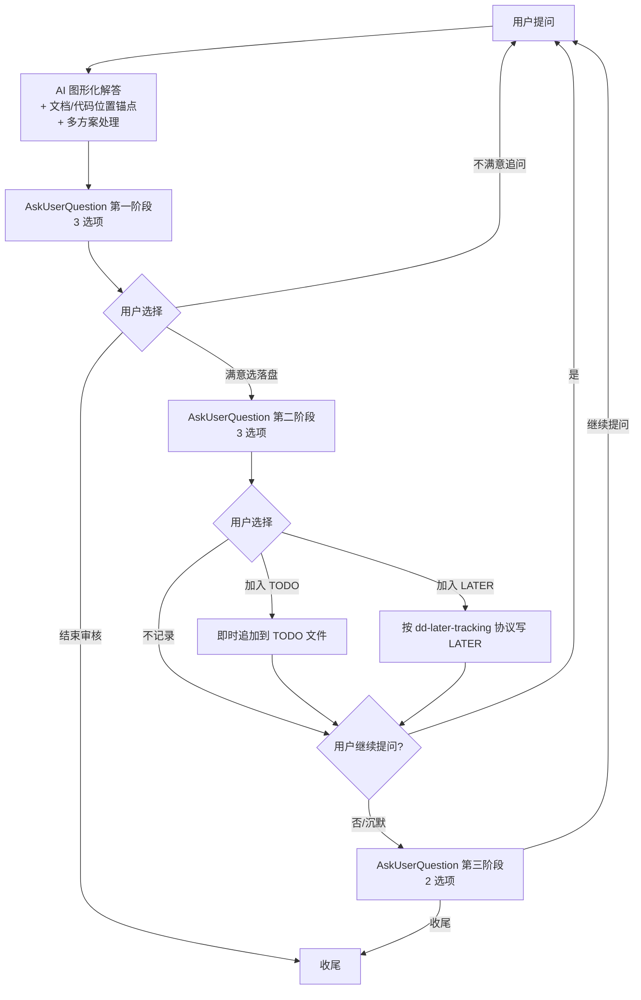

# 文档审核访谈 (Document Review Grilling)

## 概述

用户就一份文档逐条提问，助理解答**必须**用图形化展示（Mermaid 流程图/状态图/时序图/类图为主，复杂架构或 UI 对比场景启动 HTML server），随后**必须**用 `AskUserQuestion` 进行**两阶段提问**：第一阶段问满意度（3 选项），满意时进入第二阶段问落盘方式（TODO / LATER / 不记录）；用户无继续提问时**必须**用 `AskUserQuestion` 询问是否继续提问或收尾；TODO 写入启动时确认的路径，LATER 复用 `/docs/AI/LATER.md` 按 dd-later-tracking 协议；用户选「结束审核」后插入并行分组区块，生成一份 **Logseq 格式**的 TODO 文档供后续 AI 持续改进；收尾时按「文件级冲突最小化」创建并行分组并写入 TODO 文件、给出并行开发建议；审核成果提交 git 后，按 TODO 性质（bug 类 vs feature 类）自动判定后**逐条**路由到 `dd-bug-fix-workflow` 或 `dd-feature-development-workflow`，再按功能模块归类分批修复，每批修复完成 TODO→DONE 原位标记并追加 `修复SHA:: <短SHA>`（指向本批修复 commit tip）后提交，并生成可手动验证的摘要文档（`<doc-name>_批次<N>_验证摘要.md`，存于 TODO 文件同级 `验证摘要/` 子目录，含逐条操作步骤与预期结果）随批提交。全部流程结束后**必须**用 `AskUserQuestion` 询问是否结束或有其他任务。

支持两种审核模式（启动时询问确定，循环协议共享）：
- **模式 A：纯文档审核** — 仅审核文档本身（设计是否合理、是否完整、是否有歧义）
- **模式 B：文档-代码一致性审核** — 审核已有文档，并对照代码验证是否符合文档要求

核心原则：**每轮答完必进两阶段提问、无继续提问时必问是否继续/收尾、解答必含图形化、文档/代码位置必附锚点、场景 B 必验证代码、跨文件搜索必用子代理、TODO/LATER 双轨落盘用户选择落盘方式、TODO 用 Logseq 语法、保存路径启动时确认、多方案必列必选、收尾必创建并行分组写入 TODO、审核与修复两次提交分离、批量修复先按性质路由（bug 类→dd-bug-fix-workflow / feature 类→dd-feature-development-workflow）再按功能模块归类 ≤5 条/批、标记 DONE 必随附修复SHA、每批必生成验证摘要文档（存于 `验证摘要/` 子目录，含可操作验证步骤）、全部流程结束后必问是否结束/有其他任务。**

## 何时使用

触发关键词（任一即激活）：
- "审核文档" / "文档审核" / "审核这份文档"
- "review doc" / "document review"
- "逐条核对文档" / "grill this doc"
- "/dd-docreview-grilling"

适用场景：
- 用户对已有文档做交互式 Q&A 审核
- 用户希望每轮答完后被询问满意度与落盘方式
- 用户希望解答用流程图/状态图/时序图等图形化展示
- 用户希望最后产出可追踪的 TODO 清单

不适用：
- 一次性问答（直接答完即可）
- 让 AI 生成新文档（用 dd-writing-design-specs）
- 纯代码审查（用 chinese-code-review / TRAE-code-review）

## 核心协议

### 1. 启动审核

收到触发词后，第一步必须：
1. 若用户未提供文档路径 → 用 `AskUserQuestion` 询问路径
2. 用 `Read` 读取文档
3. 用 `AskUserQuestion` 询问审核模式：
   - 模式 A：纯文档审核
   - 模式 B：文档-代码一致性审核（需额外询问代码库根目录）
4. 用 `AskUserQuestion` 询问从哪一节开始（默认从开头）
5. 用 `AskUserQuestion` 询问 TODO 文件保存路径，默认 `./docs/AI/doc-review-todo/<doc-name>_TODO.md`（`<doc-name>` 取被审核文档 basename 去扩展名）。**路径提前确定，用于后续及时追加 TODO**；文件此时**不创建**，首次有 TODO 被标记时才创建。若默认目录不存在，首次创建时一并创建之。

**不询问图形化开关**（默认启用）。**不询问 LATER 路径**（固定 `/docs/AI/LATER.md`，按 dd-later-tracking 协议）。**TODO/LATER 文件此时不创建**，首次有 TODO/LATER 标记时才创建。

### 2. 单轮问答循环（必须严格遵守）



**每轮解答后必须立即调 `AskUserQuestion`，不得直接等待文本输入。用户无继续提问时，必须用 `AskUserQuestion` 询问是否继续提问或收尾，不得直接等待文本输入。**

#### 2.1 图形化解答要求

| 问题性质 | 图形类型 | 渲染方式 |
|----------|----------|----------|
| 审核流程 / 决策路径 / 文档结构 | 流程图 | Mermaid `flowchart` 内联 |
| 状态机 / 对象生命周期 / 状态流转 | 状态迁移图 | Mermaid `stateDiagram-v2` 内联 |
| 函数调用链 / 模块交互 / 并发时序 | 时序图 | Mermaid `sequenceDiagram` 内联 |
| 模块关系 / 类依赖 / 文档章节关系 | 类图 | Mermaid `classDiagram` 内联 |
| 架构图 5+ 节点复杂 | 架构图 | HTML server（详见 2.3） |
| UI 原型 / 视觉对比 | 原型图 | HTML server（详见 2.3） |
| 枚举 / 参数对照 | 表格 | Markdown 表格 |
| 纯文字内容 / 单条参数说明 | 代码块 | Markdown 代码块（必要时配 Mermaid） |

**强制规则：**
- 每次解答**至少有一种图形化**（流程图/状态图/时序图/HTML 之一），除非问题纯文字（参数表/枚举）
- 解答**必须**附文档位置锚点 `[文件名#L行号](file:///绝对路径#L行号)`
- 模式 B 下验证过代码的解答**必须**附代码位置锚点
- 多个位置分别附锚点

#### 2.2 多方案处理

若该问题有多种解决方向（如"如何优化"有多方案），**必须**在解答中列出全部候选方案、给出推荐方案及理由，并用 `AskUserQuestion` 让用户选定；用户选定的方案才作为该问题的结论，后续写入 TODO 的「改进建议」字段只写用户选定的方案，不堆砌多方案。若只有单一方向则直接解答。

#### 2.3 HTML server 启动（复杂场景）

**触发条件（任一即启动，不询问用户直接执行）：**
- 架构图 5+ 节点且关系复杂
- UI 原型 / 视觉对比
- 用户明确要求"在浏览器中展示"

**启动协议：**
1. 检查会话内是否已启动 server → 未启动则调 `brainstorming/scripts/start-server.sh --project-dir <项目根>`
2. 保存返回的 `screen_dir` 和 `url`
3. 用 `Write` 写入 HTML 内容片段到 `screen_dir`（不复用文件名，每次新文件）
4. 解答中告诉用户 URL
5. 后续复杂场景会话内复用同一 server

**HTML 文件位置：** `.superpowers/docreview/<session>/`（由 brainstorming server 自动管理到 `.superpowers/brainstorm/`，本 skill 命名空间区分用）

**清理协议：** 用户选「结束审核」时调 `brainstorming/scripts/stop-server.sh $SCREEN_DIR`；HTML 文件持久化供后续查看。

#### 2.4 场景 B 代码验证要求

模式 B 下，遇到「代码是否符合/是否实现/是否一致」类问题时，**必须先通过 `Task` 工具分派 `search` 子代理验证代码再作答**，不得仅凭文档断言，也不得由主代理直接调用 `SearchCodebase`/`Grep` 验证；解答时附上代码位置锚点（`文件路径#L行号`）。唯一例外：读取已知具体文件的具体行可用 `Read` 由主代理直接做，不算"验证代码"。

#### 2.5 第一阶段提问（每轮必问，3 选项）

| 选项 | 行为 |
|------|------|
| 满意，选择落盘方式 | 进入第二阶段 |
| 不满意，追问 | 等待用户继续提问 |
| 结束审核 | 进入收尾 |

#### 2.6 第二阶段提问（仅满意时，3 选项）

| 选项 | 行为 |
|------|------|
| 加入 TODO | **立即**追加到 TODO 文件（首次创建文件+头部） |
| 加入 LATER | 按 dd-later-tracking 协议（Grep 去重 + 子代理精判）追加到 LATER 文件 |
| 不记录 | 等待用户下一题 |

#### 2.7 第三阶段提问（无继续提问时，2 选项）

**触发条件：** 第二阶段结束后，用户**没有继续提问**（沉默/未发新消息），**必须**主动调 `AskUserQuestion` 询问。

| 选项 | 行为 |
|------|------|
| 继续提问 | 等待用户下一个问题 |
| 收尾 | 进入收尾流程 |

**规则：**
- **不得**直接等待文本输入——必须主动询问
- **不得**假设用户想结束而自动进入收尾
- **不得**假设用户想继续而无限等待

### 3. 代码验证纪律（必须严格遵守）

**主代理仅可：** `Read` 已知具体文件的具体行（用户提了路径，或子代理已返回精确位置后）。

**主代理不得：** 直接调用 `Grep` / `SearchCodebase` 跨文件搜索。

**必须用 `Task` 分派 `search` 子代理的场景：**
- 跨文件搜索（"这个函数被谁调用？"）
- 调用链分析（"调用栈？"）
- 模式匹配（"哪里有类似的实现？"）
- 任何会扫描多个文件的查询

**唯一例外：** `Read` 已知具体文件的具体行可由主代理直接做，不算"验证代码"。

**解答必须附文档/代码位置锚点** `[文件名#L行号](file:///绝对路径#L行号)`，子代理返回结果后主代理可 `Read` 指出的具体行做精确解读。

### 4. TODO 文档维护（即时追加 + 收尾刷新）

**核心机制：** TODO 在审核过程中**及时落盘**，避免会话中断丢失。

**首次追加（创建文件）：** 用户首次选「加入 TODO」时，按启动时确定的路径创建 TODO 文件，先写入头部（`审核文档:: path`），随后追加首条 TODO 行。

**后续每次追加：** 用户每选一次「加入 TODO」，**立即**把该条 TODO 追加到文件末尾，编号 = 已追加条数 + 1，即时分配。不重写头部，不重写已有 TODO 行。TODO 条目之间**不留空行**（避免多人审核时产生文件冲突）。

**结束审核时：** 用户选「结束审核」后，在头部（`审核文档::` 行）之后、首条 TODO 之前**插入「并行分组」区块**（详见第 6 步第 3 项）。TODO 行已在过程中落盘，不重写；并行分组区块为新增插入，不重写已有内容。

**空场景：** 若用户从未选过「加入 TODO」就直接结束，文件未创建，**直接不写文件，不询问**。

**格式：** Markdown 任务列表语法（`- [ ] TODO1.` + 缩进 `key:: value` 属性）

模板：
```
- 审核文档:: path/to/reviewed-doc.md
- 审核时间:: YYYY-MM-DD HH:MM ~ HH:MM
- 并行分组（按冲突最小化，供并行开发参考）   ← 收尾时生成，详见第 6 步第 3 项
  - 可并行批次（互不冲突文件，可同时分派多个开发者/代理）
    - 批次 P1:: T2(src/payment/callback.ts) | T5(src/user/list.ts) | T6(src/auth/permission.ts) | T7(src/report/export.ts)
    - 批次 P2:: T4(src/payment/order.ts)   ← 与 T2 同 #支付流程 但不同文件，可与 P1 并行
  - 需串行批次（共享文件，必须串行）
    - 串行组 S1:: T1 → T3 → T8（均触 src/auth/login.ts，建议按 P0→P1→P3 顺序）
  - 分组依据:: 模式 B 按「代码位置」文件路径；模式 A 或无代码位置条目按功能标签（同标签串行、不同标签并行）
  - 并行建议:: P1+P2 共 5 条可由 2+ 开发者/代理同时进行；S1 内 3 条需串行
- [ ] TODO1. [P1] 问题简述 #登录
  - 文档位置:: [file.md#L10-20](file:///absolute/path/to/file.md#L10-20)
  - 现状:: 文档当前怎么写的
  - 改进建议:: 应该怎么改
  - 代码位置:: [file.ts#L30-45](file:///absolute/path/to/file.ts#L30-45)   ← 可选：仅在实际引用代码锚点时添加，无则省略整行
  - 图形化预览:: [查看](file:///path/to/preview.html)（可选，仅 HTML server 时添加，无则省略整行）
  - 审核时间:: YYYY-MM-DD HH:MM
- [ ] TODO2. [P2] 另一个问题简述 #通用
  - 文档位置:: [file.md#L30-40](file:///absolute/path/to/file.md#L30-40)
  - 现状:: 另一个文档当前怎么写的
  - 改进建议:: 另一个应该怎么改
  - 审核时间:: YYYY-MM-DD HH:MM
```

> 代码位置属性行**按需添加**：仅当该问题实际通过 `Task` 工具分派 `search` 子代理验证过代码并需要引用代码锚点时才写；未引用代码时**完全省略该属性行**（不留空值）。模式 A 通常全部省略，模式 B 也只在真正引用了代码时才写。

> 图形化预览属性行**仅 HTML server 时添加**：解答用了 HTML server 时附预览链接，Mermaid 内联图无此属性行。

> 修复SHA 属性行**仅完成时追加**：条目在 7.2 第 3 步标记为 `- [x] TODO1.` 时，于该条目末尾追加 `修复SHA:: <短SHA>`（值 = 本批修复 commit tip 的短 SHA，由 `git log -1 --format=%h` 取得）。待办状态 `[ ]` 下**不写**该属性行；标记完成 `[x]` 时作为该条目**最后一个**属性行追加（在代码位置/图形化预览属性行之后，若存在）。

**第一行要求**：简洁、准确、可独立理解问题（脱离上下文也能看懂）。分类标签用产品功能（如 `#登录`、`#支付流程`），无法归类到具体功能时用 `#通用`。
- ✅ `- [ ] TODO1. [P1] 登录模块缺少双因素认证说明 #登录 #权限控制`
- ❌ `- [ ] TODO1. [P1] description 有问题 #内容`（标签用了已废弃的性质标签，且描述笼统）

**字段说明**：

第一行收敛：TODO前缀 + 序号（`TODO1.`）/ 优先级（`[Pn]`）/ 问题描述 / 分类标签（`#标签`）。状态由 Markdown 任务列表复选框（`[ ]`待办 / `[x]`完成）管理，不另设字段。

| 缩进属性 | 取值 | 必有性 |
|----------|------|--------|
| 文档位置 | 可点击链接 `[文本](file:///绝对路径#L行号)` | **必有** |
| 现状 | 文档当前怎么写的 | **必有** |
| 改进建议 | 应该怎么改（含改文档/改代码的指向）。若审核过程中该问题经多方案选择，**只写用户选定的方案**，不堆砌多方案 | **必有** |
| 代码位置 | 可点击链接 `[文本](file:///绝对路径#L行号)`。**仅在实际引用代码锚点时添加；未引用则完全省略该属性行（不留空值）** | 可选 |
| 图形化预览 | 可点击链接到 HTML 文件。**仅 HTML server 时添加；Mermaid 内联图无此属性行** | 可选 |
| 审核时间 | YYYY-MM-DD HH:MM | **必有** |
| 修复SHA | 仅完成时追加。`修复SHA:: <短SHA>`，值为本批修复 commit tip 的短 SHA（`git log -1 --format=%h`）。待办 `[ ]` 状态下不写该属性行；标记完成 `[x]` 时作为该条目**最后一个**属性行追加 | 仅完成时 |

分类标签取值：**按产品功能动态生成**（如 `#登录`、`#支付流程`、`#权限控制`、`#导出报告`），由 AI 审核时根据问题涉及的功能模块命名；无法归类到具体功能时用 `#通用`；可多标签，至少 1 个。
优先级取值：P0(阻塞) / P1(重要) / P2(一般) / P3(优化)

### 5. LATER 文件维护（按 dd-later-tracking 协议）

**路径：** `/docs/AI/LATER.md`（项目根目录，固定，不询问）。

**写入协议（严格按 dd-later-tracking）：**
1. `Read` `/docs/AI/LATER.md`
2. `Grep` 关键词粗筛候选
3. 有候选 → `Task` 子代理精判是否同一事项
4. 同一事项 → 修改已有条目（合并简洁描述）
5. 独立事项 → 新增条目到末尾
6. 无候选或文件不存在 → 首次创建（加标题行）

**格式：**
```
- [ ] LATER1. 简要描述（≤80 中文字符）#模块标签
```

**LATER 不在本 skill 收尾时单独 git 提交**（dd-later-tracking 协议未要求即时提交），统一在收尾时与 TODO 一起提交。

### 6. 收尾

结束审核后：
1. **TODO 文件处理：**
   - 若文件已创建：输出文件路径（用 markdown 链接 `[文件名](file:///绝对路径)`）
   - 若未创建（空场景）：告知用户本次未记录 TODO，跳过后续 TODO 步骤
2. **若会话启动过 HTML server：** 调 `brainstorming/scripts/stop-server.sh $SCREEN_DIR` 关闭
3. 简要汇总：N 个问题，按优先级分布（如 P0:1 / P1:3 / P2:2），按落盘分布（TODO:A / LATER:B / 不记录:C）
4. **创建并行分组并写入 TODO 文件**（按冲突最小化，供并行开发参考；空场景跳过）：
   - **分组依据**：
     - 模式 B：按各 TODO「代码位置」字段的文件路径做**文件级冲突分析**。文件集合有交集的 TODO 归为同一「串行组」；无交集的归为「可并行批次」。**仅看文件路径，不看功能标签**（同功能标签但不同文件 = 可并行；同文件不同行 = 仍归串行组，因共享文件需串行修改）
     - 模式 A（无代码位置）或模式 B 中无代码位置的条目：按功能标签分组（同标签 = 潜在冲突归串行组；不同标签 = 可并行）
     - 既无代码位置又无功能标签：默认归"无冲突可并行"
   - **写入位置**：TODO 文件中头部（`审核文档::` 行）之后、首条 TODO 之前（插入新区块，不重写头部、不重写已有 TODO 行）
   - **区块结构**（Logseq 缩进列表）：
     ```
     - 并行分组（按冲突最小化，供并行开发参考）
       - 可并行批次（互不冲突文件，可同时分派多个开发者/代理）
         - 批次 P1:: T2(src/payment/callback.ts) | T5(src/user/list.ts) | T6(src/auth/permission.ts) | T7(src/report/export.ts)
         - 批次 P2:: T4(src/payment/order.ts)   ← 与 T2 同 #支付流程 但不同文件，可与 P1 并行
       - 需串行批次（共享文件，必须串行）
         - 串行组 S1:: T1 → T3 → T8（均触 src/auth/login.ts，建议按 P0→P1→P3 顺序）
       - 分组依据:: 模式 B 按「代码位置」文件路径；模式 A 或无代码位置条目按功能标签（同标签串行、不同标签并行）
       - 并行建议:: P1+P2 共 5 条可由 2+ 开发者/代理同时进行；S1 内 3 条需串行
     ```
   - **建议内容必须包含**：哪些批次可同时启动、哪些必须串行、串行组内的建议顺序（按 P0→P1→P2→P3）
5. **git 提交（统一）：**
   - `git add <TODO 文件> <LATER 文件>`（LATER 文件若有变更）
   - `git commit`，commit message 格式：`docs(dd-docreview-grilling): 记录 <doc-name> 审核发现的 N 个 TODO + M 个 LATER`
   - 若 TODO 和 LATER 都未创建（双空场景）：跳过 git 提交
   - **分支上下文**（遵循 dd-ai-git-workflow）：审核成果提交应在 `docs/{主题}` 分支上进行；若批量修复路由到 fix/feature 分支，则审核成果提交可与首批修复同分支或在 `docs/` 分支独立提交后合并
   - **公共文件**（遵循 dd-ai-git-workflow 公共文件锁机制）：若 TODO/LATER 文件本身属于公共文件（如 `AGENTS.md`、`CLAUDE.md`），commit message 必须包含 `PublicFile: <文件路径>` tag
6. 用 `AskUserQuestion` 询问是否立即进入批量修复流程（第 7 步）：是 → 进入第 7 步；否 → 进入第 8 步（流程结束询问）

### 7. 批量修复流程

**前提：** 第 6 步用户选「是」进入此流程。TODO 文件已提交，含 N 条 `- [ ] TODO1.` 条目。

**7.1 归类分批**：
- **第一步：逐条性质判定**（在功能归类前完成）：对每条 TODO 判定属于 **bug 类** 还是 **feature 类**：
  - **bug 类**：代码已存在（文件/函数/类齐全），仅行为与文档不符 → 调用 `dd-bug-fix-workflow`。例：缺校验、值错、状态枚举不一致、逻辑分支错。
  - **feature 类**：文档描述的功能在代码中**完全缺失**（无对应文件/目录）或**仅有空桩**（`pass`/`NotImplementedError`/空函数体），需从零实现或补全实现 → 调用 `dd-feature-development-workflow`。例：整个模块缺失、函数只有 `pass`、类只有声明无方法体。
  - **边界规则**：空桩一律算 feature 类（即使骨架已就位）；仅改值/加校验/补分支算 bug 类。判定不清时用 `AskUserQuestion` 让用户裁定，不得默认归 bug 类。
- **第二步：功能模块归类**：按 TODO 的功能模块标签（`#登录`/`#支付流程`…）归类；同功能模块内按优先级（P0→P1→P2→P3）排序
- **批次大小**：单批次 ≤ 5 条；同功能模块超过 5 条时按优先级拆成多批（P0+P1 优先成批）
- **跨功能 P0**：即使只有 1 条，也单独成批，避免被埋在大批次里
- **不跨功能合并**：小批次（1-2 条 P2/P3）也不与其他功能模块合并
- **不跨性质合并**：同一批次内不得混修 bug 类与 feature 类（两个技能内部流程不同，混批会让 `scope` 与提交语义混乱）；同功能模块若同时含两类，按性质拆成两批
- 归类结果用 `AskUserQuestion` 展示给用户确认批次划分（含每批性质标签 bug/feature）后再开始修复

**7.2 逐批修复**（从 P0 批或功能模块 1 批开始）：

每批修复流程：
1. **按批次性质路由技能**（性质已在 7.1 判定，本步不得重新判定或偷懒一律走 dd-bug-fix-workflow）：
   - 批次性质 = **bug 类** → 调用 `dd-bug-fix-workflow` 技能
   - 批次性质 = **feature 类** → 调用 `dd-feature-development-workflow` 技能
   - **降级规则**（feature 类 → dd-bug-fix-workflow 的唯一可选路径，须同时满足全部条件）：
     - ✅ 纯后端逻辑（无 UI / 无可见行为 / 无 E2E 证据需求）
     - ✅ 规模极小：**单函数补全实现**，不跨文件、不跨模块
     - ✅ 不涉及状态流转 / 回调处理 / 外部系统交互 / 多函数协作
     - 须在 commit message body 注明降级原因（如"降级使用 dd-bug-fix-workflow：纯后端单函数补全，符合降级条件"）
   - **禁止降级**的情形（任一命中即必须走 `dd-feature-development-workflow`）：涉及 UI/可见行为/E2E 证据；跨文件或多函数；状态流转/回调/外部系统交互；整个模块/目录缺失；类有多方法需实现
   - 传 3 个必传项：本批 TODO 序号列表（如 [1, 3, 5]）、TODO 文件绝对路径、被审核文档路径 / 代码库根目录（模式 B 时）
2. **不干预被调用技能内部**：TDD/设计规范/验证/提交消息格式由其按自身规范执行；本技能仅提供 scope 建议（= 功能标签）
3. **获取修复提交 SHA 并更新 TODO 文件**：被调用技能（dd-bug-fix-workflow / dd-feature-development-workflow）已在内部完成代码修复并提交（其工作流含提交+push）。先用 `git log -1 --format=%h` 取最新提交的短 SHA（= 本批修复 commit 的 tip）；再把本批条目的 `- [ ] TODO1.` 改为 `- [x] TODO1.`，**并在每条条目末尾追加一行 `修复SHA:: <短SHA>`**（作为该条目最后一个缩进属性行，紧跟在原有属性行之后），其他属性行不动，条目留原位。若被调用技能产出多个 commit（如修复+lint+合并），取最后一个（tip）的短 SHA；完整范围可由上一批次 tip 或审核提交（第 6 步第 5 项）起 `git log` 追溯。**若工作区仍有未提交的修复变更**（被调用技能未完成提交），须先让其完成提交再取 SHA，不得在未提交状态下取 SHA。
4. **生成验证摘要文档**：为本批生成一份可手动验证的摘要文档，供用户按操作步骤逐条验证修复效果。
   - **查看实际改动**：用 `git show <修复SHA>` 查看本批修复 commit 的 diff（多 commit 时用 `git diff <上批tip>..<本批tip>` 看完整范围），据此编写可操作的验证步骤。
   - **命名**：`<doc-name>_批次<N>_验证摘要.md`（`<doc-name>` = 被审核文档 basename 去扩展名；`<N>` = 本批次序号，与 commit message 中「第 X 批」的 X 一致，如 `批次1`）。
   - **位置**：TODO 文件所在目录下的 `验证摘要/` 子目录（如 `./docs/AI/doc-review-todo/验证摘要/`）。若子目录不存在，首次生成时一并创建。
   - **格式**（markdown）：
     ```
     # <doc-name> 审核第 N 批修复验证摘要
     
     - 被审核文档:: path/to/reviewed-doc.md
     - TODO 文件:: path/to/TODO.md
     - 批次:: 第 N 批（bug 类 / feature 类，#功能标签）
     - 修复 commit SHA:: <短SHA>
     - 生成时间:: YYYY-MM-DD HH:MM
     - 本批条目数:: M
     
     ## 验证步骤
     
     ### TODO1. [Pn] 问题简述 #标签
     - 文档位置:: [doc.md#L行](file:///...)
     - 修复内容:: <基于 git show 看到的实际改动，简述改了什么>
     - 代码位置:: [file.ts#L行](file:///...)   ← 可选，沿用 TODO 条目中的代码位置
     - 修复SHA:: <短SHA>
     - 验证步骤::
       1. <具体可执行的操作步骤1>
       2. <操作步骤2>
     - 预期结果:: <验证通过应观察到的具体可判定现象>
     - 验证结果:: 待验证（用户手动验证后改为「通过」或「未通过 + 说明」）
     ```
   - **验证步骤要求**：必须具体可执行（用户照做即可验证），禁止笼统。
     - ❌ "测试登录功能"
     - ✅ "启动应用 → 进入登录页 → 输入正确用户名+错误密码 → 点击登录 → 观察是否弹出双因素认证提示"
     - 每条 TODO 至少 2 步；预期结果必须可观察判定（不是"应该没问题"，而是"应显示 XXX 提示 / 应跳转到 XXX 页"）。
5. **提交修复成果**：`git add <修复的文件> <TODO 文件> 验证摘要/<验证摘要文档>` + `git commit`（修复的文件已由被调用技能提交，此处 `git add` 对其为空操作；TODO 文件含 `- [x] TODO1.` + 修复SHA、验证摘要文档为本批新增），commit message 格式：
   - bug 类批次：`fix(<scope>): 修复 <doc-name> 审核的第 X 批 N 个问题`（`<scope>` = 功能标签）
   - feature 类批次：`feat(<scope>): 实现 <doc-name> 审核的第 X 批 N 个缺失功能`（`<scope>` = 功能标签）
   - **公共文件修改**（遵循 dd-ai-git-workflow 公共文件锁机制）：若本批修复触及公共文件（参见 `.trae/public-files.txt` 清单），commit message 必须包含 `PublicFile: <文件路径>` tag，且公共文件修改应已由被调用技能在独立分支处理
   - 提交后用 markdown 链接 `[文件名](file:///绝对路径)` 输出验证摘要文档路径给用户，提示可按其逐条手动验证本批修复。

**7.3 询问是否继续下一批**（每批提交后，**必须**用 `AskUserQuestion` 给出以下 4 选项，不得减少或省略）：

| # | 选项 | 行为 |
|---|------|------|
| 1 | 继续修复下一批 | 按批次顺序修复下一批 |
| 2 | 选择特定批次 | 用 `AskUserQuestion` 让用户从剩余未修复批次中选 |
| 3 | 暂停修复，保留 TODO | 结束修复流程，TODO 文件保留未修复条目供后续 |
| 4 | 全部自动修复（不再询问） | 依次修复所有剩余批次，每批完成仅提交不询问 |

**即使只剩最后 1 批，也必须给出全部 4 选项**（用户可能选「暂停」或「选择特定批次」回头补验）。

**7.4 流程结束**：所有批次修复完成 / 用户选「暂停」→ 输出最终汇总（已修复 X 条 / 剩余 Y 条，按功能模块分布）。

### 8. 流程结束询问

**全部流程结束后（第 6 步选不进入批量修复，或第 7 步批量修复完成/暂停），必须用 `AskUserQuestion` 询问：**

| 选项 | 行为 |
|------|------|
| 结束 | 真正结束，输出最终汇总 |
| 有其他任务 | 用户可继续其他工作（如审核另一份文档、调其他技能等） |

**不得直接结束而不询问。不得假设用户想结束。**

## Git 工作流合规（强制）

本技能涉及 Git 操作，必须遵循 dd-ai-git-workflow 系列子技能：

| 子技能 | 职责 | 本技能相关 |
|--------|------|-----------|
| [dd-git-workflow](../dd-git-workflow/SKILL.md) | 入口导航、分支模型 | 总览 |
| [dd-git-branch](../dd-git-branch/SKILL.md) | 分支命名、创建 | `docs/{主题}` 分支命名 |
| [dd-git-merge](../dd-git-merge/SKILL.md) | merge-only、Commit 规范 | merge-only，禁止 rebase |
| [dd-git-conflict](../dd-git-conflict/SKILL.md) | 冲突处理、公共文件锁 | PublicFile tag |
| [dd-git-worktree](../dd-git-worktree/SKILL.md) | worktree 管理 | 隔离环境 |
| [dd-git-health](../dd-git-health/SKILL.md) | 健康度、每日同步 | 24h 合并窗口 |
| [dd-git-cleanup](../dd-git-cleanup/SKILL.md) | 废弃清理 | 合并后清理 |
| [dd-git-ci](../dd-git-ci/SKILL.md) | 合并前检查、CI | 5 步检查脚本 |

**本技能特有约束**：
- 禁止使用 `git rebase`（必须 merge-only）
- 禁止夹带公共文件修改
- 禁止跳过合并前检查

## 红线 - 停下并修正

- **解答未含任何图形化**（纯文字描述流程/状态/调用） → 必须用 Mermaid 流程图/状态图/时序图/类图（除非纯文字问题如参数表）
- **解答未附文档/代码位置锚点** → 必须用 `[文本](file:///绝对路径#L行号)` 可点击链接
- **答完直接等输入** → 必须立即调 `AskUserQuestion` 第一阶段
- **单阶段提问或无提问** → 必须两阶段（满意后必进第二阶段选 TODO/LATER/不记录）
- **两阶段选项少于 3 个或改语义** → 第一阶段固定 3 选项（满意选落盘/不满意追问/结束），第二阶段固定 3 选项（TODO/LATER/不记录）
- **用户无继续提问时直接等待文本输入** → 必须调 `AskUserQuestion` 第三阶段询问是否继续/收尾
- **用户无继续提问时假设结束自动收尾** → 必须先询问用户，不得替用户做决定
- **用户无继续提问时假设继续无限等待** → 必须先询问用户，不得无限等待
- **TODO 用 Logseq `- TODO N.` 或普通列表** → 改用 Markdown 任务列表 `- [ ] TODO1. [Pn] 简述 #标签` + `key:: value`
- **TODO 第一行问题描述过于笼统**（如「有问题」「需改进」）→ 必须简洁准确、可独立理解
- **位置字段（文档位置/代码位置）未用可点击链接格式** → 必须用 `[文本](file:///绝对路径#L行号)`
- **TODO 缩进属性不全** → 3 必有（文档位置/现状/改进建议）+ 审核时间必有 + 1 可选（代码位置：仅在实际引用代码锚点时添加，未引用则完全省略属性行）+ 1 可选（图形化预览：仅 HTML server 时添加）
- **未询问保存路径就直接写文件** → 启动时必须用 `AskUserQuestion` 确认路径（首次追加时才创建文件）
- **用户未宣布结束就插入并行分组** → TODO 行在过程中及时追加；并行分组区块必须等用户选「结束审核」后才插入
- **文档位置只写文件名** → 必须带行号或章节锚点
- **场景 B 下未验证代码就作答**（仅凭文档断言「代码符合/不符合」）→ 必须先通过 `Task` 工具分派 `search` 子代理验证；主代理不得直接调用 `SearchCodebase`/`Grep` 验证代码（`Read` 已知具体文件具体行除外）
- **跨文件搜索由主代理直接 Grep/SearchCodebase** → 必须用 `Task` 分派 `search` 子代理；主代理仅可 `Read` 已知具体文件具体行
- **TODO 积压到结束才写**（用户选「加入 TODO」后未立即追加到文件）→ 必须每次标记立即追加，禁止积压
- **LATER 写入不走 dd-later-tracking 协议** → 必须 Grep 去重 + 子代理精判
- **LATER 描述超 80 字符或展开成段落** → LATER 是索引不是文档，必须压缩
- **多方案问题未列方案就解答**（或未让用户用 `AskUserQuestion` 选定方案）→ 必须列全部候选方案 + 推荐方案 + 理由，并让用户选定
- **TODO 改进建议字段堆砌多方案** → 只写用户选定的方案，多方案讨论留在会话记录里
- **收尾未创建并行分组就提交 TODO** → 必须在第 6 步第 4 项创建并行分组并写入 TODO 文件后再提交（第 6 步第 5 项）
- **模式 B 并行分组按功能标签而非文件路径**（有代码位置却按标签分组）→ 模式 B 必须按「代码位置」文件路径做文件级冲突分析；同标签不同文件 = 可并行；仅模式 A 或无代码位置条目才按功能标签
- **并行分组写入位置错误**（重写头部或重写已有 TODO 行）→ 必须插入头部（`审核文档::` 行）之后、首条 TODO 之前；不重写已有内容
- **并行分组不给建议**（只列批次不给并行/串行建议）→ 建议内容必须包含：哪些可同时启动、哪些必须串行、串行顺序（P0→P1→P2→P3）
- **空场景仍创建并行分组** → TODO 文件未创建时跳过此步（与收尾第 1 项空场景一致）
- **HTML server 询问用户是否启动** → 触发条件满足时直接启动（用户规则：浏览器展示直接执行）
- **复杂架构图用 Mermaid 硬塞**（5+ 节点挤成一团） → 必须启动 HTML server
- **未启动 server 就写 HTML 文件** → 必须先调 `start-server.sh` 拿到 `screen_dir`
- **HTML 文件复用文件名** → 每个屏幕必须新文件名
- **收尾不关闭 HTML server** → 若会话启动过 server，收尾时必须调 `stop-server.sh` 关闭
- **批量修复未归类就开修** → 必须先按性质判定（bug/feature）再按功能模块标签归类分批，归类完成后直接开始修复（第 6 步并行分组已覆盖分类逻辑）
- **跳过 7.1 性质判定直接调 dd-bug-fix-workflow** → 7.1 第一步逐条性质判定是必经步骤；不得跳过判定、不得在 7.2 重新判定、不得偷懒一律走 dd-bug-fix-workflow
- **对 feature 类 TODO（空桩/模块缺失/函数体只有 pass）硬套 dd-bug-fix-workflow** → feature 类必须走 `dd-feature-development-workflow`；仅当同时满足「纯后端 + 单函数补全 + 不跨文件 + 无状态流转/回调/外部系统交互」时可降级，且须在 commit message body 注明降级原因；命中任一禁止降级情形（UI/可见行为/E2E/跨文件/多函数/状态流转/回调/外部系统/整个模块缺失/类多方法）时强制走 dd-feature-development-workflow
- **同批次混修 bug 类与 feature 类** → 两技能内部流程不同，不得混批；同功能模块若同时含两类按性质拆成两批
- **批次超 5 条** → 必须按优先级拆分；跨功能 P0 必须单独成批
- **未提交就改 TODO 为完成** → 必须先由被调用技能（dd-bug-fix-workflow / dd-feature-development-workflow）完成修复并提交，再改 `- [ ] TODO1.` 为 `- [x] TODO1.` 并随修复内容一起提交
- **批次未完成就询问是否继续** → 必须本批完全修复 + 提交后才能询问；批次中不引入 DOING 半成品状态
- **未询问就自动修下一批** → 除用户选「全部自动修复」外，每批提交后必须用 `AskUserQuestion` 询问
- **7.3 选项少于 4 个**（只给"继续修复下一批"）→ 必须给出全部 4 选项（继续下一批 / 选择特定批次 / 暂停 / 全部自动），即使只剩 1 批也不得减少
- **标记完成时未追加修复SHA**（或漏取、或用错 SHA 来源）→ 必须先用 `git log -1 --format=%h` 取本批修复 commit tip 的短 SHA，再随 `- [ ] TODO1.` → `- [x] TODO1.` 一起追加 `修复SHA:: <短SHA>` 属性行；不得跳过、不得用 TODO 状态更新提交自身的 SHA、不得在修复未提交时取 SHA
- **每批未生成验证摘要文档就提交/询问下一批** → 必须在第 4 步为本批生成 `<doc-name>_批次<N>_验证摘要.md`（含逐条可操作验证步骤+预期结果），并在第 5 步随 TODO 文件一起 `git add` 提交；不得跳过、不得用会话回复代替文档
- **验证步骤笼统不可执行**（如"测试 XX 功能""检查是否正常"）→ 必须具体到用户照做即可验证（启动应用→进入某页→输入某值→观察某现象）；每条至少 2 步，预期结果必须可观察判定
- **验证摘要文档命名/位置错误**（如放到其他目录、命名不含批次号、用英文后缀）→ 命名必须 `<doc-name>_批次<N>_验证摘要.md`，位置必须在 TODO 文件同级的 `验证摘要/` 子目录
- **验证摘要文档漏提交**（生成后不 `git add`）→ 必须在第 5 步 `git add <验证摘要文档>` 随批提交，保证可追溯
- **全部流程结束后不询问是否结束/有其他任务** → 必须用 `AskUserQuestion` 询问，不得直接结束
- **启动询问图形化开关** → 默认启用，不询问
- **启动询问 LATER 路径** → 固定 `/docs/AI/LATER.md`，不询问
- **使用 git rebase 同步上游或合并分支**（遵循 dd-ai-git-workflow merge-only 原则，禁止 rebase）
- **在 docs/fix/feature 分支夹带公共文件修改**（公共文件必须开独立分支，加 PublicFile tag）
- **跳过合并前检查直接合并**（必须运行 pre-merge-check.sh，all_pass=false 禁止合并）

**违反以上任一条 = 违反本技能的精神。**

## 常见错误

| 错误 | 修复 |
|------|------|
| 解答纯文字描述状态流转 | 必须用 Mermaid `stateDiagram-v2` 内联图 |
| 解答纯文字描述调用链 | 必须用 Mermaid `sequenceDiagram` 内联图 |
| 跨文件搜索直接 Grep | 必须用 `Task` 分派 `search` 子代理 |
| 解答不附文档/代码位置锚点 | 必须用 `[文本](file:///绝对路径#L行号)` |
| 答完直接等输入 | 必须立即调 `AskUserQuestion` 第一阶段 |
| 单阶段提问或不提问 | 必须两阶段：满意后必进第二阶段选 TODO/LATER/不记录 |
| 用户无继续提问时直接等待 | 必须调 `AskUserQuestion` 第三阶段询问是否继续/收尾 |
| 用户无继续提问时假设结束自动收尾 | 必须先询问用户，不得替用户做决定 |
| 用户无继续提问时假设继续无限等待 | 必须先询问用户，不得无限等待 |
| 选项少于 3 个或改语义 | 第一阶段 3 选项，第二阶段 3 选项，第三阶段 2 选项，顺序语义不可变 |
| TODO 用 Logseq `- TODO N.` 或普通列表 | 改用 Markdown 任务列表 `- [ ] TODO1. [Pn] 简述 #标签` + 缩进属性 |
| TODO 第一行过于笼统 | 必须简洁准确、可独立理解 |
| 位置字段用纯文本 | 改用 `[文本](file:///绝对路径#L行号)` 可点击链接 |
| 未询问保存路径 | 启动时必须 `AskUserQuestion` 确认路径（首次追加时才创建文件） |
| 文档位置只写文件名 | 必须带 `#L行号` 或 `#章节` |
| TODO 缺字段 | 3 必有（文档位置/现状/改进建议）+ 审核时间必有；代码位置按需添加，未引用代码时省略属性行；图形化预览仅 HTML server 时添加 |
| 场景 B 仅凭文档断言 | 必须先通过 `Task` 工具分派 `search` 子代理验证代码，主代理不得直接调用 `SearchCodebase`/`Grep` |
| 场景 B 主代理直接 Grep 验证代码 | 必须改用 `Task` 子代理隔离上下文；只有 `Read` 已知具体文件具体行可例外 |
| TODO 积压到结束才写 | 必须每次标记立即追加到文件，禁止积压；中断会丢失 |
| LATER 不去重直接新增 | 必须 Grep 粗筛 + 子代理精判 |
| LATER 描述超 80 字符 | LATER 是索引不是文档，必须压缩到单行 |
| 多方案问题未列方案/未让用户选 | 必须列全部候选 + 推荐方案 + 理由，用 `AskUserQuestion` 让用户选定 |
| TODO 改进建议字段堆砌多方案 | 只写用户选定的方案，多方案讨论留在会话记录里 |
| 结束审核后不汇总 | 收尾第 3 步必须口述输出优先级分布 + 落盘分布（头部文件不再含汇总字段） |
| 收尾未创建并行分组就提交 | 必须在第 6 步第 4 项创建并行分组并写入 TODO 文件后再提交（第 6 步第 5 项） |
| 模式 B 并行分组按功能标签而非文件 | 模式 B 必须按「代码位置」文件路径做文件级冲突分析；同标签不同文件 = 可并行；模式 A 或无代码位置条目才按功能标签 |
| 并行分组重写头部/已有 TODO 行 | 必须插入头部（`审核文档::` 行）之后、首条 TODO 之前，不重写已有内容 |
| 并行分组只列批次不给建议 | 建议必须含：哪些可同时启动、哪些必须串行、串行顺序（P0→P1→P2→P3） |
| 空场景仍创建并行分组 | TODO 文件未创建时跳过此步 |
| HTML server 询问用户是否启动 | 触发条件满足直接启动（浏览器展示不询问） |
| 复杂架构图硬塞 Mermaid | 5+ 节点必须启动 HTML server |
| 未启动 server 就写 HTML | 必须先调 `start-server.sh` 拿到 `screen_dir` |
| HTML 文件复用文件名 | 每个屏幕必须新文件名 |
| 收尾不关闭 HTML server | 若会话启动过 server，收尾时必须调 `stop-server.sh` 关闭 |
| 批量修复未归类就开修 | 必须先按性质判定（bug/feature）再按功能模块标签归类分批，归类后直接开始修复（第 6 步并行分组已覆盖分类逻辑） |
| 跳过 7.1 性质判定直接调 dd-bug-fix-workflow | 7.1 第一步逐条性质判定是必经步骤；不得跳过、不得在 7.2 重新判定、不得偷懒一律走 dd-bug-fix-workflow |
| feature 类 TODO（空桩/模块缺失/pass）硬套 dd-bug-fix-workflow | feature 类必须走 `dd-feature-development-workflow`；仅当同时满足「纯后端 + 单函数补全 + 不跨文件 + 无状态流转/回调/外部系统交互」时可降级，且须在 commit message body 注明降级原因；命中禁止降级情形（UI/可见行为/E2E/跨文件/多函数/状态流转/回调/外部系统/整个模块缺失/类多方法）时强制走 dd-feature-development-workflow |
| 滥用降级（跨文件/状态流转/整个模块缺失也降级到 dd-bug-fix-workflow） | 降级须同时满足全部 3 条件；任一禁止降级情形命中即必须走 dd-feature-development-workflow |
| 同批次混修 bug 类与 feature 类 | 两技能流程不同不得混批；同功能模块含两类时按性质拆成两批 |
| 批次超 5 条 | 必须按优先级拆分；跨功能 P0 单独成批 |
| 未提交就改 TODO 为完成 | 必须先由被调用技能（dd-bug-fix-workflow / dd-feature-development-workflow）完成修复并提交，再改 `- [ ] TODO1.` 为 `- [x] TODO1.` 并随修复内容一起提交 |
| 批次中用 DOING 标记半成品 | 不引入 DOING；本批完全修复+提交后才改 `- [x] TODO1.` |
| 未询问就自动修下一批 | 除「全部自动修复」外，每批提交后必须 `AskUserQuestion` 询问 |
| 7.3 只给"继续修复下一批"1个选项 | 必须给出全部 4 选项（继续下一批 / 选择特定批次 / 暂停 / 全部自动），即使只剩 1 批也不得减少 |
| 标记完成时未记录修复SHA | 必须先 `git log -1 --format=%h` 取本批修复 commit tip 短 SHA，随 `- [ ] TODO1.` → `- [x] TODO1.` 追加 `修复SHA:: <短SHA>` |
| 修复SHA 写成了 TODO 更新提交自身的 SHA | 修复SHA 须指向代码修复 commit（被调用技能产出 tip），不是 TODO 状态更新提交的 SHA |
| 修复未提交就取 SHA | 被调用技能须先完成提交；未提交时 `git log -1` 取到旧 SHA，须等其提交后再取 |
| 每批未生成验证摘要文档 | 必须在第 4 步生成 `<doc-name>_批次<N>_验证摘要.md`（含逐条验证步骤+预期结果），第 5 步随批 `git add` 提交 |
| 验证步骤笼统（"测试 XX""检查是否正常"） | 必须具体可执行：启动应用→进入某页→输入某值→观察某现象；每条 ≥2 步，预期结果可观察判定 |
| 验证摘要文档命名/位置错 | 命名 `<doc-name>_批次<N>_验证摘要.md`，位置必须在 TODO 文件同级的 `验证摘要/` 子目录 |
| 验证摘要文档漏提交 | 第 5 步 `git add <验证摘要文档>` 随批提交，不得只生成不提交 |
| 验证摘要文档用会话回复代替 | 必须落盘为独立 .md 文件并提交；会话回复不持久、不可追溯 |
| 全部流程结束后直接结束不询问 | 必须用 `AskUserQuestion` 询问是否结束/有其他任务 |
| 启动询问图形化开关 | 默认启用，不询问 |
| 启动询问 LATER 路径 | 固定 `/docs/AI/LATER.md`，不询问 |

## 合理化借口表

| 借口 | 现实 |
|------|------|
| "文档审核不需要图形化，文字说清楚就行" | Mermaid 渲染后一眼看懂；文字箭头链对复杂状态机反而更慢理解。每问至少一种图形化是硬约束 |
| "复杂架构图用 Mermaid 硬塞更省事" | 5+ 节点 Mermaid 挤成一团不可读；必须启动 HTML server |
| "HTML server 询问用户是否启动更礼貌" | 用户规则明确"浏览器展示直接执行"；触发条件满足直接启动 |
| "用户没明确要求询问下一步" | 协议要求每轮必问，无需用户提醒 |
| "选项太多用户烦" | 两阶段 3+3 选项是审核闭环的最小完备集（满意度与落盘方式分离，含 LATER 选项） |
| "用户沉默就是默认想结束" | 沉默 ≠ 结束；必须用 AskUserQuestion 第三阶段询问，不得替用户做决定 |
| "用户沉默就是默认想继续" | 沉默 ≠ 继续；必须用 AskUserQuestion 第三阶段询问，不得无限等待 |
| "主动问是否继续太烦人" | 协议要求无继续提问时必问；不问 = 用户卡住无法推进 |
| "TODO 用 markdown 复选框也行" | 用户明确要求 Logseq 格式，不可替换 |
| "默认路径直接写就行" | 路径必须确认，避免误写 |
| "问题太少不值得追加 TODO" | 哪怕 1 个已标记问题也要及时追加落盘，保持闭环 |
| "场景 B 凭文档推断就行" | 文档与代码可能已不一致，必须实际验证代码 |
| "场景 B 主代理直接 Grep 更快" | 必须用 `Task` 子代理隔离上下文；走捷径会破坏验证纪律，主代理直接 Grep 禁止 |
| "Grep 文本命中就是调用关系" | 文本匹配 ≠ 真实调用；可能有同名函数、注释、字符串、类型引用等误命中 |
| "提问了就该默认进 TODO" | 默认不记录；只有用户选「加入 TODO」才立即追加到文件 |
| "等结束再统一写 TODO 更高效" | 会话中断会丢失全部已标记问题；必须每次标记立即追加落盘 |
| "TODO 文件没创建就没必要问路径" | 路径必须启动时确认，首次追加时才创建文件，避免临时找路径拖延写入 |
| "LATER 用 TodoWrite 也行" | TodoWrite 会话结束即失效；LATER 跨会话留存必须用文件 |
| "LATER 描述详细点更清楚" | LATER 是索引不是文档；超 80 字必须压缩 |
| "LATER 不去重直接新增，反正都是索引" | 必须 Grep 粗筛 + 子代理精判；不去重则 LATER 文件膨胀不可维护 |
| "多方案直接给推荐就行，不用让用户选" | 用户决策权不可剥夺；必须列全部候选 + 推荐 + 理由，让用户用 `AskUserQuestion` 选定 |
| TODO 改进建议字段堆砌多方案 | 只写用户选定的方案；多方案讨论留在会话记录里 |
| "修一条提交一次更安全" | 单条提交 git 开销高且破坏批次可回溯性；必须按批次提交（≤5 条/批） |
| "批次中用 DOING 标记进度更清晰" | 半成品状态会混乱；必须本批完全修复+提交后一次性改 `- [ ] TODO1.` → `- [x] TODO1.` |
| "审核完不提交 TODO，等修完一起提交" | 审核成果与修复成果混在一个 commit 不可回溯；必须两次提交分离 |
| "归类太麻烦，按编号顺序修就行" | 同功能模块一起修上下文连贯、效率高；必须按功能标签归类分批 |
| "6.1 已有归类分批，收尾再分组重复" | 7.1 按"性质+功能模块+优先级"为串行批次修复；收尾并行分组按"文件冲突"为并行开发参考，维度不同，不重复 |
| "按功能标签分组就够了，何必看文件" | 模式 B 有代码位置时必须按文件路径；同标签不同文件可并行，标签分组会误判为串行 |
| "分组信息不必写入 TODO 文件" | 用户要求写入；不写入则并行开发者/代理拿不到分组，分组沦为口头建议 |
| "并行建议可选，列批次即可" | 必须给出哪些可同时启动、哪些必须串行、串行顺序；不给建议则分组无操作性 |
| "TDD 仍可适用，feature 类用 dd-bug-fix-workflow 也行" | TDD 通用性不等于技能匹配；feature 类涉及设计规范/可见行为/E2E 证据，`dd-feature-development-workflow` 才是正确流程，硬套 dd-bug-fix-workflow 会跳过设计阶段 |
| "技能文档写死了 dd-bug-fix-workflow，我没权换" | 7.1 已要求逐条性质判定，7.2 已按性质路由；不判定就一律走 dd-bug-fix-workflow 才是违反文档 |
| "判定 bug/feature 太麻烦，统一走 dd-bug-fix-workflow 更省事" | 性质判定是 7.1 必经步骤；省事不等于正确，错配技能会让 feature 类跳过设计规范阶段 |
| "空桩也算 bug，补全实现就是修 bug" | 空桩（pass/NotImplementedError/空函数体）一律算 feature 类；"补全实现"本质是实现新功能，非修 bug |
| "降级用 dd-bug-fix-workflow 不用注明原因" | 降级必须在 commit message body 注明原因，否则无法回溯为何跳过 dd-feature-development-workflow |
| "跨文件/状态流转/整个模块缺失也可降级，反正都是补实现" | 降级须同时满足「纯后端 + 单函数补全 + 不跨文件 + 无状态流转/回调/外部系统交互」全部条件；任一禁止降级情形命中即必须走 dd-feature-development-workflow，不得扩大降级范围 |
| "SHA 没必要记，git log 能查到" | 用户明确要求记录到 TODO 末尾以便逐条追溯；不记则 TODO 文件失去自包含可追溯性 |
| "用 TODO 更新提交的 SHA 就行" | 修复SHA 须指向代码修复 commit（被调用技能产出 tip），非 TODO 状态更新提交；两者不同 |
| "被调用技能多个 commit，记哪个都行" | 取最后一个（tip）的短 SHA；完整范围由 git log 追溯，TODO 必须记 tip |
| "修复还没提交，先占位写空/写伪 SHA" | 修复未提交时不得取 SHA；须先让被调用技能完成提交再取真实 SHA，不得占位 |
| "验证摘要没必要，用户自己跑应用就行" | 用户明确要求文档化操作步骤以便逐条验证；不生成则用户无从下手，TODO 文件失去可验证性 |
| "验证步骤写'测试登录'就够了，用户知道怎么做" | 笼统步骤不可执行；必须具体到启动应用→进入某页→输入某值→观察某现象，用户照做即可判定 |
| "摘要放会话里回复就行，不必落盘" | 会话回复不持久、不可追溯；必须落盘为 `<doc-name>_批次<N>_验证摘要.md` 并随批提交 |
| "摘要文档放项目根目录更方便找" | 位置必须在 TODO 文件同级的 `验证摘要/` 子目录（集中管理审核产物）；不得散落到其他目录 |
| "批次号记不清，文件名省略批次号" | 命名必须含批次号 `<doc-name>_批次<N>_验证摘要.md`；省略则多批摘要会冲突、无法对应批次 |
| "预期结果写'应该没问题'" | 不可判定；必须写可观察现象（"应显示 XXX 提示""应跳转 XXX 页""应返回 401 状态码"） |
| "7.3 只给继续修复就行，其他选项没用" | 必须给出全部 4 选项；用户可能想暂停回验、选特定批次、或全部自动，省略选项等于剥夺决策权 |
| "只剩1批了，4个选项多此一举" | 即使只剩 1 批，用户仍可能选「暂停」或「选择特定批次」回头补验；4 选项不可减少 |
| "全部流程结束了直接结束就行" | 用户可能还有其他文档要审核或其他任务；必须用 `AskUserQuestion` 询问是否结束/有其他任务 |
| "图示化对简单问题多余" | 每问至少一种图形化是硬约束；简单问题用表格或小型 Mermaid 也算 |
| "赶时间，画 Mermaid 反而先读图，文字箭头链更快" | Mermaid 渲染后一眼看懂；文字箭头链对复杂状态机反而更慢理解。赶时间不是降低质量标准的理由 |
| "前面顺利，节奏要跟上别拖" | 沉没成本压力；每轮纪律必须一致，不能因前面顺利就降标准 |

## 实际效果

- 用户全程只需聚焦「提问 + 选选项」，交互成本最低
- 解答必含图形化，人脑看流程图/状态图比看 500 行文字快得多
- 文档/代码位置锚点可点击，用户可快速跳转验证
- TODO/LATER 双轨落盘：TODO 结构化便于批量修复，LATER 单行索引跨会话留存
- TODO 每条标记即落盘，会话中断不丢失已记录内容
- TODO 文档结构化、可被后续 AI 直接读取并迭代
- Logseq 格式可在知识库中直接渲染为待办追踪
- 每条 TODO 含文档位置锚点，AI 改进时可精确定位
- 无继续提问时主动询问是否继续/收尾，用户不会卡住
- 审核成果与修复成果分两次提交，git log 可回溯
- 收尾时按文件级冲突最小化创建并行分组并写入 TODO 文件，并行开发者/代理可直接读取分组同时启动互不冲突的批次，串行组内按优先级排队
- 批量修复按性质路由（bug 类→dd-bug-fix-workflow / feature 类→dd-feature-development-workflow），避免 feature 类错配 TDD 修 bug 流程而跳过设计规范阶段
- 批量修复按功能模块归类，同模块上下文连贯，每批 ≤5 条可控，同批次不混性质
- 修复完成后 TODO→DONE 原位标记，状态与代码提交同步，bug 类用 `fix()` / feature 类用 `feat()` 提交语义清晰
- 标记完成 `- [x] TODO1.` 时同步追加 `修复SHA:: <短SHA>`（指向本批修复 commit tip），每条 TODO 可独立追溯其修复提交，TODO 文件自包含可追溯
- 每批修复后生成 `<doc-name>_批次<N>_验证摘要.md`（存于 TODO 文件同级的 `验证摘要/` 子目录、随批提交），含逐条可操作验证步骤、预期结果、验证结果勾选，用户照做即可手动验证每条修复，验证产物可追溯
- 复杂架构/UI 场景启动 HTML server，视觉最佳；简单场景 Mermaid 内联轻量
- 全部流程结束后主动询问是否结束/有其他任务，不打断用户工作流
