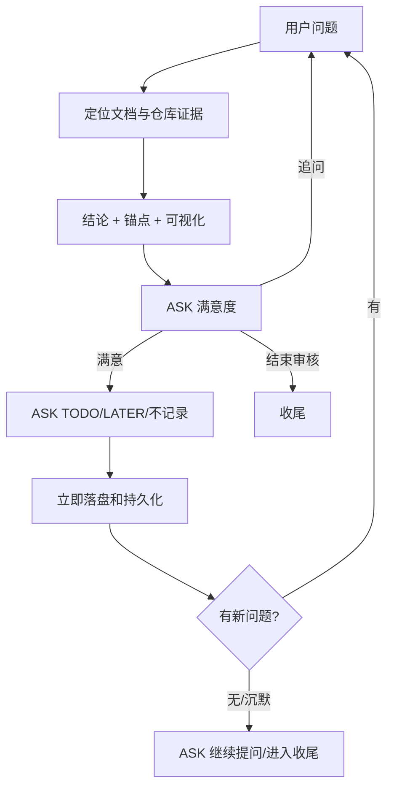

# Review Loop and Evidence

## 目录

- [固定循环](#固定循环)
- [可视化选择](#可视化选择)
- [复杂 HTML](#复杂-html)
- [文档代码一致性证据](#文档代码一致性证据)
- [多方案](#多方案)
- [三阶段 ASK](#三阶段-ask)

## 固定循环



每个 ASK 一次只问一个问题。结构化工具不可用时使用相同语义的短文本选项。

## 可视化选择

| 问题 | 首选 |
|---|---|
| 流程、分支、职责链 | Mermaid flowchart |
| 状态和生命周期 | `stateDiagram-v2` |
| 调用顺序和异步交互 | sequence diagram |
| 模块、依赖、类型关系 | class/graph diagram |
| 多页面 UI、布局或复杂交互对比 | HTML preview |

用最小有效图，不为简单参数表强行画图。图必须与证据一致，不得通过示意图暗示未经验证的实现。

## 复杂 HTML

复杂 UI/架构场景可使用本 Skill 自带的 HTML server 脚本（位于 [scripts/](../scripts/)，2026-08-23 由已删除的 brainstorming Skill 迁入）：

```bash
SCREEN_DIR=/tmp/docreview-<topic>
bash <dd-docreview-grilling>/scripts/start-server.sh "$SCREEN_DIR"
```

保存 HTML 的绝对路径和 URL 到状态/TODO。收尾调用对应 `stop-server.sh`；HTML 文件保留。脚本不可用时退化为 Mermaid 或静态 HTML 文件，不降低内容质量。

## 文档代码一致性证据

模式 B 至少执行：

1. 阅读 governing rules；
2. 阅读文档相关段落；
3. 搜索符号和文件；
4. 沿生产装配和真实调用链追踪；
5. 阅读相关测试与构建/CI 入口；
6. 比较文档 claim 与代码 evidence。

输出结论：

- `MATCHED`：文档 claim 有生产代码和测试/可观察证据；
- `PARTIAL`：部分接线或覆盖；
- `MISMATCHED`：事实相反；
- `UNRESOLVED`：证据不足或冲突。

位置先验证再展示。不存在的用户称谓只能作为搜索线索；提供真实候选路径和行号。跨文件检查优先并行；无子 Agent 时主线程完成同等多视角检查。

模式 B TODO 的推荐修复文件必须来自上述追踪，并写简短理由。不能把“定义了类型”误判为“生产已接线”。

## 多方案

有多种可行方向时展示：

- 每个方案的目标；
- 优点、代价、兼容/迁移影响；
- 推荐方案和理由；
- 用户可选择的互斥选项。

只有用户选择的方案进入 TODO 的“改进建议”；其他方案留在会话证据中。

## 三阶段 ASK

第一阶段，每轮必问：

1. `满意，选择落盘方式`
2. `不满意，继续追问`
3. `结束审核`

第二阶段，仅满意时：

1. `加入 TODO`
2. `加入 LATER`
3. `不记录`

第三阶段，用户没有继续提问时：

1. `继续提问`
2. `进入收尾`

null、取消、空输入均为未回答，重复原 ASK。第二阶段完成不等于默认收尾。
