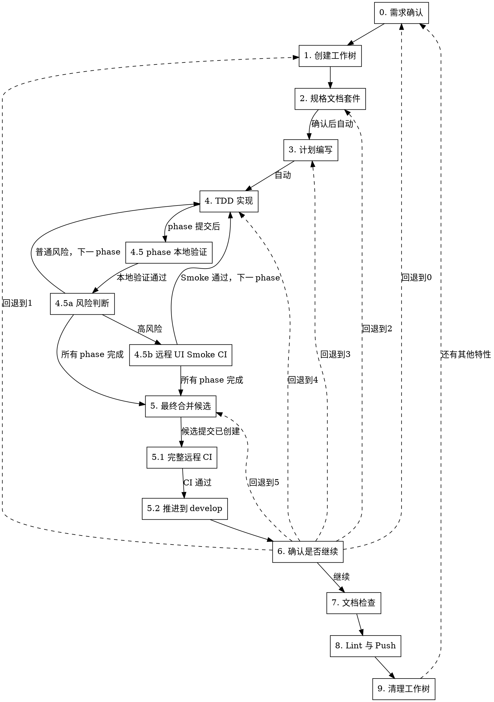

# 新特性实现工作流

## 概述

10 步严格顺序工作流：需求确认 → 创建工作树 → 规格文档套件 → 计划编写 → TDD 实现（三层增量验证）→ 最终合并候选 + 完整 CI → 确认是否继续 → 文档检查 → Lint与Push → 清理工作树。每步必须在前一步成功后才能继续。**核心增量验证约束（三层验证）**：每个 phase 完成后必须通过本地快速验证（lint + build + 相关 XCTest + XCUITest 编译检查）；高风险节点可触发远程 UI Smoke CI；所有 phase 完成后，基于最新 develop 创建最终合并候选提交，对该准确提交执行一次完整远程 CI，通过后才允许推进到 develop。

## 何时使用

- 所有规格文档套件优先的设计驱动变更：新功能、大规模重构、API 迁移
- 用户提到"新特性流程"、"feature development workflow"、"规格文档套件先行"、"分阶段计划"
- 需要先写规格文档套件（需求文档+设计文档+视觉原型+测试用例表），再拆计划、审查计划、按子计划执行

**不适用：** bug 修复、简单文本修改、纯文档修改、一次性小改动

## 流程



<HARD-GATE>
严格按 0→1→2→3→4→5→6→7→8→9 顺序执行。禁止跳步、禁止先写代码、禁止未通过检查就开始下一步。步骤 2 确认后到步骤 5 之间按推荐路径自动执行，无需用户确认。步骤 6 可回退到任意步骤(0-5)。任一步骤失败自动回退到上一步骤重新执行。

**三层增量验证约束**：步骤 4 内部按 phase 循环执行 4.1→4.2→4.3→4.4→4.5，每个 phase 完成后必须通过本地快速验证；高风险节点触发远程 UI Smoke CI；所有 phase 完成后进入步骤 5 创建最终合并候选提交，执行一次完整远程 CI，通过后才推进到 develop。**禁止**：累积多个 phase 后未经最终完整 CI 就合并到 develop；跳过本地快速验证就进入下一 phase。

Bootstrap Handoff 可预先满足步骤 0 的已解决需求事实和步骤 1 的工作环境选择，但不得跳过各步骤的产物验证与状态写入。
</HARD-GATE>

## Bootstrap Handoff 入口

开始步骤 0 前，检查当前 Git dir 或调用参数中的 `project-bootstrap-state.json`。状态为 `active` 或 `handoff-ready` 时读取并验证；仅 `handoff-ready` 且下列条件全部满足时消费：

1. `handoff_version` 为支持的版本；
2. `goal`、`scope`、`project_mode`、`selected_feature_or_phase`、`required_reading`、`constraints`、`verification` 存在；
3. `blocking_questions` 为空，所有必需文件路径存在；
4. `worktree_path` 与当前工作树一致；
5. Greenfield 有 `requirements_seed`；
6. Brownfield 有 Baseline 和状态为 approved 的 Phase Contract。

`active` 或不完整 Handoff 返回 Bootstrap blocker，不猜测缺失内容。

接收后：

- 继承 Goal、Scope、Mode、Selected Feature/Phase、Required Reading、Constraints、Verification、Out of Scope 和 resolved decisions；
- Greenfield 把 `requirements_seed` 作为步骤 0/2 的需求输入；
- Brownfield 复用 approved Phase Contract，不把 `KNOWN_DEFECT` 自动转成 AC；
- 复用已确认的 `worktree_path`，不再次询问工作环境；
- 只询问 Feature 特有且仍阻塞的未知决策。

步骤 1.4 写入 Feature state 后，将 Bootstrap state 更新为 `status=completed`。禁止同时维护 Greenfield 的 `dd-writing-specs` 直达出口；所有 Bootstrap 模式都先进入本工作流。

## 上下文恢复机制

状态持久化遵循 [dd-shared-state](../dd-shared-state/SKILL.md)，参数 `WORKFLOW_TYPE=feature-development`，`BRANCH_FIELD=feature_branch`。

- **状态文件**：`$(git rev-parse --git-dir)/feature-development-state.json`
- **特有字段**：feature_name、requirements_path、design_path、visual_path、test_case_path、review_path、plan_dir、current_phase、total_phases、commits、completed_phases（已完成本地验证的 phase 列表）、smoke_ci_phases（触发过远程 UI Smoke CI 的 phase 列表）、final_candidate_branch（最终合并候选分支名，如 `ci/F3.2-final-candidate`）、final_ci_passed（布尔，标记最终完整 CI 是否通过）、bootstrap_handoff_consumed、bootstrap_state_path、requirements_seed_source、phase_contract_path
- **写入**：步骤 1（工作树创建/验证成功后）
- **更新 `current_step`**：**每个步骤出口判定成功后必须立即更新**（步骤 1/2/3/4/5/6/7/8 均强制更新；步骤 9.1 在清理工作树成功后删除状态文件）
- **更新 `current_phase`**：每完成一个子计划（步骤 4.5 提交后）
- **更新 `completed_phases`**：每完成一个 phase 的本地验证（步骤 4.5 执行）
- **更新 `smoke_ci_phases`**：每触发一次远程 UI Smoke CI（步骤 4.5b 执行）
- **更新 `final_candidate_branch`**：步骤 5 创建最终合并候选分支时
- **更新 `final_ci_passed`**：步骤 5.1 完整远程 CI 通过时设置为 `true`
- **删除**：步骤 9.1 清理工作树成功后（须在工作树删除成功后执行，禁止清理前删除）

### 强制更新规则（HARD-GATE）

每个步骤的「出口判定」章节必须包含更新状态文件的要求。智能体若发现状态文件 `current_step` 与实际进度不符（如 `current_step="1"` 但 `current_phase="2"`），必须先更新再继续下一步，不得跳过。

更新模板（在每个步骤出口执行）：

```bash
git_dir=$(git rev-parse --git-dir)
python3 -c "
import json
state_file = '$git_dir/feature-development-state.json'
with open(state_file) as f:
    state = json.load(f)
state['current_step'] = '<新步骤号或子步骤>'
with open(state_file, 'w') as f:
    json.dump(state, f, indent=2)
"
```

### 状态文件不存在时的恢复策略

会话恢复时若状态文件不存在，**禁止默认从步骤 0 重启**。必须先按以下顺序判断：

1. 检查当前目录是否在 worktree 中（`git rev-parse --is-inside-work-tree`）
2. 获取当前分支名（`git rev-parse --abbrev-ref HEAD`）
3. 若分支名匹配 `feature/F<N>-<描述>` 格式，对比 `git log origin/<BASE_BRANCH>..HEAD` 判断是否有已提交的特性实现
4. 检查 `origin/develop` 是否已包含本特性的 phase commit（`git log origin/develop --oneline | grep "phase"` 或对比 feature 分支与 develop 的 merge 记录）：
   - **develop 已包含本特性的 merge commit（最终合并已推进）**：识别为「步骤 9.1 清理中」状态，询问用户是否继续清理工作树或开新一轮
   - **存在 `ci/F*-final-candidate` 分支**：识别为「步骤 5 最终合并候选中」状态，询问用户是否继续 CI 验证或重新开始
   - **develop 无本特性 commit**：识别为「步骤 4 TDD 中」状态，询问用户是否继续实现或重新开始
5. 若无实现 commit：识别为「步骤 4 TDD 中」状态，询问用户是否继续实现或重新开始
6. 仅当无法判断进度时，才从步骤 0 重新开始

> **通用规则**：结构化询问、null 输入重问遵循 [dd-shared-ask](../dd-shared-ask/SKILL.md)。

## 全局规则

**通用规则**（结构化询问、null 输入重问、文档规则优先、提交边界）遵循 [dd-shared-ask](../dd-shared-ask/SKILL.md)。

- **UI 可观测性优先**：UI 相关功能必须定义用户可见证据。内部状态、ViewModel、reducer、buffer、layer count 或日志只能作为辅助证据，不能单独证明 UI 已完成。
- **提交确认**：步骤 2（规格文档套件）和步骤 5（最终同步检查）需用户确认后提交；步骤 3-4 按推荐路径自动提交，无需用户确认。步骤 4 的每个 phase 合并到 develop（4.6）和步骤 5.4 最终文档合并均自动执行，无需用户确认。提交失败必须修复后重试，不得跳过提交继续下一步。**注**：步骤 2 的 git commit 由 dd-writing-specs 内部完成（每步即提交），本工作流步骤 2 的"用户确认"指工作流层面的最终确认（2.3），确认后更新状态文件进入步骤 3。
- **没有设计不写代码**：步骤 4 之前禁止修改生产代码。若为验证设计临时探索，必须丢弃探索改动后回到当前步骤。

## 三子代理并行检查规则

三子代理并行检查规则遵循 [dd-shared-subagent](../dd-shared-subagent/SKILL.md)。

## UI 可观测性门禁

UI 可观测性门禁遵循 [dd-shared-ui](../dd-shared-ui/SKILL.md)。

---

## 步骤 0：需求确认

### 0.0 Bootstrap 输入复用

存在已验证 Handoff 时，先用其字段回答 0.2 的检查项，并读取 `required_reading`。已解决事实不得重问：

- Greenfield：用 `requirements_seed` 生成步骤 0.4 摘要；
- Brownfield：以 `phase_contract_path` 为已批准需求与验收来源，Baseline 作为兼容性约束；
- 只有 Feature 特有 blocker 才进入 0.1；
- 没有 blocker 时直接展示继承摘要供核对，不重新 grill。

### 0.1 调用 grill-me

开始时宣布：

```
我正在使用 dd-feature-development-workflow，并先进行需求拷问确定新特性需求。
```

进行需求质询，仅聚焦于**需求本身**，不做技术方案设计。

### 0.2 至少确认的问题

一次性收敛以下信息，避免后续设计返工：

1. **用户问题和业务目标**：这个特性解决什么问题？
2. **成功标准**：用户如何判断它完成？
3. **范围边界**：必须做什么？明确不做什么？
4. **用户流程**：入口、主要路径、失败路径、退出条件是什么？
5. **数据和接口**：新增或修改哪些模型、配置、协议、API、持久化格式？
6. **兼容和迁移**：是否影响旧行为、旧数据、旧快捷键、旧配置？
7. **验收标准**：可测试的 AC 列表（场景+预期+验证方式，必须有 XCTest/XCUITest 或对应测试框架）。
8. **阶段拆分**：按功能需求分成哪些 Phase，每个 Phase 的可交付结果是什么？
9. **UI 证据**（涉及 UI 时）：哪些 AC 需要真实 UI 交互验证？用 E2E/XCUITest/Playwright、截图、日志 marker、手动录屏还是组合证据？
10. **文档位置与编号**：按项目 `.trae/rules/docs.md` 规则，文档存放于 `docs/planning/P{n}/F{m}/`，需确认功能编号 `F{m}` 和优先级 `P{n}`；编写顺序为需求文档 → 设计文档 → 视觉原型（涉及 UI 时）→ 测试用例表；涉及 docs/、功能设计或关键架构决策的 commit 必须在 `historys/` 写日志（`YYYY-MM-DD-修改摘要.md`）。若无项目规则，使用 `docs/superpowers/specs/` 和 `docs/superpowers/plans/`。

### 0.3 出口判定

输出需求摘要并要求用户确认。

- 选项 1（推荐）：确认理解正确
- 选项 2：需要补充细节
- 选项 3：理解有误，重新描述

确认正确 → 进入 0.4 写入需求摘要文件。需要补充 → 继续质询。理解有误 → 重述需求，重新执行 0.2。

### 0.4 写入需求摘要文件并提交（供步骤 2 跳过判断复用）

用户确认需求摘要后，将 0.2 收敛的 10 项内容（用户问题/目标/成功标准/范围/流程/数据接口/兼容/AC/阶段/UI 证据/文档位置）写入 `.feature-step0-requirements-summary.md`，存放于步骤 0.2 第 10 项确认的文档目录（如 `docs/planning/P{n}/F{m}/.feature-step0-requirements-summary.md`）。

此文件供步骤 2 调用的 [dd-writing-specs](../dd-writing-specs/SKILL.md) 在步骤 1.0 跳过判断时复用——dd-writing-specs 检测到该文件存在则跳过 grill，直接复用本步骤确认的需求摘要。

立即提交：

```bash
git add docs/planning/P{n}/F{m}/.feature-step0-requirements-summary.md
git commit -m "docs(feature): record step 0 requirements summary for F{m}"
```

**禁止**：
- 跳过本次提交直接进入步骤 1
- 将该文件命名为其他名称（dd-writing-specs 步骤 1.0 按固定文件名检测）
- 在该文件中写入技术方案（仅记录需求，不做设计）

> **状态文件更新（HARD-GATE）**：步骤 0 尚无状态文件，确认正确后将在步骤 1.4 写入。无需在此更新。本步骤产出的 `.feature-step0-requirements-summary.md` 路径将在步骤 2 由 dd-writing-specs 复用，并在步骤 9 清理工作树时由本工作流清理（dd-writing-specs 不清理此文件）。

---

## 步骤 1：创建工作树

### 1.1 工作环境

若 Bootstrap Handoff 已验证，必须复用其 `worktree_path`，仅检查当前路径一致、工作区状态和基线证据，不再询问。

否则，**首次修改文件前必须按 [dd-shared-ask](../dd-shared-ask/SKILL.md) 的「工作环境询问」模板询问用户**：

- 选项 1（推荐）：新建隔离工作树
- 选项 2：在当前 worktree 工作

**处理用户选择**：

- **选「新建隔离工作树」** → 走 1.2 完整创建流程
- **选「在当前 worktree 工作」** → 走 1.3 当前 worktree 验证
- **null 输入** → 按 [dd-shared-ask](../dd-shared-ask/SKILL.md) 的「null 输入重问」规则重新询问，不得默认新建

**默认约束（无论用户选择哪个，选中工作环境后都必须遵守）：**

- **仅参考当前 worktree**：规格文档套件、计划、TDD 实现和文档检查只能参考当前 worktree 上的文档和代码，不得引用主仓库或其他工作树的内容。前置读取（步骤 2.1 调用 dd-writing-specs 时的规则文件）也以当前 worktree 内的为准。
- **不得中途切换 worktree**：选中工作环境后，后续所有工作都在该工作树中执行。

违反以上约束视为红线行为，必须停止并回到本步骤重新执行。

> **与旧版本的差异**：旧版本写「默认新建隔离工作树（除非用户明确要求使用当前 worktree）」，实际是默认行为，未走 `AskUserQuestion`。现已统一为**必须询问**，与 [dd-bug-fix-workflow](../dd-bug-fix-workflow/SKILL.md) 步骤 0.2 的「问 2」保持一致。

### 1.2 新建工作树

#### 1.2.1 记录基线分支

遵循 [dd-git-branch](../dd-git-branch/SKILL.md)，基线分支默认为 `develop`：

```bash
# 默认基线分支为 develop（遵循 dd-git-branch）
# 若步骤 0 用户明确指定其他基线分支，则使用用户指定的分支
BASE_BRANCH="${BASE_BRANCH:-develop}"
git fetch origin "$BASE_BRANCH"
```

#### 1.2.2 计算工作树路径

基于主仓库位置计算（避免在 worktree 内调用时项目名识别错误）：

```bash
common_dir=$(git rev-parse --git-common-dir)
main_root=$(cd "$(dirname "$common_dir")" && pwd)
project=$(basename "$main_root")
worktree_dir=$(dirname "$main_root")/${project}-worktrees
```

**关键**：必须基于主仓库，而非当前工作树——否则项目名会被误识别为分支名，导致工作树目录嵌套。

#### 1.2.3 创建工作树

遵循 [dd-git-branch](../dd-git-branch/SKILL.md) 的分支命名规则，feature 分支使用 `feature/{F编号}-{描述}` 格式。推荐使用 [dd-git-worktree](../dd-git-worktree/SKILL.md) 提供的脚本：

```bash
# 使用 dd-ai-git-workflow 脚本创建（推荐）
# 用法：./scripts/create-worktree.sh feature <F编号> <描述>
SKILL_DIR="$HOME/.trae-cn/skills/dd-ai-git-workflow"
bash "$SKILL_DIR/scripts/create-worktree.sh" feature <F编号> <描述>
# 示例：bash "$SKILL_DIR/scripts/create-worktree.sh" feature F3.1 ocr-acceleration
```

或手动创建（基于 origin/develop、本地 develop 最新提交）：

```bash
BRANCH="feature/<F编号>-<描述>"  # 示例：feature/F3.1-ocr-acceleration
git fetch origin develop
path="$worktree_dir/$BRANCH"
# --no-track: 不设置 upstream，新分支保持独立（不 tracking develop）
# 首次推送时使用 `git push -u origin <branch>` 建立独立 tracking
git worktree add --no-track "$path" -b "$BRANCH" origin/develop
cd "$path"
```

**基线分支**：默认基于 `origin/develop`、本地 `develop` 最新提交（取两者中更新的）创建，新分支不设置 upstream（首次 push 用 `git push -u origin <branch>` 建立独立 tracking，遵循 dd-git-branch）。若需基于其他分支，需在步骤 0 明确说明并获得用户确认。

#### 1.2.4 运行项目设置

自动检测并运行相应设置命令：

```bash
# Node.js
[ -f package.json ] && npm install

# Rust
[ -f Cargo.toml ] && cargo build

# Python
[ -f requirements.txt ] && pip install -r requirements.txt
[ -f pyproject.toml ] && poetry install

# Go
[ -f go.mod ] && go mod download

# Swift (Xcode 项目)
[ -f Package.swift ] && swift build
```

#### 1.2.5 验证基线测试干净

CI 验证遵循 [dd-shared-ci](../dd-shared-ci/SKILL.md) 场景 1（基线 CI 验证）。按 test-location-strategy skill 决策测试位置。

- 测试失败：报告失败情况，询问是否继续或排查
- 测试通过：报告就绪

#### 1.2.6 报告位置

```
工作树已就绪：<full-path>
测试通过（<N> 个测试，0 个失败）
准备实现 <feature-name>
```

**重要**：调用后会话工作目录必须始终位于该工作树路径下，不得切换回主仓库目录。

#### 1.2.7 红线

CI 相关红线（跳过基线测试、未 push 降级本地、CI 不可用宽泛措辞、用户要求凌驾 CI 优先）遵循 [dd-shared-ci](../dd-shared-ci/SKILL.md) 红线章节。

**本步骤特有红线**：
- 在项目内部创建工作树目录（污染 git status）

> **与步骤 8.2.1 红线的关系**：步骤 8.2.1 的 CI 红线同样适用于本步骤——基线验证与回归验证在"CI 优先"上标准一致，不得在 1.2.5 阶段降级。详见 dd-shared-ci"基线验证 vs 回归验证的表面张力说明"。

### 1.3 当前 worktree 验证

跳过创建，仅做验证：

```bash
# 并发检查：遵循 dd-shared-state 并发检查
git_dir=$(git rev-parse --git-dir)
for f in "$git_dir"/bug-fix-state.json "$git_dir"/feature-development-state.json; do
  if [ -f "$f" ]; then
    existing_type=$(python3 -c "import json; print(json.load(open('$f')).get('workflow_type','unknown'))")
    echo "❌ 当前 worktree 已有活跃的 ${existing_type} 工作流，禁止并发"
    exit 1
  fi
done

# 记录基线分支
BASE_BRANCH=$(git rev-parse --abbrev-ref HEAD)

# 验证工作区状态
git status  # 必须干净，有未提交变更需先处理

# 验证基线测试：CI 验证遵循 dd-shared-ci 场景 1（基线 CI 验证）
```

- 成功标准：工作区干净 + 基线测试通过
- 失败：报错并停止

### 1.4 写入状态文件

工作树创建/验证成功后，持久化关键状态供上下文恢复。遵循 [dd-shared-state](../dd-shared-state/SKILL.md) 写入模板，参数 `WORKFLOW_TYPE=feature-development`，`BRANCH_FIELD=feature_branch`，`current_step=1`。需追加 feature-development 特有字段：feature_name、requirements_path、design_path、visual_path、test_case_path、review_path、plan_dir、current_phase、total_phases、commits、completed_phases（初始化为空数组 `[]`）、smoke_ci_phases（初始化为空数组 `[]`）、final_candidate_branch（初始化为空字符串）、final_ci_passed（初始化为 `false`）。

若消费 Bootstrap Handoff，同时写入：

```json
{
  "bootstrap_handoff_consumed": true,
  "bootstrap_state_path": "/absolute/path/project-bootstrap-state.json",
  "requirements_seed_source": "bootstrap-requirements-seed-or-phase-contract",
  "phase_contract_path": null
}
```

Brownfield 的 `phase_contract_path` 必须为 approved Phase Contract 的绝对路径。Feature state 成功写入后，再把 Bootstrap state 从 `handoff-ready` 改为 `completed`；任一写入失败都不得继续步骤 2。

> **状态文件更新（HARD-GATE）**：本步骤是状态文件的**首次写入**点，必须确保 `current_step="1"` + `feature_branch=<分支名>` + `feature_name=<特性名>` 正确写入。后续每个步骤出口判定都需更新 `current_step`。更新模板见「上下文恢复机制 → 强制更新规则（HARD-GATE）」。

---

## 步骤 2：规格文档套件

**通过子代理调用 [dd-writing-specs](../dd-writing-specs/SKILL.md) 完成整套规格文档**：规格文档套件包含 4 篇文档（需求文档+设计文档+视觉原型+测试用例表），由 dd-writing-specs 工作流完整负责"读规则 → grill（含跳过判断）→ 写需求文档 → 3 子代理审 → 确认 → 逐份完成设计文档/视觉原型/测试用例表"全流程。直接在主线程编写会消耗大量 context，调度子代理执行。

### 2.1 调用 dd-writing-specs

调度子代理，**子代理执行时调用 [dd-writing-specs](../dd-writing-specs/SKILL.md) skill**。传入以下上下文：

- 步骤 0.4 写入的 `.feature-step0-requirements-summary.md` 路径（供 dd-writing-specs 步骤 1.0 跳过判断复用，跳过重复 grill）
- Bootstrap Handoff 的 `requirements_seed` 或 approved `phase_contract_path`（如存在，作为已确认输入复用）
- 步骤 0.2 第 10 项确认的文档目录路径（如 `docs/planning/P{n}/F{m}/`）
- 步骤 0.2 第 10 项确认的功能编号 `F{m}` 和优先级 `P{n}`
- 当前 worktree 路径（dd-writing-specs 工作环境询问的特例：被上游调用时不询问，工作环境已由本工作流步骤 1 确定）

**dd-writing-specs 内部完整流程**（由子代理执行，主线程不干预）：

1. 步骤 0：读项目 docs.md + app 功能列表 + 既有规格文档，提取 10 项规则
2. 步骤 1：grill 拷问（含跳过判断——检测到 `.feature-step0-requirements-summary.md` 存在则跳过 grill，复用上游需求摘要并核对一致性）
3. 步骤 2：写需求文档（子代理调用 dd-write-requirements，12 章节，P0 铁律）
4. 步骤 3：3 子代理并行审查需求文档（审查员 A 完整性+一致性+docs.md+P0 铁律；B 可设计性+范围+YAGNI；C 可验证性+UI 可观测性）
5. 步骤 4：合并总结 + 一次一问确认需求文档
6. 步骤 5：逐份完成设计文档（调 dd-write-design 10 章节）→ 视觉原型（涉及 UI 时）→ 测试用例表，每篇走"写 → 3 子代理审 → 合并 → 一次一问确认 → 提交"完整流程
7. 工作流结束：清理 dd-writing-specs 步骤 0、1 的临时笔记文件（`.step0-rules-summary.md` / `.step1-requirements-summary.md` / `.step1-requirements-confirmed.md`），**不清理** `.feature-step0-requirements-summary.md`（该文件归本工作流清理）

**dd-writing-specs 内部每步即提交**：每个步骤产出可保存的工件后，dd-writing-specs 立即 `git add` + `git commit`。所有 4 篇文档及审查结果在 dd-writing-specs 工作流结束时均已提交到 git 历史。

### 2.2 接收产物路径

dd-writing-specs 子代理返回后，主线程接收以下产物路径（由 dd-writing-specs 在工作流结束时输出）：

- `requirements_path`：需求文档路径（`F{N}_{功能名}_需求文档.md`）
- `design_path`：设计文档路径（`F{N}_{功能名}_设计文档.md`）
- `visual_path`：视觉原型路径（`F{N}_{功能名}_视觉原型.html`，涉及 UI 时；不涉及时为空）
- `test_case_path`：测试用例表路径（`F{N}_{功能名}_测试用例表.md`）
- `review_path`：审查结果路径（`<feature-name>_需求文档_审查结果.md` 及各文档的审查结果与合并总结）

**验证产物已提交**：

```bash
# 验证 4 篇文档均已提交到 git 历史
git log --oneline -10
git status --short  # 应为干净状态（无未提交变更）
```

若发现未提交的文档文件 → 返回 2.1 重新调度子代理补提交（dd-writing-specs 红线：任一步骤未提交就进入下一步是违规）。

### 2.3 用户确认

展示规格文档套件路径、审查结论和修改摘要，询问用户最终确认：

- 选项 1（推荐）：确认规格文档套件，可以进入步骤 3
- 选项 2：需要补充或修改（回到 2.1 重新调度 dd-writing-specs，传入修改要求）
- 选项 3：方向不对，回到步骤 0

> **注**：dd-writing-specs 内部已对每篇文档做过"一次一问确认"，本步骤是工作流层面的最终确认，确保用户对整套规格文档套件满意后才进入计划编写。

### 2.4 更新状态文件

用户确认通过后，更新状态文件（无需额外 git commit——4 篇文档及审查结果已由 dd-writing-specs 提交）：

```bash
git_dir=$(git rev-parse --git-dir)
python3 -c "
import json
state_file = '$git_dir/feature-development-state.json'
with open(state_file) as f:
    state = json.load(f)
state['current_step'] = '2'
state['requirements_path'] = '<需求文档路径>'
state['design_path'] = '<设计文档路径>'
state['visual_path'] = '<视觉原型路径，可为空>'
state['test_case_path'] = '<测试用例表路径>'
state['review_path'] = '<审查结果路径>'
with open(state_file, 'w') as f:
    json.dump(state, f, indent=2)
"
```

> **状态文件更新（HARD-GATE）**：用户确认通过后必须更新 `feature-development-state.json`：`current_step="2"`、`requirements_path=<需求文档路径>`、`design_path=<设计文档路径>`、`visual_path=<视觉原型路径>`、`test_case_path=<测试用例表路径>`、`review_path=<审查结果路径>`。更新模板见「上下文恢复机制 → 强制更新规则（HARD-GATE）」。

---

## 步骤 3：计划编写

### 3.1 读取规格文档套件

必须读取已提交的需求文档、设计文档、视觉原型（如有）、测试用例表和审查结果，再编写实现计划。

### 3.2 按功能需求划分阶段

需求文档中已按功能需求划分 Phase（dd-writing-specs 步骤 1 grill 的第 8 项）。计划按 Phase 拆分为子计划。

### 3.3 先写总计划，动态拆子计划

**通过子代理编写**：主计划 + 多个 Phase 子计划是 token 量最大的文档产出。调度子代理（使用 `writing-plans` 技能），传入需求文档、设计文档、视觉原型（如有）、测试用例表和审查结果路径，由子代理生成全部计划文件。

**先写一个总实现计划**，定义整体目标、架构、Phase 列表和依赖关系。然后根据复杂度动态决定是否拆分子计划：

- **简单特性**（1-2 个 Phase，每个 Phase 任务数 ≤ 5）：总计划已足够，无需拆子计划
- **中等特性**（2-3 个 Phase，任务数 > 5）：按 Phase 拆子计划，每个 Phase 一个子计划文件
- **复杂特性**（4+ Phase 或有跨 Phase 依赖）：按 Phase 拆子计划，额外补充跨 Phase 依赖和集成验证计划

### 3.4 计划结构

按项目文档规则优先；无规则时使用：

```text
docs/superpowers/plans/YYYY-MM-DD-<feature-name>/
  README.md                  # 总实现计划
  phase-0-<name>.md          # Phase 0 子计划（如需拆分）
  phase-1-<name>.md          # Phase 1 子计划
  phase-2-<name>.md          # Phase 2 子计划
```

#### README.md（总实现计划）必须包含：

```markdown
# [功能名称] 实现计划

> **面向 AI 代理的工作者：** 必需子技能：使用 subagent-driven-development（推荐）或 executing-plans 逐任务实现此计划。步骤使用复选框（`- [ ]`）语法来跟踪进度。

**目标：** [一句话描述要构建什么]

**架构：** [2-3 句话描述方案]

**技术栈：** [关键技术/库]

**需求文档：** [需求文档路径]

**设计文档：** [设计文档路径]

**视觉原型：** [视觉原型路径，如有]

**测试用例表：** [测试用例表路径]

**审查结果：** [审查结果路径]

---

## Phase 列表

| Phase | 目标 | 子计划文件 | 依赖 |
|-------|------|-----------|------|
| 0 | ... | phase-0-xxx.md | 无 |
| 1 | ... | phase-1-xxx.md | Phase 0 |
| 2 | ... | phase-2-xxx.md | Phase 0, 1 |

## 全局验证命令

[运行所有测试的命令]

## 最终验收方式

[如何确认整个特性已完成]
```

#### Phase 子计划必须包含：

- 本 Phase 的目标、范围和非目标
- 涉及文件和职责
- 小步骤任务，粒度为 2-5 分钟
- TDD 步骤：失败测试 → 验证失败 → 最小实现 → 验证通过 → 重构
- 精确命令和预期结果
- UI 证据任务（涉及 UI 时）：真实交互验证命令，或手动验收脚本、截图/录屏/日志证据路径和风险记录
- commit 建议信息
- **Phase 合并到 develop 的预期基线**：本 phase 合并到 develop 后预期的可交付状态（便于步骤 4.6 合并后核验）

#### 禁止占位符

每个步骤都必须包含工程师需要的实际内容。以下是**计划缺陷**——绝不要写出来：

- "待定"、"TODO"、"后续实现"、"补充细节"
- "添加适当的错误处理" / "添加验证" / "处理边界情况"
- "为上述代码编写测试"（没有实际测试代码）
- "类似任务 N"（重复代码——工程师可能不按顺序阅读任务）
- 只描述做什么而不展示怎么做的步骤（代码步骤必须有代码块）
- 引用了未在任何任务中定义的类型、函数或方法

### 3.5 check-plan

**通过 3 个独立子代理并行核对**：按"三子代理并行检查规则"调度 3 个独立子代理（均非编写计划的子代理），使用相同的输入文件（计划目录、需求文档、设计文档、视觉原型、测试用例表、审查结果），按统一方向框架分工：

| 子代理 | 方向 | 负责的核对项 |
|--------|------|------------|
| **A - 覆盖与范围** | 是否符合规格与规则 | 1.是否遵循需求文档、设计文档和审查结果 / 2.是否遵循 CODING_STANDARDS / 3.是否遵循 docs.md / 4.是否遵循 xctest-rules |
| **B - 一致与正确** | 结构是否一致 | 5.主计划和 Phase 子计划是否一致 / 6.每个子计划是否有明确的测试、验证和提交步骤 |
| **C - 可验证与可观测** | UI 能否真实验证 | 8.是否存在"只测内部状态却声称 UI 已验证"的计划缺陷 |
| **3 代理必检** | UI 最高风险项，所有代理都查 | 7.UI 子计划是否包含真实入口、真实操作、用户可见断言和证据保存方式 |

计划写完后，必须核对实施计划：

**核对内容**：

1. 是否遵循需求文档、设计文档和审查结果
2. 是否遵循 `docs/standards/CODING_STANDARDS.md`（或旧路径 `docs/CODING_STANDARDS.md`）
3. 是否遵循 `.trae/rules/docs.md`
4. 是否遵循 `docs/AI/trae-xctest-rules.md` 或 `docs/ai/trae-xctest-rules.md`
5. 主计划和 Phase 子计划是否一致
6. 每个子计划是否有明确的测试、验证和提交步骤
7. UI 子计划是否包含真实入口、真实操作、用户可见断言和证据保存方式
8. 是否存在"只测内部状态却声称 UI 已验证"的计划缺陷

**自检**（计划编写者自行执行）：

1. **规格覆盖度**：需求文档每个 AC 是否映射到一个或多个计划任务
2. **占位符扫描**：搜索计划中的红旗——"禁止占位符"章节中的任何模式
3. **类型一致性**：后续任务中使用的类型、方法签名和属性名是否与前面任务中定义的一致

**汇总与处理结果**：

3 个子代理全部返回后，主线程按"三子代理并行检查规则"汇总（方向专属发现直接合并 + UI 必检项 3 票冗余 + 冲突取最严格 → 分类输出）：

- **3 个子代理均通过**（方向专属 + UI 必检均无发现）→ 进入 3.6
- **「必须修复」类** → 自动采纳并修正计划，无需 ASK；修正后**重新调度 3 个子代理并行核对**，确保修改未引入新问题
- **「建议修复」/「可选优化」类** → 仅当涉及重大架构变化、产品功能变化或改动影响很大时，用 `AskUserQuestion` 逐条确认；否则自动跳过并记录到核对摘要
- **达到 3 次重试上限** → `AskUserQuestion` 升级处理：继续重试 / 跳过该问题 / 停止工作流回退到上一步

### 3.6 自动提交

check-plan 通过后自动提交计划，无需用户确认（规格文档套件确认后到最终同步检查前，按推荐路径自动执行）。

展示主计划路径、子计划列表和自检结论，然后直接提交：

```bash
git add <plan-dir>
git commit -m "$(cat <<'EOF'
docs: add <feature-name> implementation plans

- 总计划: README.md
- Phase 子计划: phase-0-xxx.md, phase-1-xxx.md, ...
EOF
)"
```

提交成功后进入步骤 4。

> **状态文件更新（HARD-GATE）**：提交成功后必须更新 `feature-development-state.json`：`current_step="3"`、`plan_dir=<计划目录路径>`、`current_phase="0"`、`total_phases=<Phase 总数>`。更新模板见「上下文恢复机制 → 强制更新规则（HARD-GATE）」。

---

## 步骤 4：TDD 实现

### 4.1 执行方式

**默认子代理驱动执行**：每个任务调度新子代理，任务间审查。无需用户确认，直接开始执行（规格文档套件确认后到最终同步检查前，按推荐路径自动执行）。

### 4.2 每个子计划的固定节奏

对每个 Phase 子计划按顺序执行：

1. 读取主计划、当前子计划、需求文档、设计文档、视觉原型（如有）、测试用例表和审查结果
2. 按子计划中的任务顺序执行，遵循 TDD 循环
3. 当前子计划全部任务完成后，执行 check-code
4. 根据 check-code 结果修复问题，直到通过
5. 对 UI 子计划执行真实路径验证或手动验收，保存截图/录屏/日志/测试输出
6. 运行子计划要求的验证命令（按 test-location-strategy skill 决策测试位置）：
   - **XCTest 单测试文件验证**（代码未提交，本地执行）：仅运行当前子计划相关的 XCTest，确认 TDD 绿灯。无 GUI 依赖，本地快速反馈合理
   - **XCUITest 验证**：禁止本地执行，延迟到步骤 4.5a 风险判断后可能触发远程 Smoke CI，或最终步骤 5 完整 CI（UI 测试依赖 GUI 会话、Accessibility 权限等环境状态，本地不可靠）
   - **全量回归验证**：延迟到步骤 5 最终完整 CI
   - **禁止**：在步骤 4.2 本地跑全量回归或本地执行 XCUITest——代码未提交，本地通过不能替代 CI 的跨环境验证；不得以"CI 不可用"或"用户明确要求"为由本地降级
7. 提交当前子计划相关代码、测试、文档、证据记录（步骤 4.5）
8. 更新状态文件的 `current_phase`（步骤 4.5）
9. **本地快速验证**（步骤 4.5：lint + build + 相关 XCTest + XCUITest 编译检查）
10. **风险判断**（步骤 4.5a）：高风险 → 触发远程 UI Smoke CI；普通风险 → 直接进入下一 phase
11. 进入下一个子计划（如所有 phase 已完成，进入步骤 5）

### 4.3 TDD 循环

对每个任务，严格遵循 TDD 四步循环：

#### 第一步：编写失败测试（红灯）

**目标：用测试用例定义期望行为。**

- 阅读需求文档的 AC 和子计划的任务描述
- 编写最小测试（只测一件事，使用真实代码，避免不必要 mock）
- **按测试类型决定红灯验证位置**：
  - **XCTest（单元测试）**：可本地验证红灯（快速反馈，无 GUI 依赖），确认测试因正确原因失败而非拼写错误
  - **XCUITest（UI 测试）**：禁止本地验证红灯，延迟到步骤 4.5 走 CI（UI 测试依赖 GUI 会话、Accessibility 权限、窗口焦点等环境状态，本地环境不可靠）

#### 第二步：实现设计（绿灯）

**目标：实现需求文档定义的行为，让测试通过。**

- 严格按子计划步骤实现（不做"顺便改改"的优化，不捆绑重构）

**按测试类型决定验证位置，必须严格区分：**

- **XCTest（单元测试）**：
  - **单测试文件绿灯验证**（本地执行，TDD 快速反馈）：仅运行当前任务编写的新 XCTest，确认因实现而通过。无 GUI 依赖，本地快速反馈合理
  - **不在本地跑全量 XCTest 回归**——全量回归延迟到步骤 4.5 提交并 push 后走 CI
- **XCUITest（UI 测试）**：
  - **禁止本地执行任何 XCUITest**（包括单测试文件、包括红灯和绿灯验证）——UI 测试依赖 GUI 会话、Accessibility 权限、窗口焦点、TCC 授权弹窗等环境状态，本地环境不可靠。所有 XCUITest 验证延迟到步骤 4.5 走 CI
  - 实现是否让 UI 测试通过，由步骤 4.5 的 CI 结果判断。在 CI 结果出来前，不声明"UI 测试已验证"

> **为什么 XCUITest 禁止本地执行？** 与 dd-bug-fix-workflow 相同：UI 测试对运行环境高度敏感（GUI 会话、Accessibility 权限、窗口焦点、TCC 弹窗），本地通过不能替代 CI 验证。XCTest 无 GUI 依赖，本地快速反馈是合理的。步骤 4.5 提交后由 CI 给出最终验证（XCTest 全量回归 + XCUITest）。

- **回归测试失败需修改时**：必须使用 `AskUserQuestion` 说明失败原因和修改理由，获得用户确认后方可修改
- 如果实现不起作用：
  - 少于 3 次：回到第二步，用新信息重新分析
  - 3 次或以上：停下来质疑设计 → **AskUserQuestion**：
    - 选项 1（推荐）：继续实现（回到第二步）
    - 选项 2：回到步骤 3 重新编写计划
    - 选项 3：放弃并清理工作树

#### 第三步：重构

**目标：在 XCTest 绿灯基础上清理代码（XCUITest 验证延迟到步骤 4.5）。**

- 消除重复
- 改善命名
- 提取辅助函数
- 保持 XCTest 绿灯，不添加行为（XCUITest 验证延迟到 CI）

#### 第四步：提交

每完成一个任务或一组相关任务，提交变更：

```bash
git add <files-for-current-task>
git commit -m "<type>[scope]: <description>"
```

### 4.4 check-code

**通过 3 个独立子代理并行核对**：按"三子代理并行检查规则"调度 3 个独立子代理（均非实现该子计划的子代理），使用相同的输入文件（需求文档、设计文档、当前 Phase 子计划、代码变更路径），按统一方向框架分工：

| 子代理 | 方向 | 负责的核对项 |
|--------|------|------------|
| **A - 覆盖与范围** | 符合性与覆盖 | 1.代码是否符合需求文档、设计文档和子计划 / 2.是否遗漏 AC 或实现超范围 / 3.是否符合 CODING_STANDARDS |
| **B - 一致与正确** | 测试与质量 | 4.测试是否覆盖新增和受影响旧行为 / 5.日志、错误处理、边界条件 / 8.临时调试代码、未清理 TODO、跳过测试 |
| **C - 可验证与可观测** | UI 证据 | 6.UI 行为是否有用户可见证据 |
| **3 代理必检** | UI 最高风险项，所有代理都查 | 7.是否错误地把内部状态、mock、日志、layer count 或组件渲染测试当成完整 UI 验证 |

每个子计划完成后必须核对代码实现：

**核对内容**：

1. 代码是否符合需求文档、设计文档和当前 Phase 子计划
2. 是否遗漏 AC 或实现了超范围功能
3. 是否符合 `docs/standards/CODING_STANDARDS.md`（或旧路径 `docs/CODING_STANDARDS.md`）
4. 测试是否覆盖新增行为和受影响旧行为
5. 日志、错误处理、边界条件是否完整
6. UI 行为是否有用户可见证据：E2E/XCUITest/Playwright、截图像素、AX/DOM/window marker、录屏或手动验收记录
7. 是否错误地把内部状态、mock、日志、layer count 或组件渲染测试当成完整 UI 验证
8. 是否存在临时调试代码、未清理 TODO、未解释的跳过测试

**UI 可观测性门禁**：涉及 UI 的特性必须通过（详见全局章节），检查是否把内部状态/mock/日志误当成完整 UI 验证

**汇总与处理结果**：

3 个子代理全部返回后，主线程按"三子代理并行检查规则"汇总（方向专属发现直接合并 + UI 必检项 3 票冗余 + 冲突取最严格 → 分类输出）：

- **3 个子代理均通过**（方向专属 + UI 必检均无发现）→ 提交当前子计划成果
- **「必须修复」类** → 自动采纳并修复，无需 ASK；修复后**重新调度 3 个子代理并行核对**，确保修改未引入新问题
- **「建议修复」/「可选优化」类** → 仅当涉及重大架构变化、产品功能变化或改动影响很大时，用 `AskUserQuestion` 逐条确认；否则自动跳过并记录到核对摘要
- **达到 3 次重试上限** → `AskUserQuestion` 升级处理：继续重试 / 跳过该问题 / 停止工作流回退到上一步

### 4.5 子计划提交 + 本地快速验证

check-code 通过后提交并执行本地快速验证：

```bash
git status --short
git diff
git add <files-for-current-phase>
git commit -m "$(cat <<'EOF'
feat(<feature-name>): complete phase <N> - <phase-name>

- 实现: <简述实现内容>
- 测试: <简述测试覆盖>
- 证据: <UI证据类型，如有>
EOF
)"
```

如果实现任务已经按计划产生了多个 commit，确保当前子计划结束时没有未提交变更；如 check-code 后没有新增变更，记录最后一个属于该子计划的 commit SHA 作为完成点，不创建空提交。

**提交后本地快速验证（第一层）**：不干扰桌面工作的本地检查，快速反馈 TDD 质量。

> **证书规范（HARD-GATE）**：Swift / Xcode 项目编译必须遵循 [dd-shared-ci](../dd-shared-ci/SKILL.md) Xcode 编译证书规范——禁止走 "Automatically manage signing" 默认行为。下方命令中的 `XC_ARG` / `DEVELOPMENT_TEAM` / `CODE_SIGN_IDENTITY` 由前置步骤读取（详见 [dd-shared-ci](../dd-shared-ci/SKILL.md) 步骤 1-2）。

```bash
# 0. 检测项目类型 + 从 pbxproj 提取证书（详见 dd-shared-ci 步骤 1-2）
#    优先 .xcworkspace，否则 .xcodeproj
#    XC_ARG = (-workspace <ws>) 或 (-project <proj>)
#    DEVELOPMENT_TEAM / CODE_SIGN_IDENTITY 从 pbxproj 读取

# 1. Lint
swiftlint lint --strict  # Swift 项目；其他项目用对应 lint 命令

# 2. 编译 App（不运行 UI 测试，必须显式传入证书参数）
xcodebuild \
  "${XC_ARG[@]}" \
  -scheme <Scheme> \
  -configuration Debug \
  CODE_SIGN_STYLE=Manual \
  DEVELOPMENT_TEAM="$DEVELOPMENT_TEAM" \
  CODE_SIGN_IDENTITY="$CODE_SIGN_IDENTITY" \
  build

# 3. 只运行当前 phase 相关的 XCTest（同样追加证书参数）
xcodebuild test \
  "${XC_ARG[@]}" \
  -scheme <Scheme>Tests \
  -only-testing:<Scheme>Tests/<CurrentFeature>Tests \
  CODE_SIGN_STYLE=Manual \
  DEVELOPMENT_TEAM="$DEVELOPMENT_TEAM" \
  CODE_SIGN_IDENTITY="$CODE_SIGN_IDENTITY"

# 4. 检查 XCUITest Target 是否可编译（不实际启动 App，同样追加证书参数）
xcodebuild build-for-testing \
  "${XC_ARG[@]}" \
  -scheme <Scheme>UITests \
  CODE_SIGN_STYLE=Manual \
  DEVELOPMENT_TEAM="$DEVELOPMENT_TEAM" \
  CODE_SIGN_IDENTITY="$CODE_SIGN_IDENTITY"
```

**本地快速验证失败** → 修复后重新执行，不得跳过（循环直到通过）。

**本地快速验证通过** → 更新状态文件，进入 4.5a 风险判断。

> **红线**：不得跳过本地快速验证。每个 phase 完成后必须 lint + build + 相关 XCTest + XCUITest 编译检查通过，才能进入下一 phase。

> **状态文件更新（HARD-GATE）**：每个子计划提交成功且本地验证通过后必须更新 `feature-development-state.json`：`current_step="4.5"`、`current_phase=<刚完成的 Phase 编号>`、`commits` 数组追加本次 commit SHA、`completed_phases` 数组追加当前 phase 编号。更新模板见「上下文恢复机制 → 强制更新规则（HARD-GATE）」。

---

### 4.5a 风险判断（是否触发远程 UI Smoke CI）

每个 phase 本地验证通过后，判断是否需要触发远程 UI Smoke CI（第二层）。**默认不触发远程 CI**，仅在以下高风险情况触发：

**高风险触发条件**（满足任一即触发）：

- 修改 App 启动流程、AppDelegate、SceneDelegate
- 修改主窗口、设置窗口、Toolbar、菜单栏
- 修改 Accessibility 权限相关代码
- 修改全局快捷键
- 修改 XCUITest 基础设施（PageObject、辅助函数、启动参数）
- 修改共享导航或窗口管理代码
- 当前 phase 无法通过 XCTest 或静态证据验证
- 单个功能开发跨度超过 2~3 天
- 连续修改多个 UI 页面

**非高风险** → 直接进入下一 phase（或所有 phase 完成后进入步骤 5）。

**高风险** → 触发远程 UI Smoke CI（4.5b）。

---

### 4.5b 远程 UI Smoke CI

仅运行 5~10 个核心用例，验证 App 基本功能不受影响：

```text
App 能启动
主窗口能显示
设置窗口能打开
当前新增功能入口能进入
新增功能最核心路径能完成
App 能正常退出
```

**执行方式**：push feature 分支到远端，触发 CI（仅运行 Smoke 测试集，非全量）。

CI 验证遵循 [dd-shared-ci](../dd-shared-ci/SKILL.md) 场景 2（回归 CI 验证）。若 CI 配置支持选择性测试集，使用 `--only-testing` 参数限定范围；否则运行完整 CI 但只关注核心用例结果。

- **Smoke CI 通过** → 更新状态文件 `smoke_ci_phases`，进入下一 phase（或步骤 5）
- **Smoke CI 失败** → **AskUserQuestion**：
  - 选项 1（推荐）：拉取 CI 日志分析失败原因，回到 TDD 步骤修复，修复后重新运行 Smoke CI
  - 选项 2：运行定向 CI（仅失败用例组），定向修复后重新 Smoke CI
  - 选项 3：跳过 Smoke 继续（不推荐，风险自担）

> **状态文件更新（HARD-GATE）**：Smoke CI 通过后必须更新 `feature-development-state.json`：`smoke_ci_phases` 数组追加当前 phase 编号。更新模板见「上下文恢复机制 → 强制更新规则（HARD-GATE）」。

---

### 4.6 出口判定

- **仍有未完成的 phase** → 切回工作树路径 `cd "$WORKTREE_PATH"`，回到步骤 4.1 执行下一个 phase
- **所有 phase 完成**（`completed_phases` 长度等于 `total_phases`）→ 进入步骤 5 最终合并候选
- 设计或计划在实现中被证明错误 → 回到步骤 2 或步骤 3，按顺序重新推进

> **状态文件更新（HARD-GATE）**：进入步骤 5 前必须更新 `feature-development-state.json`：`current_step="4.6-completed"`（标记所有 phase 本地验证已完成，准备进入最终合并候选）。更新模板见「上下文恢复机制 → 强制更新规则（HARD-GATE）」。

---

## 步骤 5：最终合并候选 + 完整 CI

**所有 phase 本地验证完成后的最终合并与验证**。创建合并候选分支，执行一次完整远程 CI，通过后才推进到 develop。

### 5.1 添加详细日志与文档补充

给相关代码添加正式运行日志，带功能标签前缀（如 `[F1.10]`）便于检索。如步骤 4 各 phase 已添加完整日志，本步仅做补充检查。

**格式**：`[<功能编号>] <级别> | <位置> | <信息> | <上下文>`，级别用 DEBUG/INFO/WARN/ERROR。

**添加原则**：函数入口记参数、关键分支记走向、异步操作记始末、错误处理记详情、状态变更记前后值。

如果项目 `CODING_STANDARDS.md` 中定义了日志规范，以项目规范为准。

### 5.2 编写流程图和时序图

- **流程图**：描述特性涉及的代码执行流程，标注关键节点与分支条件
- **时序图**：描述特性涉及的组件交互顺序，标注关键消息与状态转换

使用 mermaid 格式，兼容 9.1.2，不使用中文标点、符号。

### 5.3 提交文档补充

```bash
cd "$WORKTREE_PATH"
git add <files-for-current-sync>
git commit -m "<type>[scope]: final documentation and logging"
```

### 5.4 创建最终合并候选分支

**关键原则：必须测试"即将进入 develop 的准确提交"，而不是测试旧 feature commit 后再产生一个未经测试的新 merge commit。**

```bash
cd "$main_root"
git fetch origin

# 基于最新 develop 创建候选分支
git switch -c ci/<F编号>-final-candidate origin/develop

# 合并 feature 分支（merge-only，禁止 rebase）
git merge --no-ff <工作树分支> -m "Merge feature/<F编号>-<描述> final candidate"

# 推送候选分支到远端
git push -u origin ci/<F编号>-final-candidate
```

冲突处理遵循 [dd-git-conflict](../dd-git-conflict/SKILL.md) 长分支冲突处理流程章节。

**冲突无法解决** → **AskUserQuestion**：

- 选项 1（推荐）：在 feature 分支合并 develop 最新代码后重新创建候选
- 选项 2：继续手动解决冲突
- 选项 3：放弃本次实现，清理工作树

**更新状态文件**（HARD-GATE，候选分支创建成功后执行）：

```bash
cd "$WORKTREE_PATH"
git_dir=$(git rev-parse --git-dir)
python3 -c "
import json
state_file = '$git_dir/feature-development-state.json'
with open(state_file) as f:
    state = json.load(f)
state['current_step'] = '5.4-candidate-created'
state['final_candidate_branch'] = 'ci/<F编号>-final-candidate'
with open(state_file, 'w') as f:
    json.dump(state, f, indent=2)
"
```

### 5.5 完整远程 CI（第三层）

对候选分支执行一次完整远程 CI，包括：

```text
SwiftLint
完整编译
全部 XCTest
全部 XCUITest
关键截图或证据检查
安装、启动、退出测试
```

CI 验证遵循 [dd-shared-ci](../dd-shared-ci/SKILL.md) 场景 2（回归 CI 验证，针对候选分支）。

- **完整 CI 通过** → 更新状态文件 `final_ci_passed=True`，进入 5.6 推进到 develop
- **完整 CI 失败** → **定向修复循环**：
  1. 拉取 CI 日志（`gh run view <run-id> --log-failed`）分析失败原因
  2. 回到 feature 分支修复
  3. **仅运行失败测试或相关测试组**（定向验证）：
     ```bash
     xcodebuild test-without-building \
       -xctestrun <Project>UITests.xctestrun \
       -only-testing:<Project>UITests/<FailedTestGroup>
     ```
  4. 修复后重新创建候选分支并推送
  5. 重新触发完整 CI
  6. 通常流程：一次完整 CI 发现问题 → 若干次定向修复 → 最后一次完整 CI 做最终确认
  7. 不得每次修一个小问题都重新跑整套——先定向验证稳定后再跑完整 CI

> **红线**：不得跳过完整远程 CI。这是 XCUITest 和全量回归验证的唯一执行点。CI 相关红线遵循 dd-shared-ci 红线章节。

> **状态文件更新（HARD-GATE）**：完整 CI 通过后必须更新 `feature-development-state.json`：`current_step="5.5-ci-passed"`、`final_ci_passed=True`。更新模板见「上下文恢复机制 → 强制更新规则（HARD-GATE）」。

### 5.6 推进到 develop

**关键：推进的是已通过 CI 验证的同一个 merge commit，而不是重新执行一次不同的 merge。**

```bash
cd "$main_root"
git switch develop
git pull --ff-only origin develop
git merge --ff-only ci/<F编号>-final-candidate
git push origin develop
```

**如果 CI 期间 develop 又有了新提交** → 候选提交已过期，需要回到 5.4 重新生成候选并重新验证。

**推进成功后删除候选分支**：

```bash
git branch -d ci/<F编号>-final-candidate
git push origin --delete ci/<F编号>-final-candidate
```

### 5.7 同步 AI-test 测试工作树

提交变更后同步 AI-test 工作树，确保其复位到最新 develop。

**AskUserQuestion**：是否同步 AI-test 工作树

- 选项 1（推荐）：同步（使用 `reset --hard` 复位到最新 develop）
- 选项 2：不同步，结束步骤 5

选择同步时：

```bash
bash "$HOME/.trae-cn/skills/shared/scripts/sync-ai-test-worktree.sh" develop "$worktree_dir"
```

选择不同步 → 直接进入步骤 6

> **状态文件更新（HARD-GATE）**：步骤 5 推进到 develop 成功后必须更新 `feature-development-state.json`：`current_step="5"`。AI-test 同步成功后更新 `current_step="5.7-completed"`。更新模板见「上下文恢复机制 → 强制更新规则（HARD-GATE）」。

---

## 步骤 6：确认是否继续

在最终同步检查完成后、进入文档检查之前，询问用户是否需要回到之前的步骤。

**AskUserQuestion**：

- 选项 1（推荐）：继续进入步骤 7 检查文档
- 选项 2：回到步骤 4 重新实现（重新执行各 phase TDD + 合并到 develop）
- 选项 3：回到步骤 2 重新设计规格文档套件
- 选项 4：回到步骤 0 重新确认需求

> 其他回退目标（步骤 1/3/5）可通过"Other"自定义输入。

**分支处理**：

- 选"继续" → 进入步骤 7
- 选任意回退选项 → 跳转到对应步骤重新执行，后续步骤顺序推进

> **状态文件更新（HARD-GATE）**：用户选择后必须立即更新 `feature-development-state.json`：`current_step="<下一步骤号>"`（如选"继续"则 `current_step="6-completed"` 准备进入步骤 7；选回退则 `current_step="<目标步骤号>"` + `rollback_from="6"`）。更新模板见「上下文恢复机制 → 强制更新规则（HARD-GATE）」。

---

## 步骤 7：文档检查

确保文档与代码变更保持一致。

### 7.1 读取测试规则并识别变更

**通过 3 个子代理并行分析**：按"三子代理并行检查规则"调度 3 个子代理，使用相同的输入（`git diff` 输出、需求文档、设计文档、视觉原型、测试用例表、代码路径、`BASE_BRANCH`、功能编号），按统一方向框架分工。本步骤不涉及 UI 验证，**无必检项**，纯方向分工。3 个子代理只负责"分析与检查"，不负责修改文档——修改由主线程在 7.2 根据汇总结果执行。

| 子代理 | 方向 | 负责的分析项 |
|--------|------|------------|
| **A - 覆盖与范围** | 直接变更与影响 | 直接修改行为、直接依赖、间接依赖 |
| **B - 一致与正确** | 风险路径与回归 | 高风险路径、必须更新的测试 |
| **C - 可验证与可观测** | 测试执行与暂缓 | 必须新增的测试、必须执行的测试、可暂缓自动化 |

先阅读 `docs/AI/trae-xctest-rules.md`（或 `docs/ai/trae-xctest-rules.md`），严格遵守测试和回归规则。然后获取变更：

```bash
git diff "$BASE_BRANCH"...HEAD
git log --oneline "$BASE_BRANCH"..HEAD
```

3 个子代理分别按各自方向分析变更内容：新增/修改的行为、直接修改的文件和符号、直接调用方与被调用方、共享模型/协议/配置/持久化格式、可能受影响的用户流程。

3 个子代理全部返回后，主线程按"三子代理并行检查规则"汇总（方向专属发现直接合并 + 冲突取最严格 → 分类输出），输出变更影响分析表（直接修改行为 / 直接依赖 / 间接依赖 / 高风险路径 / 必须新增的测试 / 必须更新的测试 / 必须执行的测试 / 可暂缓自动化）。

表中「必须执行的测试」按 test-location-strategy skill 选择测试位置：自建服务器优先，无自建服务器才本地。

- 规则文件不存在 → 报错并停止
- `git diff` 为空 → 提示"无代码变更，无需更新文档"，结束步骤 7

### 7.2 定位并检查目标文档

根据步骤 0 确认的功能编号（如 F1.10），定位需求文档、设计文档、视觉原型（如有）和测试用例表（路径模式 `docs/planning/P0/{功能编号}/`）。

- 目录不存在 → **AskUserQuestion**：新建目录 / 重新输入功能编号 / 终止
- 无法推断功能编号 → 询问用户

#### 检查需求文档

对照代码变更逐项检查：AC 是否需要新增/修改、行为描述是否一致、范围是否需要调整、约束是否需要更新。需要更新时直接修改并递增版本号。

#### 检查设计文档

对照代码变更逐项检查：模块划分是否需要记录、数据流是否有变化、状态机是否有变化、职责边界是否需要调整、已解决风险是否需要移除。需要更新时直接修改并递增版本号。

#### 检查测试用例表

对照代码变更逐项检查：新增用例、状态更新（❌/🟡 → ✅）、现有证据、AC 映射、统计更新。需要更新时直接修改并递增版本号。

格式约定：`状态` 列用 ✅ COVERED / 🟡 PARTIAL / ❌ MISSING / ⏸️ DEFERRED；`AC` 列对应验收标准编号。

#### 检查代码中测试

步骤 4 的 TDD 已为新增行为写过测试，本步仅检查：已有测试断言是否需要更新、测试名称是否符合规范、测试替身是否需要更新。

### 7.3 输出摘要与自检

```markdown
## 文档更新摘要
- 需求文档：[已更新 / 无需更新] — 原因
- 设计文档：[已更新 / 无需更新] — 原因
- 视觉原型：[已更新 / 无需更新 / 不涉及] — 原因
- 测试用例表：[已更新 / 无需更新] — 原因
- 代码测试：[已更新 / 无需更新] — 原因

## 自检结果
- 是否遗漏受影响的旧行为？是否错误修改了旧测试预期？是否适合进入 CI？
```

### 7.4 重要约束

1. 不得仅根据修改文件列表决定回归范围——必须结合调用关系、数据流、共享模型和用户流程判断
2. 不得为了让测试通过而随意修改旧测试预期——必须先确认需求是否真的改变
3. 每次更新需求文档、设计文档或测试用例表时，必须递增版本号

### 7.5 出口判定

- 完成或无需更新 → 进入步骤 8
- 失败 → **AskUserQuestion**：重试 / 跳过继续 / 停止工作流

> **状态文件更新（HARD-GATE）**：进入步骤 8 前必须更新 `feature-development-state.json`：`current_step="7"`（文档检查已完成）。更新模板见「上下文恢复机制 → 强制更新规则（HARD-GATE）」。

---

## 步骤 8：Lint 与 Push

**流程顺序：lint → 测试验证 → push → 等待 CI 结果，缺一不可。测试验证的测试位置按 test-location-strategy skill 决策。**

### 8.1 代码质量检查

**lint 部分**（本地执行，不使用自建服务器）：

按项目类型执行：

- **Swift 项目**：`swiftlint lint --strict`
- **其他项目**：项目对应的 lint / typecheck 命令

- **成功** → 进入 lint 后的测试验证
- **失败** → 修复 lint 错误后重新检查，不得跳过（循环直到通过）

**测试验证部分**（按 test-location-strategy skill 决策测试位置）：

lint 通过后，运行项目测试套件验证整体回归。CI 验证遵循 [dd-shared-ci](../dd-shared-ci/SKILL.md) 场景 2（回归 CI 验证，需先 push 再触发 CI）。

> **红线**：代码已提交，必须 push 后走 CI 验证。不得以"CI 不可用"或"用户明确要求"为由本地降级——按 dd-shared-ci 红线章节处理。

- **成功** → 进入 8.2
- **失败** → 修复后重新执行 lint + 测试

### 8.2 Push 到远端

```bash
# 确认远端仓库存在
git remote -v

# 推送分支
# 无 upstream
git push -u origin <当前分支>

# 有 upstream
git push
```

- **成功** → 进入 8.2.1
- **失败** → **AskUserQuestion**：
  - 选项 1（推荐）：重试
  - 选项 2：跳过 push 继续
  - 选项 3：停止工作流

**禁止**：
- 使用 `git push --force` / `git push -f`（除非用户明确要求）
- 推送到 main/master（除非用户明确要求）

### 8.2.1 等待 CI 结果（push 后强制执行）

push 完成后必须等待 CI 运行完成，不得直接结束工作流或宣称完成。本步是新流程的核心：让远端 self-hosted runner 验证代码，避免本地环境差异掩盖问题。

CI 验证遵循 [dd-shared-ci](../dd-shared-ci/SKILL.md) 场景 3（Push 后等待 CI）。CI 失败或未找到 run 时的 AskUserQuestion 选项遵循 dd-shared-ci 场景 3。

- **成功** → 进入步骤 9

> **状态文件更新（HARD-GATE）**：CI 通过后必须更新 `feature-development-state.json`：`current_step="8"`（lint + push + CI 全部完成，准备进入清理工作树）。更新模板见「上下文恢复机制 → 强制更新规则（HARD-GATE）」。

---

## 步骤 9：清理工作树

**所有 phase 已在步骤 4.6 合并到 develop，最终文档已在步骤 5.4 合并到 develop。本步骤仅做工作树和 feature 分支的清理。**

**AskUserQuestion**：

- 选项 1（推荐）：清理工作树（删除工作树 + 删除已合并的 feature 分支）
- 选项 2：还有其他特性（反馈新需求）
- 选项 3：暂不处理，保留工作树

### 9.1 选"清理工作树"

**先更新状态文件标记"清理中"**（HARD-GATE，在离开 worktree 前执行，禁止直接删除状态文件）：

```bash
# 在 worktree 路径下执行
git_dir=$(git rev-parse --git-dir)
python3 -c "
import json
state_file = '$git_dir/feature-development-state.json'
with open(state_file) as f:
    state = json.load(f)
state['current_step'] = '9.1-cleanup'
state['cleanup_in_progress'] = True
with open(state_file, 'w') as f:
    json.dump(state, f, indent=2)
"
```

**清理步骤 0.4 的临时需求摘要文件**（清理工作树前，避免临时文件残留）：

```bash
# 在 worktree 路径下执行
# .feature-step0-requirements-summary.md 是步骤 0.4 写入的临时文件
git rm -f docs/planning/P{n}/F{m}/.feature-step0-requirements-summary.md 2>/dev/null || true
git commit -m "chore(feature): clean up step 0 requirements summary for F{m}" 2>/dev/null || true
```

> **注**：若文件不存在（如步骤 0.4 未执行或已被清理），`git rm -f` 会报错，可忽略并继续。

**验证最终合并已完成**（HARD-GATE，清理前必须确认）：

```bash
# 检查 final_ci_passed 和 completed_phases
git_dir=$(git rev-parse --git-dir)
python3 -c "
import json
with open('$git_dir/feature-development-state.json') as f:
    state = json.load(f)
completed = state.get('completed_phases', [])
total = state.get('total_phases', 0)
ci_passed = state.get('final_ci_passed', False)
if len(completed) < total:
    print(f'❌ 还有 {total - len(completed)} 个 phase 未完成，禁止清理')
    exit(1)
elif not ci_passed:
    print(f'❌ 最终完整 CI 未通过，禁止清理')
    exit(1)
else:
    print(f'✅ 所有 {total} 个 phase 已完成，最终 CI 已通过')
"
```

如有未完成的 phase 或最终 CI 未通过 → 禁止清理，回到步骤 4 完成剩余 phase 或步骤 5 完成最终合并。

**删除工作树和 feature 分支**（在主仓库路径执行，同时删除远端分支）：

```bash
cd "$main_root"
git worktree remove "$WORKTREE_PATH" --force
git branch -d <工作树分支>  # 已合并到 develop，可安全删除
git push origin --delete <工作树分支>  # 同步删除远端 feature 分支
# 清理候选分支（如存在，步骤 5.6 推进后通常已删除）
git branch -D ci/<F编号>-final-candidate 2>/dev/null || true
git push origin --delete ci/<F编号>-final-candidate 2>/dev/null || true
```

**清理成功后删除状态文件**（HARD-GATE，工作树删除成功后才执行）：

```bash
# 工作树目录已删除后，状态文件也一并消失
# 若 git rev-parse --git-dir 仍可访问，则手动删除：
rm -f "$git_dir/feature-development-state.json"
```

工作流结束。

### 9.2 选"还有其他特性"

**更新状态文件标记"开新一轮"**（HARD-GATE，进入新一轮前执行；不删除状态文件以便新一轮复用）：

```bash
git_dir=$(git rev-parse --git-dir)
python3 -c "
import json
state_file = '$git_dir/feature-development-state.json'
with open(state_file) as f:
    state = json.load(f)
state['current_step'] = '0'
state['previous_phase_completed'] = state.get('current_phase', '')
state['new_round_pending'] = True
with open(state_file, 'w') as f:
    json.dump(state, f, indent=2)
"
```

**清理上一轮的临时需求摘要文件**（开新一轮前清理，避免与新一轮的 `.feature-step0-requirements-summary.md` 冲突）：

```bash
# 清理上一轮步骤 0.4 写入的临时文件（若存在）
git rm -f docs/planning/P{n}/F{m}/.feature-step0-requirements-summary.md 2>/dev/null || true
git commit -m "chore(feature): clean up previous round requirements summary" 2>/dev/null || true
```

- 接收用户提出的新特性需求
- **重新从步骤 0 开始**（新一轮会写入新的 `.feature-step0-requirements-summary.md`）
- 工作流循环执行

### 9.3 选"暂不处理，保留工作树"

**更新状态文件标记"暂停"**（HARD-GATE，会话结束前执行；禁止删除状态文件，便于后续恢复）：

```bash
git_dir=$(git rev-parse --git-dir)
python3 -c "
import json
state_file = '$git_dir/feature-development-state.json'
with open(state_file) as f:
    state = json.load(f)
state['current_step'] = '9.3-paused'
state['paused_at'] = state.get('current_step', 'unknown')
state['paused'] = True
with open(state_file, 'w') as f:
    json.dump(state, f, indent=2)
"
```

- 不清理、不删除 feature 分支
- 工作流结束，工作树保留供后续继续

### 9.4 中途中断处理

用户在任何步骤中断本工作流 → **AskUserQuestion**：

- 选项 1（推荐）：保留工作树（便于后续继续）
- 选项 2：立即清理工作树

**用户选择后必须更新状态文件**（HARD-GATE，会话结束前执行）：

```bash
git_dir=$(git rev-parse --git-dir)
python3 -c "
import json
state_file = '$git_dir/feature-development-state.json'
with open(state_file) as f:
    state = json.load(f)
# 记录中断时的步骤，便于恢复
state['current_step'] = state.get('current_step', 'unknown') + '-interrupted'
state['interrupted_at'] = '<当前步骤>'
state['user_choice'] = '<选项1或2>'
with open(state_file, 'w') as f:
    json.dump(state, f, indent=2)
"
```

- 选项 1：保留工作树，状态文件保留供恢复使用
- 选项 2：清理工作树前先按 9.1 流程标记 `cleanup_in_progress=True`，删除成功后状态文件随之消失

### 9.5 步骤 1 选"当前 worktree"时的特殊处理

**状态文件已在步骤 1.4 写入，本步骤必须更新 `current_step`**（HARD-GATE）：

- 选"清理工作树" → 执行 9.1 流程（清理前标记 `cleanup_in_progress=True` + 清理后删除状态文件）
- 选"还有其他特性" → 按 9.2 流程更新 `current_step="0"` 后在当前工作树继续新一轮
- 选"暂不处理" → **不删除工作树**（因工作树非本流程创建），但**必须**按 9.3 流程更新 `current_step="9.3-paused"` + `paused=True`

---

## Git 工作流合规（强制）

本技能涉及 Git 操作，必须遵循 [dd-git-workflow](../dd-git-workflow/SKILL.md) 系列子技能：

| 子技能 | 职责 | 本技能相关 |
|--------|------|-----------|
| [dd-git-workflow](../dd-git-workflow/SKILL.md) | 入口导航、分支模型 | 总览 |
| [dd-git-branch](../dd-git-branch/SKILL.md) | 分支命名、创建 | `feature/{F编号}-{描述}` 分支命名 |
| [dd-git-merge](../dd-git-merge/SKILL.md) | merge-only、Commit 规范 | merge-only，禁止 rebase |
| [dd-git-conflict](../dd-git-conflict/SKILL.md) | 冲突处理、公共文件锁 | PublicFile tag |
| [dd-git-worktree](../dd-git-worktree/SKILL.md) | worktree 管理 | 隔离环境 |
| [dd-git-health](../dd-git-health/SKILL.md) | 健康度、每日同步 | 24h 合并窗口 |
| [dd-git-cleanup](../dd-git-cleanup/SKILL.md) | 废弃清理 | 合并后清理 |
| [dd-git-ci](../dd-git-ci/SKILL.md) | 合并前检查、CI | 5 步检查脚本 |

**本技能特有约束**：
- 禁止使用 `git rebase`（必须 merge-only，rebase→merge 核心冲突已修复）
- 禁止在 feature 分支夹带公共文件修改
- 禁止跳过合并前检查

---

## 红线 — 停下来重新开始

- 没有需求拷问或已验证 Bootstrap Handoff 就写规格文档套件
- 未经用户明确同意或有效 Bootstrap Handoff，复用已有 worktree 而非新建
- 规格文档套件参考了主仓库或其他 worktree 的文档和代码（用户未明确说明）
- 用户未确认规格文档套件就进入计划编写
- 未经 3 子代理并行审核就进入计划编写（dd-writing-specs 内部的 3 子代理审核）
- 没有主计划和 Phase 子计划就开始实现
- check-plan 未通过仍开始写代码
- 子计划完成后跳过 check-code（3 子代理并行核对）
- UI AC 只有内部状态测试，却标记为完成
- 没有启动真实 app/浏览器或没有手动验收证据，却声称 UI 已验证
- 审查发现问题但继续下一个子计划
- 将多个阶段的无关变更混在同一个 commit
- **在步骤 4.3 中本地执行 UI 测试（XCUITest）**（必须延迟到步骤 4.5b Smoke CI 或步骤 5.5 完整 CI；XCTest 单测试文件可本地执行快速反馈）
- **跳过步骤 4.5 本地快速验证**（每个 phase 必须通过 lint + build + 相关 XCTest + XCUITest 编译检查才能进入下一 phase）
- **跳过步骤 5.5 完整远程 CI 就推进到 develop**（最终合并候选必须通过完整 CI 才能推进；这是 XCUITest 和全量回归验证的唯一执行点）
- **未经最终完整 CI 验证的 merge commit 推进到 develop**（必须测试"即将进入 develop 的准确提交"；禁止先 merge 再测试）
- **使用 git rebase 同步上游或合并分支**（遵循 [dd-git-merge](../dd-git-merge/SKILL.md) merge-only 原则，禁止 rebase）
- **在 feature 分支夹带公共文件修改**（公共文件必须开独立分支，加 PublicFile tag）
- **步骤 0.4 未写入 `.feature-step0-requirements-summary.md` 就进入步骤 1**（dd-writing-specs 步骤 1.0 跳过判断依赖此文件）
- **存在有效 Bootstrap Handoff 却重复询问已解决需求或工作环境**
- **Feature state 未记录 Bootstrap 消费字段，或未在接收成功后把 Bootstrap state 置为 completed**
- **步骤 9.1 清理工作树前未验证最终合并已完成**（必须确认 `final_ci_passed=True` 且 `completed_phases` 长度等于 `total_phases`）

### 状态文件红线（HARD-GATE）

- **进入下一步骤前未更新 `current_step`**（必须立即按更新模板写入，禁止"等下次再补"）
- **状态文件 `current_step` 与实际进度不符但未纠正**（必须先纠正再继续，不得跳过）
- **步骤 5.4 创建候选分支前未更新状态文件**（必须先记录 `final_candidate_branch` + `current_step="5.4-candidate-created"`，再推送候选分支）
- **步骤 9.1 清理工作树前删除状态文件**（必须先标记 `cleanup_in_progress=True` + `current_step="9.1-cleanup"`，再清理）
- **步骤 9.3 暂停时删除状态文件**（必须更新 `current_step="9.3-paused"` + `paused=True`，保留供恢复使用）
- **会话恢复时状态文件不存在但未按恢复策略判断**（禁止默认从步骤 0 重启，必须按「上下文恢复机制 → 状态文件不存在时的恢复策略」6 步判断）
- **状态文件不存在时默认从步骤 0 重启**（必须先检查 worktree/分支名/git log 判断进度）

> **CI 相关红线**（分支未 push 降级本地、CI 触发失败降级本地、合并后跳过 CI、"本地合并"作为跳过 CI 理由）遵循 [dd-shared-ci](../dd-shared-ci/SKILL.md) 红线章节。CI 合理化借口表见 dd-shared-ci。

### 状态文件合理化借口表

| 借口 | 现实 |
|------|------|
| "下一步再补状态文件更新" | 下一步永远不来。会话压缩后失忆直接跳步，导致跨步骤执行 |
| "状态文件 `current_step` 已经写过了，不用再写" | `current_step` 是**进度指示器**，每个步骤出口都必须更新到最新值，否则恢复时识别错误步骤 |
| "本地快速验证只是形式，跳过也行" | 本地验证是 TDD 快速反馈的关键环节；lint/build/XCTest 失败说明代码有缺陷，跳过等于带病进入下一 phase |
| "高风险判断太主观，每个 phase 都跑 Smoke CI 更安全" | 每个 phase 跑 Smoke CI 会恢复原来的串行瓶颈；高风险触发条件已覆盖最危险场景，普通 phase 本地验证足够 |
| "最终完整 CI 太慢，先 merge 再补 CI" | 必须测试"即将进入 develop 的准确提交"；先 merge 再 CI 等于把未验证代码推入 develop，违背核心原则 |
| "Smoke CI 通过了，最终完整 CI 可以跳过" | Smoke CI 只覆盖 5~10 个核心用例，不是全量验证；XCUITest 全量和边缘用例只能由最终完整 CI 覆盖 |
| "候选分支多此一举，直接在 develop 上测" | 直接在 develop 上测试 = 先 merge 再测试 = 未验证代码已入 develop；候选分支确保 CI 测试的就是最终进入 develop 的代码 |
| "CI 期间 develop 又有新提交，候选过期了，直接 merge 算了" | 候选过期说明基线已变化，必须重新生成候选并验证；直接 merge 会引入未验证的合并结果 |
| "定向修复太繁琐，直接全量重跑 CI" | 全量重跑每次修复都在浪费等待时间；定向修复 → 稳定 → 再全量确认，是更高效的流程 |
| "工作树目录都要删了，状态文件留着干嘛" | 状态文件在 `.git/` 目录下，工作树删除前必须先标记 `cleanup_in_progress=True`，否则异常中断后无法识别 |
| "状态文件不存在就从头开始，最安全" | 已实现的 commit 会被丢弃，已写的规格文档套件/计划/代码全部浪费。必须先按恢复策略判断 |
| "步骤 9.3 暂停，删除状态文件避免污染" | 删除后无法识别"暂停中"状态，下次会话默认从步骤 0 重启，浪费已有进度 |
| "回退到上一步骤不用更新状态文件" | 回退也是状态变更，必须更新 `current_step` + `rollback_from=<当前步骤>`，否则恢复时误判 |
| "用户要求立即处理新特性，状态文件先不更新" | 状态文件未更新就开新一轮，会话压缩后混淆两轮的进度，必须先标记 `current_step="0"` + `new_round_pending=True` |

**以上任一情况发生时，停止当前步骤，回到违规步骤重新执行。**

---
