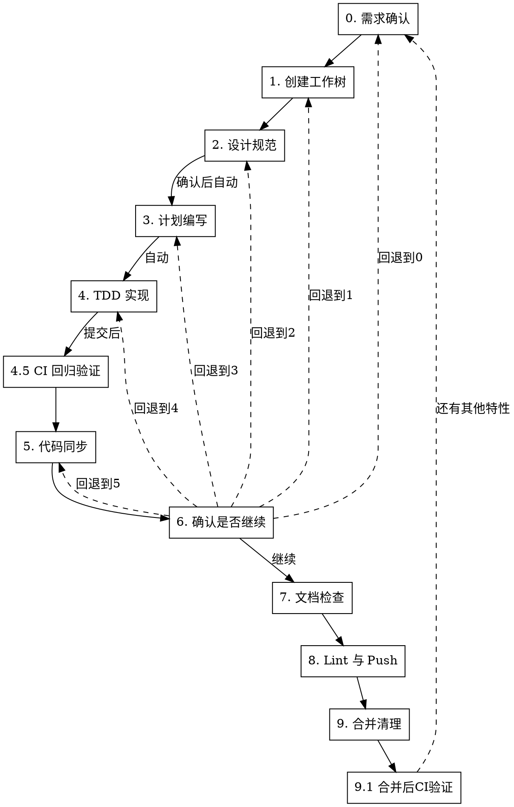

# 新特性实现工作流

## 概述

10 步严格顺序工作流：需求确认 → 创建工作树 → 设计规范 → 计划编写 → TDD 实现 → 代码同步(含提交) → 确认是否继续 → 文档检查 → Lint与Push → 合并清理。每步必须在前一步成功后才能继续。

## 何时使用

- 所有设计驱动变更：新功能、大规模重构、API 迁移
- 用户提到"新特性流程"、"feature development workflow"、"设计规范先行"、"分阶段计划"
- 需要先写设计规范，再拆计划、审查计划、按子计划执行

**不适用：** bug 修复、简单文本修改、纯文档修改、一次性小改动

## 流程



<HARD-GATE>
严格按 0→1→2→3→4→5→6→7→8→9 顺序执行。禁止跳步、禁止先写代码、禁止未通过检查就开始下一步。步骤 2 确认后到步骤 5 之间按推荐路径自动执行，无需用户确认。步骤 6 可回退到任意步骤(0-5)。任一步骤失败自动回退到上一步骤重新执行。
</HARD-GATE>

## 上下文恢复机制

会话上下文压缩后可能遗忘当前 worktree 路径、`BASE_BRANCH`、`FEATURE_BRANCH`、设计规范路径、计划目录、已完成阶段等关键状态。通过**状态文件持久化**解决。

### 状态文件位置

`$(git rev-parse --git-dir)/feature-development-state.json`

存放在 git dir（worktree 私有目录）下，不被 `git status` 检测。每个 worktree 拥有独立状态文件，支持多会话并行开发。

### 状态文件内容

```json
{
  "workflow_type": "feature-development",
  "feature_name": "short feature name",
  "worktree_path": "/absolute/path/to/worktree",
  "base_branch": "main",
  "feature_branch": "feature/xxx",
  "main_root": "/absolute/path/to/main/repo",
  "worktree_dir": "/absolute/path/to/project-worktrees",
  "spec_path": "docs/.../feature-design-spec.md",
  "review_path": "docs/.../feature-design-review.md",
  "test_case_path": "docs/.../feature-test-cases.md",
  "plan_dir": "docs/.../plans/feature-name",
  "current_step": "4",
  "current_phase": "phase-1",
  "total_phases": "3",
  "commits": {
    "design_spec": "abc1234",
    "design_review": "def5678",
    "plans": "987abcd"
  },
  "created_at": "2026-06-30T10:00:00Z"
}
```

### 恢复流程

每个步骤开始前，若不确定当前工作上下文，执行以下恢复：

```bash
git_dir=$(git rev-parse --git-dir)
state_file="$git_dir/feature-development-state.json"

if [ -f "$state_file" ]; then
    # 一次读取所有关键变量
    eval $(python3 -c "
import json
d = json.load(open('$state_file'))
for k in ['worktree_path','base_branch','feature_branch','main_root','worktree_dir','spec_path','plan_dir','current_phase']:
    print(f'{k.upper()}=\"{d.get(k,\"\")}\"')
")
    cd "$WORKTREE_PATH"
else
    echo "未找到状态文件，可能尚未创建工作树或已清理"
fi
```

### 写入时机

- **写入**：步骤 1（工作树创建/验证成功后）
- **更新 `current_step`**：每完成一个步骤，更新此字段
- **更新 `current_phase`**：每完成一个子计划，更新此字段
- **删除**：步骤 9 清理工作树前先删除（须在离开 worktree 前执行，此时 `git-dir` 指向 worktree 私有目录）

## 全局规则

- **结构化询问**：需要用户决策时，在 Trae 中使用 `AskUserQuestion`；在 Codex 中使用 `request_user_input`（如可用）或带清晰选项的简短文本问题。
- **null 输入重问**：调用 `AskUserQuestion` 后，若返回结果为 null（含空值、空字符串、用户取消、未选择任何选项），视为未获取有效决策。必须以原问题重新询问用户，重复直到获取有效输入，不得自行假设默认值继续。
- **文档规则优先**：项目存在 `.trae/rules/docs.md`、`docs/CODING_STANDARDS.md`、`docs/AI/trae-xctest-rules.md` 时，写设计规范、计划、检查前先阅读并遵守。
- **UI 可观测性优先**：UI 相关功能必须定义用户可见证据。内部状态、ViewModel、reducer、buffer、layer count 或日志只能作为辅助证据，不能单独证明 UI 已完成。
- **提交边界**：每次 commit 只包含当前阶段的相关文件。不得暂存无关脏文件，不得提交秘密文件，不得使用 `--no-verify`，不得 force push。
- **提交确认**：步骤 2（设计规范）和步骤 5（代码同步）需用户确认后提交；步骤 3-4 按推荐路径自动提交，无需用户确认。提交失败必须修复后重试，不得跳过提交继续下一步。
- **没有设计不写代码**：步骤 4 之前禁止修改生产代码。若为验证设计临时探索，必须丢弃探索改动后回到当前步骤。

## 三子代理并行检查规则

工作流中所有"检查"类步骤（设计规范审核 step 2.5、check-plan step 3.5、check-code step 4.4、文档检查 step 7.1）必须采用三子代理并行检查 + 汇总结果的模式，不得由单个子代理独断。

### 调度方式：方向分工 + 关键项冗余

采用**混合策略**——3 个子代理按方向分工最大化覆盖面，同时对最高风险项（UI 可观测性）设为 3 代理必检以兜底 LLM 盲区。

- **并行调度**：在同一条消息中一次性发起 3 个 `Task` 工具调用（subagent_type=general_purpose_task 或 search，按检查性质选择），3 个子代理同时运行，互不通信。
- **方向分工**：3 个子代理分别负责不同方向，各自专注自己方向内的检查项，确保覆盖面最大化。方向定义见下方"统一方向框架"。
- **UI 必检项**：涉及 UI 的检查步骤（2.5/3.5/4.4），"UI 可观测性 / 是否把内部状态误当成 UI 验证"设为 3 代理必检——无论代理自己的方向是什么，都必须检查这一项。7.1 文档检查不涉及 UI 验证，无必检项。
- **命名约定**：在 Task 工具的 description 中标注方向，如"审核子代理 A-覆盖与范围"、"审核子代理 B-一致与正确"、"审核子代理 C-可验证与可观测"，便于追溯。
- **跨方向上报**：任一代理在检查自己方向时发现其他方向的问题，可直接上报，不因"不在我的方向"而忽略。

### 统一方向框架

所有检查步骤使用同一套 3 方向，各步骤把清单项映射到对应方向：

| 方向 | 名称 | 核心关注 | 典型检查项 |
|------|------|----------|------------|
| **A** | 覆盖与范围 | 该有的有没有、范围对不对、是否混入未请求功能 | 完整性、范围、YAGNI、规格符合、AC 覆盖 |
| **B** | 一致与正确 | 互相矛盾吗、符合规范吗、结构一致吗 | 一致性、可计划性、CODING_STANDARDS、主子计划一致、测试质量 |
| **C** | 可验证与可观测 | 能验证吗、UI 有真实证据吗 | 可验证性、UI 真实入口、UI 证据、内部状态误判 |

每个步骤的具体映射在该步骤内说明。

### 汇总规则

3 个子代理全部返回后，主线程按以下方式汇总：

1. **方向专属发现**：各方向的检查项发现直接合并入汇总——该方向只有 1 个代理查，发现即上报，无投票
2. **UI 必检项发现**：对 UI 可观测性相关发现应用 3 票冗余——标注"N/3 子代理发现"（如"3/3 发现"权重最高）。任一代理发现问题即视为存在问题（最严格结论优先）
3. **冲突判定**：若代理结论冲突，按"最严格结论优先"——只要有任一代理发现问题，即视为存在问题
4. **分类输出**：将汇总结果分为「必须修复」「建议修复」「可选优化」三类
5. **汇总报告**：写入对应检查步骤的摘要文件，包含每个方向代理的关键发现、UI 必检项投票结果和最终汇总结论

### 处理结果

**分级自动处理（减少 ASK）**：汇总后的修改建议按类别分级处理，仅重大项才询问用户。

- **3 个子代理均通过且无问题**（方向专属 + UI 必检均无发现）→ 记录审核通过，进入下一步
- **「必须修复」类** → 自动采纳并修复，无需 ASK；修复后**重新调度 3 个子代理并行检查**，确保修改未引入新问题
- **「建议修复」/「可选优化」类** → 仅当涉及**重大架构变化、产品功能变化或改动影响很大**时，用 `AskUserQuestion` 逐条确认；否则自动跳过并记录到检查摘要
- **重试上限**：同一检查步骤并行检查重试次数上限为 3 次。第 3 次仍未通过 → `AskUserQuestion` 升级处理：继续重试 / 跳过该问题 / 停止工作流回退到上一步

### 适用范围

本规则仅适用于子代理检查类步骤。命令式检查（如 step 8.1 的 lint、test 命令）不在本规则范围内，按原命令流程执行。

## UI 可观测性门禁

任何涉及 UI、桌面 app、Web app、可视化、快捷键交互、窗口/浮层/菜单/表单/画布的特性，都必须通过此门禁。

### 证据分层

优先级从高到低：

1. **真实路径自动化证据**：E2E、XCUITest、Playwright、Appium、真实浏览器或真实 app 流程，断言用户可见结果。
2. **稳定可观测标记**：可访问性树、DOM、窗口层级、截图像素、canvas pixel、状态日志、activation marker、ready hook；必须能证明用户可见行为。
3. **组件级 UI 证据**：渲染测试、快照、视觉回归、故事书截图；只能覆盖组件边界。
4. **手动验收证据**：明确步骤、预期画面、截图/录屏/日志路径、执行时间和执行人；只能用于自动化不可行的部分。
5. **内部状态证据**：单元测试、ViewModel 状态、Core 状态机、日志；只能证明支撑逻辑，不能单独关闭 UI AC。

### 关闭规则

- 每个 UI AC 至少需要一种 1-4 层证据；只有第 5 层证据时，状态必须标为"未完成 UI 验证"或"存在 UI 风险"。
- 自动化不可行时，必须在设计规范和子计划中写明原因、手动验收步骤、证据保存位置和剩余风险。
- 任何"测试不到但应该没问题"的结论都必须升级为风险项，不能作为完成依据。

---

## 步骤 0：需求确认

### 0.1 调用 grill-me

开始时宣布：

```
我正在使用 dd-feature-development-workflow，并先进行需求拷问确定新特性需求。
```

进行需求质询，仅聚焦于**需求本身**，不做技术方案设计。

### 0.2 至少确认的问题

一次性收敛以下信息，避免后续设计返工：

1. **用户问题和业务目标**：这个特性解决什么问题？
2. **成功标准**：用户如何判断它完成？
3. **范围边界**：必须做什么？明确不做什么？
4. **用户流程**：入口、主要路径、失败路径、退出条件是什么？
5. **数据和接口**：新增或修改哪些模型、配置、协议、API、持久化格式？
6. **兼容和迁移**：是否影响旧行为、旧数据、旧快捷键、旧配置？
7. **验收标准**：可测试的 AC 列表（场景+预期+验证方式，必须有 XCTest/XCUITest 或对应测试框架）。
8. **阶段拆分**：按功能需求分成哪些 Phase，每个 Phase 的可交付结果是什么？
9. **UI 证据**（涉及 UI 时）：哪些 AC 需要真实 UI 交互验证？用 E2E/XCUITest/Playwright、截图、日志 marker、手动录屏还是组合证据？
10. **文档位置与编号**：按项目 `.trae/rules/docs.md` 规则，文档存放于 `docs/planning/P{n}/F{m}/`，需确认功能编号 `F{m}` 和优先级 `P{n}`；编写顺序为设计规范 → 视觉原型（涉及 UI 时）→ 测试用例表；涉及 docs/、功能设计或关键架构决策的 commit 必须在 `historys/` 写日志（`YYYY-MM-DD-修改摘要.md`）。若无项目规则，使用 `docs/superpowers/specs/` 和 `docs/superpowers/plans/`。

### 0.3 出口判定

输出需求摘要并要求用户确认。

- 选项 1（推荐）：确认理解正确
- 选项 2：需要补充细节
- 选项 3：理解有误，重新描述

确认正确 → 进入步骤 1。需要补充 → 继续质询。理解有误 → 重述需求，重新执行 0.2。

---

## 步骤 1：创建工作树

### 1.1 工作环境

**默认新建隔离工作树**（除非用户明确要求使用当前 worktree）。直接走 1.2 完整创建流程。仅当用户明确要求时才走 1.3 当前 worktree 验证。

**默认约束（除非用户明确说明，否则必须遵守）：**

- **必须新建 worktree**：不得复用已有工作树。即使存在同名或相关分支的 worktree，也必须创建新的工作树，保证隔离环境干净。
- **仅参考当前 worktree**：设计规范、计划、TDD 实现和文档检查只能参考当前 worktree 上的文档和代码，不得引用主仓库或其他工作树的内容。前置读取（步骤 2.1）的规则文件也以当前 worktree 内的为准。

违反以上约束视为红线行为，必须停止并回到本步骤重新执行。

### 1.2 新建工作树

#### 1.2.1 记录基线分支

```bash
BASE_BRANCH=$(git rev-parse --abbrev-ref HEAD)
```

#### 1.2.2 计算工作树路径

基于主仓库位置计算（避免在 worktree 内调用时项目名识别错误）：

```bash
common_dir=$(git rev-parse --git-common-dir)
main_root=$(cd "$(dirname "$common_dir")" && pwd)
project=$(basename "$main_root")
worktree_dir=$(dirname "$main_root")/${project}-worktrees
```

**关键**：必须基于主仓库，而非当前工作树——否则项目名会被误识别为分支名，导致工作树目录嵌套。

#### 1.2.3 创建工作树

```bash
BRANCH="feature/<简短描述>"
path="$worktree_dir/$BRANCH"
git worktree add "$path" -b "$BRANCH"
cd "$path"
```

#### 1.2.4 运行项目设置

自动检测并运行相应设置命令：

```bash
# Node.js
[ -f package.json ] && npm install

# Rust
[ -f Cargo.toml ] && cargo build

# Python
[ -f requirements.txt ] && pip install -r requirements.txt
[ -f pyproject.toml ] && poetry install

# Go
[ -f go.mod ] && go mod download

# Swift (Xcode 项目)
[ -f Package.swift ] && swift build
```

#### 1.2.5 验证基线测试干净

按 test-location-strategy skill 决策测试位置。**基线验证的语义是确认起点 commit 干净**——起点 = BASE_BRANCH 的 HEAD（步骤 1.2.1 已记录）。新创建的 fix 分支尚未 push，远端无此分支，此时**必须**查 BASE_BRANCH 的 CI 结果，因为工作树 HEAD 等于 BASE_BRANCH HEAD，基线 commit 已有成功 CI 证据即满足复用条件。

1. **检查基线 commit 的 CI 已有结果**（按优先级检索，commit 一致即可复用）：
   - 先查当前分支：`gh run list --workflow macos-ci.yml --branch <当前分支> --limit 1`
   - 当前分支无远端或无结果时，**必须**再查 BASE_BRANCH：`gh run list --workflow macos-ci.yml --branch <BASE_BRANCH> --limit 1`
   - 任一查询返回 `conclusion=success` 且 `headSha` 等于当前工作树 HEAD → 复用 CI 结果（记录复用来源分支与 run ID），跳过本地测试
   - `status=in_progress` → 等待 CI 完成，不重复触发
2. **触发 CI**（无可用结果且当前分支已 push 时）：`gh workflow run macos-ci.yml --ref <当前分支>` + `gh run watch <run-id> --exit-status`
   - **当前分支未 push 时不得以此为由降级本地**——按 1.2.7 红线处理（先查 BASE_BRANCH 已有结果，或用 AskUserQuestion 询问是否 push 后触发 CI）
   - `gh workflow run` 本身报错（ref 不存在、鉴权失败等）→ 按 test-location-strategy 步骤 2 的 AskUserQuestion 流程处理，**不得降级本地**
3. **本地测试**（仅在满足 1.2.7 红线明示条件时）：`bash scripts/ci/test-macos.sh`（与 CI 同脚本，基于 xcodebuild test + Macim.xcworkspace + MacimApp scheme）。禁止用 `swift test` 替代——本项目是 Xcode 工程，`swift test` 只覆盖 SwiftPM 子集。

- 测试失败：报告失败情况，询问是否继续或排查
- 测试通过：报告就绪

#### 1.2.6 报告位置

```
工作树已就绪：<full-path>
测试通过（<N> 个测试，0 个失败）
准备实现 <feature-name>
```

**重要**：调用后会话工作目录必须始终位于该工作树路径下，不得切换回主仓库目录。

#### 1.2.7 红线

**绝不：**
- 跳过基线测试验证
- 不询问就带着失败的测试继续
- 在项目内部创建工作树目录（污染 git status）
- **以"当前分支未 push 导致 CI 触发失败"为由降级本地测试**——必须先查 BASE_BRANCH 的 CI 结果（基线 commit 与 BASE_BRANCH HEAD 相同）；若 BASE_BRANCH 也无结果，用 AskUserQuestion 询问是否 push 后触发 CI，不得直接降级本地
- **以"CI 不可用"宽泛措辞降级本地**——"CI 不可用"仅指：项目无 `.github/workflows/` 配置、`gh` 命令不可用且用户选择不修复、用户在**无可用 CI 结果**时明确选择本地。分支未 push、`gh workflow run` 报错、CI 触发失败**均不构成"CI 不可用"**
- **以"用户明确要求"凌驾于 CI 优先之上**——当已有可复用的成功 CI 结果时，用户要求本地不构成降级理由；应用 AskUserQuestion 给出"复用 CI 结果（推荐）/ 仍要本地仅作参考 / 终止"选项
  - **触发时机**：若 agent 已按步骤 1 确定复用（commit 一致 + conclusion=success），可直接复用并告知用户，无需 AskUserQuestion；AskUserQuestion 仅在 agent 考虑接受用户本地请求时强制触发（即 agent 在"复用 CI"与"本地执行"之间犹豫时，必须用 AskUserQuestion 让用户显式选择，不得沉默降级本地）

> **与步骤 8.2.1 红线的关系**：步骤 8.2.1"分支未 push 时必须先 push 再等待 CI，禁止落到本地测试""CI 触发失败不构成走本地测试的理由"同样适用于本步骤——基线验证与回归验证在"CI 优先"上标准一致，不得在 1.2.5 阶段降级。
>
> **1.2.5 与 8.2.1 的表面张力说明**：1.2.5"可复用 BASE_BRANCH 的 CI 结果"与 8.2.1"分支未 push 时必须先 push"并不冲突——8.2.1 的"必须先 push"针对**回归验证**（步骤 8 提交后的新 commit 需新 CI 运行）；1.2.5 的"可复用 BASE_BRANCH"针对**基线验证**（步骤 1 的起点 commit 已有 CI 证据，无需新运行）。两者场景不同，不得混淆。

### 1.3 当前 worktree 验证

跳过创建，仅做验证：

```bash
# 并发检查：禁止同一 worktree 上同时运行多个工作流
git_dir=$(git rev-parse --git-dir)
for f in "$git_dir"/bug-fix-state.json "$git_dir"/feature-development-state.json; do
  if [ -f "$f" ]; then
    existing_type=$(python3 -c "import json; print(json.load(open('$f')).get('workflow_type','unknown'))")
    echo "❌ 当前 worktree 已有活跃的 ${existing_type} 工作流，禁止并发"
    exit 1
  fi
done

# 记录基线分支
BASE_BRANCH=$(git rev-parse --abbrev-ref HEAD)

# 验证工作区状态
git status  # 必须干净，有未提交变更需先处理

# 验证基线测试（按 test-location-strategy skill 决策测试位置）
# 1. 检查基线 commit 的 CI 已有结果（commit 一致即可复用）：
#    - 先查当前分支：gh run list --workflow macos-ci.yml --branch <当前分支> --limit 1
#    - 当前分支无远端或无结果时，必须再查 BASE_BRANCH：gh run list --workflow macos-ci.yml --branch <BASE_BRANCH> --limit 1
#    - 任一返回 conclusion=success 且 headSha==当前工作树 HEAD → 复用 CI 结果，跳过本地测试
#    - status=in_progress → 等待 CI 完成，不重复触发
# 2. 触发 CI（无可用结果且当前分支已 push 时）：gh workflow run macos-ci.yml --ref <当前分支> && gh run watch <run-id> --exit-status
#    - 当前分支未 push 时不得降级本地——先查 BASE_BRANCH 已有结果，或 AskUserQuestion 询问是否 push
# 3. 本地测试（仅在 1.2.7 红线明示条件满足时）：bash scripts/ci/test-macos.sh（与 CI 同脚本）
#    禁止用 swift test 替代——本项目是 Xcode 工程
```

- 成功标准：工作区干净 + 基线测试通过
- 失败：报错并停止

### 1.4 写入状态文件

工作树创建/验证成功后，持久化关键状态供上下文恢复：

```bash
common_dir=$(git rev-parse --git-common-dir)
main_root=$(cd "$(dirname "$common_dir")" && pwd)
project=$(basename "$main_root")
worktree_dir=$(dirname "$main_root")/${project}-worktrees
git_dir=$(git rev-parse --git-dir)

cat > "$git_dir/feature-development-state.json" <<EOF
{
  "workflow_type": "feature-development",
  "feature_name": "<简短特性名>",
  "worktree_path": "$(pwd)",
  "base_branch": "$BASE_BRANCH",
  "feature_branch": "$(git rev-parse --abbrev-ref HEAD)",
  "main_root": "$main_root",
  "worktree_dir": "$worktree_dir",
  "spec_path": "<设计规范路径>",
  "review_path": "<设计评审摘要路径>",
  "test_case_path": "<测试用例表路径>",
  "plan_dir": "<计划目录路径>",
  "current_step": "1",
  "current_phase": "",
  "total_phases": "<Phase总数>",
  "commits": {
    "design_spec": "<commit-sha>",
    "design_review": "<commit-sha>",
    "plans": "<commit-sha>"
  },
  "created_at": "$(date -u +%Y-%m-%dT%H:%M:%SZ)"
}
EOF
```

---

## 步骤 2：设计规范

### 2.1 前置读取

**约束**：设计规范只能参考当前 worktree 上的文档和代码，不得引用主仓库或其他工作树的内容。用户未明确说明时，以此约束为准。

按项目存在情况读取：

```bash
test -f .trae/rules/docs.md && cat .trae/rules/docs.md
test -f docs/CODING_STANDARDS.md && cat docs/CODING_STANDARDS.md
test -f docs/AI/trae-xctest-rules.md && cat docs/AI/trae-xctest-rules.md
```

如规则文件很长，必须完整阅读与设计规范、验收标准、测试和回归相关的章节。

### 2.2 设计规范

**通过子代理编写**：设计规范是全文最长文档，直接在主线程编写会消耗大量 context。调度子代理，传入步骤 0 的需求摘要、步骤 2.1 读取的规则文件和以下章节要求，由子代理生成设计规范文件。

按项目模板优先；无模板时按 `.trae/rules/docs.md` 规定的格式编写。设计规范文件命名：`F{N}_{功能名}_设计规范.md`。

必须包含以下章节：

1. **背景与目标**：做什么
2. **非目标**：明确不做什么
3. **用户流程和交互入口**（mermaid）
4. **行为规则和状态机**
5. **数据模型、接口、配置、持久化影响**
6. **兼容性、迁移和回滚策略**
7. **可观测性**：日志、埋点、调试开关
8. **验收标准 AC**：每条必须可验证（场景+预期+验证方式，必须有 XCTest/XCUITest 或对应测试框架）
9. **测试策略**：单元、集成、UI、回归范围
10. **UI 可观测性矩阵**（涉及 UI 时）：每个 UI AC 对应真实入口、操作路径、可见结果、证据类型、自动化可行性、手动验收步骤和剩余风险
11. **分阶段设计**：Phase 0..N，每个 Phase 有目标、范围、交付物、验证方式
12. **风险和待确认问题**

文档头部必须包含：`> 最后更新：YYYY-MM-DD | 版本：vX.Y`

每次修改同步更新版本号和最后更新日期，最后添加列表格式版本记录。

### 2.3 视觉原型（涉及 UI 时）

**仅当特性涉及 UI 时执行**，不涉及 UI 时跳过本子步。

- 文件命名：`F{N}_{功能名}_视觉原型.html`
- 浏览器直接打开
- 编写时调用 `brainstorming` skill 的视觉原型辅助（如当前环境不可用，使用同等方式生成）
- 页面头部显示最后更新时间与版本信息

涉及 UI 行为变化时，必须同步更新视觉原型。

### 2.4 测试用例表

**通过子代理生成**：需读取已有测试代码并生成矩阵，token 量大。调度子代理，传入设计规范路径和项目代码路径，由子代理生成测试用例表。

基于设计规范验收标准按功能分类生成测试用例矩阵。

- 文件命名：`F{N}_{功能名}_测试用例表.md`
- 对照代码中已有测试标注覆盖状态（✅ COVERED / 🟡 PARTIAL / ❌ MISSING / ⏸️ DEFERRED）
- 文档头部版本号须注明对应的设计规范版本：`> 最后更新：YYYY-MM-DD | 版本：vX.Y（基于设计规范 vA.B）`

修改设计规范中的目标、范围、流程、接口、验收标准时，必须同步更新测试用例表。

### 2.5 三子代理并行审核 + 自动修复

按"三子代理并行检查规则"调度 3 个独立子代理并行审核设计规范。3 个子代理使用相同的输入文件（设计规范、视觉原型、测试用例表），但按统一方向框架分工：

| 子代理 | 方向 | 负责的检查项 |
|--------|------|------------|
| **A - 覆盖与范围** | 该有的有没有、范围对不对 | 完整性、范围、YAGNI |
| **B - 一致与正确** | 互相矛盾吗、能拆任务吗 | 一致性、可计划性 |
| **C - 可验证与可观测** | 能验证吗、UI 有真实证据吗 | 可验证性 |
| **3 代理必检** | UI 最高风险项，所有代理都查 | UI 可观测性（是否把内部状态误当成 UI 已验证） |

审核检查项明细：

| 类别 | 检查要点 | 方向 |
|------|----------|------|
| 完整性 | TODO、TBD、占位符、不完整章节 | A |
| 一致性 | 需求、AC、Phase、测试策略是否互相冲突 | B |
| 可计划性 | 是否足够具体，能被拆成任务 | B |
| 范围 | 是否混入多个独立特性，是否需要拆成多个规格 | A |
| YAGNI | 是否加入未请求功能或过度设计 | A |
| 可验证性 | 每个 AC 和 Phase 是否有明确验证方式 | C |
| UI 可观测性 | UI AC 是否有用户可见证据，是否把内部状态误当成 UI 已验证 | **必检** |

**校准标准**：只标记会在计划编写阶段造成实际问题的事项。缺失的章节、矛盾之处、模糊到可能被两种不同方式理解的需求才是问题。措辞小改进、风格偏好不是。

#### 汇总与处理审核结果

3 个子代理全部返回后，主线程按"三子代理并行检查规则"汇总（方向专属发现直接合并 + UI 必检项 3 票冗余 + 冲突取最严格 → 分类输出）：

- **3 个子代理均通过且无问题**（方向专属 + UI 必检均无发现）→ 记录审核通过
- **「必须修复」类** → 自动采纳并修复规范，无需 ASK；修复后**重新调度 3 个子代理并行审核**，确保修改未引入新问题
- **「建议修复」/「可选优化」类** → 仅当涉及重大架构变化、产品功能变化或改动影响很大时，用 `AskUserQuestion` 逐条确认；否则自动跳过并记录到评审摘要
- **达到 3 次重试上限** → `AskUserQuestion` 升级处理：继续重试 / 跳过该问题 / 停止工作流回退到上一步

设计评审摘要（含各方向代理的关键发现、UI 必检项投票结果和最终汇总结论）保存到设计规范同目录的 `<feature-name>_设计评审摘要.md`。

### 2.6 用户确认

展示设计规范路径、视觉原型路径（如有）、测试用例表路径、审核结论和修改摘要，询问用户确认：

- 选项 1（推荐）：确认设计规范，可以提交
- 选项 2：需要补充或修改
- 选项 3：方向不对，回到步骤 0

### 2.7 提交

确认后只暂存设计规范相关文件：

```bash
git status --short
git diff -- <spec-path> <visual-path> <test-case-path> <review-path>
git add <spec-path> <visual-path> <test-case-path> <review-path>
git commit -m "$(cat <<'EOF'
docs: add <feature-name> design spec

- 设计规范: F{N}_{功能名}_设计规范.md
- 视觉原型: F{N}_{功能名}_视觉原型.html (如有)
- 测试用例表: F{N}_{功能名}_测试用例表.md
- 设计评审摘要: <feature-name>_设计评审摘要.md
EOF
)"
```

提交信息格式遵循 Conventional Commits：

- `<type>[scope]: <description>`，描述用现在时+命令式，<72 字符
- 类型表：`feat` 新功能 | `fix` 修复 | `docs` 文档 | `style` 格式 | `refactor` 重构 | `perf` 性能 | `test` 测试 | `build` 构建 | `ci` CI | `chore` 维护 | `revert` 回退

**Git 安全协议**：
- 禁止更新 git config
- 禁止 `--force`、hard reset（除非用户明确要求）
- 禁止 `--no-verify` 跳过 hooks
- 禁止 force push 到 main/master
- hooks 失败 → 修复后新建 commit，不 amend

提交成功后进入步骤 3。

---

## 步骤 3：计划编写

### 3.1 读取设计规范和评审摘要

必须读取已提交的设计规范、设计评审摘要和测试用例表，再编写实现计划。

### 3.2 按功能需求划分阶段

设计规范中已按功能需求划分 Phase。计划按 Phase 拆分为子计划。

### 3.3 先写总计划，动态拆子计划

**通过子代理编写**：主计划 + 多个 Phase 子计划是 token 量最大的文档产出。调度子代理（使用 `writing-plans` 技能），传入设计规范、设计评审摘要和测试用例表路径，由子代理生成全部计划文件。

**先写一个总实现计划**，定义整体目标、架构、Phase 列表和依赖关系。然后根据复杂度动态决定是否拆分子计划：

- **简单特性**（1-2 个 Phase，每个 Phase 任务数 ≤ 5）：总计划已足够，无需拆子计划
- **中等特性**（2-3 个 Phase，任务数 > 5）：按 Phase 拆子计划，每个 Phase 一个子计划文件
- **复杂特性**（4+ Phase 或有跨 Phase 依赖）：按 Phase 拆子计划，额外补充跨 Phase 依赖和集成验证计划

### 3.4 计划结构

按项目文档规则优先；无规则时使用：

```text
docs/superpowers/plans/YYYY-MM-DD-<feature-name>/
  README.md                  # 总实现计划
  phase-0-<name>.md          # Phase 0 子计划（如需拆分）
  phase-1-<name>.md          # Phase 1 子计划
  phase-2-<name>.md          # Phase 2 子计划
```

#### README.md（总实现计划）必须包含：

```markdown
# [功能名称] 实现计划

> **面向 AI 代理的工作者：** 必需子技能：使用 subagent-driven-development（推荐）或 executing-plans 逐任务实现此计划。步骤使用复选框（`- [ ]`）语法来跟踪进度。

**目标：** [一句话描述要构建什么]

**架构：** [2-3 句话描述方案]

**技术栈：** [关键技术/库]

**设计规范：** [设计规范路径]

**设计评审摘要：** [评审摘要路径]

---

## Phase 列表

| Phase | 目标 | 子计划文件 | 依赖 |
|-------|------|-----------|------|
| 0 | ... | phase-0-xxx.md | 无 |
| 1 | ... | phase-1-xxx.md | Phase 0 |
| 2 | ... | phase-2-xxx.md | Phase 0, 1 |

## 全局验证命令

[运行所有测试的命令]

## 最终验收方式

[如何确认整个特性已完成]
```

#### Phase 子计划必须包含：

- 本 Phase 的目标、范围和非目标
- 涉及文件和职责
- 小步骤任务，粒度为 2-5 分钟
- TDD 步骤：失败测试 → 验证失败 → 最小实现 → 验证通过 → 重构
- 精确命令和预期结果
- UI 证据任务（涉及 UI 时）：真实交互验证命令，或手动验收脚本、截图/录屏/日志证据路径和风险记录
- commit 建议信息

#### 禁止占位符

每个步骤都必须包含工程师需要的实际内容。以下是**计划缺陷**——绝不要写出来：

- "待定"、"TODO"、"后续实现"、"补充细节"
- "添加适当的错误处理" / "添加验证" / "处理边界情况"
- "为上述代码编写测试"（没有实际测试代码）
- "类似任务 N"（重复代码——工程师可能不按顺序阅读任务）
- 只描述做什么而不展示怎么做的步骤（代码步骤必须有代码块）
- 引用了未在任何任务中定义的类型、函数或方法

### 3.5 check-plan

**通过 3 个独立子代理并行核对**：按"三子代理并行检查规则"调度 3 个独立子代理（均非编写计划的子代理），使用相同的输入文件（计划目录、设计规范、评审摘要），按统一方向框架分工：

| 子代理 | 方向 | 负责的核对项 |
|--------|------|------------|
| **A - 覆盖与范围** | 是否符合规格与规则 | 1.是否遵循设计规范和评审摘要 / 2.是否遵循 CODING_STANDARDS / 3.是否遵循 docs.md / 4.是否遵循 xctest-rules |
| **B - 一致与正确** | 结构是否一致 | 5.主计划和 Phase 子计划是否一致 / 6.每个子计划是否有明确的测试、验证和提交步骤 |
| **C - 可验证与可观测** | UI 能否真实验证 | 8.是否存在"只测内部状态却声称 UI 已验证"的计划缺陷 |
| **3 代理必检** | UI 最高风险项，所有代理都查 | 7.UI 子计划是否包含真实入口、真实操作、用户可见断言和证据保存方式 |

计划写完后，必须核对实施计划：

**核对内容**：

1. 是否遵循设计规范和设计评审摘要
2. 是否遵循 `docs/CODING_STANDARDS.md`
3. 是否遵循 `.trae/rules/docs.md`
4. 是否遵循 `docs/AI/trae-xctest-rules.md` 或 `docs/ai/trae-xctest-rules.md`
5. 主计划和 Phase 子计划是否一致
6. 每个子计划是否有明确的测试、验证和提交步骤
7. UI 子计划是否包含真实入口、真实操作、用户可见断言和证据保存方式
8. 是否存在"只测内部状态却声称 UI 已验证"的计划缺陷

**自检**（计划编写者自行执行）：

1. **规格覆盖度**：设计规范每个 AC 是否映射到一个或多个计划任务
2. **占位符扫描**：搜索计划中的红旗——"禁止占位符"章节中的任何模式
3. **类型一致性**：后续任务中使用的类型、方法签名和属性名是否与前面任务中定义的一致

**汇总与处理结果**：

3 个子代理全部返回后，主线程按"三子代理并行检查规则"汇总（方向专属发现直接合并 + UI 必检项 3 票冗余 + 冲突取最严格 → 分类输出）：

- **3 个子代理均通过**（方向专属 + UI 必检均无发现）→ 进入 3.6
- **「必须修复」类** → 自动采纳并修正计划，无需 ASK；修正后**重新调度 3 个子代理并行核对**，确保修改未引入新问题
- **「建议修复」/「可选优化」类** → 仅当涉及重大架构变化、产品功能变化或改动影响很大时，用 `AskUserQuestion` 逐条确认；否则自动跳过并记录到核对摘要
- **达到 3 次重试上限** → `AskUserQuestion` 升级处理：继续重试 / 跳过该问题 / 停止工作流回退到上一步

### 3.6 自动提交

check-plan 通过后自动提交计划，无需用户确认（设计规范确认后到代码同步前，按推荐路径自动执行）。

展示主计划路径、子计划列表和自检结论，然后直接提交：

```bash
git add <plan-dir>
git commit -m "$(cat <<'EOF'
docs: add <feature-name> implementation plans

- 总计划: README.md
- Phase 子计划: phase-0-xxx.md, phase-1-xxx.md, ...
EOF
)"
```

提交成功后进入步骤 4。

---

## 步骤 4：TDD 实现

### 4.1 执行方式

**默认子代理驱动执行**：每个任务调度新子代理，任务间审查。无需用户确认，直接开始执行（设计规范确认后到代码同步前，按推荐路径自动执行）。

### 4.2 每个子计划的固定节奏

对每个 Phase 子计划按顺序执行：

1. 读取主计划、当前子计划、设计规范和评审摘要
2. 按子计划中的任务顺序执行，遵循 TDD 循环
3. 当前子计划全部任务完成后，执行 check-code
4. 根据 check-code 结果修复问题，直到通过
5. 对 UI 子计划执行真实路径验证或手动验收，保存截图/录屏/日志/测试输出
6. 运行子计划要求的验证命令（按 test-location-strategy skill 决策测试位置）：
   - **单测试文件验证**（代码未提交，本地执行）：仅运行当前子计划相关的测试，确认 TDD 绿灯。此时代码未提交，无法 push 触发 CI，本地执行是唯一选项
   - **全量回归验证**：延迟到步骤 4.5 提交后按 test-location-strategy 走 CI 优先（先 push 再触发 CI）
   - **禁止**：在步骤 4.2.6 本地跑全量回归——代码未提交，本地通过不能替代 CI 的跨环境验证；不得以"CI 不可用"或"用户明确要求"为由本地降级
7. 提交当前子计划相关代码、测试、文档、证据记录
8. 更新状态文件的 `current_phase`
9. 进入下一个子计划

### 4.3 TDD 循环

对每个任务，严格遵循 TDD 四步循环：

#### 第一步：编写失败测试（红灯）

**目标：用测试用例定义期望行为。**

- 阅读设计规范的 AC 和子计划的任务描述
- 编写最小测试（只测一件事，使用真实代码，避免不必要 mock）
- 验证因正确原因失败（失败信息反映功能缺失，非拼写错误）
- 测试通过？说明测了已有行为，需修改测试

#### 第二步：实现设计（绿灯）

**目标：实现设计规范定义的行为，让测试通过。**

- 严格按子计划步骤实现（不做"顺便改改"的优化，不捆绑重构）

**验证分两层，必须严格区分：**

1. **单测试文件绿灯验证**（本地执行，TDD 快速反馈）：仅运行当前任务编写的新测试，确认因实现而通过。此时代码未提交，无法触发 CI，本地执行是唯一选项
2. **全量回归验证**（**步骤 4.5 提交后**按 `test-location-strategy` skill 走 CI 优先）：运行项目完整测试套件，确认实现未破坏其他测试。**禁止在步骤 4.3 中直接本地跑全量回归——必须延迟到步骤 4.5 提交后走 CI 验证**

> **为什么不能在步骤 4.3 本地跑全量回归？** 与 dd-bug-fix-workflow 相同：代码未提交无法 push 触发 CI。即使本地通过，CI 环境差异可能掩盖问题。

- **回归测试失败需修改时**：必须使用 `AskUserQuestion` 说明失败原因和修改理由，获得用户确认后方可修改
- 如果实现不起作用：
  - 少于 3 次：回到第二步，用新信息重新分析
  - 3 次或以上：停下来质疑设计 → **AskUserQuestion**：
    - 选项 1（推荐）：继续实现（回到第二步）
    - 选项 2：回到步骤 3 重新编写计划
    - 选项 3：放弃并清理工作树

#### 第三步：重构

**目标：在绿灯基础上清理代码。**

- 消除重复
- 改善命名
- 提取辅助函数
- 保持测试绿灯，不添加行为

#### 第四步：提交

每完成一个任务或一组相关任务，提交变更：

```bash
git add <files-for-current-task>
git commit -m "<type>[scope]: <description>"
```

### 4.4 check-code

**通过 3 个独立子代理并行核对**：按"三子代理并行检查规则"调度 3 个独立子代理（均非实现该子计划的子代理），使用相同的输入文件（设计规范、当前 Phase 子计划、代码变更路径），按统一方向框架分工：

| 子代理 | 方向 | 负责的核对项 |
|--------|------|------------|
| **A - 覆盖与范围** | 符合性与覆盖 | 1.代码是否符合设计规范和子计划 / 2.是否遗漏 AC 或实现超范围 / 3.是否符合 CODING_STANDARDS |
| **B - 一致与正确** | 测试与质量 | 4.测试是否覆盖新增和受影响旧行为 / 5.日志、错误处理、边界条件 / 8.临时调试代码、未清理 TODO、跳过测试 |
| **C - 可验证与可观测** | UI 证据 | 6.UI 行为是否有用户可见证据 |
| **3 代理必检** | UI 最高风险项，所有代理都查 | 7.是否错误地把内部状态、mock、日志、layer count 或组件渲染测试当成完整 UI 验证 |

每个子计划完成后必须核对代码实现：

**核对内容**：

1. 代码是否符合设计规范和当前 Phase 子计划
2. 是否遗漏 AC 或实现了超范围功能
3. 是否符合 `docs/CODING_STANDARDS.md`
4. 测试是否覆盖新增行为和受影响旧行为
5. 日志、错误处理、边界条件是否完整
6. UI 行为是否有用户可见证据：E2E/XCUITest/Playwright、截图像素、AX/DOM/window marker、录屏或手动验收记录
7. 是否错误地把内部状态、mock、日志、layer count 或组件渲染测试当成完整 UI 验证
8. 是否存在临时调试代码、未清理 TODO、未解释的跳过测试

**UI 可观测性门禁**：涉及 UI 的特性必须通过（详见全局章节），检查是否把内部状态/mock/日志误当成完整 UI 验证

**汇总与处理结果**：

3 个子代理全部返回后，主线程按"三子代理并行检查规则"汇总（方向专属发现直接合并 + UI 必检项 3 票冗余 + 冲突取最严格 → 分类输出）：

- **3 个子代理均通过**（方向专属 + UI 必检均无发现）→ 提交当前子计划成果
- **「必须修复」类** → 自动采纳并修复，无需 ASK；修复后**重新调度 3 个子代理并行核对**，确保修改未引入新问题
- **「建议修复」/「可选优化」类** → 仅当涉及重大架构变化、产品功能变化或改动影响很大时，用 `AskUserQuestion` 逐条确认；否则自动跳过并记录到核对摘要
- **达到 3 次重试上限** → `AskUserQuestion` 升级处理：继续重试 / 跳过该问题 / 停止工作流回退到上一步

### 4.5 子计划提交

check-code 通过后提交：

```bash
git status --short
git diff
git add <files-for-current-phase>
git commit -m "$(cat <<'EOF'
feat(<feature-name>): complete phase <N> - <phase-name>

- 实现: <简述实现内容>
- 测试: <简述测试覆盖>
- 证据: <UI证据类型，如有>
EOF
)"
```

如果实现任务已经按计划产生了多个 commit，确保当前子计划结束时没有未提交变更；如 check-code 后没有新增变更，记录最后一个属于该子计划的 commit SHA 作为完成点，不创建空提交。

**提交后全量回归验证（CI 优先，必须 push）**：代码已提交，必须 push 到远端触发 CI 验证。**禁止在本地执行测试作为 CI 的替代**——本地环境差异会掩盖问题。按以下顺序执行（不得跳步、不得本地测试兜底）：

1. **检查分支是否已 push 到远端**：
   ```bash
   CURRENT_BRANCH=$(git rev-parse --abbrev-ref HEAD)
   git ls-remote --exit-code --heads origin "$CURRENT_BRANCH" >/dev/null 2>&1
   ```
   - **退出码 0**（远端已有此分支）→ 进入步骤 2
   - **退出码非 0**（远端无此分支，新建分支未 push）→ **必须先 push**：`git push -u origin "$CURRENT_BRANCH"`
     - push 失败 → **AskUserQuestion**：重试 push（排查网络/权限）/ 停止工作流排查权限
     - **禁止**：以 push 失败为由落到本地测试

2. **检查 CI 已有结果**（分支已 push 到远端后）：`gh run list --workflow macos-ci.yml --branch <当前分支> --limit 1`
   - `conclusion=success` 且 `headSha` 等于当前 HEAD → 复用 CI 结果，更新状态文件进入下一个子计划
   - `status=in_progress` → 等待 CI 完成，不重复触发

3. **触发 CI 并等待结果**（无可用 CI 结果时）：
   ```bash
   gh workflow run macos-ci.yml --ref <当前分支>
   sleep 5
   RUN_ID=$(gh run list --workflow macos-ci.yml --branch <当前分支> --limit 5 \
     --json databaseId,headSha \
     --jq ".[] | select(.headSha == \"$(git rev-parse HEAD)\") | .databaseId" | head -1)
   gh run watch "$RUN_ID" --exit-status
   ```
   - **触发失败** → **AskUserQuestion**：重试触发 CI / 停止工作流排查 CI 配置
   - **禁止**：以 CI 触发失败为由落到本地测试

- **CI 通过** → 更新状态文件，进入下一个子计划
- **CI 失败**（测试用例未通过）→ **AskUserQuestion**：
  - 选项 1（推荐）：拉取 CI 日志（`gh run view <run-id> --log-failed`）分析失败原因，回到步骤 4 修复
  - 选项 2：本地复现排查（`bash scripts/ci/test-macos.sh`，**仅用于理解失败原因，修复后必须重新走 CI 验证**）
  - 选项 3：跳过继续（不推荐）

> **红线**：
> - 不得跳过本验证。步骤 4.3 的全量回归已延迟到此处，跳过等于放弃回归验证。
> - **分支未 push 时，必须先 push 再等待 CI，禁止落到本地测试**。本地测试不能作为 CI 的替代。
> - **CI 触发失败不构成走本地测试的理由**。应排查 CI 配置或重试，而非降级验证。

更新状态文件的 `current_phase`。

### 4.6 出口判定

- 所有子计划完成、check-code 通过、工作区干净 → 进入步骤 5
- 任一子计划阻塞 → 停止并报告阻塞点、已验证事实和建议选项
- 设计或计划在实现中被证明错误 → 回到步骤 2 或步骤 3，按顺序重新推进

---

## 步骤 5：代码同步

### 5.1 变基到 BASE_BRANCH 并解决冲突

#### 5.1.1 前置检查：对比本地与远端 BASE_BRANCH 新旧

```bash
# 精确拉取 BASE_BRANCH
git fetch origin "$BASE_BRANCH"

LOCAL_SHA=$(git rev-parse "$BASE_BRANCH")
REMOTE_SHA=$(git rev-parse "origin/$BASE_BRANCH")

if [ "$LOCAL_SHA" = "$REMOTE_SHA" ]; then
    # 本地与远端一致，无需变基
    SKIP_REBASE=true
elif git merge-base --is-ancestor "$LOCAL_SHA" "$REMOTE_SHA"; then
    # 远端更新，推荐 rebase 到 origin/<BASE_BRANCH>
    RECOMMEND="origin/$BASE_BRANCH"
else
    # 本地更新，推荐 rebase 到 <BASE_BRANCH>
    RECOMMEND="$BASE_BRANCH"
fi
```

- `SKIP_REBASE=true` → **跳过 5.1.2**，直接进入 5.2
- 否则进入 5.1.2 询问变基策略

#### 5.1.2 询问变基策略（仅当需要变基时）

**AskUserQuestion**：

- 选项 1（推荐）：变基到较新的一方（自动判定本地/远端）
- 选项 2：变基到 `origin/<BASE_BRANCH>`（强制远端）
- 选项 3：变基到 `<BASE_BRANCH>`（强制本地）
- 选项 4：不变基，跳过本子步

#### 5.1.3 执行变基

选择变基时：

```bash
git rebase <目标分支>
```

**冲突处理流程**：

1. `git status` 查看冲突文件列表
2. 手动逐个文件解决冲突（保留正确逻辑、删除冲突标记）
3. `git add <已解决文件>` 标记冲突已解决
4. `git rebase --continue` 继续 rebase
5. 若有多个冲突 commit，重复步骤 1-4
6. **成功标准**：`git status` 显示 rebase 已结束，无冲突文件

**冲突无法解决** → **AskUserQuestion**：

- 选项 1（推荐）：`git rebase --abort` 中止，回到步骤 4 在 BASE_BRANCH 最新代码上重新实现
- 选项 2：继续手动解决冲突
- 选项 3：放弃本次实现，清理工作树

**禁止**：强制 `--no-edit` 跳过冲突处理、使用 `git rebase --skip` 丢弃提交

### 5.2 添加详细日志

给相关代码添加正式运行日志，带功能标签前缀（如 `[F1.10]`）便于检索。

**格式**：`[<功能编号>] <级别> | <位置> | <信息> | <上下文>`，级别用 DEBUG/INFO/WARN/ERROR。

**添加原则**：函数入口记参数、关键分支记走向、异步操作记始末、错误处理记详情、状态变更记前后值。

如果项目 `CODING_STANDARDS.md` 中定义了日志规范，以项目规范为准。

### 5.3 编写流程图和时序图

- **流程图**：描述特性涉及的代码执行流程，标注关键节点与分支条件
- **时序图**：描述特性涉及的组件交互顺序，标注关键消息与状态转换

使用 mermaid 格式，兼容 9.1.2，不使用中文标点、符号。

### 5.4 提交变更

无论是否变基，均提交当前变更（含代码 + 日志 + 文档）。提交流程同步骤 2.7（分析 diff → 智能暂存 → Conventional Commits → Git 安全协议）。

```bash
git add <files-for-current-sync>
git commit -m "<type>[scope]: <description>"
```

**成功** → 进入 5.5 同步 AI-test 工作树

**失败** → 回到步骤 4 修复问题，不跳过

### 5.5 同步 AI-test 测试工作树

提交变更后同步 AI-test 工作树，确保其复位到最新特性分支。

**AskUserQuestion**：是否同步 AI-test 工作树

- 选项 1（推荐）：同步（使用 `reset --hard` 复位到最新修复分支）
- 选项 2：不同步，结束步骤 5

选择同步时：

```bash
FEATURE_BRANCH=$(git rev-parse --abbrev-ref HEAD)
bash "$HOME/.trae-cn/skills/shared/scripts/sync-ai-test-worktree.sh" "$FEATURE_BRANCH" "$worktree_dir"
```

- **返回码 0**（成功）：AI-test 工作树 HEAD 等于当前特性分支最新 commit，工作区干净
- **返回码 2**（未提交变更）：AI-test 工作树存在未提交变更，询问用户处理方式
- **其他失败** → **AskUserQuestion**：
  - 选项 1（推荐）：重试
  - 选项 2：跳过继续
  - 选项 3：停止工作流

选择不同步 → 直接进入步骤 6

---

## 步骤 6：确认是否继续

在代码同步完成后、进入文档检查之前，询问用户是否需要回到之前的步骤。

**AskUserQuestion**：

- 选项 1（推荐）：继续进入步骤 7 检查文档
- 选项 2：回到步骤 0 重新确认需求
- 选项 3：回到步骤 2 重新设计
- 选项 4：回到步骤 3 重新编写计划
- 选项 5：回到步骤 1 重新创建工作树
- 选项 6：回到步骤 4 重新实现
- 选项 7：回到步骤 5 重新代码同步

**分支处理**：

- 选"继续" → 进入步骤 7
- 选任意回退选项 → 跳转到对应步骤重新执行，后续步骤顺序推进

---

## 步骤 7：文档检查

确保文档与代码变更保持一致。

### 7.1 读取测试规则并识别变更

**通过 3 个子代理并行分析**：按"三子代理并行检查规则"调度 3 个子代理，使用相同的输入（`git diff` 输出、设计规范、测试用例表、代码路径、`BASE_BRANCH`、功能编号），按统一方向框架分工。本步骤不涉及 UI 验证，**无必检项**，纯方向分工。3 个子代理只负责"分析与检查"，不负责修改文档——修改由主线程在 7.2 根据汇总结果执行。

| 子代理 | 方向 | 负责的分析项 |
|--------|------|------------|
| **A - 覆盖与范围** | 直接变更与影响 | 直接修改行为、直接依赖、间接依赖 |
| **B - 一致与正确** | 风险路径与回归 | 高风险路径、必须更新的测试 |
| **C - 可验证与可观测** | 测试执行与暂缓 | 必须新增的测试、必须执行的测试、可暂缓自动化 |

先阅读 `docs/AI/trae-xctest-rules.md`（或 `docs/ai/trae-xctest-rules.md`），严格遵守测试和回归规则。然后获取变更：

```bash
git diff "$BASE_BRANCH"...HEAD
git log --oneline "$BASE_BRANCH"..HEAD
```

3 个子代理分别按各自方向分析变更内容：新增/修改的行为、直接修改的文件和符号、直接调用方与被调用方、共享模型/协议/配置/持久化格式、可能受影响的用户流程。

3 个子代理全部返回后，主线程按"三子代理并行检查规则"汇总（方向专属发现直接合并 + 冲突取最严格 → 分类输出），输出变更影响分析表（直接修改行为 / 直接依赖 / 间接依赖 / 高风险路径 / 必须新增的测试 / 必须更新的测试 / 必须执行的测试 / 可暂缓自动化）。

表中「必须执行的测试」按 test-location-strategy skill 选择测试位置：自建服务器优先，无自建服务器才本地。

- 规则文件不存在 → 报错并停止
- `git diff` 为空 → 提示"无代码变更，无需更新文档"，结束步骤 7

### 7.2 定位并检查目标文档

根据步骤 0 确认的功能编号（如 F1.10），定位设计规范和测试用例表（路径模式 `docs/planning/P0/{功能编号}/`）。

- 目录不存在 → **AskUserQuestion**：新建目录 / 重新输入功能编号 / 终止
- 无法推断功能编号 → 询问用户

#### 检查设计规范

对照代码变更逐项检查：AC 是否需要新增/修改、行为描述是否一致、数据模型是否需要记录、状态机是否有变化、已解决问题是否需要移除。需要更新时直接修改并递增版本号。

#### 检查测试用例表

对照代码变更逐项检查：新增用例、状态更新（❌/🟡 → ✅）、现有证据、AC 映射、统计更新。需要更新时直接修改并递增版本号。

格式约定：`状态` 列用 ✅ COVERED / 🟡 PARTIAL / ❌ MISSING / ⏸️ DEFERRED；`AC` 列对应验收标准编号。

#### 检查代码中测试

步骤 4 的 TDD 已为新增行为写过测试，本步仅检查：已有测试断言是否需要更新、测试名称是否符合规范、测试替身是否需要更新。

### 7.3 输出摘要与自检

```markdown
## 文档更新摘要
- 设计规范：[已更新 / 无需更新] — 原因
- 测试用例表：[已更新 / 无需更新] — 原因
- 代码测试：[已更新 / 无需更新] — 原因

## 自检结果
- 是否遗漏受影响的旧行为？是否错误修改了旧测试预期？是否适合进入 CI？
```

### 7.4 重要约束

1. 不得仅根据修改文件列表决定回归范围——必须结合调用关系、数据流、共享模型和用户流程判断
2. 不得为了让测试通过而随意修改旧测试预期——必须先确认需求是否真的改变
3. 每次更新设计规范或测试用例表时，必须递增版本号

### 7.5 出口判定

- 完成或无需更新 → 进入步骤 8
- 失败 → **AskUserQuestion**：重试 / 跳过继续 / 停止工作流

---

## 步骤 8：Lint 与 Push

**流程顺序：lint → 测试验证 → push → 等待 CI 结果，缺一不可。测试验证的测试位置按 test-location-strategy skill 决策。**

### 8.1 代码质量检查

**lint 部分**（本地执行，不使用自建服务器）：

按项目类型执行：

- **Swift 项目**：`swiftlint lint --strict`
- **其他项目**：项目对应的 lint / typecheck 命令

- **成功** → 进入 lint 后的测试验证
- **失败** → 修复 lint 错误后重新检查，不得跳过（循环直到通过）

**测试验证部分**（按 test-location-strategy skill 决策测试位置）：

lint 通过后，运行项目测试套件验证整体回归：

1. **检查 CI 已有结果**：`gh run list --workflow macos-ci.yml --branch <当前分支> --limit 1`
   - `conclusion=success` 且 `headSha` 等于当前工作树 HEAD → 复用 CI 结果，跳过本地测试
   - `status=in_progress` → 等待 CI 完成，不重复触发
2. **触发 CI**（无可用结果时）：代码已提交，先 `git push` 再 `gh workflow run macos-ci.yml --ref <当前分支>` + `gh run watch <run-id> --exit-status`
   - `gh workflow run` 本身报错（ref 不存在、鉴权失败等）→ 按 test-location-strategy 步骤 2 的 AskUserQuestion 流程处理，**不得降级本地**
3. **本地测试**：仅在 test-location-strategy 步骤 3 封闭列表条件满足时（无 `.github/workflows/` 配置 / `gh` 不可用且用户选择不修复 / 无可用 CI 结果且 CI 触发失败且用户明确选择本地）。禁止用 `swift test` 替代——本项目是 Xcode 工程，`swift test` 只覆盖 SwiftPM 子集。

> **红线**：代码已提交，必须 push 后走 CI 验证。不得以"CI 不可用"或"用户明确要求"为由本地降级——按步骤 8.2.1 红线处理。

- **成功** → 进入 8.2
- **失败** → 修复后重新执行 lint + 测试

### 8.2 Push 到远端

```bash
# 确认远端仓库存在
git remote -v

# 推送分支
# 无 upstream
git push -u origin <当前分支>

# 有 upstream
git push
```

- **成功** → 进入 8.2.1
- **失败** → **AskUserQuestion**：
  - 选项 1（推荐）：重试
  - 选项 2：跳过 push 继续
  - 选项 3：停止工作流

**禁止**：
- 使用 `git push --force` / `git push -f`（除非用户明确要求）
- 推送到 main/master（除非用户明确要求）

### 8.2.1 等待 CI 结果（push 后强制执行）

push 完成后必须等待 CI 运行完成，不得直接结束工作流或宣称完成。本步是新流程的核心：让远端 self-hosted runner 验证代码，避免本地环境差异掩盖问题。

```bash
# 等 GitHub 注册新 push
sleep 5

# 查找当前 SHA 对应的最新 run
CURRENT_BRANCH=$(git rev-parse --abbrev-ref HEAD)
CURRENT_SHA=$(git rev-parse HEAD)

RUN_ID=$(gh run list \
  --workflow "macos-ci.yml" \
  --branch "$CURRENT_BRANCH" \
  --limit 5 \
  --json databaseId,headSha \
  --jq ".[] | select(.headSha == \"${CURRENT_SHA}\") | .databaseId" \
  | head -1)

if [ -n "$RUN_ID" ]; then
  echo "Watching run ${RUN_ID}..."
  gh run watch "$RUN_ID" --exit-status
else
  echo "⚠️ 未找到对应 SHA 的 run，可能 CI 未触发或 workflow 文件不存在"
fi
```

- **成功** → 进入步骤 9
- **CI 失败** → **AskUserQuestion**：
  - 选项 1（推荐）：拉取 CI 日志（`gh run view <run-id> --log-failed`）分析失败原因，回到步骤 4 修复
  - 选项 2：本地复现排查（`bash scripts/ci/test-macos.sh`，**仅用于理解失败原因，修复后必须重新走 CI 验证**）
  - 选项 3：跳过继续（不推荐，会引入未验证代码到远端）
- **未找到 run** → **AskUserQuestion**：
  - 选项 1（推荐）：手动触发 `gh workflow run macos-ci.yml --ref <当前分支>` 后重新等待
  - 选项 2：检查 workflow 文件是否存在 / `.github/workflows/macos-ci.yml` 配置是否正确
  - 选项 3：跳过继续（不推荐，会引入未验证代码到远端）

---

## 步骤 9：合并清理

**AskUserQuestion**：

- 选项 1：合并到原分支
- 选项 2：不合并，仅清理工作树
- 选项 3：还有其他特性（反馈新需求）
- 选项 4：暂不处理，保留工作树

### 9.1 选"合并到原分支"

**先删除状态文件**（在离开工作树前，此时 `git-dir` 指向 worktree 私有目录）：

```bash
git_dir=$(git rev-parse --git-dir)
rm -f "$git_dir/feature-development-state.json"
```

```bash
# 以下命令必须在主仓库路径执行
cd "$main_root"

# 变基到原分支最新
git rebase "$BASE_BRANCH" <工作树分支>

# 切回原分支并合并（保留合并记录）
git checkout "$BASE_BRANCH"
git merge --no-ff <工作树分支>
```

**合并后全量回归验证（CI 优先）**：合并产生新的 commit，必须验证合并后代码在 CI 中通过。按 `test-location-strategy` skill 决策测试位置：

1. **本地快速冒烟**（可选，快速检测合并冲突遗留）：仅编译检查（如 `swift build --package-path MacimCore`），**不替代全量测试**
2. **CI 全量验证**（**必需**）：
   - **已 push**：`gh run list --workflow macos-ci.yml --branch "$BASE_BRANCH" --limit 1` 查找对应 SHA 的 run，`gh run watch` 等待结果
   - **未 push**：先 `git push`，再等待 CI 结果（与步骤 8.2.1 相同流程）
3. **本地全量测试**：仅在 test-location-strategy 步骤 3 封闭列表条件满足时（无 `.github/workflows/` 配置 / `gh` 不可用且用户选择不修复 / 无可用 CI 结果且 CI 触发失败且用户明确选择本地）

- **CI 通过** → 继续清理工作树
- **CI 失败** → **AskUserQuestion**：
  - 选项 1（推荐）：拉取 CI 日志分析，回到步骤 4 修复
  - 选项 2：`git merge --abort` 撤销合并，回到步骤 4
  - 选项 3：本地复现排查

> **红线**：合并后不得跳过 CI 验证直接清理工作树。合并可能引入基线变更冲突，CI 是唯一的跨环境验证。

清理工作树：删除工作树目录。

工作流结束。

### 9.2 选"不合并，仅清理工作树"

**先删除状态文件**（在离开工作树前）：

```bash
git_dir=$(git rev-parse --git-dir)
rm -f "$git_dir/feature-development-state.json"
```

- 保留原分支不变
- 清理工作树：删除工作树目录

工作流结束。

### 9.3 选"还有其他特性"

- 接收用户提出的新特性需求
- **重新从步骤 0 开始**
- 工作流循环执行

### 9.4 选"暂不处理，保留工作树"

- 不合并、不清理
- 工作流结束，工作树保留供后续继续

### 9.5 中途中断处理

用户在任何步骤中断本工作流 → **AskUserQuestion**：

- 选项 1（推荐）：保留工作树（便于后续继续）
- 选项 2：立即清理工作树

### 9.6 步骤 1 选"当前 worktree"时的特殊处理

- 选"合并" → 执行 rebase + merge --no-ff
- 选"不合并"/"暂不处理" → **不删除工作树**（因工作树非本流程创建）
- 选"还有其他特性" → 在当前工作树继续新一轮

---

## 红线 — 停下来重新开始

- 没有执行需求拷问就写设计规范
- 未经用户明确同意，复用已有 worktree 而非新建
- 设计规范参考了主仓库或其他 worktree 的文档和代码（用户未明确说明）
- 用户未确认设计规范就提交或进入审核
- 未经 3 子代理并行审核就进入计划编写
- 没有主计划和 Phase 子计划就开始实现
- check-plan 未通过仍开始写代码
- 子计划完成后跳过 check-code（3 子代理并行核对）
- UI AC 只有内部状态测试，却标记为完成
- 没有启动真实 app/浏览器或没有手动验收证据，却声称 UI 已验证
- 审查发现问题但继续下一个子计划
- 将多个阶段的无关变更混在同一个 commit
- **在步骤 4.3 中直接本地跑全量回归**（必须延迟到步骤 4.5 提交后走 CI）
- **跳过步骤 4.5 提交后全量回归验证**
- **分支未 push 时落到本地测试**（必须先 push 再等 CI，禁止本地测试兜底）
- **以 CI 触发失败为由走本地测试**（应排查 CI 配置或重试，而非降级验证）
- **合并后跳过 CI 验证直接清理工作树**
- **用"本地合并"作为跳过 CI 的理由**（合并方式不影响验证质量）

**以上任一情况发生时，停止当前步骤，回到违规步骤重新执行。**

## 测试位置 — 合理化借口表

| 借口 | 现实 |
|------|------|
| "TDD 循环中代码未提交，无法触发 CI" | **步骤 4.3 的单测试文件绿灯可本地执行**（快速反馈），但**全量回归必须延迟到步骤 4.5**（代码已提交，可触发 CI）。未提交 ≠ 放弃 CI 验证。 |
| "本地跑全量测试更快" | 快不等于可靠。CI 验证本地环境差异（签名、SDK、runner 配置），是工作流核心价值。快速反馈靠步骤 4.3 单测试文件本地验证，全量靠 CI。 |
| "用户选了本地合并所以跳过 CI" | 合并方式（本地 merge vs PR）不影响验证质量。合并产生新 commit，必须验证。步骤 9.1 明确要求合并后走 CI。 |
| "只是小特性，全量 CI 没必要" | 小特性的回归风险不一定小。CI 正是捕获意外回归。 |
| "CI 太慢，影响效率" | 步骤 4.3 已提供快速本地绿灯反馈。步骤 4.5 的 CI 等待可与下一个子计划准备并行，不阻塞。 |
| "本地测试通过了，CI 肯定也通过" | 本地环境 ≠ CI 环境。签名配置、SDK 版本、runner 权限差异都可能掩盖问题。 |
| "分支未 push，CI 触发不了，只能本地测" | 分支未 push 时必须先 `git push`，再等待远程 CI 结果。push 是 CI 验证的前置条件，不是跳过 CI 的理由。步骤 4.5 已明确要求先 push。 |
| "gh workflow run 失败了，CI 不可用" | CI 触发失败应排查配置或重试，而非降级到本地测试。本地测试不能替代 CI 的跨环境验证。 |
| "先本地验证逻辑，等权限好了再补 CI" | 本地测试无论包装成"预验证""逻辑检查"还是"先跑通再说"，都不能作为 4.5 的通过条件。4.5 必须等 push + CI 完成才能进入下一个子计划。 |
| "远端仓库故障（500/维护），CI 物理上跑不了" | 远端不可用时停止工作流并等待恢复，不得降级本地测试。基础设施故障不改变验证标准。 |
