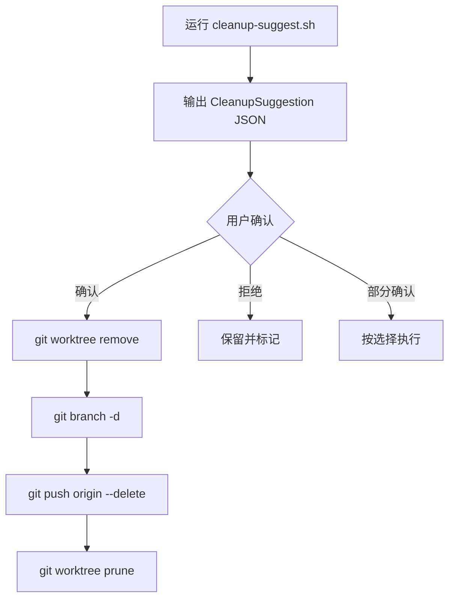

# Git 废弃分支清理

## 概述

废弃分支清理帮助 AI Agent 保持工作区整洁，避免陈旧 worktree 和已合并分支堆积。本技能涵盖自动检测、清理流程和约束。完整工作流总览见 [dd-git-workflow](../dd-git-workflow/SKILL.md)。

本技能按 `invocation_mode=helper` 返回调用方，不自行 Host Close。直接承接用户目标时由顶层 `standalone` 会话按 [dd-shared-ask](../dd-shared-ask/SKILL.md) 收尾。

## 自动检测项

| 检测项 | 判定条件 | 处理建议 |
|--------|---------|---------|
| 已合并分支 | `git branch --merged origin/develop` | 直接删除（本地 + 远端） |
| 陈旧 worktree | 超过 7 天无活动 commit | 提示清理 |
| 孤儿 worktree | worktree 目录已删除但元数据残留 | `git worktree prune` |
| 远程已删除分支 | 本地 tracking 分支远程已不存在 | `git remote prune origin` |

## 清理流程



## 清理约束

- **必须用户确认**：自动检测仅输出建议，不自动删除
- **保护活跃分支**：当前 checkout 的分支、develop、main 永不清理
- **保留历史**：合并过的分支删除后，merge commit 仍保留开发轨迹

## cleanup-suggest.sh 用法

**废弃清理脚本**：`../dd-ai-git-workflow/scripts/cleanup-suggest.sh`

```bash
# 用法：输出 CleanupSuggestion JSON
./../dd-ai-git-workflow/scripts/cleanup-suggest.sh [stale-days]
```

## 禁止事项

- **禁止自动清理未确认分支**：清理脚本仅输出建议，必须用户确认
