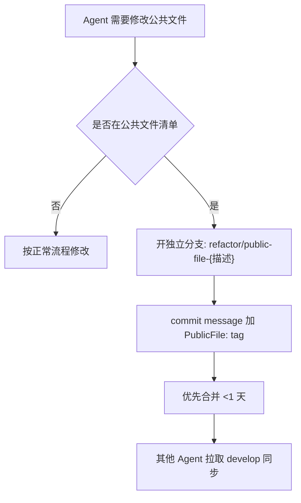

> 迁移来源：`dd-git-workflow/conflict/SKILL.md`。现作为按需 reference 使用，不参与顶层 Skill 路由。

# Git 冲突处理

## 概述

冲突处理遵循"在 feature 分支解决，禁止在 develop 上直接解决"原则。本技能涵盖冲突流程、优先级、公共文件锁机制和冲突预测。完整工作流总览见 [dd-git-workflow](../../dd-git-workflow/SKILL.md)。

本技能按 `invocation_mode=helper` 返回调用方，不自行 Host Close。直接承接用户目标时由顶层 `standalone` 会话按 [dd-workflow-runtime/ask](../../dd-workflow-runtime/references/ask.md) 收尾。

## 长分支合并策略

### 全部使用 merge

长分支合并**不引入 rebase**，原因：

- rebase 改写历史，多 Agent 协作时易导致 force push 冲突
- merge 保留真实开发轨迹，便于追溯
- AI Agent 不需要处理 rebase 引入的交互式冲突

## 长分支冲突处理流程

长分支冲突必须按以下顺序处理，**禁止直接在 develop 上解决冲突**：

```text
1. 在 feature 分支上执行 git merge origin/develop
2. 在 feature 分支解决冲突
3. 在 feature 分支提交冲突解决
4. 在 feature 分支运行合并前自检
5. 将 feature 分支合并到 develop（此时 develop 端无冲突）
```

## 冲突解决优先级

| 优先级 | 文件类型 | 处理方式 |
|--------|---------|---------|
| P0 | 公共文件（见下文） | 必须开独立分支，优先合并 |
| P1 | 跨模块接口文件 | 按模块边界拆分，分别合并 |
| P2 | 单模块内部文件 | 在 feature 分支内解决 |
| P3 | 文档、配置 | 最后合并，避免阻塞代码 |

## 公共文件锁机制

**公共文件定义**：被多个模块或多个 AI Agent 共同依赖的文件，修改会引发跨分支冲突。

典型公共文件：

- 项目级配置：`Package.swift`、`*.xcworkspace/contents.xcworkspacedata`、`project.yml`
- 共享协议：`Sources/*/Protocols.swift`、`Sources/*/Contracts.swift`
- 共享模型：`Sources/*/Models.swift`、`Sources/*/SharedTypes.swift`
- 依赖清单：`Package.resolved`、`Podfile.lock`
- 路由/注册表：`Sources/*/Router.swift`、`Sources/*/ModuleRegistry.swift`

### 公共文件清单维护

公共文件锁机制依赖可查询的清单，避免依赖 AI Agent 主观判断：

- **清单来源**：项目根目录 `.trae/public-files.txt`（若存在），每行一个 glob 模式
- **查询方式**：脚本中遍历当前修改的文件路径，对每个文件用 `git ls-files` 配合清单中的 glob 模式判断是否命中
- **默认清单**（清单文件不存在时回退）：
  - 项目级配置文件：`*.xcodeproj/project.pbxproj`、`Package.swift`、`Package.resolved`、`*.xcworkspace/contents.xcworkspacedata`、`*.entitlements`、`project.yml`
  - 共享代码与规则：`DependencyContainer.swift`、`AGENTS.md`、`CLAUDE.md`、`.trae/rules/*.md`
- **维护机制**：清单文件由项目维护者管理，AI Agent 不直接修改；新增公共文件需提 PR 由维护者审核后追加

### 公共文件修改流程



**约束**：

- 公共文件修改必须开独立分支，分支名 `refactor/public-file-{描述}`
- commit message 必须包含 `PublicFile: <文件路径>` tag
- 公共文件分支生命周期必须 <1 天，优先合并到 develop
- 禁止在 feature 分支中夹带公共文件修改

## 按模块拆分边界

按项目架构边界划分 AI Agent 职责，每个 Agent 主要负责一个模块：

| 模块类型 | Agent 职责 | 跨模块协作方式 |
|---------|-----------|---------------|
| Core 层 | 核心逻辑、协议定义 | 通过协议抽象，避免反向依赖 |
| UI 层 | 界面、交互 | 依赖 Core 层接口，不修改 Core |
| App 层 | 生命周期、依赖注入 | 组装 Core + UI，不修改业务逻辑 |
| 测试 | 测试代码 | 仅依赖公共接口，不修改实现 |

**跨模块修改规则**：

- 发现需要跨模块修改时，先在当前模块分支提交 issue 或任务记录
- 跨模块修改必须开独立分支，按模块顺序合并（Core → UI → App）
- 禁止单个 Agent 同时修改 3 个以上模块

## 冲突预测报告

每个 AI Agent 开工前必须输出冲突预测报告，包含：

1. **本分支预计修改的文件清单**（基于任务范围预估）
2. **与其他活跃分支的文件交集**（基于 `git diff` 比对）
3. **高冲突风险文件**（出现在多个活跃分支的修改清单中）
4. **建议处理顺序**（公共文件优先、按模块拆分）

**冲突预检脚本**：`scripts/conflict-predict.sh`

```bash
# 用法：输出 ConflictPredictionReport JSON
bash scripts/conflict-predict.sh [base-branch]
# severity: high（>5文件）禁止合并
# severity: medium（3-5文件）需人工确认
# severity: low（≤2文件）可合并但需标注
```

## 禁止事项

- **禁止在 develop 上直接解决冲突**：冲突必须在 feature 分支解决，develop 端应无冲突
- **禁止公共文件长期独立修改**：公共文件分支必须 <1 天合并到 develop
- **禁止跨模块边界修改**：单个 Agent 不得同时修改 3 个以上模块
- **禁止在 feature 分支中夹带公共文件修改**：公共文件必须开独立分支 `refactor/public-file-*`
- **禁止修改大量公共文件**：单次合并避免触及过多公共文件，按优先级 P0 优先处理
- **禁止已共享分支频繁 Rebase**：rebase 改写历史，多 Agent 协作时易导致 force push 冲突，长分支合并使用 merge
- **禁止用固定 sleep 掩盖合并竞态**：合并冲突必须显式解决，不得依赖时序侥幸
