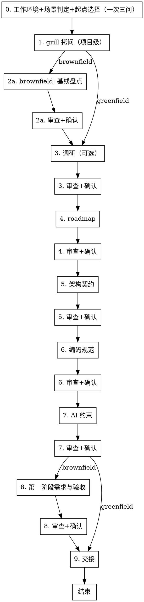
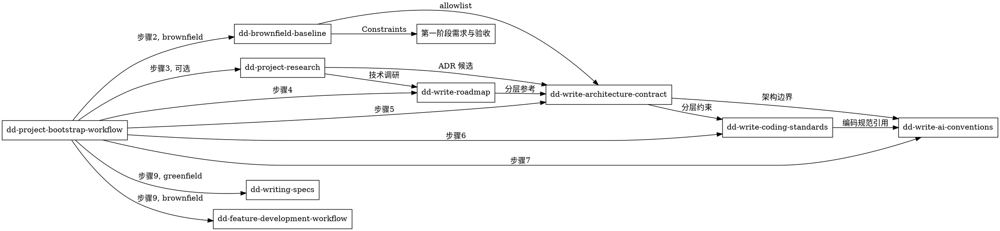

# 项目创建与迁移工作流（dd-project-bootstrap-workflow）

## 概述

**项目级文档套件是 AI 协作的根。功能级规格（dd-writing-specs）必须建立在项目级文档套件之上。**

本工作流编排 6 个子 skill，从调研、路线图、架构契约、编码规范、AI 约束到第一阶段需求与验收，产出完整项目级文档套件。**greenfield 与 brownfield 共享主干，brownfield 额外插入基线盘点与 allowlist 约束。**

**违反规则的字面意思就是违反规则的精神。**

## Priority 分层

| 优先级 | 含义 | 示例 |
|--------|------|------|
| **P0** | 绝不能违反 | brownfield 必须先基线盘点再写架构契约；greenfield 跳过第一阶段需求与验收 |
| **P1** | 尽量遵守 | 9 步顺序执行；每步审查 + 确认；HARD-GATE 前置断言 |
| **P2** | 建议 | docs 治理目录结构；historys 触发时机 |

## 何时使用

- 创建新项目（greenfield）：从零开始，需要项目级文档套件
- 迁移老项目（brownfield）：已有代码，需要基线盘点 + 文档套件重建
- 用户提到"创建新项目"、"迁移老项目"、"项目脚手架"、"project bootstrap"
- 项目缺少 AGENTS.md / 路线图 / 架构契约 / 编码规范中的多项
- AI 代理规则散落，无统一入口

**不适用：** 单个功能开发（用 dd-feature-development-workflow）、bug 修复（用 dd-bug-fix-workflow）、纯文档修改、已有项目级文档套件只需微调

## 全局规则

**通用规则**（结构化询问、null 输入重问、文档规则优先、提交边界、worktree 选择模板）遵循 [dd-shared-ask](../dd-shared-ask/SKILL.md)。

## docs 治理规范（项目级，本 skill 内嵌）

### 目录结构

```
docs/
├── planning/              # 项目级规划（路线图、功能列表、技术调研）
├── phases/                # 阶段文档（阶段需求与验收、设计、测试、实现、基线盘点）
│   └── P{N}_{阶段名}/
├── architecture/          # 架构契约与 ADR
│   ├── 全局架构契约.md
│   ├── ADR索引.md
│   └── adr/               # 单个 ADR 文件
│       └── {NNN}_{主题}.md
└── historys/              # 历史记录（变更摘要 + 审查记录）
    └── YYYY-MM-DD-{文档名}-{修改摘要|审查记录}.md
```

### 命名规范

- 阶段文档：`P{N}_{NN}_{文档名}.md`（如 `P0_01_阶段需求与验收.md`）
- 功能文档：`F{N}_{功能名}_{文档类型}.md`（如 `F1_2_设计规范.md`）
- ADR 文件：`{NNN}_{主题}.md`（如 `0004_BackendBoundary.md`）
- historys 文件：`YYYY-MM-DD-{文档名}-{类型}.md`（类型：修改摘要 / 审查记录）

### 版本记录格式

- 文档头部：`> 最后更新：YYYY-MM-DD | 版本：vX.Y`
- 文末：版本记录列表（版本 / 日期 / 变更摘要）

### historys 触发时机

以下变更必须追加 historys 记录：

- 架构决策（ADR 批准 / 修订 / 废弃）
- 关键 docs（路线图 / 架构契约 / 编码规范 / AI 约束）变更
- 阶段合同（第一阶段需求与验收）变更
- 审查记录（每文档审查后写入）

**功能设计、实现计划变更**由 dd-writing-specs 触发，不在本 skill 范围。

## 流程



<HARD-GATE>
严格按 0→1→2→3→4→5→6→7→8→9 顺序执行。每进入下一步前，必须自查"上一步产物已在 git 历史中"（`git log --oneline -1` 可见对应 commit）。未提交则禁止进入下一步，先补提交。

**greenfield 跳过步骤 2（基线盘点）与步骤 8（第一阶段需求与验收）**，直接从步骤 1 进入步骤 3，步骤 7 完成后进入步骤 9。

**brownfield 必须执行步骤 2 与步骤 8**，不得跳过。
</HARD-GATE>

## 步骤 0：工作环境 + 场景判定 + 起点选择（一次三问）

进入步骤 1 前，必须使用 `AskUserQuestion` 一次性询问三个问题：

### 问题 1：工作环境

- 选项 1（推荐）：新建隔离工作树（基于 `origin/develop`，分支命名 `docs/project-bootstrap`）
- 选项 2：在当前 worktree 工作

处理规则遵循 [dd-shared-ask](../dd-shared-ask/SKILL.md) 的「工作环境询问」模板。

### 问题 2：场景判定（greenfield / brownfield）

**自动检测**：扫描当前 worktree 是否存在产品代码（>=1 个源文件，非脚手架/模板）。

- 选项 1：greenfield（无产品代码）
- 选项 2（自动建议）：brownfield（检测到产品代码）
- 选项 3：用户覆盖（如想重新做基线盘点）

**brownfield 判定标准**：代码存在（>=1 个源文件，非脚手架/模板）即 brownfield。

### 问题 3：起点选择

- 选项 1（推荐）：从步骤 1 grill 开始（完整流程）
- 选项 2：从步骤 2 基线盘点开始（仅 brownfield，跳过 grill）
- 选项 3：从步骤 3 调研开始
- 选项 4：从步骤 4 roadmap 开始（假设调研已完成）

**起点选择后**，按依赖顺序补全前置步骤的产物（若用户跳过某步，需在 grill 阶段确认跳过理由）。

## 步骤 1：grill 拷问（项目级）

针对项目级情况进行 grill（一次一问），覆盖：

1. 项目核心目标是什么？（一句话）
2. 目标平台与最低版本？
3. 技术栈选型？（语言/框架/工具链）
4. 阶段如何划分？（P0 MVP / P1 扩展 / P2 稳定性...）
5. AI 协作偏好？（使用的 AI 工具、会话交互规则）
6. 是否有已知技术风险或外部依赖约束？
7. brownfield 项目：现有代码规模与对外能力？（仅 brownfield）

**grill 完成后**，将项目级结论记录到临时笔记（`docs/planning/.grill-notes.md`），供后续子 skill 引用。

## 步骤 2：brownfield 基线盘点（仅 brownfield）

调用 [dd-brownfield-baseline](../dd-brownfield-baseline/SKILL.md)。

**产出**：
- docs/phases/P-1_基线盘点/能力清单.md
- docs/phases/P-1_基线盘点/使用关系清单.md
- docs/phases/P-1_基线盘点/保留适配替换矩阵.md
- docs/phases/P-1_基线盘点/Characterization_Test清单.md
- 扩展：平台与构建矩阵.md、历史文档矩阵.md（按项目复杂度）

**审查**：调用 [dd-shared-subagent](../dd-shared-subagent/SKILL.md) 三子代理并行审查（完整性 / 分类合理性 / 一致性）。

**确认**：调用 [dd-shared-ask](../dd-shared-ask/SKILL.md) 一次一问确认。

**HARD-GATE**：审查记录写入 `docs/historys/YYYY-MM-DD-基线盘点-审查记录.md`，commit 后进入步骤 3。

## 步骤 3：调研（可选）

调用 [dd-project-research](../dd-project-research/SKILL.md)。

**产出**：
- docs/planning/技术调研.md
- 可选：docs/architecture/adr-candidates/{主题}.md

**审查 + 确认 + HARD-GATE**：同步骤 2。

**跳过条件**：用户在步骤 0 选择"从 roadmap 开始"且已有调研结论，可在 grill 阶段确认跳过。

## 步骤 4：roadmap

调用 [dd-write-roadmap](../dd-write-roadmap/SKILL.md)。

**产出**：
- docs/planning/路线图.md（混合风格：阶段 P0/P1 + 每阶段 Goal/IN/OUT/Exit Gate）
- docs/planning/功能列表.md（功能 F0/F1 + 验证标准 + 依赖 + 状态）

**brownfield 额外**：功能列表标注"已实现/未实现/部分实现"状态（基于步骤 2 的 Characterization Test）。

**审查 + 确认 + HARD-GATE**：同步骤 2。

## 步骤 5：架构契约

调用 [dd-write-architecture-contract](../dd-write-architecture-contract/SKILL.md)。

**产出**：
- docs/architecture/全局架构契约.md（分层结构 + 依赖方向 + 不变量 + 禁止依赖方向 + ADR 流程）
- docs/architecture/ADR索引.md
- 可选：docs/architecture/adr/{NNN}_{主题}.md

**brownfield 额外**：全局架构契约含 Public Compatibility Surface allowlist（基于步骤 2 的保留分类，只减不增）。

**扩展可选**：UI 框架分区（如"必须 AppKit / 允许 SwiftUI"）。

**审查 + 确认 + HARD-GATE**：同步骤 2。

## 步骤 6：编码规范

调用 [dd-write-coding-standards](../dd-write-coding-standards/SKILL.md)。

**产出**：
- docs/CODING_STANDARDS.md（语言风格 + 文档注释 + 日志 + 并发 + 错误处理 + 魔术数字 + 测试规范 + 验证命令）
- 可选：.swiftlint.yml / .pylintrc / .eslintrc 等 lint 配置

**审查 + 确认 + HARD-GATE**：同步骤 2。

## 步骤 7：AI 约束

调用 [dd-write-ai-conventions](../dd-write-ai-conventions/SKILL.md)。

**产出**：
- AGENTS.md（必含，共享 AI 代理规则主入口）
- 可选：CLAUDE.md + .trae/rules/*.md（docs.md / git-commit-message.md / 语言规则 / 测试规则）

**审查 + 确认 + HARD-GATE**：同步骤 2。

## 步骤 8：第一阶段需求与验收（仅 brownfield）

**greenfield 跳过此步骤**，直接进入步骤 9。

**brownfield 必写**，作为阶段合同承载保留/适配/替换矩阵与 ADR 准入约束。

**产出**：docs/phases/P0_{阶段名}/P0_01_阶段需求与验收.md

**结构**（必含 8 节 + 可选 4 节）：
- 必含：Goals / Scope / FR / NFR / Constraints / AC / Out of Scope / Decision Freedom
- 可选：Background / Problem Statement / Terminology / Future Considerations

**约束来源**：
- FR 基于步骤 4 roadmap 的 P0 阶段功能
- Constraints 引用步骤 5 的不变量与步骤 2 的保留分类
- AC 覆盖步骤 2 的 Characterization Test 行为基线

**审查 + 确认 + HARD-GATE**：同步骤 2。

## 步骤 9：交接

### greenfield 出口

项目级文档套件就绪：
- docs/planning/路线图.md + 功能列表.md
- docs/architecture/全局架构契约.md + ADR索引.md
- docs/CODING_STANDARDS.md
- AGENTS.md

**交接**：调用 [dd-writing-specs](../dd-writing-specs/SKILL.md) 写第一个功能规格套件（需求 + 设计 + 视觉原型 + 测试用例）。

### brownfield 出口

项目级文档套件 + 阶段合同就绪：
- 上述 greenfield 全部产物
- docs/phases/P-1_基线盘点/*.md
- docs/phases/P0_{阶段名}/P0_01_阶段需求与验收.md

**交接**：调用 [dd-feature-development-workflow](../dd-feature-development-workflow/SKILL.md) 推进阶段实现。

## skill 调用协议

- **集中调度**：本流程 skill 集中调度 6 个子 skill，保证流程完整性（HARD-GATE）
- **独立触发**：每个子 skill 可独立触发（用户可直接调用 dd-write-roadmap 等），但独立触发时不保证流程完整性
- **子 skill 内部 grill**：每个子 skill 有自己的 grill 环节（针对自身产出），本流程 skill 的步骤 1 grill 是项目级

## 与其他 skill 的关系



**共享依赖**：
- [dd-shared-ask](../dd-shared-ask/SKILL.md)：结构化询问 + worktree 选择
- [dd-shared-subagent](../dd-shared-subagent/SKILL.md)：三子代理并行审查
- [dd-shared-state](../dd-shared-state/SKILL.md)：状态持久化 + 上下文恢复
- [dd-git-workflow](../dd-git-workflow/SKILL.md)：Git 操作规范

## 输出要求

- 文件名：按 docs 治理命名规范
- 格式：Markdown，层级标题
- 文档头部：`> 最后更新：YYYY-MM-DD | 版本：vX.Y`
- 文末：版本记录列表
- 中文标点（，。！？：；），英文术语保持原文
- 不使用 emoji

## 验证清单

完成前自查：

- [ ] 步骤 0 一次三问已完成（工作环境 + 场景 + 起点）
- [ ] 步骤 1 项目级 grill 笔记已记录
- [ ] brownfield：步骤 2 基线盘点 4 核心产物齐全
- [ ] 步骤 4 路线图 + 功能列表齐全
- [ ] 步骤 5 全局架构契约 + ADR 索引齐全
- [ ] brownfield：架构契约含 Public Compatibility Surface allowlist
- [ ] 步骤 6 CODING_STANDARDS.md 齐全
- [ ] 步骤 7 AGENTS.md 齐全
- [ ] brownfield：步骤 8 第一阶段需求与验收 8 必含节齐全
- [ ] greenfield：跳过步骤 2 与步骤 8
- [ ] 每步审查记录写入 docs/historys/
- [ ] 每步产物已 git commit
- [ ] docs/ 目录结构符合治理规范
- [ ] 交接目标明确（greenfield → dd-writing-specs；brownfield → dd-feature-development-workflow）

**任一项失败，修订后重新验证。**

## Git 工作流合规

本技能涉及 Git 操作时，遵循 [dd-git-workflow](../dd-git-workflow/SKILL.md) 系列子技能。分支命名 `docs/project-bootstrap`，merge-only，禁止 rebase。修改公共文件加 `PublicFile` tag。
