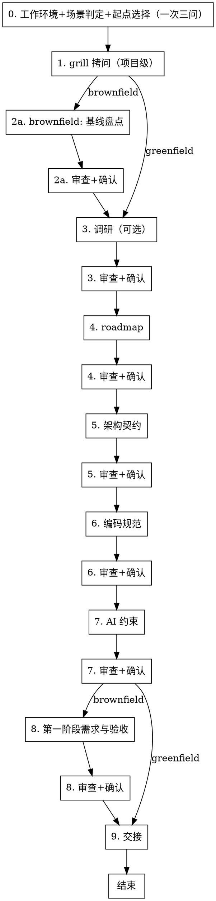
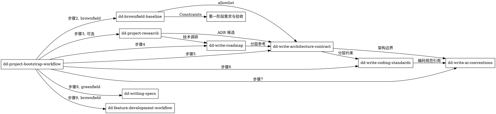

# 项目创建与迁移工作流（dd-project-bootstrap-workflow）

## 概述

**项目级文档套件是 AI 协作的根。功能级规格（dd-writing-specs）必须建立在项目级文档套件之上。**

本工作流编排 6 个子 skill，从调研、路线图、架构契约、编码规范、AI 约束到第一阶段需求与验收，产出完整项目级文档套件。**greenfield 与 brownfield 共享主干，brownfield 额外插入基线盘点与 allowlist 约束。**

**违反规则的字面意思就是违反规则的精神。**

## Priority 分层

| 优先级 | 含义 | 示例 |
|--------|------|------|
| **P0** | 绝不能违反 | brownfield 必须先基线盘点再写架构契约；greenfield 跳过第一阶段需求与验收 |
| **P1** | 尽量遵守 | 9 步顺序执行；每步审查 + 确认；HARD-GATE 前置断言 |
| **P2** | 建议 | docs 治理目录结构；historys 触发时机 |

## 何时使用

- 创建新项目（greenfield）：从零开始，需要项目级文档套件
- 迁移老项目（brownfield）：已有代码，需要基线盘点 + 文档套件重建
- 用户提到"创建新项目"、"迁移老项目"、"项目脚手架"、"project bootstrap"
- 项目缺少 AGENTS.md / 路线图 / 架构契约 / 编码规范中的多项
- AI 代理规则散落，无统一入口

**不适用：** 单个功能开发（用 dd-feature-development-workflow）、bug 修复（用 dd-bug-fix-workflow）、纯文档修改、已有项目级文档套件只需微调

## 全局规则

**通用规则**（结构化询问、null 输入重问、文档规则优先、提交边界、worktree 选择模板）遵循 [dd-shared-ask](../dd-shared-ask/SKILL.md)。

## docs 治理规范（项目级，本 skill 内嵌）

本治理规范对齐 Tidy `docs.md` 的 8 节结构，但保持语言与栈中立，适用于任何 greenfield / brownfield 项目。项目正式启动后，本节内容应抽离为仓库根目录的 `docs.md`，作为项目文档体系入口。

### 0. 文档定位

本治理规范是项目文档体系的入口，位于仓库根目录（独立后为 `docs.md`）。只负责：

- 定义根目录与 `docs/` 的目录和命名；
- 规定各类文档的唯一维护位置；
- 规定阶段文档的创建顺序和同步规则；
- 列出当前阶段文档和产物的编写顺序。

本规范不复制路线图中的功能优先级、模块分解与状态机定义，也不承载具体需求、设计、测试或编码规范。

发生冲突时按以下优先级处理：

```text
项目路线图
  ↓
全局架构契约与 ADR
  ↓
阶段需求与验收
  ↓
阶段设计文档
  ↓
阶段测试用例表
  ↓
阶段实现计划
  ↓
阶段产物与历史归档
```

下游文档发现上游不完整或冲突时，必须先修正上游，不得在下游另写一套规则。

### 1. 目标目录

按 Phase 聚合文档。目录和文件仅在实际需要时创建，不提前生成空壳。

```text
.                                       # 仓库根目录
├── docs.md                              # 本文件，文档治理与目录规范（项目启动后从 skill 内嵌抽离）
├── AGENTS.md                            # AI Agent 执行纪律、任务模板与输出格式
├── {lint 配置}                          # 如 .swiftlint.yml / .pylintrc / .eslintrc，置于根目录便于 CLI 读取
└── docs/
    ├── planning/                        # 项目级规划
    │   ├── 路线图.md
    │   ├── 功能列表.md
    │   └── 技术调研.md
    ├── architecture/                    # 架构契约与 ADR
    │   ├── 全局架构契约.md
    │   ├── ADR索引.md
    │   └── adr/
    │       └── ADR-NNNN-主题.md
    ├── phases/                          # 阶段文档
    │   ├── P{n}_{准备阶段名}/            # 准备阶段（P 前缀）
    │   │   ├── P{n}_01_阶段需求与验收.md
    │   │   ├── P{n}_02_设计文档.md
    │   │   ├── P{n}_03_测试用例表.md
    │   │   ├── P{n}_04_实现计划.md
    │   │   └── artifacts/
    │   └── F{功能编号}_{简短功能名}/      # 功能阶段（F 前缀）
    │       ├── F{n}_01_阶段需求与验收.md
    │       ├── F{n}_02_设计文档.md
    │       ├── F{n}_03_测试用例表.md
    │       ├── F{n}_04_实现计划.md
    │       └── artifacts/
    ├── standards/                       # 编码与工具规范
    │   ├── CODING_STANDARDS.md
    │   ├── git-commit-message.md
    │   └── {语言/测试规则}.md            # 如 swift-rules.md / xctest-rules.md / python-rules.md
    ├── specs/                           # 已实现行为规格（按需创建）
    │   └── 已实现行为规格.md
    └── historys/                        # 历史归档（变更摘要 + 审查记录 + 失效草案）
        └── YYYY-MM-DD-{文档名}-{修改摘要|审查记录}.md
```

目录规则：

- `docs.md` 与 `AGENTS.md` 位于仓库根目录；前者面向人类协作者，后者面向 AI Agent；
- lint 配置位于根目录，便于 CLI 与 IDE 直接读取；
- `architecture/` 在首批架构契约或 ADR 形成时创建；
- `P{n}_{准备阶段名}/` 是准备阶段目录，承载技术验证、项目骨架或基线盘点，**不参与 F 功能编号**；brownfield 的基线盘点使用 `P-1_基线盘点/` 或 `P0_基线盘点/`，由项目命名习惯决定；
- 功能阶段目录在该功能的需求合同成为当前 Gate 输入时按需创建；仅创建下一功能的 `F{n}_01_阶段需求与验收.md` 属于阶段准备，不代表下一功能已经开始；
- 功能正式开始后，才允许在对应目录继续创建设计文档、测试用例表和实现计划；
- `artifacts/` 保存清单、矩阵、基线和证据，**不新增需求或架构规则**；
- `standards/` 必须按项目实际代码和工具链重新基线后创建，不照搬其他项目规则；
- `AGENTS.md` 在 AI 工作纪律稳定后创建；`specs/已实现行为规格.md` 在首批外部行为获批准时创建，均不提前生成空壳；
- `historys/` 只保存失效草案和历史输入，不作为当前规则来源。

### 2. 单一事实来源（SSOT）

| 信息 | 唯一维护位置 |
|---|---|
| 阶段战略目标、边界、依赖、状态、关键路径和路线级 Gate | `docs/planning/路线图.md` |
| 文档目录、命名、创建顺序和同步规则 | `docs.md`（仓库根目录） |
| AI Agent 执行纪律、任务模板和输出格式 | `AGENTS.md` |
| 已批准的跨阶段架构不变量 | `docs/architecture/全局架构契约.md` |
| 单个架构决策及理由 | `docs/architecture/adr/ADR-NNNN-主题.md` |
| 准备阶段范围、FR、NFR、兼容性矩阵和验收标准 | `docs/phases/P{n}_{准备阶段名}/P{n}_01_阶段需求与验收.md` |
| 准备阶段模块职责、数据流、错误和回退 | `docs/phases/P{n}_{准备阶段名}/P{n}_02_设计文档.md` |
| 准备阶段 Acceptance Criteria 覆盖和证据 | `docs/phases/P{n}_{准备阶段名}/P{n}_03_测试用例表.md` |
| 准备阶段文件、任务、命令和回滚 | `docs/phases/P{n}_{准备阶段名}/P{n}_04_实现计划.md` |
| 准备阶段清单、矩阵和阶段证据 | `docs/phases/P{n}_{准备阶段名}/artifacts/` |
| 功能阶段详细范围、FR、NFR 和可测验收标准 | `docs/phases/F{n}_{简短功能名}/F{n}_01_阶段需求与验收.md` |
| 功能阶段模块职责、数据流、错误和回退 | `docs/phases/F{n}_{简短功能名}/F{n}_02_设计文档.md` |
| 功能阶段 Acceptance Criteria 覆盖和证据 | `docs/phases/F{n}_{简短功能名}/F{n}_03_测试用例表.md` |
| 功能阶段文件、任务、命令和回滚 | `docs/phases/F{n}_{简短功能名}/F{n}_04_实现计划.md` |
| 功能阶段清单、矩阵和阶段证据 | `docs/phases/F{n}_{简短功能名}/artifacts/` |
| 编码规范、提交规范、语言与测试规则 | `docs/standards/` 对应文件 |
| 项目已发布、外部可观察行为 | `docs/specs/已实现行为规格.md` |
| 被取代但仍需追溯的文档 | `docs/historys/` |
| 项目功能优先级、模块组织、状态机、视觉规格 | `docs/planning/功能列表.md` |
| 市场定位、竞品、风险、商业模式（如适用） | `docs/planning/技术调研.md` 或独立市场调研文档 |

同一事实不得在多份文档中复制维护。引用上游时使用编号、表格 ID 或相对链接。

路线图中的 Goal、IN、OUT 和 Exit Gate 定义阶段的战略目标、边界和路线级准入条件。阶段需求中的 Scope 是对路线图 IN 的细化，Out of Scope 是对路线图 OUT 的细化；阶段需求可以在该边界内继续定义 FR、NFR 和 Acceptance Criteria，但不得扩大、缩小或改变路线图边界。需要改变边界时必须先修改路线图。

#### 2.1 已有文档的事实归属（brownfield 专用）

brownfield 项目启动时通常已有散落文档。基线盘点阶段（步骤 2）必须梳理已有文档，明确：

| 已有文档 | 唯一负责 | 暂由其承载但应迁移的事实 |
|---|---|---|
| {已有文档 A} | {该文档负责的核心事实} | {应迁移到新目录结构的事实清单} |
| {已有文档 B} | {该文档负责的核心事实} | {应迁移到新目录结构的事实清单} |

迁移时机：在新目录结构正式创建时一次性抽离，不重复维护；迁移前以已有文档为唯一来源。

### 3. 阶段文档

#### 3.1 命名与顺序

`docs/phases/` 下有两类目录：

- **准备阶段** `P{n}_{准备阶段名}/`：以 `P` 前缀标识，承载技术验证、项目骨架或基线盘点，**不参与功能编号**；后续如有新的准备阶段可继续使用 `P{n}_` 前缀；
- **功能阶段** `F{功能编号}_{简短功能名}/`：以 `F` 前缀标识，每个目录对应一个功能。

```text
docs/phases/P{n}_{准备阶段名}/          # 准备阶段（P 前缀）
docs/phases/F{功能编号}_{简短功能名}/   # 功能阶段（F 前缀）
```

功能编号必须与 `docs/planning/功能列表.md` 中的 F 编号一致；目录中的简短功能名允许使用稳定缩写，不要求与功能列表标题逐字一致。阶段目录一经建立，除必要情况不得因功能列表措辞调整而重命名。

> **命名说明**：`docs/phases/` 下的 `P{n}` 指准备阶段，`F{n}` 既指功能编号也指功能开发阶段；`docs/planning/功能列表.md` 中的 `P0/P1/P2` 指**功能优先级**（Priority），是独立维度。

准备阶段与功能阶段均按固定顺序创建核心文档（`{X}` 为阶段前缀，准备阶段用 `P{n}`，功能阶段用 `F{n}`）：

```text
{X}_01_阶段需求与验收.md
  ↓
{X}_02_设计文档.md
  ↓
{X}_03_测试用例表.md
  ↓
{X}_04_实现计划.md
  ↓
编码或功能验证
```

涉及用户可见 UI 行为时，在设计之后增加 `{X}_02a_视觉原型.html`；纯基础设施功能（窗口枚举、状态机、算法等）不创建视觉原型。

阶段核心文档命名规则：

- 阶段根目录下的核心文档（`01_阶段需求与验收.md`、`02_设计文档.md`、`03_测试用例表.md`、`04_实现计划.md`）和视觉原型统一加 `{阶段前缀}_` 前缀，准备阶段如 `P0_01_阶段需求与验收.md`，功能阶段如 `F0_01_阶段需求与验收.md`；
- 每份核心文档对应的审查/审核记录（`*_审查记录.md`、`*_审核记录.md`）统一归档到 `docs/historys/`，加 `{阶段前缀}_` 前缀，例如 `P0_01_阶段需求与验收_审查记录.md`；**不在阶段目录下保留审查记录**；
- `artifacts/` 子目录下的文件不加阶段前缀。

#### 3.2 职责边界

| 文档 | 回答什么 | 不包含什么 |
|---|---|---|
| 需求与验收 | Goal、Scope、Out of Scope、需求、Acceptance Criteria、决策自由度 | 类名、方法、字段、文件和实现步骤 |
| 设计文档 | 模块职责、依赖、数据流、状态、错误和回退 | 完整实现代码和逐文件任务 |
| 测试用例表 | AC 对应的测试 ID、覆盖状态、证据和环境 | 新需求和未经批准的产品语义 |
| 实现计划 | 文件、任务、测试、命令、提交边界和回滚 | 未批准阶段和未来抽象 |
| Artifact | 已执行工作的清单、矩阵、快照和证据 | 新需求、阶段状态和架构规则 |

测试用例表必须：

- 标记 `COVERED`、`PARTIAL`、`MISSING` 或 `DEFERRED`；
- 区分 Unit、Characterization、Corpus、Golden、Compatibility、Performance、Fuzz 和 UI 证据；
- 区分观测行为与批准的产品语义；
- 对 `KNOWN_DEFECT`、`TOLERATED_COMPATIBILITY` 和 `REVIEW` 明确处置；
- 不把单个兼容性测试输出当作绝对真值。

### 4. 阶段推进顺序

greenfield 项目通常先经准备阶段（如 `P0_技术探针`）完成技术验证与项目骨架，再按功能优先级与依赖关系推进开发，每个功能即一个开发阶段。brownfield 项目通常以 `P-1_基线盘点` 或 `P0_基线盘点` 作为首个准备阶段。

```text
P-1_基线盘点（仅 brownfield：legacy 能力清单 + 保留/适配/替换矩阵 + Characterization Test）
  ↓ Exit Gate：基线已盘点，allowlist 已冻结
P0_技术探针（可选，greenfield 必含；技术验证 + 项目骨架）
  ↓ Exit Gate：技术可行性已证明，骨架可编译
F0_{首个功能}（最低风险，基础能力）
  ↓
F1_{次功能}
  ↓
... 后续功能按路线图依赖推进
```

#### 4.1 单阶段推进流程

准备阶段与功能阶段均按以下顺序创建文档与产物（`{X}` 为阶段前缀，准备阶段 `P{n}`，功能阶段 `F{n}`）：

1. `docs/phases/{X}_{简短名}/{X}_01_阶段需求与验收.md`；
2. `docs/phases/{X}_{简短名}/{X}_02_设计文档.md`；
3. `docs/phases/{X}_{简短名}/{X}_03_测试用例表.md`；
4. `docs/phases/{X}_{简短名}/{X}_04_实现计划.md`；
5. 编码实现与功能验证；
6. 按需生成 artifacts（兼容性矩阵、性能数据、证据等）。

#### 4.2 架构与 ADR 时机

- `docs/architecture/全局架构契约.md` 在准备阶段完成首批验证后编写雏形，首个功能阶段验证后冻结；
- 首批 ADR 在准备阶段期间探索、首个功能阶段期间验证后冻结；
- 后续功能按需产出新 ADR。

#### 4.3 阶段间依赖规则

- 准备阶段 Exit Gate 通过后，才允许创建首个功能阶段的 `F0_01_阶段需求与验收.md`；
- 当前功能 `{X}_01_阶段需求与验收.md` 批准后，才允许开始 `{X}` 的编码实现；
- 当前功能 Exit Gate 通过后，才允许创建下一功能 `{X+1}_01_阶段需求与验收.md`；
- 默认情况下，Exit Gate 前不得创建下一阶段正式需求文档；
- 用户明确要求提前规划时，可以创建 Draft，但 Draft 不属于当前权威链，不得作为编码依据。

#### 4.4 brownfield 基线盘点（P-1_基线盘点）

brownfield 项目以基线盘点作为首个准备阶段，集中承载以下验证与骨架，不参与 F 功能编号：

| 验证项 | 类别 | 说明 |
|---|---|---|
| 现有代码能力清单 | 清单 | 模块/组件/对外能力 |
| 使用关系清单 | 清单 | 内部依赖 + 外部调用方 |
| 保留/适配/替换矩阵 | 矩阵 | 每项能力的处置分类 |
| Characterization Test 清单 | 测试 | 锁定现有行为的测试分类 |
| 平台与构建矩阵（按需） | 矩阵 | 多平台/多版本构建状态 |
| 历史文档矩阵（按需） | 矩阵 | 已有文档的事实归属与迁移计划 |

基线盘点 Exit Gate 通过后，后续功能阶段可直接基于已盘点的 allowlist 进入实现，无需重复盘点。

### 5. Standards 后续规则

参考成熟项目的"短工具入口 → 详细权威规范 → 自动验证"分层可以复用，但具体规则不能照搬。

项目当前事实包括（由步骤 1 grill 与步骤 3 调研确定）：

- 目标平台与最低版本；
- 开发语言与工具链；
- 模块/target 划分与依赖方向；
- UI 框架选型（如适用）；
- 日志子系统；
- 测试框架；
- lint 工具与配置。

因此本项目在步骤 6（编码规范）创建 `docs/standards/`，按需编写以下文件：

1. `docs/standards/CODING_STANDARDS.md`：标准入口、跨主题原则和详细规范索引；
2. `docs/standards/git-commit-message.md`：提交格式和 scope 的唯一来源；
3. `docs/standards/{语言规则}.md`：如 `swift-rules.md` / `python-rules.md`，命名规则、并发模型、框架使用约定；
4. `docs/standards/{测试规则}.md`：如 `xctest-rules.md` / `pytest-rules.md`，测试平台矩阵和测试纪律。

工具专用规则只保留阅读入口和不可省略的硬约束，不复制完整标准。

#### 5.1 Lint 硬约束

**任何包含代码的 Git 提交前必须运行项目约定的 lint 检查，并修复所有 error 级违规。**

- 提交前命令：项目 lint 命令（如 `swiftlint lint --strict` / `ruff check .` / `eslint .`）；
- `warning` 级违规应在同一提交内修复，确实无法修复时必须在 commit message 中显式说明豁免理由；
- CI 流水线必须将 lint 设为强制门禁；
- 第三方依赖与生成代码允许通过 `excluded` 排除。

### 6. 通用编写规则

#### 6.1 元数据和版本

Markdown 标题后必须包含：

```text
> 最后更新：YYYY-MM-DD | 版本：vX.Y 或 vX.Y.Z
> 文档状态：草案 / 审核中 / 已批准 / 已实现 / 已取代 / 归档
```

- 内容、范围、接口或验收标准变化时更新版本；
- 文档末尾维护列表格式版本记录（面向 AI Agent 的文档如 `AGENTS.md` 除外，仅更新头部元数据即可）；
- 文档状态不得替代路线图中的阶段状态；
- 当前权威文件名不加 `final`、`new`、`最新版` 或版本号；
- 只有历史归档文件保留原始版本后缀。

#### 6.2 链接、语言和图表

- 仓库内使用相对链接，不硬编码个人电脑绝对路径；
- 根目录的 `docs.md`、`AGENTS.md` 引用 `docs/` 下文件时使用 `docs/...` 相对路径；
- 跨仓库内容使用"仓库名 + 仓库内路径"描述；
- 不创建指向尚不存在文件的 Markdown 链接，规划路径使用代码格式；
- 中文正文使用中文标点，英文术语保持原文；
- Mermaid 用于流程、状态、时序和依赖图；
- Mermaid 节点含空格、括号或标点时使用引号；
- 图表必须有文字解释，不能成为唯一规范来源；
- 用户决策问题必须使用 `AskUserQuestion` 工具给出 2~4 个结构化选项，不得用纯文本提问中断会话。

#### 6.3 同步规则

| 变更来源 | 必须同步检查 |
|---|---|
| 路线图阶段、依赖或 Gate | 当前阶段需求和受影响链接 |
| 需求 Goal、IN、OUT 或 AC | 设计、测试用例表和实现计划 |
| 设计职责、数据流、接口或回退 | 测试用例表、实现计划、架构契约和 ADR |
| UI 可见行为 | 视觉原型、测试用例表和已实现行为规格 |
| 测试或覆盖状态 | 测试用例表和阶段 artifacts |
| 兼容性矩阵或兼容黑名单 | 测试用例表、失败降级设计和风险章节 |
| 已批准架构不变量或待冻结架构主题 | 全局架构契约、ADR、路线图和受影响设计 |
| Pilot 验证结果（如适用） | 路线图阶段、商业模式判断和后续阶段范围 |

修改后必须检查：

1. 是否产生两个状态来源；
2. 上下游是否矛盾；
3. 相对链接是否有效；
4. 版本和版本记录是否更新；
5. 测试覆盖状态是否真实；
6. 是否把 legacy bug 或兼容性缺陷误写成批准契约。

### 7. History、ADR 与 Git

| 机制 | 记录内容 |
|---|---|
| 文档版本记录 | 本文档各版本改了什么 |
| ADR | 为什么选择或改变跨阶段架构决定 |
| Git commit | 哪些文件在何时发生了变化 |
| `docs/historys/` | 已失效但仍需追溯的完整历史输入 |

本项目不要求每个文档 commit 再创建一份重复 history 日志。以下主题变化时必须写 ADR（greenfield 由步骤 1 grill 确认，brownfield 由步骤 2 基线盘点 + 步骤 1 grill 确认）：

- 依赖方向（模块/target 划分）；
- 激活模型（单热键 Toggle vs 多激活方式）；
- 数据范围（当前可见 vs 跨域聚合）；
- 目标判定策略；
- 还原/撤销语义；
- 事件拦截生命周期（仅激活时启用 vs 全程常驻）；
- 外部 API 失败处理策略；
- UI 框架选型（如 AppKit vs SwiftUI）；
- 关键算法选型；
- Pilot 验证后的默认作用域调整（如适用）。

文档提交使用 Conventional Commits：

```text
docs(<scope>): <简洁祈使语气主题>
```

`<scope>` 可选：`governance`、`roadmap`、`architecture`、`adr`、`phase-P{n}`、`phase-F{n}`、`standards`、`spec`、`history`、`agents`。一个提交只处理一个可独立审查的文档主题。详细规则由 `docs/standards/git-commit-message.md` 维护。

### 8. 阅读顺序

AI Agent 开始任务前：

1. 先读 `docs/planning/路线图.md`，确认当前阶段和范围；
2. 创建或修改文档时再读根目录 `docs.md`；
3. 执行编码或调试任务时读根目录 `AGENTS.md`，遵守其中的任务模板和输出格式；
4. 按需求、设计、测试用例表、实现计划的顺序读取当前阶段文档；
5. 涉及功能优先级、模块组织或状态机细节时读取 `docs/planning/功能列表.md`；
6. 涉及技术调研、风险或外部依赖时读取 `docs/planning/技术调研.md`；
7. 只读取与任务直接相关的 artifact、代码和测试；
8. 涉及已批准架构不变量或待冻结架构主题时读取全局架构契约和相关 ADR；
9. 上游文档缺失或未批准时停止编码，先补齐上游；
10. 不以历史归档、旧草案或单个测试现状覆盖当前批准文档；
11. 涉及"浏览器中展示"的需求直接执行，不询问用户。

## 流程



<HARD-GATE>
严格按 0→1→2→3→4→5→6→7→8→9 顺序执行。每进入下一步前，必须自查"上一步产物已在 git 历史中"（`git log --oneline -1` 可见对应 commit）。未提交则禁止进入下一步，先补提交。

**greenfield 跳过步骤 2（基线盘点）与步骤 8（第一阶段需求与验收）**，直接从步骤 1 进入步骤 3，步骤 7 完成后进入步骤 9。

**brownfield 必须执行步骤 2 与步骤 8**，不得跳过。
</HARD-GATE>

## 步骤 0：工作环境 + 场景判定 + 起点选择（一次三问）

进入步骤 1 前，必须使用 `AskUserQuestion` 一次性询问三个问题：

### 问题 1：工作环境

- 选项 1（推荐）：新建隔离工作树（基于 `origin/develop`，分支命名 `docs/project-bootstrap`）
- 选项 2：在当前 worktree 工作

处理规则遵循 [dd-shared-ask](../dd-shared-ask/SKILL.md) 的「工作环境询问」模板。

### 问题 2：场景判定（greenfield / brownfield）

**自动检测**：扫描当前 worktree 是否存在产品代码（>=1 个源文件，非脚手架/模板）。

- 选项 1：greenfield（无产品代码）
- 选项 2（自动建议）：brownfield（检测到产品代码）
- 选项 3：用户覆盖（如想重新做基线盘点）

**brownfield 判定标准**：代码存在（>=1 个源文件，非脚手架/模板）即 brownfield。

### 问题 3：起点选择

- 选项 1（推荐）：从步骤 1 grill 开始（完整流程）
- 选项 2：从步骤 2 基线盘点开始（仅 brownfield，跳过 grill）
- 选项 3：从步骤 3 调研开始
- 选项 4：从步骤 4 roadmap 开始（假设调研已完成）

**起点选择后**，按依赖顺序补全前置步骤的产物（若用户跳过某步，需在 grill 阶段确认跳过理由）。

## 步骤 1：grill 拷问（项目级）

针对项目级情况进行 grill（一次一问），覆盖：

1. 项目核心目标是什么？（一句话）
2. 目标平台与最低版本？
3. 技术栈选型？（语言/框架/工具链）
4. 阶段如何划分？（P0 MVP / P1 扩展 / P2 稳定性...）
5. AI 协作偏好？（使用的 AI 工具、会话交互规则）
6. 是否有已知技术风险或外部依赖约束？
7. brownfield 项目：现有代码规模与对外能力？（仅 brownfield）

**grill 完成后**，将项目级结论记录到临时笔记（`docs/planning/.grill-notes.md`），供后续子 skill 引用。

## 步骤 2：brownfield 基线盘点（仅 brownfield）

调用 [dd-brownfield-baseline](../dd-brownfield-baseline/SKILL.md)。

**产出**（清单/矩阵归档到 `artifacts/`，遵循 docs 治理 3.1）：
- docs/phases/P-1_基线盘点/artifacts/能力清单.md
- docs/phases/P-1_基线盘点/artifacts/使用关系清单.md
- docs/phases/P-1_基线盘点/artifacts/保留适配替换矩阵.md
- docs/phases/P-1_基线盘点/artifacts/Characterization_Test清单.md
- 扩展：artifacts/平台与构建矩阵.md、artifacts/历史文档矩阵.md（按项目复杂度）

**审查**：调用 [dd-shared-subagent](../dd-shared-subagent/SKILL.md) 三子代理并行审查（完整性 / 分类合理性 / 一致性）。

**确认**：调用 [dd-shared-ask](../dd-shared-ask/SKILL.md) 一次一问确认。

**HARD-GATE**：审查记录写入 `docs/historys/YYYY-MM-DD-基线盘点-审查记录.md`，commit 后进入步骤 3。

## 步骤 3：调研（可选）

调用 [dd-project-research](../dd-project-research/SKILL.md)。

**产出**：
- docs/planning/技术调研.md
- 可选：docs/architecture/adr/ADR-NNNN-主题.md（候选 ADR，标记为草案状态）

**审查 + 确认 + HARD-GATE**：同步骤 2。

**跳过条件**：用户在步骤 0 选择"从 roadmap 开始"且已有调研结论，可在 grill 阶段确认跳过。

## 步骤 4：roadmap

调用 [dd-write-roadmap](../dd-write-roadmap/SKILL.md)。

**产出**：
- docs/planning/路线图.md（混合风格：阶段 P0/P1 + 每阶段 Goal/IN/OUT/Exit Gate）
- docs/planning/功能列表.md（功能 F0/F1 + 验证标准 + 依赖 + 状态）

**brownfield 额外**：功能列表标注"已实现/未实现/部分实现"状态（基于步骤 2 的 Characterization Test）。

**审查 + 确认 + HARD-GATE**：同步骤 2。

## 步骤 5：架构契约

调用 [dd-write-architecture-contract](../dd-write-architecture-contract/SKILL.md)。

**产出**：
- docs/architecture/全局架构契约.md（分层结构 + 依赖方向 + 不变量 + 禁止依赖方向 + ADR 流程）
- docs/architecture/ADR索引.md
- 可选：docs/architecture/adr/ADR-NNNN-主题.md

**brownfield 额外**：全局架构契约含 Public Compatibility Surface allowlist（基于步骤 2 的保留分类，只减不增）。

**扩展可选**：UI 框架分区（如"必须 AppKit / 允许 SwiftUI"）。

**审查 + 确认 + HARD-GATE**：同步骤 2。

## 步骤 6：编码规范

调用 [dd-write-coding-standards](../dd-write-coding-standards/SKILL.md)。

**产出**：
- docs/standards/CODING_STANDARDS.md（语言风格 + 文档注释 + 日志 + 并发 + 错误处理 + 魔术数字 + 测试规范 + 验证命令）
- docs/standards/git-commit-message.md（提交格式与 scope）
- 可选：docs/standards/{语言规则}.md、docs/standards/{测试规则}.md
- 可选：.swiftlint.yml / .pylintrc / .eslintrc 等 lint 配置（根目录）

**审查 + 确认 + HARD-GATE**：同步骤 2。

## 步骤 7：AI 约束

调用 [dd-write-ai-conventions](../dd-write-ai-conventions/SKILL.md)。

**产出**：
- AGENTS.md（必含，共享 AI 代理规则主入口，仓库根目录）
- 可选：CLAUDE.md（Claude Code 专用补充约定，仓库根目录）
- 可选：.trae/rules/*.md（Trae IDE 特定规则入口，引用 docs/standards/ 权威来源）

**审查 + 确认 + HARD-GATE**：同步骤 2。

## 步骤 8：第一阶段需求与验收（仅 brownfield）

**greenfield 跳过此步骤**，直接进入步骤 9。

**brownfield 必写**，作为阶段合同承载保留/适配/替换矩阵与 ADR 准入约束。

**产出**：`docs/phases/{X}_{阶段名}/{X}_01_阶段需求与验收.md`（`{X}` 为阶段前缀，准备阶段用 `P0`，功能阶段用 `F0`，由步骤 1 grill 确认）

**结构**（必含 8 节 + 可选 4 节）：
- 必含：Goals / Scope / FR / NFR / Constraints / AC / Out of Scope / Decision Freedom
- 可选：Background / Problem Statement / Terminology / Future Considerations

**约束来源**：
- FR 基于步骤 4 roadmap 的首阶段功能
- Constraints 引用步骤 5 的不变量与步骤 2 的保留分类
- AC 覆盖步骤 2 的 Characterization Test 行为基线

**审查 + 确认 + HARD-GATE**：同步骤 2。

## 步骤 9：交接

### greenfield 出口

项目级文档套件就绪：
- docs/planning/路线图.md + 功能列表.md（+ 可选技术调研.md）
- docs/architecture/全局架构契约.md + ADR索引.md
- docs/standards/CODING_STANDARDS.md + git-commit-message.md（+ 可选语言/测试规则）
- AGENTS.md

**交接**：调用 [dd-writing-specs](../dd-writing-specs/SKILL.md) 写第一个功能规格套件（需求 + 设计 + 视觉原型 + 测试用例）。

### brownfield 出口

项目级文档套件 + 阶段合同就绪：
- 上述 greenfield 全部产物
- docs/phases/P-1_基线盘点/artifacts/*.md（基线清单与矩阵）
- docs/phases/{X}_{阶段名}/{X}_01_阶段需求与验收.md（阶段合同）

**交接**：调用 [dd-feature-development-workflow](../dd-feature-development-workflow/SKILL.md) 推进阶段实现。

## skill 调用协议

- **集中调度**：本流程 skill 集中调度 6 个子 skill，保证流程完整性（HARD-GATE）
- **独立触发**：每个子 skill 可独立触发（用户可直接调用 dd-write-roadmap 等），但独立触发时不保证流程完整性
- **子 skill 内部 grill**：每个子 skill 有自己的 grill 环节（针对自身产出），本流程 skill 的步骤 1 grill 是项目级

## 与其他 skill 的关系



**共享依赖**：
- [dd-shared-ask](../dd-shared-ask/SKILL.md)：结构化询问 + worktree 选择
- [dd-shared-subagent](../dd-shared-subagent/SKILL.md)：三子代理并行审查
- [dd-shared-state](../dd-shared-state/SKILL.md)：状态持久化 + 上下文恢复
- [dd-git-workflow](../dd-git-workflow/SKILL.md)：Git 操作规范

## 输出要求

- 文件名：按 docs 治理命名规范
- 格式：Markdown，层级标题
- 文档头部：`> 最后更新：YYYY-MM-DD | 版本：vX.Y`
- 文末：版本记录列表
- 中文标点（，。！？：；），英文术语保持原文
- 不使用 emoji

## 验证清单

完成前自查：

- [ ] 步骤 0 一次三问已完成（工作环境 + 场景 + 起点）
- [ ] 步骤 1 项目级 grill 笔记已记录
- [ ] brownfield：步骤 2 基线盘点 4 核心产物齐全
- [ ] 步骤 4 路线图 + 功能列表齐全
- [ ] 步骤 5 全局架构契约 + ADR 索引齐全
- [ ] brownfield：架构契约含 Public Compatibility Surface allowlist
- [ ] 步骤 6 CODING_STANDARDS.md 齐全
- [ ] 步骤 7 AGENTS.md 齐全
- [ ] brownfield：步骤 8 第一阶段需求与验收 8 必含节齐全
- [ ] greenfield：跳过步骤 2 与步骤 8
- [ ] 每步审查记录写入 docs/historys/
- [ ] 每步产物已 git commit
- [ ] docs/ 目录结构符合治理规范
- [ ] 交接目标明确（greenfield → dd-writing-specs；brownfield → dd-feature-development-workflow）

**任一项失败，修订后重新验证。**

## Git 工作流合规

本技能涉及 Git 操作时，遵循 [dd-git-workflow](../dd-git-workflow/SKILL.md) 系列子技能。分支命名 `docs/project-bootstrap`，merge-only，禁止 rebase。修改公共文件加 `PublicFile` tag。
