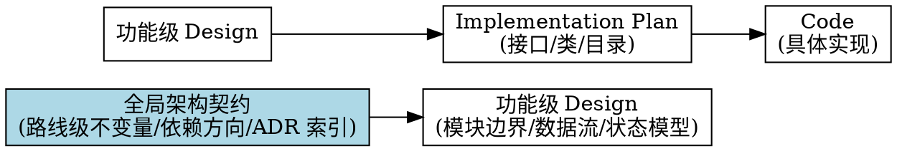
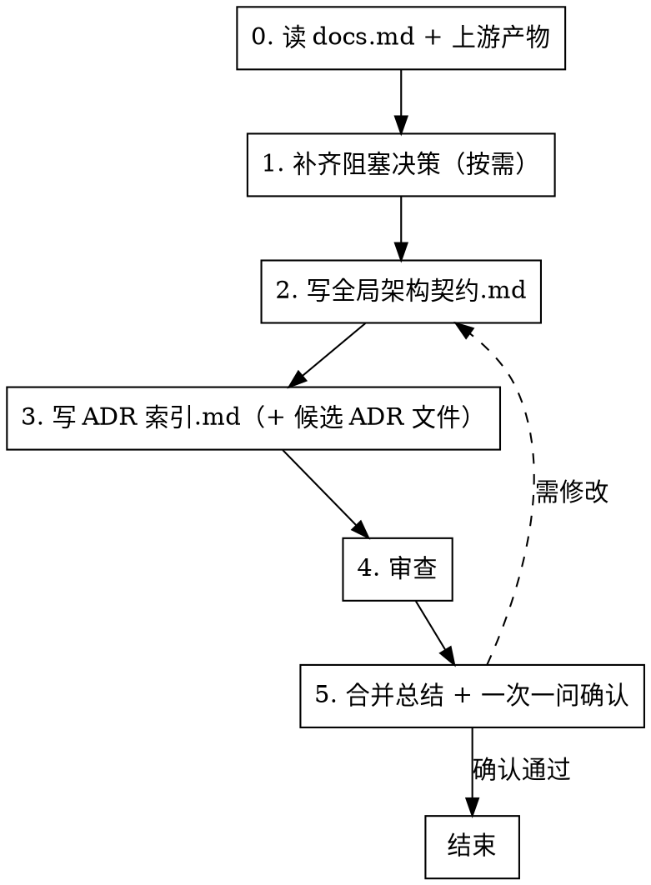

> 迁移来源：`dd-write-architecture-contract/SKILL.md`。现作为按需 reference 使用，不参与顶层 Skill 路由。

# 编写全局架构契约（dd-project-docs/architecture-contract）

## 概述

**全局架构契约描述"路线级永远成立的约束"（WHAT 永远成立），绝不描述"具体怎么实现"（HOW 代码）。**

架构契约是整个项目的"路线级宪法"与"分层边界唯一来源"。它回答四个问题：哪些不变量永远成立、模块如何分层、依赖朝哪个方向走、哪些历史耦合点只能减不能增。即使后续类名、接口签名、实现语言全部重构，架构契约基本不需要改——只有经 ADR 评审批准才能修订。

调用时声明 `invocation_mode=standalone|child`。`child` 消费上游事实并只返回产物/Gate；`standalone` 由顶层会话按 [dd-workflow-runtime/ask](../../dd-workflow-runtime/references/ask.md) 收尾，禁止 child 重复最终 ASK。

**架构契约写的是"什么永远成立（Invariants）"，不写"怎么实现"。** 例如"核心逻辑层永不依赖 UI 框架"是架构契约；"用 protocol 抽象 NSWindow"是 Design/Implementation。

**功能级 Design 文档引用架构契约的不变量编号（如 INV-003），不复制契约原文。** Design 落到具体模块边界，架构契约只锁路线级约束。

**违反规则的字面意思就是违反规则的精神。**

## 何时使用

- 新项目 bootstrap 阶段，需要确立路线级架构契约与 ADR 流程
- brownfield 项目首次引入 AI Coding 工作流，需要梳理历史耦合点 allowlist
- 用户提到"架构契约"、"全局架构契约"、"ADR 索引"、"ADR 流程"、"写架构"、"不变量"、"禁止依赖方向"
- dd-project-bootstrap-workflow 的 Architecture Contract 节点调用本 skill
- 项目级架构调整（新增分层、调整依赖方向、引入新 UI 框架分区）需修订契约
- 团队把功能级 Design 文档当项目级架构契约用，或 ADR 候选堆积但无登记与流程

**不适用：** 单个功能的设计文档（用 dd-writing-specs/design-writer）、需求文档（用 dd-writing-specs/requirements-writer）、编码规范（用 dd-project-docs/coding-standards）、bug 修复、完整规格文档套件（用 dd-writing-specs）

## 上游上下文协议

被 `dd-project-bootstrap-workflow` 调用时，先读取 `project_mode`、`host`、`worktree_path`、`resolved_decisions`、`artifact_paths` 和 `delivery_policy`，并消费 Roadmap、Research/ADR 候选与 Brownfield Baseline（如适用）。

- 已解决事实、工作环境和已批准边界不得重复询问；
- 只询问会阻塞架构契约的未知决策；
- 上游证据冲突时返回 blocker；
- 独立调用时才执行最小 Preflight。

## 契约状态

架构状态必须显式记录，禁止把草案写成永久事实：

| 状态 | 含义 | 允许用途 |
|------|------|---------|
| `hypothesis` | 仍需验证的候选 | Research/Spike 输入 |
| `provisional` | 暂定，仍有 blocker | 继续补证据 |
| `approved-baseline` | Bootstrap Exit Gate 可接受的项目基线 | Feature Design 引用 |
| `frozen` | 有实现、测试和 ADR 证据支持的稳定契约 | 长期强约束 |

Bootstrap 出口至少需要 `approved-baseline`。没有真实实现与验证证据时不得声称 `frozen`。

## 项目规则优先（强制首步）

写架构契约前，**必须先读取项目的 docs.md**。docs.md 的规则优先于 skill 的默认规则。

```bash
test -f .trae/rules/docs.md && cat .trae/rules/docs.md
test -f docs/docs.md && cat docs/docs.md
test -f docs.md && cat docs.md
```

从 docs.md 提取：架构契约存放路径、文件命名规则、文档头部格式、标点规则、mermaid/dot 规则、ADR 编号规则、不变量编号规则、同步更新规则。

**处理规则**：docs.md 存在则其规则优先；不存在用 skill 默认规则；与 skill P0 冲突时 P0 优先（不写代码符号是铁律），与 P1/P2 冲突时 docs.md 优先。

## 核心原则：路线级契约不是功能级 Design



| 层级 | 内容 | 随代码变化 | 是否写代码 | 示例 |
|------|------|-----------|-----------|------|
| **全局架构契约** | 路线级不变量、分层、依赖方向、ADR 索引 | ❌ 几乎不会 | ❌ 绝不 | "Core 层永不依赖 AppKit" |
| 功能级 Design | 模块边界、数据流、状态模型 | ⚠️ 偶尔调整 | ❌ 不写代码符号 | "识别模块负责生命周期" |
| Implementation Plan | 接口、类、目录、迁移方案 | ✅ 经常变化 | ✅ 可写接口签名 | `class RecognitionEngine` |

**关键区分：** 架构契约写"路线级永远成立的约束"，功能级 Design 写"由谁负责什么"。类名、协议名、方法签名、文件路径属于 Implementation Plan，不属于架构契约。

## 禁止清单（P0 铁律）

全局架构契约中**绝不**出现以下内容（属于 Implementation Plan / Code）：

| 禁止类别 | 示例（禁止） | 替代表述（允许） |
|---------|-------------|----------------|
| 类名/协议名 | `VisionModeController`、`VisualRecognitionEngine` | 视觉识别总控模块、视觉识别引擎接口 |
| 方法签名 | `recognize(screen:) async -> [VisualElement]` | 执行识别 |
| 字段类型/枚举值 | `rect: CGRect`、`idle`/`capturing` | 位置属性、待激活/采集 |
| 实现语言 | "采用 Swift 实现"、"使用 Rust" | （不写，留给 Implementation Plan） |
| 框架 API | `vDSP.meanv`、`CVPixelBuffer`、`NSWindow` | 向量运算、像素缓冲、系统窗口类型 |
| 并发原语 | `async let`、`TaskGroup`、`DispatchQueue.main`、`actor` | 并行执行、并发协调、主线程 |
| 文件路径/完整代码块 | `MacimCore/Xxx.swift`、`struct VisualElement { ... }` | （不写）/ 用文字描述数据形状 |
| 配置键名 | `com.macim.visual.xxx` | 业务配置项名 |

**判定方法：** 如果一个词出现在代码里能被编译器识别为符号（类/协议/方法/字段/枚举/模块/类型），它就不能出现在架构契约。

## 流程



<HARD-GATE>
按 0→1→2→3→4→5 执行。步骤 1 只补齐 blocker，可以因上游上下文完整而无提问；步骤 3 没有 ADR 主题时只维护索引。不得跳过审查与确认。

节点完成以产物存在、验证通过、阻塞决策归零和状态持久化为准；是否逐步 commit 遵循 `delivery_policy`。
</HARD-GATE>

## 全局规则

**通用规则**（结构化询问、null 输入重问、文档规则优先、提交边界、worktree 选择模板）遵循 [dd-workflow-runtime/ask](../../dd-workflow-runtime/references/ask.md)（含 worktree 选择模板）。

**审查规则**遵循 [dd-workflow-runtime/review-gate](../../dd-workflow-runtime/references/review-gate.md)。

## 工作环境前置询问（强制，先于步骤 0）

独立调用且工作环境未知时，按 [dd-workflow-runtime/ask](../../dd-workflow-runtime/references/ask.md) 的「工作环境询问」模板询问用户：选项 1（推荐）新建隔离工作树；选项 2 在当前 worktree 工作。

**处理规则**：选「新建」走 [dd-git-workflow/worktree](../../dd-git-workflow/references/worktree.md)；Bootstrap 已传入 `worktree_path` 时直接继承。提交、公共文件和推送规则遵循 `delivery_policy` 与 [dd-git-workflow](../../dd-git-workflow/SKILL.md)。

---

## 步骤 0：读 docs.md + 既有契约 + ADR 候选

按"项目规则优先"章节读取 docs.md。同时读取既有架构契约、ADR 索引、上游 ADR 候选（`docs/architecture/adr/ADR-NNNN-主题.md`，标注"待批准"状态）、路线图（`路线图.md`），判断新建/修订模式：

- **既有契约存在** → 修订模式：记录现有不变量编号上限、ADR 编号上限、allowlist 现状；本次改动需走 ADR 修订流程
- **不存在** → 新建模式：编号从 INV-001、ADR-0001 起
- **上游 ADR 候选存在**（被 dd-project-bootstrap-workflow 调用时）→ 作为步骤 3 起草输入，不直接定稿
- **路线图存在**（dd-project-docs/roadmap 产出）→ 提取规划的分层结构作为契约参考

把新事实合并进上游状态；独立调用且需要跨会话恢复时才写 `.contract-step0-summary.md`。是否提交遵循 `delivery_policy`。

---

## 步骤 1：grill 拷问（一次一问）

先用上游产物和仓库证据回答下列问题。只有答案仍未知且会阻塞契约时才使用 grilling，且**一次只问一个问题**。

针对项目具体情况，依次拷问（跳过不适用的）：

1. **项目模块如何分层？** — Core/UI/App 三层？还是 Facade/Boundary/Adapter/Native？是否还有其他层？
2. **哪些是路线级不变量？** — 永远不能违反的约束（如"Core 层永不依赖 AppKit"、"依赖方向必须单向"）
3. **依赖方向是什么？** — 明确单向依赖图，用 dot/mermaid 绘制
4. **禁止哪些反向依赖？** — 明确禁止的反向依赖（如"Core 禁止 import UI"、"UI 禁止直接持有覆盖层"）
5. **Brownfield 的 Legacy/Target Surface 是否已分开？** — Legacy Compatibility Surface 只记录必须兼容且只减不增的历史面；Target Public Surface 记录目标公共边界，禁止混为同一 allowlist
6. **是否有 UI 框架分区需求？** — 仅 UI 项目问。如"必须 AppKit / 允许 SwiftUI"分区表
7. **哪些决策需要 ADR？** — 来自调研阶段的 ADR 候选，逐一确认是否进入 ADR 流程

把新增决策写回上游状态；独立调用且需要跨会话恢复时才写 `.contract-step1-summary.md`。

---

## 步骤 2：写全局架构契约.md

按项目模板优先；无模板时使用以下默认 9 章节：

1. **概述**：架构契约的作用（路线级不变量 + 依赖方向 + ADR 索引）；声明契约修订必须经 ADR 流程批准
2. **路线级不变量**：编号 INV-001 起，零填充三位。每条描述"什么永远成立"，不描述"怎么实现"。例："INV-001：核心逻辑层永不依赖 UI 框架（AppKit/SwiftUI）"
3. **分层结构**：模块划分（如 MacimCore/MacimUI/MacimApp；或 CPDF Facade/Boundary/Adapter/Native）。用中文业务术语命名模块，不写类名
4. **依赖方向**：明确单向依赖图，用 dot 或 mermaid 绘制。例：`MacimApp -> MacimUI -> MacimCore`
5. **禁止依赖方向**：明确禁止的反向依赖。例："MacimCore 禁止 import MacimUI"、"MacimUI 禁止 import MacimApp"
6. **Legacy Compatibility Surface**（仅 Brownfield）：必须兼容的历史入口与耦合点，标注“只减不增”
7. **Target Public Surface**：目标公共边界与稳定性承诺；不得用 Legacy allowlist 代替
8. **UI 框架分区**（可选扩展）：仅 UI 项目。分区表列出“分区名 | 允许框架 | 涉及子模块 | 理由”
9. **ADR 流程与契约状态**：候选 → 评审 → 批准 → 登记；明确状态与升级证据

**写作规则**：不变量描述"什么永远成立"；分层用中文业务术语；依赖方向图与禁止依赖方向不得矛盾；allowlist 完整列出历史耦合点只减不增；ADR 候选不预写最终内容，仅登记到索引标注"候选"状态。

验证后按 `delivery_policy` 交付。

---

## 步骤 3：写 ADR 索引.md + 候选 ADR 文件

**ADR 索引.md** 表格格式：

| ADR 编号 | 主题 | 状态 | 批准日期 | 文件链接 |
|---------|------|------|---------|---------|
| ADR-0001 | 核心层禁依赖 UI 框架 | 已批准 | 2026-07-28 | `adr/ADR-0001-核心层禁依赖UI框架.md` |
| ADR-0002 | 引入 SwiftUI 偏好设置窗口 | 候选 | - | `adr/ADR-0002-引入SwiftUI偏好设置窗口.md` |

**状态取值**：候选 / 已批准 / 已废弃

**候选 ADR 文件结构**（`adr/ADR-NNNN-主题.md`）：

- **标题**：`ADR-NNNN：{主题}`
- **状态**：候选 / 已批准 / 已废弃
- **上下文（Context）**：为什么需要这个决策
- **决策（Decision）**：决策内容
- **影响（Consequences）**：决策带来的影响
- **关联不变量**：本 ADR 影响哪些不变量（如 INV-001、INV-003）

**候选 ADR 不预写最终内容**：上下文与决策写初步草案，标注"待评审"；批准后补全影响与关联不变量。

验证后按 `delivery_policy` 交付。

---

## 步骤 4：审查

按 [dd-workflow-runtime/review-gate](../../dd-workflow-runtime/references/review-gate.md) 的通用 A/B/C 语义自检。架构契约附加检查：不变量是否覆盖所有路线级约束、allowlist 是否完整、ADR 候选是否遗漏；依赖方向图与禁止依赖方向是否矛盾、章节结构是否符合 docs.md、编号是否连续；不变量是否可检验（非模糊词）、ADR 流程是否可执行、是否有"优化/改进"等模糊词。

### P0 必检项

全文搜索代码符号（类名/协议名/方法签名/字段类型/枚举值/文件路径/并发原语/框架 API）应为 0；不变量描述"什么永远成立"而非"怎么实现"；ADR 候选未预写最终内容。

按 [dd-workflow-runtime/review-gate](../../dd-workflow-runtime/references/review-gate.md) 汇总规则处理；“必须修复”自动采纳并重审。审查结果写入状态；需要跨会话恢复时才写临时文件。

---

## 步骤 5：合并总结 + 一次一问确认

将审查结果合并为修订清单，分类为「必须修复」「建议修复」「可选优化」。用宿主可用的结构化 ASK 一次一问确认：问题 1 修订清单是否采纳（全部采纳/部分采纳/不采纳）；问题 2（如需修订）是否重新审查（重新审查/跳过审查直接确认）。

**修订与重审**：“必须修复”自动采纳后重审；重试上限 3 次，第 3 次未通过 → 结构化 ASK 升级处理。

最终产物与状态按 `delivery_policy` 交付；若创建了临时笔记，确认其内容已进入 SSOT 后再清理。

---

## 产出文件结构

```
docs/architecture/
├── 全局架构契约.md          # 必含（9 章节核心契约）
├── ADR索引.md               # 必含（ADR 登记表）
└── adr/                     # 可选（每个 ADR 一个文件，候选状态即可创建）
    ├── ADR-0001-主题.md
    └── ADR-0002-主题.md
```

## 与其他 skill 的关系

- **上游**：dd-project-docs/research 提供 ADR 候选；dd-project-docs/roadmap 提供分层结构参考
- **下游**：dd-project-docs/coding-standards 基于架构契约写编码规范；第一阶段需求文档的 Constraints 章节引用不变量编号（如"根据 INV-003"）；功能级 Design 引用不变量编号而非复制契约原文
- **被调度**：dd-project-bootstrap-workflow 的 Architecture Contract 节点调用本 skill
- **独立触发**：用户提到"架构契约"、"ADR 索引"等触发词时独立使用
- **与 dd-writing-specs/design-writer 的区分**：dd-writing-specs/design-writer 写功能级模块边界/数据流/状态模型；本 skill 写路线级不变量/依赖方向/ADR 索引。Design 引用契约不变量编号，不复制契约原文

## 输出要求（P2）

- 文件名：`全局架构契约.md`、`ADR索引.md`、`adr/ADR-NNNN-主题.md`
- 格式：Markdown，层级标题
- 不变量编号：INV-001 起，零填充三位；ADR 编号：ADR-0001 起，零填充四位
- 文档头部：`> 最后更新：YYYY-MM-DD | 版本：vX.Y`；文末：版本记录列表
- 中文标点（，。！？：；），英文术语保持原文；图示用 dot 或 mermaid，节点用中文业务术语；不使用 emoji

## Output Review（生成后自检扫描）

生成架构契约后，自动执行以下扫描。发现任何匹配项，立即重新生成违规部分。

| 步骤 | 扫描模式 | 含义 | 发现时处理 |
|------|---------|------|-----------|
| 1 | CamelCase 词（首字母大写连写） | 类名/协议名/类型名 | 转换为业务术语 |
| 2 | `xxx()`/`xxx: Yyy` | 方法调用/字段类型 | 转换为业务动作/属性 |
| 3 | `protocol`/`func`/`class`/`struct`/`enum` 关键字 | 代码定义 | 删除，改用业务描述 |
| 4 | `idle`/`capturing` 等英文状态 / `async let`/`TaskGroup`/`actor` | 英文枚举/并发原语 | 转换为中文业务术语/业务行为 |
| 5 | `Swift`/`Rust`/`C++` 等语言名 | 实现语言选型 | 删除，留给 Implementation Plan |
| 6 | `vDSP`/`Accelerate`/`CVPixelBuffer`/`NSWindow` / `.swift` 文件扩展名 | 框架 API/文件路径 | 转换为业务能力描述/删除 |
| 7 | 依赖方向图与禁止依赖方向矛盾 | 一致性冲突 | 修订其中一方 |
| 8 | 不变量含"优化/改进/更好"等模糊词 | 不可检验 | 改为可检验描述 |
| 9 | ADR 候选预写最终决策内容 | 跳过评审流程 | 改为草案，标注"待评审" |

**执行原则：** 扫描发现违规时，不要"修补"，直接重写违规段落。

## 红线 — 停下来重写

- 架构契约中出现类名、协议名、方法签名、字段类型、枚举值、文件路径、并发原语、框架 API、实现语言选型
- 不变量描述"怎么实现"而非"什么永远成立"，或用"优化/改进/更好"等模糊词
- 依赖方向图与禁止依赖方向互相矛盾
- brownfield 项目未列 allowlist，或 allowlist 未标注"只减不增"
- ADR 候选直接定稿未经评审批准，或跳过 ADR 流程擅自修订不变量
- 把 UI 框架分区写进功能级 Design，或把功能级 Design 的模块边界内容复制到架构契约
- 用"团队习惯"/"行业标准"/"AI 更明确"为由保留代码符号

**以上任一情况发生时，停止写作，删除违规内容，重写。**

## 验证清单

完成前自查：

- [ ] 全文搜索类名/协议名/方法签名/字段类型/枚举值/文件路径/并发原语/框架 API — 应为 0
- [ ] 不变量描述"什么永远成立"，不描述"怎么实现"
- [ ] 不变量编号连续（INV-001、INV-002...）
- [ ] 分层结构用中文业务术语，非英文类名
- [ ] 依赖方向图与禁止依赖方向无矛盾
- [ ] Brownfield 的 Legacy Compatibility Surface 与 Target Public Surface 分离，Legacy 标注“只减不增”
- [ ] 契约状态明确，Bootstrap 出口至少为 `approved-baseline`
- [ ] UI 框架分区（如有）写在架构契约，非功能级 Design
- [ ] ADR 索引登记所有候选 ADR，状态明确
- [ ] 候选 ADR 未预写最终内容，标注"待评审"
- [ ] ADR 流程章节明确"修订不变量必须经 ADR 批准"
- [ ] 文档头部含 `> 最后更新：YYYY-MM-DD | 版本：vX.Y`
- [ ] 文末含版本记录列表
- [ ] 文档换实现语言/换框架/换类名不需要改

**任一项失败，修订后重新验证。**

## Git 工作流合规

本技能涉及 Git 操作时，遵循 [dd-git-workflow](../../dd-git-workflow/SKILL.md) 系列子技能。分支命名 `docs/architecture-contract`，merge-only，禁止 rebase。修改公共文件（如 `全局架构契约.md` 通常属于公共文件）加 `PublicFile` tag。
