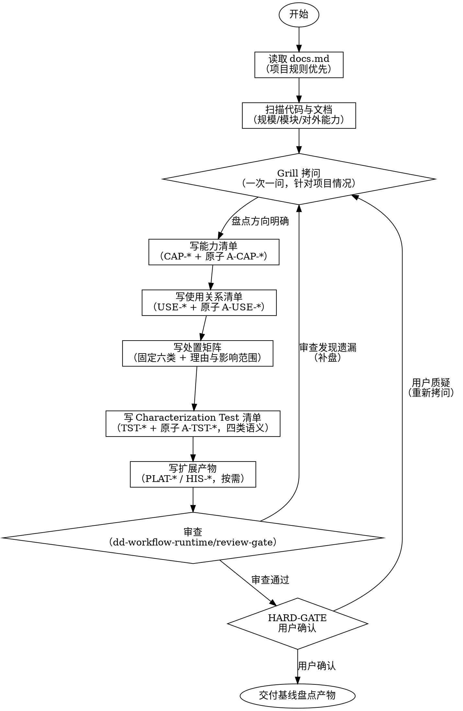
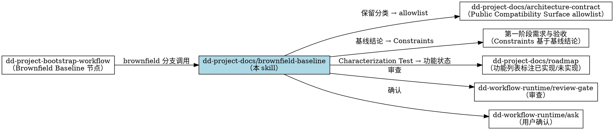

> 迁移来源：`dd-brownfield-baseline/SKILL.md`。现作为按需 reference 使用，不参与顶层 Skill 路由。

# 老项目基线盘点（dd-project-docs/brownfield-baseline）

## 概述

**基线盘点只盘点不修改——只读现有代码与文档，不改动产品代码。**

dd-project-docs/brownfield-baseline 是项目级基线盘点子 skill，用于在 Brownfield 场景下，系统化盘点项目对外能力、内部使用关系、处置分类与行为基线测试。Brownfield 的判定依据是**存在必须解释的兼容性、历史行为、发布用户、数据迁移或公共接口义务**，不是源文件数量。产出作为后续架构契约 allowlist、阶段合同与 roadmap 功能状态标注的输入。

调用时声明 `invocation_mode=standalone|child`。`child` 继承 Bootstrap 的事实并只返回产物/Gate；`standalone` 由顶层会话按 [dd-workflow-runtime/ask](../../dd-workflow-runtime/references/ask.md) 收尾。不得在 child 内重复最终 ASK。

**基线盘点必须完整——能力级与原子级双层盘点，不漏盘。** 每条处置分类必须有理由与影响范围；每个 Characterization Test 必须有明确语义分类。

**基线盘点产物是后续所有迁移决策的事实基础。** 盘点遗漏会导致架构契约漏掉必须保留的能力，迁移后破坏兼容性。

## 何时使用

- 老项目（brownfield）启动迁移或重构前，需要盘点现有能力与使用关系
- 用户提到"基线盘点"、"brownfield"、"老项目迁移"、"能力清单"、"Characterization Test"、"保留适配替换"
- dd-project-bootstrap-workflow 在 Brownfield Baseline 节点调用
- 团队要迁移老项目但不清楚哪些能力必须保留
- 迁移前需要建立行为基线测试，锁定当前行为

**不适用：** 无兼容性或历史义务的 Greenfield、bug 修复（用 dd-bug-fix-workflow）、纯需求文档编写（用 dd-writing-specs/requirements-writer）

## 上游上下文协议

被 `dd-project-bootstrap-workflow` 调用时，先读取并消费：

- `project_mode`、`host`、`worktree_path`
- `resolved_decisions`、`artifact_paths`
- `delivery_policy`

上游已确定的目标、工作环境、项目模式和文档规则不得重复询问。先从仓库和上游产物取证，只询问会阻塞本产物的未知决策；若证据与上游结论冲突，返回 blocker，不在本 skill 内另建一套事实。

独立调用时才执行最小 Preflight：确认项目规则、工作环境、兼容性义务和产物路径。

## 项目规则优先（强制首步）

写基线盘点前，**必须先读取项目的 docs.md**。docs.md 的规则优先于 skill 的默认规则。

### 读取路径（按存在情况尝试）

```bash
test -f .trae/rules/docs.md && cat .trae/rules/docs.md
test -f docs/docs.md && cat docs/docs.md
test -f docs.md && cat docs.md
```

### 从 docs.md 提取并记录

1. **文档存放路径**（如 `docs/phases/P-1_基线盘点/artifacts/`，清单/矩阵归档到 `artifacts/`）
2. **文件命名规则**（如 `能力清单.md` 或 `CAP-xxx.md`）
3. **文档头部格式**（如 `> 最后更新：YYYY-MM-DD | 版本：vX.Y`）
4. **标点符号规则**（中文标点/英文术语保持原文）
5. **编号规则**（CAP-* / USE-* / TST-* / PLAT-* / HIS-* 前缀约定）

### 处理规则

- **docs.md 存在** → docs.md 规则优先于 skill 默认规则
- **docs.md 不存在** → 用 skill 默认规则
- **docs.md 与 skill 冲突时** → docs.md 优先（项目约定 > 通用建议），冲突用宿主可用的结构化 ASK 提出

## 流程



### Grill 拷问环节（写盘点前）

先从代码、文档、测试与上游上下文回答下列问题。只有答案仍未知且会阻塞产物时，才使用结构化 ASK 一次一问：

1. **项目代码规模？**（文件数/模块数/代码行数）——决定盘点粒度
2. **对外能力如何识别？**（公开 API / CLI 命令 / 配置项 / 事件 / 文件格式）——确定 CAP-* 边界
3. **内部使用关系如何追踪？**（import 关系 / 调用图 / 依赖分析工具）——确定 USE-* 来源
4. **处置分类证据是否完整？**——PRESERVE / ADAPT / REPLACE / KNOWN_DEFECT / TOLERATED_COMPATIBILITY / REVIEW
5. **是否有现有测试可作为 Characterization Test？**——现有测试直接纳入，缺失行为补写
6. **测试语义分类如何判定？**（INTENDED / KNOWN_DEFECT / TOLERATED_COMPATIBILITY / REVIEW）——见下方分类定义
7. **是否需要平台与构建矩阵？**（多平台 / 多构建配置 / 多证书策略）——单平台可跳过
8. **是否有历史文档需要重新基线？**——历史设计文档/规范是否纳入 HIS-* 矩阵

**Grill 原则：** 一次一问，等待用户回答后再问下一个。不要批量抛出。用户回答不明确时，用结构化 ASK 给出 2-3 个建议及推荐。

## 产出文件结构

### 核心产物（必含）

存放路径默认 `docs/phases/P-1_基线盘点/artifacts/`（清单/矩阵归档到 `artifacts/`，按 docs.md 调整）：

#### 1. 能力清单.md

项目对外能力盘点，编号 CAP-* 起。每个能力含：

| 字段 | 说明 |
|------|------|
| 编号 | CAP-001 起 |
| 名称 | 业务能力名（非类名） |
| 描述 | 能力提供什么行为 |
| 当前实现位置 | 模块/文件/入口（盘点用，非约束） |
| 原子条目 | A-CAP-* 编号，能力拆解到原子级别 |

**双层完整性：** 能力级（CAP-*）+ 原子级（A-CAP-*）。能力级是粗粒度分类，原子级是可独立验证的最小能力单元。不允许只盘能力级不盘原子级。

#### 2. 使用关系清单.md

内部使用关系盘点，编号 USE-* 起。每个使用关系含：

| 字段 | 说明 |
|------|------|
| 编号 | USE-001 起 |
| 调用方 | 谁在使用（模块/能力编号） |
| 被调用能力 | CAP-* 编号 |
| 调用版本 | 当前调用方式（同步/异步/事件） |
| 原子条目 | A-USE-* 编号 |

#### 3. 处置矩阵.md

对每个 CAP-* 能力分类：

| CAP 编号 | 能力名称 | 分类 | 分类理由 | 影响范围 | 迁移路径 |
|----------|----------|------|---------|---------|---------|
| CAP-001 | xxx | PRESERVE | 迁移后必须保持 | 调用方 USE-* | 直接保留 |
| CAP-002 | xxx | ADAPT | 接口需调整，语义保留 | 调用方 USE-* | 适配后迁移 |
| CAP-003 | xxx | REPLACE | 当前实现不满足目标 | 调用方 USE-* | 新实现替换 |

**分类定义：**
- **PRESERVE**：迁移后行为必须保持，属于 Legacy Compatibility Surface
- **ADAPT**：接口形态需调整，但业务语义保留，调用方需同步修改
- **REPLACE**：当前实现不满足目标，重新实现并明确退役路径
- **KNOWN_DEFECT**：已知缺陷，不得自动成为目标行为或验收标准
- **TOLERATED_COMPATIBILITY**：仅在明确兼容范围内暂时保留
- **REVIEW**：证据不足，必须在进入阶段合同前归零

**每条分类必须有理由与影响范围，不允许只填分类不填理由。**

#### 4. Characterization_Test清单.md

行为基线测试清单，编号 TST-* 起。每个测试含：

| 字段 | 说明 |
|------|------|
| 编号 | TST-001 起 |
| 名称 | 测试名称 |
| 关联能力 | CAP-* 编号 |
| 语义分类 | INTENDED / KNOWN_DEFECT / TOLERATED_COMPATIBILITY / REVIEW |
| 当前状态 | 已有测试 / 待补写 / 待修复 |
| 原子条目 | A-TST-* 编号 |

**语义分类（固定四类，不漏分类）：**

| 分类 | 含义 | 迁移时处理 |
|------|------|-----------|
| **INTENDED** | 符合预期的行为 | 迁移后必须保持 |
| **KNOWN_DEFECT** | 已知缺陷 | 迁移时应修复 |
| **TOLERATED_COMPATIBILITY** | 为兼容性容忍的行为 | 迁移时需评估是否保留 |
| **REVIEW** | 待审查的行为 | 迁移时需决策，暂不判定 |

**每个测试必须明确语义分类，不允许留空或写"待定"。** 无法判定时归入 REVIEW，并记录待审查原因。

### 扩展产物（可选，按项目复杂度）

#### 5. 平台与构建矩阵.md

编号 PLAT-* 起。盘点多平台支持、构建配置、签名策略、CI 矩阵。单平台单构建项目可跳过，由 Grill 第 7 问决定。

#### 6. 历史文档矩阵.md

编号 HIS-* 起（原子级 A-HIS-*）。盘点历史设计文档、规范、变更记录，标注是否纳入新基线。无历史文档项目可跳过，由 Grill 第 8 问决定。

## 审查与确认

### 审查（复用 dd-workflow-runtime/review-gate）

按 [dd-workflow-runtime/review-gate](../../dd-workflow-runtime/references/review-gate.md) 的通用 A/B/C 语义自检。基线盘点附加检查：

1. **完整性审查**：能力清单是否漏盘（对照代码模块逐项核对）；使用关系是否完整（对照 import 与调用图）
2. **分类合理性审查**：处置分类是否有理由与影响范围；Characterization Test 语义分类是否明确
3. **一致性审查**：CAP-* 与 USE-* 交叉引用是否一致；TST-* 与 CAP-* 关联是否正确

审查发现问题 → 回到 Grill 环节补盘或修正，不直接交付。

### 用户确认（复用 dd-workflow-runtime/ask）

审查通过后，用 dd-workflow-runtime/ask 向用户确认：

- 基线盘点产物是否覆盖项目全部对外能力
- 处置分类是否符合迁移预期
- Characterization Test 语义分类是否准确

## HARD-GATE

**基线盘点产物未经用户确认，不得进入下游环节。**

HARD-GATE 触发条件：
- 审查未通过
- 能力清单存在漏盘（审查指出但未补盘）
- 处置矩阵存在无理由分类
- Characterization Test 存在未分类测试
- 用户未确认

HARD-GATE 触发时：停止，回到 Grill 环节或用结构化 ASK 澄清，不得绕过。

## 与其他 skill 的关系



**上游：** dd-project-bootstrap-workflow（流程 skill，仅 brownfield 分支调用）；也可独立触发

**下游：**
- dd-project-docs/architecture-contract：Public Compatibility Surface allowlist 基于"保留"分类
- 第一阶段需求与验收：Constraints 基于基线盘点结论
- dd-project-docs/roadmap：功能列表标注"已实现/未实现"状态基于 Characterization Test

**审查与确认复用：** dd-workflow-runtime/review-gate（审查）、dd-workflow-runtime/ask（用户确认）、HARD-GATE

## 输出要求

- 文件名：`能力清单.md` / `使用关系清单.md` / `处置矩阵.md` / `Characterization_Test清单.md`（若项目已有 `保留适配替换矩阵.md` 则原位演进），统一归档到项目规则指定位置
- 格式：Markdown，层级标题，表格
- 编号：CAP-* / USE-* / TST-* / PLAT-* / HIS-* 起，原子级加 A- 前缀
- 文档头部：`> 最后更新：YYYY-MM-DD | 版本：vX.Y`
- 文末：版本记录（仅保留最新一行：版本号 + 一句话语义变化；更早历史由 Git 承担）
- 中文标点（，。！？：；），英文术语保持原文
- 不使用 emoji
- **不改产品代码**（只盘点，不修改）

## 验证清单

完成前自查：

- [ ] 能力清单双层完整（CAP-* + A-CAP-*），对照代码模块逐项核对无漏盘
- [ ] 使用关系清单完整（USE-* + A-USE-*），对照 import 与调用图核对
- [ ] 处置矩阵每条分类有理由与影响范围，分类属于固定六类之一
- [ ] Characterization Test 清单每个测试有明确语义分类（四类之一，不留空）
- [ ] 语义分类覆盖：INTENDED / KNOWN_DEFECT / TOLERATED_COMPATIBILITY / REVIEW 均有判定标准
- [ ] CAP-* 与 USE-* 交叉引用一致
- [ ] TST-* 与 CAP-* 关联正确
- [ ] 扩展产物按需产出（多平台/多历史文档时未跳过）
- [ ] 文档头部格式正确（`> 最后更新：YYYY-MM-DD | 版本：vX.Y`）
- [ ] 文末版本记录仅保留最新一行（版本号 + 一句话语义变化；docs-governance §9）
- [ ] 未改动任何产品代码
- [ ] 审查通过
- [ ] 用户已确认

**任一项失败，修订后重新验证。**

## Git 工作流合规

本技能涉及 Git 操作时，遵循 dd-git-workflow 系列子技能。分支命名 `docs/P-1-基线盘点`，merge-only，禁止 rebase。修改公共文件加 PublicFile tag。
