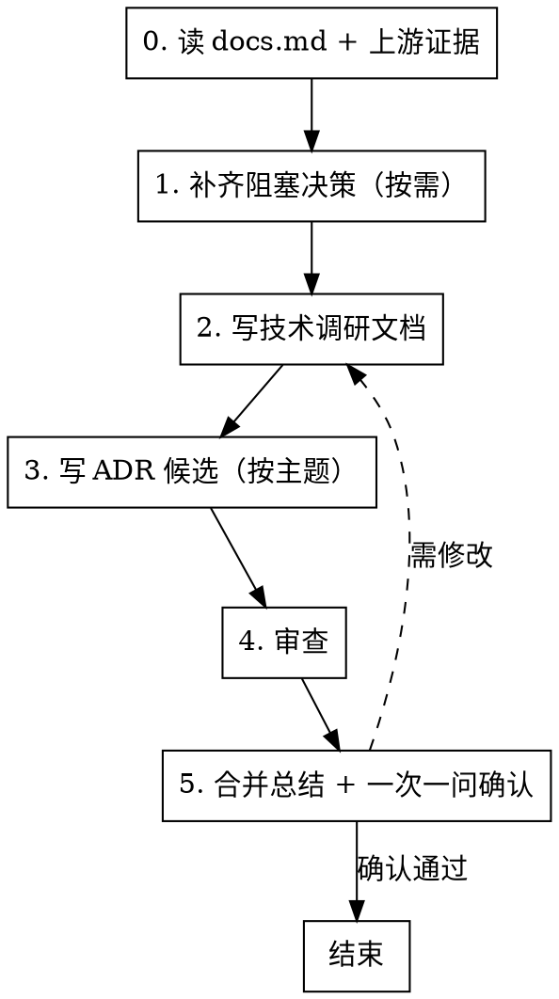

> 迁移来源：`dd-project-research/SKILL.md`。现作为按需 reference 使用，不参与顶层 Skill 路由。

# 项目调研（dd-project-docs/research）

## 概述

**项目调研只回答"该不该做、用什么做、风险在哪"，不写代码原型，不写最终架构决策。**

dd-project-docs/research 是项目级调研子 skill，被 dd-project-bootstrap-workflow 的 Research / Technical Validation 节点按风险调度，也可独立触发。产出技术调研文档与 ADR 候选草稿，为后续 dd-project-docs/roadmap 与 dd-project-docs/architecture-contract 提供输入。

调用时声明 `invocation_mode=standalone|child`。`child` 继承 Bootstrap 的事实并只返回产物/Gate；`standalone` 由顶层会话按 [dd-workflow-runtime/ask](../../dd-workflow-runtime/references/ask.md) 收尾。不得在 child 内重复最终 ASK。

**调研产出的是"候选与依据"，不是"拍板的决策"。** 最终架构决策由 dd-project-docs/architecture-contract 阶段批准；本 skill 只提供候选草稿与对比依据。

**违反规则的字面意思就是违反规则的精神。**

## 何时使用

- 新项目创建、技术栈迁移、重大重构前的可行性论证
- 用户提到"项目调研"、"技术调研"、"技术选型"、"竞品分析"、"可行性评估"、"风险识别"、"ADR 候选"
- dd-project-bootstrap-workflow 的 Research / Technical Validation 节点调度本 skill
- 项目核心方向未定，需要对比候选技术栈
- 关键技术决策存在分歧，需要 ADR 候选留档

**不适用：** 功能级规格文档（用 dd-writing-specs）、bug 修复（用 dd-bug-fix-workflow）、写架构契约最终文档（用 dd-project-docs/architecture-contract）、写 roadmap（用 dd-project-docs/roadmap）、POC 代码原型（属于后续阶段）

## 上游上下文与触发协议

被 `dd-project-bootstrap-workflow` 调用时，先读取 `project_mode`、`host`、`worktree_path`、`resolved_decisions`、`artifact_paths` 和 `delivery_policy`。

- 已解决事实不得重复询问；
- 先读取 Gap Scan、Baseline、已有调研和可靠外部证据；
- 只询问本产物仍缺失的 blocker；
- 上游冲突返回 blocker，不在调研中另写一套决策；
- 工作环境已确定时不得再次询问 worktree。

调研是**风险触发节点**，不是每次 Bootstrap 的固定步骤。仅在未验证假设可能改变 Roadmap/Architecture、外部证据不足或用户明确要求时执行；可靠证据已覆盖时，记录证据路径并返回 `skipped-with-evidence`。

独立调用时执行最小 Preflight，补齐上述输入后再继续。

## 项目规则优先（强制首步）

写调研文档前，**必须先读取项目的 docs.md**。docs.md 的规则优先于 skill 的默认规则。

### 读取路径（按存在情况尝试）

```bash
test -f .trae/rules/docs.md && cat .trae/rules/docs.md
test -f docs/docs.md && cat docs/docs.md
test -f docs.md && cat docs.md
```

### 从 docs.md 提取并记录

1. **文档存放路径**（如 `docs/planning/` 或 `docs/architecture/`）
2. **文件命名规则**（如 `技术调研.md` 或 `技术调研报告.md`）
3. **文档头部格式**（如 `> 最后更新：YYYY-MM-DD | 版本：vX.Y`）
4. **标点符号规则**（中文标点/英文术语保持原文）
5. **mermaid/dot 流程图规则**
6. **同步更新规则**（修改调研文档时是否需要同步更新其他文档）

### 处理规则

- **docs.md 存在** → docs.md 规则优先于 skill 默认规则
- **docs.md 不存在** → 用 skill 默认规则
- **docs.md 规则与 skill 约束冲突时** → 用宿主可用的结构化 ASK 提出，由用户决定

## 流程



<HARD-GATE>
存在调研必要性时按 0→1→2→3→4→5 执行。步骤 1 只补齐 blocker，可以因上游上下文完整而无提问；步骤 3 没有 ADR 主题时可跳过。不得跳过审查。

节点通过要求产物存在、已验证、阻塞决策归零并写入上游状态。是否逐步 commit 属于 Delivery Policy，不得把“尚未 commit”误判为调研内容未完成。
</HARD-GATE>

## 全局规则

**通用规则**（结构化询问、null 输入重问、文档规则优先、提交边界、worktree 选择模板）遵循 [dd-workflow-runtime/ask](../../dd-workflow-runtime/references/ask.md)。

## 工作环境前置询问（强制，先于步骤 0）

独立调用且工作环境未知时，按 [dd-workflow-runtime/ask](../../dd-workflow-runtime/references/ask.md) 的「工作环境询问」模板询问用户：

- 问题：本次调研将在哪个工作环境进行？
- 选项 1（推荐）：新建隔离工作树
- 选项 2：在当前 worktree 工作

选中工作环境后，后续所有工作都在该 worktree 中执行，不得中途切换。

> Bootstrap 已传入 `worktree_path` 时直接继承；独立调用只有在即将修改文件且环境未知时才询问。

## 步骤 0：读 docs.md + 项目既有资料（强制首步）

**这是不可跳过的第一步。**

### 0.1 读取项目规则文件

按上文「读取路径」尝试读取 docs.md，提取并记录文档存放路径、命名规则、头部格式、标点规则。

### 0.2 读取项目既有资料

- 功能列表（如 `docs/planning/全键盘控制 App 功能列表.md`）
- 已有 roadmap 或架构文档（如存在）
- 最近提交的调研或设计文档（学习风格与深度）

### 0.3 记录规则摘要

仅当后续需要跨会话恢复时，将“规则与参考摘要”写入状态或临时笔记；不要为已存在于上游状态的事实再复制一份文件。

## 步骤 1：grill 拷问（一次一问）

只对证据和上游上下文无法回答的 blocker 使用 grilling。**一次一问**，每问用结构化 ASK 单独提出；已解决问题不得因进入本 skill 而重问。

### 1.1 拷问范围

仅聚焦**项目调研边界**，不做技术方案设计。至少覆盖：

1. **项目核心目标是什么？**（一句话，用于锁定调研方向）
2. **目标平台与最低版本？**（如 macOS 13+、iOS 16+，影响技术选型兼容性）
3. **关键技术约束？**（如必须用某框架、必须避免某许可证、必须支持离线）
4. **是否有竞品参考？**（列出竞品名称，便于步骤 2 对比）
5. **是否有已知技术风险？**（如某依赖平台支持不确定、某 API 即将废弃）
6. **调研深度？**（快速选型 vs 深度对比，影响产出粒度）

### 1.2 拷问产物

把新增决策合并进上游状态；独立调用且需要跨会话恢复时才写临时摘要。

## 步骤 2：写技术调研文档

**必含产出**：`docs/planning/技术调研.md`

### 2.1 文档结构

按项目 docs.md 命名规则优先；无则用默认 `技术调研.md`。文档头部：`> 最后更新：YYYY-MM-DD | 版本：vX.Y`

### 2.2 必含章节

1. **调研背景与目标**：基于上游上下文与步骤 1 新增决策，一句话核心目标 + 调研边界
2. **技术栈选型对比**：列出候选技术栈，按维度对比（成熟度/社区活跃度/许可证/性能/与现有栈兼容性），给出推荐与理由
3. **竞品分析**：列出竞品，对比功能/架构/优劣势，提炼对本项目的启示（不止列名字）
4. **可行性评估**：
   - 技术可行性（关键风险点）
   - 资源可行性（人力/时间/工具链）
   - 外部依赖可行性（许可证/平台支持）
5. **风险识别**：每条风险给出影响等级（高/中/低）与缓解措施；覆盖技术风险、许可证风险、平台风险、维护风险
6. **调研结论与推荐**：综合以上，给出推荐方向与待决策项（指向 ADR 候选）
7. **版本记录**

### 2.3 写作约束

- **不写代码原型**：POC 属于后续阶段，调研只写对比与依据
- **不写最终架构决策**：本 skill 只产出候选与依据，最终决策由 dd-project-docs/architecture-contract 批准
- **无模糊词**：禁止"优化/改进/更好"，风险等级与可行性必须可判断
- **中文标点**，英文术语保持原文，不使用 emoji

### 2.4 验证与交付

写完后验证引用、结论与风险表。是否提交遵循 `delivery_policy`。

## 步骤 3：写 ADR 候选（按主题）

**可选产出**：`docs/architecture/adr/ADR-NNNN-主题.md`（每个候选 ADR 一个文件，标注"待批准"状态）

### 3.1 识别 ADR 主题

从步骤 2 的"待决策项"中识别需要架构决策的主题，例如：

- 使用哪个 PDF 后端
- 是否引入 Native Core
- 是否采用某第三方库

### 3.2 ADR 候选文件结构

每个 ADR 候选文件包含：

1. **上下文（Context）**：为什么需要这个决策，背景与约束
2. **决策（Decision）**：候选方案（可多个），每个方案的优劣势
3. **影响（Consequences）**：采用该方案的正面/负面影响、风险

### 3.3 重要约束

**ADR 候选不预写最终内容，只提供候选草稿。** 最终决策与批准由 dd-project-docs/architecture-contract 步骤 5 完成。本 skill 产出的候选文件标注"待批准"状态。

### 3.4 验证与交付

写完后验证候选状态与调研结论一致。是否提交遵循 `delivery_policy`。

## 步骤 4：审查

按 [dd-workflow-runtime/review-gate](../../dd-workflow-runtime/references/review-gate.md) 的通用 A/B/C 语义自检。技术调研附加检查：选型对比是否覆盖候选、竞品分析是否遗漏关键竞品、风险是否漏识别；调研结论与对比依据是否一致、ADR 候选与调研结论是否对齐；风险影响等级是否可判断、可行性依据是否可追溯、是否混入代码原型或最终决策。

按 [dd-workflow-runtime/review-gate](../../dd-workflow-runtime/references/review-gate.md) 的汇总规则处理：必须修复自动采纳，建议修复仅重大项询问用户。审查结果写入 `技术调研_审查结果.md`。

## 步骤 5：合并总结 + 一次一问确认

### 5.1 合并

合并适用审查等级的发现，分为「必须修复」「建议修复」「可选优化」三类。

### 5.2 一次一问确认

按 [dd-workflow-runtime/ask](../../dd-workflow-runtime/references/ask.md) 的结构化询问规则，一次一问：

- 问题：技术调研文档与 ADR 候选是否确认通过？
- 选项 1（推荐）：确认通过，进入下一阶段
- 选项 2：需要修改（修复后重新审查）

**确认通过后**按 `delivery_policy` 交付合并总结，工作流结束。

**需修改** → 返回步骤 2 修订后重新走步骤 4-5。

## 产出文件结构

### 必含

- `docs/planning/技术调研.md`：技术调研主文档

### 可选

- `docs/architecture/adr/ADR-NNNN-主题.md`：每个候选 ADR 一个文件，标注"待批准"

### 临时（工作流结束后清理）

- `docs/planning/.research-step0-summary.md`
- `docs/planning/.research-step1-summary.md`

## 与其他 skill 的关系

- **被调用**：[dd-project-bootstrap-workflow](../../dd-project-bootstrap-workflow/SKILL.md) 的风险触发调研节点
- **下游消费**：
  - 产出的技术调研供 [dd-project-docs/roadmap](../../dd-project-docs/references/roadmap.md) 参考
  - 产出的 ADR 候选供 [dd-project-docs/architecture-contract](../../dd-project-docs/references/architecture-contract.md) 批准
- **不替代**：功能级规格文档（用 [dd-writing-specs](../../dd-writing-specs/SKILL.md)）、架构契约最终文档（用 dd-project-docs/architecture-contract）

## 输出要求

- 文件名：`docs/planning/技术调研.md`（按项目 docs.md 命名规则优先）
- 格式：Markdown，层级标题
- 文档头部：`> 最后更新：YYYY-MM-DD | 版本：vX.Y`
- 文末：版本记录列表
- 中文标点（，。！？：；），英文术语保持原文
- 不使用 emoji
- ADR 候选文件标注"待批准"状态

## 验证清单

完成前自查：

- [ ] 技术调研文档包含全部必含章节（背景/选型对比/竞品分析/可行性/风险/结论）
- [ ] 技术栈选型有对比维度（成熟度/社区/许可证/性能/兼容性），不止列名字
- [ ] 竞品分析提炼了对本项目的启示，不止列竞品名字
- [ ] 每条风险有影响等级（高/中/低）与缓解措施
- [ ] 调研文档未混入代码原型（POC 属后续阶段）
- [ ] 调研文档未写最终架构决策（只写候选与依据）
- [ ] ADR 候选文件包含上下文/决策/影响三段，标注"待批准"
- [ ] ADR 候选不预写最终内容，只提供候选草稿
- [ ] 文档头部格式正确（`> 最后更新：YYYY-MM-DD | 版本：vX.Y`）
- [ ] 中文标点，英文术语保持原文，无 emoji
- [ ] 无"优化/改进/更好"等模糊词
- [ ] 审查已执行，必须修复项已处理
- [ ] 用户已通过一次一问确认

**任一项失败，修订后重新验证。**

## Git 工作流合规

本技能涉及 Git 操作时，遵循 [dd-git-workflow](../../dd-git-workflow/SKILL.md) 系列子技能。分支命名 `docs/research-{主题}`，merge-only，禁止 rebase。修改公共文件加 `PublicFile` tag。
