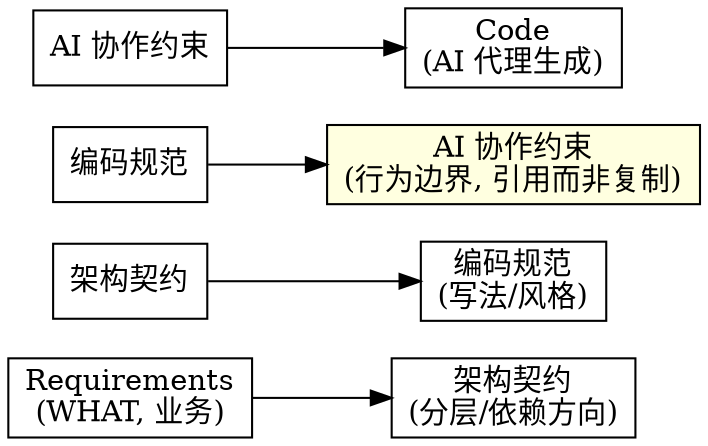
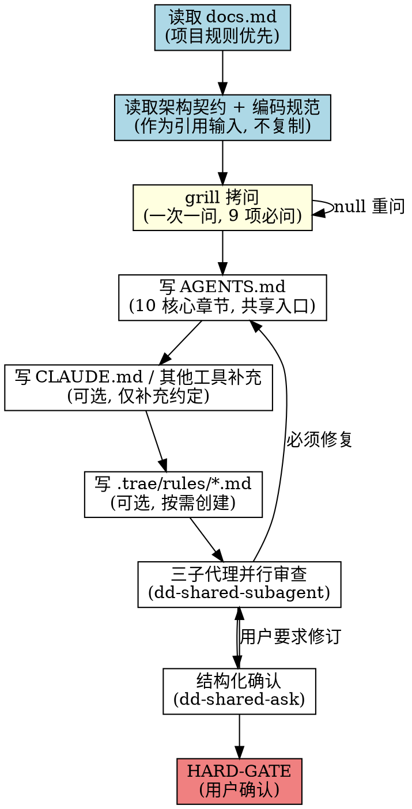
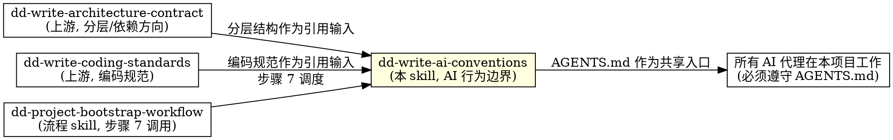

# 编写 AI 协作约束（dd-write-ai-conventions）

## 概述

**AI 协作约束定义"AI 代理在本项目工作时的行为边界"，不定义"系统是什么"（Requirements 职责），不定义"系统怎么分层"（架构契约职责），也不定义"代码怎么写"（编码规范职责）。**

AGENTS.md 是整个项目的"AI 代理共享入口契约"。它回答：AI 必须先读什么、必须遵守哪些边界、必须按什么流程工作、必须用什么命令验证、必须以什么方式提交与结束会话。即使后续重构类名、调整模块拆分，AGENTS.md 基本不需要改——它只引用架构契约与编码规范，不复制内容。

**AGENTS.md 是共享入口，CLAUDE.md 只写 Claude Code 的补充约定，不与 AGENTS.md 重复。** 其他 AI 工具（Cursor/Trae/Codex）按需创建对应补充文件或不创建。`.trae/rules/*.md` 是细粒度规则文件，按项目实际按需创建。

**违反规则的字面意思就是违反规则的精神。**

## Priority 分层（规则权重）

| 优先级 | 含义 | 示例 | 违反后果 |
|--------|------|------|---------|
| **P0** | 绝不能违反 | AGENTS.md 必含且为共享入口、不复制架构契约/编码规范原文、CLAUDE.md 不与 AGENTS.md 重复 | 立即重写违规内容 |
| **P1** | 尽量遵守 | AGENTS.md 10 章节齐全、引用而非复制、grill 必问 9 项全部问完 | 补齐缺失项 |
| **P2** | 建议 | 文档头部版本号、中文标点、英文术语保持原文 | 提醒修正 |

**冲突处理优先级：** User > Skill > Default behavior。当用户明确要求与 P0 规则冲突时，用 AskUserQuestion 提出，由用户决定。

## 何时使用

- 新项目 bootstrap 阶段，需要确立 AI 代理共享入口与行为边界
- brownfield 项目首次引入 AI Coding 工作流，需要补齐 AGENTS.md
- 用户提到"AI 协作约束"、"AGENTS.md"、"CLAUDE.md"、"AI 约定"、"写 AI 规则"、"trae rules"、"AI 代理规则"
- dd-project-bootstrap-workflow 步骤 7 调用本 skill
- AI 行为漂移：会话被自行终止、提交前未过 lint、绕过文档同步规则、用 sleep 代替条件等待
- AGENTS.md 与 CLAUDE.md 内容大量重复，维护时频繁漂移

**不适用：** 写需求文档（用 dd-write-requirements）、写设计/架构契约（用 dd-write-design / dd-write-architecture-contract）、写编码规范（用 dd-write-coding-standards）、bug 修复、功能开发

## 项目规则优先（强制首步）

写 AI 协作约束前，**必须先读取项目的 docs.md**。docs.md 的规则优先于 skill 的默认规则。

### 读取路径（按存在情况尝试）

```bash
test -f .trae/rules/docs.md && cat .trae/rules/docs.md
test -f docs/docs.md && cat docs/docs.md
test -f docs.md && cat docs.md
```

### 从 docs.md 提取并记录

1. **AI 约束文件存放路径**（根目录 AGENTS.md / CLAUDE.md；权威规范文件 `docs/standards/`；Trae IDE 特定入口 `.trae/rules/`）
2. **文档头部格式**（如 `> 最后更新：YYYY-MM-DD | 版本：vX.Y`）
3. **标点符号规则**（中文标点 / 英文术语保持原文）
4. **historys 同步规则**（架构变更 / 入口文档变更是否需追加 history）
5. **同步更新规则**（修改 AGENTS.md 时是否需同步 CLAUDE.md 或规则文件）
6. **既有规则文件清单**（已存在哪些 `docs/standards/*.md` 与 `.trae/rules/*.md`，避免重复创建）

### 处理规则

- **docs.md 存在** → docs.md 规则优先于 skill 默认规则
- **docs.md 不存在** → 用 skill 默认规则
- **docs.md 规则与 skill P0 冲突时** → P0 优先（AGENTS.md 必含且为共享入口是铁律），用 AskUserQuestion 提出冲突
- **docs.md 规则与 skill P1/P2 冲突时** → docs.md 优先（项目约定 > 通用建议）

## 上游引用输入（强制读取）

写 AGENTS.md 前，**必须先读取架构契约与编码规范**作为引用输入（不复制原文，只引用文件路径与核心约束名）：

- **架构契约**（dd-write-architecture-contract 产出）：分层结构、依赖方向、UI 框架分区 → AGENTS.md 第 3 章"架构边界"引用
- **编码规范**（dd-write-coding-standards 产出）：`docs/standards/CODING_STANDARDS.md` + `docs/standards/git-commit-message.md` + 语言/测试规则 → AGENTS.md 第 6 章"编码规范"引用
- 若上游文件不存在 → 用 AskUserQuestion 提示先走对应 skill，不得自行编造架构与规范内容

## 核心原则：引用不是复制



| 层级 | 内容 | 是否写代码 | AI 是否遵守 |
|------|------|-----------|-----------|
| Requirements | 用户目标、业务规则 | 绝不 | 必须遵守 |
| 架构契约 | 分层、依赖方向、模块边界 | 不写代码符号 | 必须遵守 |
| 编码规范 | 缩进/命名/日志/并发/错误 | 不写具体类名作为示例 | 必须遵守 |
| **AI 协作约束** | **AI 必读资料/工作流程/验证命令/禁止事项/会话交互** | **不复制架构与规范原文** | **必须遵守** |
| Code | 具体实现 | 完整代码 | 可参考可优化 |

**关键区分：** 架构契约说"Core 不能依赖 UI"，编码规范说"Core 代码用 4 空格缩进"，AI 协作约束说"AI 改动前先读架构契约与编码规范，commit 前过 lint"。AGENTS.md 引用上游，不重复上游。

## grill 拷问环节（写约束前必做）

写 AGENTS.md 前，针对项目情况**一次一问**拷问用户（用 AskUserQuestion，每问等用户回答再问下一问）。不可一次性抛出全部问题。

### 必问清单（9 项）

1. **AI 工具栈**：项目使用哪些 AI 工具？（Claude Code / Cursor / Trae / Codex / 多工具并存）—— 决定是否写 CLAUDE.md，是否需要其他工具的补充文件
2. **必读资料**：AI 开始改动前至少阅读哪些权威文档？（功能列表 / 编码规范 / docs 治理规范 / 提交规范 / 对应功能的设计文档）
3. **架构边界引用**：是否已有架构契约可引用？分层结构如何？UI 框架分区是否需要写进 AGENTS.md（还是只引用架构契约）
4. **工作流程关键步骤**：先看 git 状态 → 阅读规划文档 → 涉及新功能先更新设计文档 → TDD → 聚焦修改 → 验证，是否需要裁剪或追加项目特定步骤
5. **文档同步规则**：哪些变更触发 historys 追加？（关键 docs / 功能设计 / 实现计划 / 架构决策）
6. **验证命令**：lint / 测试 / 编译检查命令分别是什么？是否需要区分 CI 与本地？全量回归是否必须由 CI 执行
7. **Git 提交规范**：Conventional Commits 类型 / scope 约定？Swift 项目 commit 前是否强制 swiftlint？是否禁止 push --force / rebase
8. **禁止事项**：项目特定禁忌有哪些？（如 Core 引入 UI 依赖、绕过文档同步、用 sleep 代替条件等待、吞掉错误、直接结束会话）
9. **会话交互规则**：是否禁止 AI 直接结束会话？是否要求每次结束前用 AskUserQuestion 询问？是否要求调用前复制上下文到剪切板

### 处理规则

- 用户回答模糊（如"差不多就行"）→ 用 AskUserQuestion 给 2-3 个具体选项让用户选
- 用户回答与既有架构契约/编码规范冲突 → 标注冲突，以架构契约/编码规范为准，AGENTS.md 只引用不重写
- 用户跳过某问 → 不得自行假设默认值，标记为"待定"并在 HARD-GATE 前补问
- 不同项目用不同 AI 工具 → CLAUDE.md 不是所有项目都需要，按用户回答决定

## 流程



<HARD-GATE>
严格按 read_docs → read_upstream → grill → write_agents → write_claude → write_rules → review → ask → gate 顺序执行。HARD-GATE 触发条件全部满足后才算完成。禁止跳过 grill、禁止跳过三子代理审查、禁止跳过一次一问确认、禁止把 AGENTS.md 与 CLAUDE.md 并行写完再批量确认、禁止自行宣布完成。
</HARD-GATE>

## 产出文件结构

### 必含文件

- `AGENTS.md` — 共享 AI 代理规则主入口（所有 AI 工具共用，仓库根目录）

### 可选文件（按 grill 回答按需创建）

| 文件 | 创建条件 | 内容定位 |
|------|----------|----------|
| `CLAUDE.md` | 项目使用 Claude Code | Claude Code 专用补充约定，不复制 AGENTS.md 主体（仓库根目录） |
| `.trae/rules/*.md` | 项目使用 Trae IDE | Trae IDE 特定规则入口，**引用 `docs/standards/` 权威来源，不复制原文**；按需创建 `docs.md`（文档治理入口）、`git-commit-message.md`（提交规范入口）、`{语言}-rules.md`（语言规则入口）、`xctest-rules.md`（测试规则入口） |

**重要区分：**
- **权威来源**：`docs/standards/CODING_STANDARDS.md`、`docs/standards/git-commit-message.md`、`docs/standards/{语言}-rules.md`、`docs/standards/{测试}-rules.md` — 由 dd-write-coding-standards 产出，是规范正文
- **Trae IDE 入口**：`.trae/rules/*.md` — 仅作为 Trae IDE 的规则入口文件，引用 `docs/standards/` 对应文件，不复制规范原文
- **文档治理**：仓库根目录 `docs.md` 由 dd-project-bootstrap-workflow 治理规范抽离产出，`.trae/rules/docs.md` 可作为 Trae IDE 入口引用根目录 `docs.md`

**约束：** 可选文件按需创建，不强制全部生成。无对应需求不创建空文件。

## AGENTS.md 核心章节（10 章）

按项目已有 AGENTS.md 优先；无 AGENTS.md 时使用以下默认 10 章。**每章不可跳过**。

1. **项目定位**：一句话核心目标 + 最低系统要求 + 开发工具。不写实现细节
2. **必读资料**：开始改动前至少阅读的权威文档列表（功能列表 / 编码规范 / docs 治理规范 / 提交规范 / 对应功能的设计文档）
3. **架构边界**：分层结构 + 依赖方向 + UI 框架分区（**引用架构契约文件路径与不变量编号，不复制原文**）
4. **工作流程**：先看 git 状态 → 阅读规划文档 → 涉及新功能先更新设计文档 → TDD → 聚焦修改 → 验证。每步简洁可执行
5. **文档同步**：引用 docs 治理规范（修改设计 / 架构 / 实现计划时同步更新对应文档 + historys 追加）。不复制 docs.md 原文
6. **编码规范**：引用 `docs/standards/CODING_STANDARDS.md`、`docs/standards/git-commit-message.md` 与对应语言/测试规则文件。不复制规范原文
7. **验证命令**：lint / 测试 / 编译检查命令，区分 CI 与本地。明确全量回归是否必须由 CI 执行
8. **Git 与提交**：commit 前检查（Swift 项目过 swiftlint）+ Conventional Commits 规范（引用 git-commit-message.md）。禁止 push --force / rebase 等危险操作
9. **禁止事项**：明确禁止的行为（如 Core 引入 UI 依赖、绕过文档同步、用 sleep 代替条件等待、吞掉错误、直接结束会话）
10. **会话交互**：是否禁止直接结束会话 + AskUserQuestion 规则（调用前复制上下文到剪切板）

## CLAUDE.md 章节模板（可选，Claude Code 专用补充）

1. **入口规则**：先阅读 AGENTS.md，冲突时以 AGENTS.md 为准，除非用户在当前任务中明确要求例外
2. **Claude Code 补充约定**：确认任务范围 / 不复制 AGENTS.md 主体 / 涉及 Superpowers skill 按对应流程 / 修改前说明范围 / 完成后说明验证
3. **常用入口**：共享代理规则 / 编码规范 / 文档规范 / 提交规范 / 功能列表（只列文件路径，不复制内容）

**约束：** CLAUDE.md 只写 Claude Code 特有的补充约定，AGENTS.md 已有的规则不重复。其他 AI 工具的补充文件同理。

## .trae/rules/*.md 写作要求

`.trae/rules/*.md` 是 Trae IDE 的规则入口文件，**引用 `docs/standards/` 权威来源，不复制规范原文**。

- **docs.md**（Trae 入口）：引用仓库根目录 `docs.md`（文档治理规范），可补充 Trae IDE 特定的规则加载顺序说明。不复制根目录 `docs.md` 内容
- **git-commit-message.md**（Trae 入口）：引用 `docs/standards/git-commit-message.md`，可补充 Trae IDE 的提交检查入口说明
- **{语言}-rules.md**（Trae 入口）：引用 `docs/standards/{语言}-rules.md`，可补充 Trae IDE 的 lint 集成说明
- **xctest-rules.md**（Trae 入口）：引用 `docs/standards/{测试}-rules.md`，可补充 Trae IDE 的测试运行说明

**关键原则：** `.trae/rules/*.md` 只写 Trae IDE 特定的入口说明与引用，规范正文唯一来源是 `docs/standards/`。项目不使用 Trae IDE 时不创建 `.trae/rules/` 目录。

**规则文件头部**：规则文件可省略 `> 最后更新：YYYY-MM-DD | 版本：vX.Y`（仅 AGENTS.md / CLAUDE.md 必含）。

## 审查与确认

### 三子代理并行审查（复用 dd-shared-subagent）

写完 AGENTS.md 与可选文件后，发起 3 个子代理并行审查：

| 方向 | 名称 | 检查项 |
|------|------|--------|
| **A** | 覆盖与范围 | AGENTS.md 10 章节齐全、必含文件存在、可选文件按需创建无空文件、不混入需求/设计/代码细节 |
| **B** | 一致与正确 | AGENTS.md 与 CLAUDE.md 无内容重复、引用路径正确（架构契约/编码规范/规则文件存在）、不与上游冲突、commit 规范与 git-commit-message.md 一致 |
| **C** | 可验证与可观测 | 验证命令可执行、禁止事项可机器或人工检查、会话交互规则明确、grill 9 项回答已全部纳入 |

### 结构化确认（复用 dd-shared-ask）

审查后用 AskUserQuestion 逐项确认重大项（一次一问）：

- AGENTS.md 是否作为共享入口（其他 AI 工具也用这份）
- 是否需要创建 CLAUDE.md（取决于是否使用 Claude Code）
- 验证命令是否可在本地执行
- 禁止事项是否符合项目实际

null 输入按 dd-shared-ask 规则重问，不得假设默认值。

## HARD-GATE

**在用户明确确认前，不得宣布 AI 协作约束完成。** HARD-GATE 触发条件：

1. AGENTS.md 10 核心章节齐全
2. 可选文件按需创建（无空文件，无未问需求的冗余文件）
3. 上游架构契约与编码规范文件存在且被正确引用（不复制原文）
4. grill 9 项必问全部问完，用户回答已全部纳入约束
5. AGENTS.md 与 CLAUDE.md 无内容重复（CLAUDE.md 只写补充约定）
6. 三子代理审查的「必须修复」项全部处理
7. 用户通过 AskUserQuestion 明确确认"AI 协作约束完成"

任一项不满足，回到对应步骤修订。**禁止自行宣布完成。**

## 与其他 skill 的关系



- **上游**：dd-write-architecture-contract 的分层结构与依赖方向、dd-write-coding-standards 的编码规范，作为引用输入（AGENTS.md 引用，不复制）
- **流程 skill**：dd-project-bootstrap-workflow 步骤 7 调度本 skill
- **下游**：所有 AI 代理（Claude Code / Cursor / Trae / Codex）在本项目工作时必须遵守 AGENTS.md
- **共享**：复用 dd-shared-subagent（三子代理审查）、dd-shared-ask（结构化询问 + null 重问 + worktree 选择）

## 输出要求

- 文件名：`AGENTS.md`（必含，根目录）、`CLAUDE.md`（可选，根目录）、`.trae/rules/*.md`（可选，Trae IDE 入口，引用 `docs/standards/` 权威来源）
- 格式：Markdown，层级标题
- 文档头部：`> 最后更新：YYYY-MM-DD | 版本：vX.Y`（仅 AGENTS.md / CLAUDE.md 必含，规则文件可省略）
- 文末：版本记录列表（仅 AGENTS.md / CLAUDE.md）
- 中文标点（，。！？：；），英文术语保持原文
- 不使用 emoji（除非用户明确要求）
- 不复制架构契约 / 编码规范原文，只引用文件路径与约束名
- AGENTS.md 与 CLAUDE.md 无内容重复

## 验证清单

完成前自查：

- [ ] 读取过项目 docs.md（若存在）
- [ ] 读取过架构契约与编码规范（若存在），AGENTS.md 只引用不复制
- [ ] grill 9 项必问全部问完，用户回答已纳入约束
- [ ] AGENTS.md 10 核心章节齐全
- [ ] CLAUDE.md（如创建）只写补充约定，与 AGENTS.md 无内容重复
- [ ] .trae/rules/*.md 按需创建（仅 Trae IDE 项目），引用 docs/standards/ 权威来源，无空文件，无未问需求的冗余文件
- [ ] AGENTS.md 文档头部含版本号与最后更新日期
- [ ] 验证命令可执行，区分 CI 与本地
- [ ] 禁止事项明确可检查
- [ ] 会话交互规则明确（是否禁止直接结束会话）
- [ ] 三子代理审查「必须修复」项全部处理
- [ ] 用户通过 AskUserQuestion 明确确认完成

**任一项失败，修订后重新验证。**

## Git 工作流合规

本技能涉及 Git 操作时，遵循 [dd-git-workflow](../dd-git-workflow/SKILL.md) 系列子技能。分支命名 `docs/ai-conventions`，merge-only，禁止 rebase。修改公共文件加 `PublicFile` tag。
