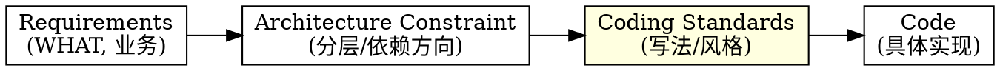
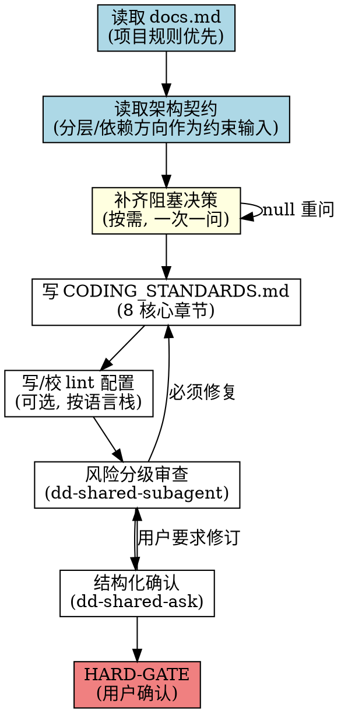
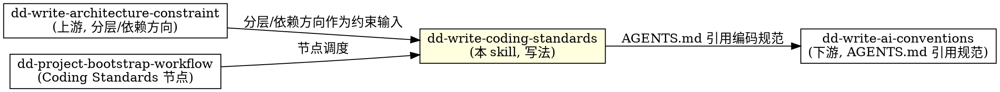

# 编写编码规范（CODING_STANDARDS.md）

## 概述

**编码规范定义"代码具体怎么写"（HOW 写法），不定义"系统怎么分层"（架构契约职责），也不定义"系统应该是什么"（Requirements 职责）。**

CODING_STANDARDS.md 是整个 AI Coding 项目的"写法契约"。它回答：缩进多少格、大括号放哪、类型/方法/变量/常量怎么命名、日志怎么记、并发怎么守边界、错误怎么处理、魔术数字怎么消除、测试怎么写。即使后续重构类名、调整模块拆分，编码规范基本不需要改。

**编码规范是项目级的，适用于整个项目所有代码。** 架构契约定义分层与依赖方向，编码规范定义每一行代码的写法。两者互补不冲突——架构契约说"Core 不能依赖 UI"，编码规范说"Core 里的代码统一用 4 空格缩进、Allman 大括号"。

**不写具体类名/方法签名作为示例**——避免被误读为"必须这样命名"。示例用自然语言或通用形式描述。

**违反规则的字面意思就是违反规则的精神。**

## Priority 分层（规则权重）

| 优先级 | 含义 | 示例 | 违反后果 |
|--------|------|------|---------|
| **P0** | 绝不能违反 | 不写具体类名/方法签名作为命名示例、lint 配置与规范一致、日志不输出敏感信息 | 立即重写违规内容 |
| **P1** | 尽量遵守 | 8 章节齐全、命名约定明确、并发边界明确、错误处理可检索 | 补齐缺失项 |
| **P2** | 建议 | 中文标点、文档头部版本号、验证命令齐全 | 提醒修正 |

**冲突处理优先级：** User > Skill > Default behavior。当用户明确要求与 P0 规则冲突时，用 AskUserQuestion 提出，由用户决定。

## 何时使用

- 新项目创建、AI Coding 项目迁移、团队确立统一写法时，写编码规范
- 用户提到"编码规范"、"CODING_STANDARDS"、"写编码规范"、"coding standards"、"lint 配置"、"代码风格规范"
- dd-project-bootstrap-workflow 的 Coding Standards 节点
- AGENTS.md 引用了 CODING_STANDARDS.md 但文件不存在
- AI 生成的代码风格漂移、命名混乱、日志直接 print、并发更新 UI
- lint 配置与编码规范不一致

**不适用：** 写需求文档（用 dd-write-requirements）、写设计/架构契约（用 dd-write-design / dd-write-architecture-constraint）、写 AGENTS.md / AI 协作约定（用 dd-write-ai-conventions）、bug 修复、功能开发

## 上游上下文协议

被 `dd-project-bootstrap-workflow` 调用时，先读取 `project_mode`、`host`、`worktree_path`、`resolved_decisions`、`artifact_paths`、`review_level`、`delivery_policy` 和已批准架构契约。

- 已确定的语言、工具链、工作环境和架构边界不得重复询问；
- 先检查现有 lint/test/CI 配置，只询问仍会阻塞规范的未知决策；
- 上游与工具配置冲突时返回 blocker；
- 独立调用时才执行最小 Preflight。

## 质量基线

| 模式 | 强制政策 |
|------|---------|
| Greenfield | 新项目零新增 lint error/violation；warning 必须有明确政策，不能无限累积 |
| Brownfield | 记录现有 baseline；changed code 不新增违规；new code 满足完整规范；CI 使用 ratchet 逐步收紧 |

禁止要求 Brownfield 一次性清零所有历史债务，也禁止以“已有债务”为由放宽新代码。

## 项目规则优先（强制首步）

写 CODING_STANDARDS.md 前，**必须先读取项目的 docs.md**。docs.md 的规则优先于 skill 的默认规则。

### 读取路径（按存在情况尝试）

```bash
test -f .trae/rules/docs.md && cat .trae/rules/docs.md
test -f docs/docs.md && cat docs/docs.md
test -f docs.md && cat docs.md
```

### 从 docs.md 提取并记录

1. **文档存放路径**（如 `docs/`）
2. **文档头部格式**（如 `> 最后更新：YYYY-MM-DD | 版本：vX.Y`）
3. **标点符号规则**（中文标点 / 英文术语保持原文）
4. **同步更新规则**（修改编码规范时是否需同步 lint 配置或 AGENTS.md）
5. **语言栈约定**（项目是否明确主语言 / 多语言并存）

### 处理规则

- **docs.md 存在** → docs.md 规则优先于 skill 默认规则
- **docs.md 不存在** → 用 skill 默认规则
- **docs.md 规则与 skill P0 冲突时** → P0 优先（lint 配置与规范一致是铁律），用 AskUserQuestion 提出冲突
- **docs.md 规则与 skill P1/P2 冲突时** → docs.md 优先（项目约定 > 通用建议）

## 核心原则：写法不是架构



| 层级 | 内容 | 会不会随代码变化 | 是否写代码 | AI 是否遵守 |
|------|------|----------------|-----------|-----------|
| Requirements | 用户目标、业务规则 | 基本不会 | 绝不 | 必须遵守 |
| Architecture Constraint | 分层、依赖方向、模块边界 | 偶尔调整 | 不写代码符号 | 必须遵守 |
| **Coding Standards** | **缩进/命名/日志/并发/错误/魔术数字/测试** | **基本不会** | **不写具体类名/方法签名作为示例** | **必须遵守** |
| Code | 具体实现 | 一直变化 | 完整代码 | 可参考可优化 |

**关键区分：** 架构契约说"Core 不能依赖 UI"，编码规范说"Core 里的代码统一用 4 空格缩进"。编码规范不重复架构契约，只补充写法。

## grill 拷问环节（写规范前必做）

先从上游上下文、代码和工具配置回答下列问题。只有答案仍未知且会阻塞产物时，才**一次一问**拷问用户。

### 检查清单（8 项）

1. **编程语言**：项目使用什么主语言？是否有次要语言？（Swift / Python / TypeScript / Go / Rust / 多语言）
2. **代码风格**：缩进几格？大括号 Allman 还是 K&R？行宽上限多少？
3. **命名约定**：类型/方法/变量/常量分别用什么风格？（PascalCase / camelCase / snake_case / SCREAMING_SNAKE_CASE）
4. **日志方案**：项目用什么 Logger？敏感信息边界在哪？（禁止直接 print、不输出用户输入 / 含用户名路径）
5. **并发模型**：主线程边界？协程？线程池？UI 状态更新必须在哪里？
6. **错误处理策略**：抛异常？返回错误码？Result 类型？错误日志必须带哪些上下文？
7. **lint 工具与配置**：swiftlint / ruff / eslint / golangci-lint？配置文件放哪？
8. **测试框架与命名约定**：XCTest / pytest / Jest？测试命名规范？Mock 边界（只 mock 外部依赖，不 mock 被测对象本身）？

### 处理规则

- 用户回答模糊（如"差不多就行"）→ 用 AskUserQuestion 给 2-3 个具体选项让用户选
- 用户回答与已有 lint 配置冲突 → 标注冲突，写规范时以用户回答为准并提示同步改 lint 配置
- 用户跳过且该项会阻塞规范 → 标记 blocker；不阻塞时记录为 deferred，不为凑齐问题而重问

## 流程



## 产出文件结构

### 必含文件

- `docs/standards/CODING_STANDARDS.md` — 编码规范正文（标准入口、跨主题原则和详细规范索引）
- `docs/standards/git-commit-message.md` — 提交格式与 scope 规范

### 可选 standards 文件（按语言栈与项目需要）

| 文件 | 创建条件 | 内容定位 |
|------|----------|----------|
| `docs/standards/{语言}-rules.md` | 项目有语言特定规则 | 如 `swift-rules.md`（Allman 风格 / 4 空格缩进 / 命名约定）；如 `python-rules.md`（类型标注 / import 约定） |
| `docs/standards/{测试框架}-rules.md` | 项目有测试规则需求 | 如 `xctest-rules.md`（TDD / Mock 规范 / 测试隔离）；如 `pytest-rules.md` |

### 可选 lint 配置（按语言栈，至少一个，置于仓库根目录便于 CLI 读取）

| 语言 | 配置文件 |
|------|---------|
| Swift | `.swiftlint.yml` |
| Python | `.pylintrc` / `pyproject.toml [tool.ruff]` / `.flake8` |
| TypeScript / JavaScript | `.eslintrc.js` / `.eslintrc.json` / `eslint.config.js` |
| Go | `.golangci.yml` |
| Rust | `clippy.toml` / `rustfmt.toml` |

**约束：** lint 配置必须与 CODING_STANDARDS.md 一致。例如规范说"行宽 120"，lint 配置必须设为 120。不一致以规范为准，修订 lint 配置。

同时写明 Greenfield/Brownfield 对应的 lint baseline、changed-code 检查和 CI ratchet 命令；命令无法执行时标记 blocker，不编造验证结果。

## CODING_STANDARDS.md 核心章节（8 章）

按项目已有规范优先；无规范时使用以下默认 8 章。**每章不可跳过**。

1. **语言风格**：缩进（4 空格）、大括号风格（Allman/K&R）、行宽上限、命名约定（类型/方法/变量/常量分别约定）
2. **文档注释**：公共 API 必须有文档注释；复杂内部逻辑需简洁说明；禁止无意义注释
3. **日志规范**：使用项目 Logger（不写死具体类名）；禁止直接 print；日志不输出敏感信息 / 用户输入 / 含用户名路径；错误日志需上下文 metadata
4. **并发规范**：UI 状态更新必须在主线程或项目约定的并发边界内；避免数据竞争；明确并发原语使用场景
5. **错误处理**：不吞掉错误；错误需可检索上下文（错误码 / metadata）；不只用自然语言日志；明确抛异常 / 返回错误码 / Result 类型的使用场景
6. **魔术数字与魔术字符串**：使用命名常量；系统键码 / 阈值 / 配置键使用命名规范；禁止散落字面量
7. **测试规范**：TDD 优先；Mock 只模拟外部依赖，不 mock 被测对象本身；测试命名规范；测试隔离
8. **验证命令**：lint 命令、测试命令、快速编译检查命令

## 写作规则

- **不写具体类名 / 方法签名作为示例**——避免被误读为"必须这样命名"。用自然语言或通用形式描述
- **不与架构契约冲突**——架构契约定义分层与依赖方向，编码规范定义具体写法，两者互补
- **lint 配置必须与规范一致**——不一致以规范为准
- **章节内容用规则 + 反例 + 正例**，反例和正例不绑定具体业务类名
- **禁止模糊词**：optimize、improve、better、优化、改进、更好

## 审查与确认

### 风险分级审查（复用 dd-shared-subagent）

按上游 `review_level` 调用 [dd-shared-subagent](../dd-shared-subagent/SKILL.md)；独立调用默认 `standard`。Level 决定成本，不改变 A/B/C 语义：

| 方向 | 名称 | 检查项 |
|------|------|--------|
| **A** | 覆盖与范围 | 8 章节齐全、lint 配置存在且与规范一致、不混入架构契约内容、不混入需求内容 |
| **B** | 一致与正确 | 命名约定前后一致、并发边界明确、错误处理策略明确、不与架构契约冲突 |
| **C** | 可验证与可观测 | 验证命令可执行、规则可机器检查（lint 能覆盖）、规则可人工检查 |

### 结构化确认（复用 dd-shared-ask）

审查后用 AskUserQuestion 逐项确认重大项（一次一问）：

- 命名约定是否符合团队习惯
- 并发边界是否符合项目实际
- lint 工具选型是否确认
- 验证命令是否可在本地执行

null 输入按 dd-shared-ask 规则重问，不得假设默认值。

## HARD-GATE

**在用户明确确认前，不得宣布编码规范完成。** HARD-GATE 触发条件：

1. CODING_STANDARDS.md 8 章节齐全
2. lint 配置（如需）已写且与规范一致
3. 适用 `review_level` 的「必须修复」项全部处理
4. 已确认输入与新增决策全部纳入规范
5. 用户通过 AskUserQuestion 明确确认"编码规范完成"

任一项不满足，回到对应步骤修订。**禁止自行宣布完成。**

## 与其他 skill 的关系



- **上游**：dd-write-architecture-constraint 的分层结构与依赖方向作为约束输入（编码规范不重复分层，只补充写法）
- **下游**：dd-write-ai-conventions 的 AGENTS.md 引用编码规范；功能开发时所有代码需遵守
- **流程 skill**：dd-project-bootstrap-workflow 的 Coding Standards 节点调度本 skill
- **共享**：复用 dd-shared-subagent（风险分级审查）、dd-shared-ask（结构化询问 + null 重问）

## 输出要求

- 文件名：`docs/standards/CODING_STANDARDS.md`、`docs/standards/git-commit-message.md`（必含）；`docs/standards/{语言/测试规则}.md`（可选）
- 格式：Markdown，层级标题
- 文档头部：`> 最后更新：YYYY-MM-DD | 版本：vX.Y`
- 文末：版本记录列表
- 中文标点（，。！？：；），英文术语保持原文
- 不使用 emoji（除非用户明确要求）
- 不写具体类名 / 方法签名作为命名示例

## 验证清单

完成前自查：

- [ ] 读取过项目 docs.md（若存在）
- [ ] 读取过架构契约（若存在），编码规范不与架构契约冲突
- [ ] 上游输入与必要的新决策已纳入规范，已解决事实未重问
- [ ] docs/standards/CODING_STANDARDS.md 8 核心章节齐全
- [ ] lint 配置（如需）已写且与规范一致
- [ ] 全文无具体类名 / 方法签名作为命名示例
- [ ] 全文无"优化 / 改进 / 更好"等模糊词
- [ ] 验证命令可执行
- [ ] Greenfield/Brownfield 质量政策与验证命令明确
- [ ] 适用 `review_level` 的「必须修复」项全部处理
- [ ] 用户通过 AskUserQuestion 明确确认完成

**任一项失败，修订后重新验证。**

## Git 工作流合规

本技能涉及 Git 操作时，遵循 [dd-git-workflow](../dd-git-workflow/SKILL.md) 系列子技能。分支命名 `docs/coding-standards`，merge-only，禁止 rebase。修改公共文件加 `PublicFile` tag。
