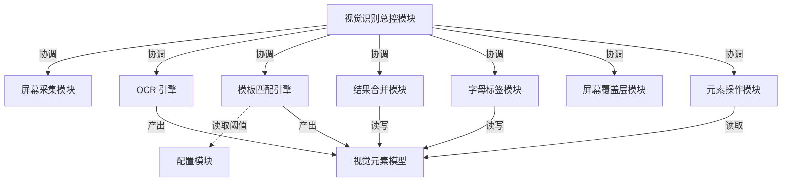
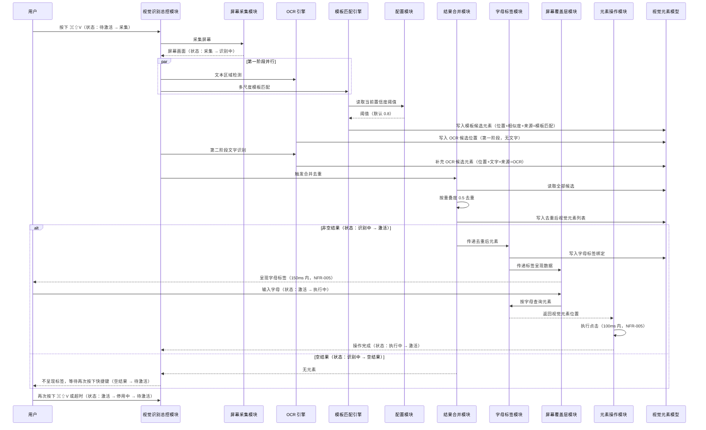
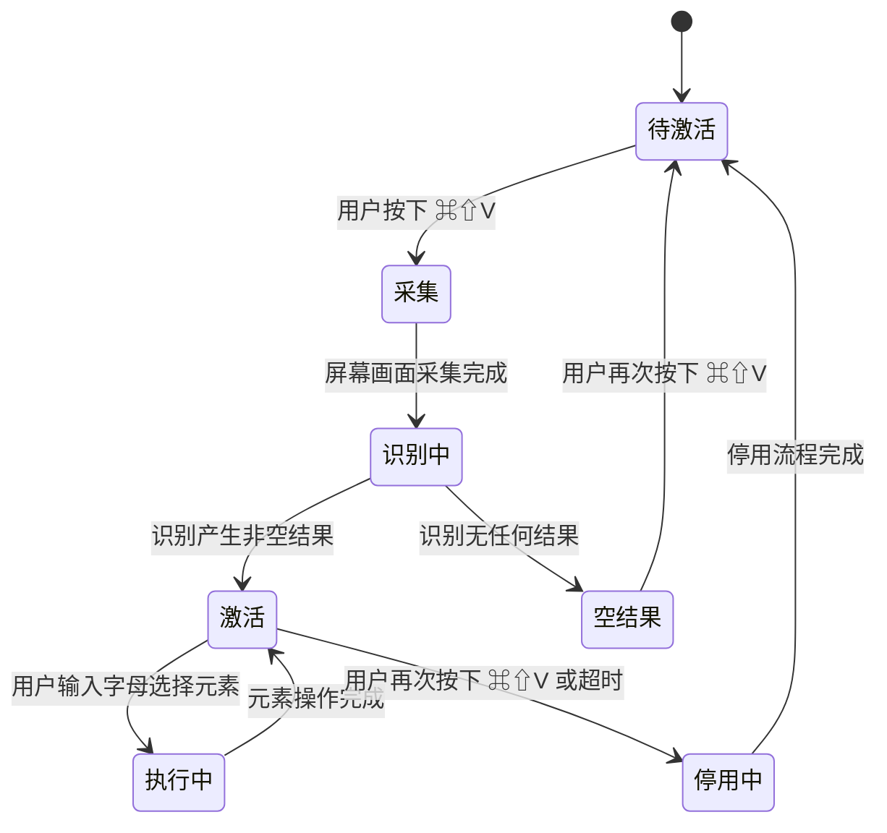

# 视觉识别 F3.2 模板匹配设计文档

> 最后更新：2026-07-16 | 版本：v1.0

## 1. 文档目的与定位

本文档是 F3.2 模板匹配功能的 Design 文档，回答**系统内部由谁负责什么、模块如何协作、数据如何流动、状态如何变化**。

需求来源以 Requirements 文档（`01_Requirements.md`，版本 v1.0）为唯一事实来源（Single Source of Truth）。本文档不复制需求文本，仅在设计需要时以 `FR-x` / `NFR-x` / `AC-x` / `Constraints-x` 编号引用。

**分界原则**：

- Requirements 回答"业务为什么需要、系统必须做到什么"。
- Design 回答"为了满足需求，系统内部如何组织"。
- 本文不讨论产品需求（如标签颜色、按钮位置、是否支持导出 PDF），不涉及具体类名、方法签名、文件路径、并发原语符号（这些属于 Implementation Plan 与 Code 范畴）。
- 模块以中文命名，描述其职责与边界；具体类结构、协议划分、命名风格由 Implementation Plan 决定（Requirements 第 11.1 节已将此列为允许 AI 自由发挥项）。

---

## 2. 模块划分

依据 `FR-002`（并行执行）、`FR-010`（两阶段流程）、`FR-006`（合并去重）、`FR-008`（统一字母标签）、`FR-011`（状态机）、`FR-012`（元素点击），系统划分为以下十个模块。模块划分遵循"并行路径分离、合并点独立、协调者中立"原则。

| 模块 | 一句话职责 | 对应需求 |
|------|-----------|---------|
| 视觉识别总控模块 | 管理识别流程状态机，协调各子模块的执行时机 | FR-001、FR-010、FR-011 |
| 屏幕采集模块 | 采集屏幕画面，作为两条识别路径的共同输入 | FR-001、FR-002 |
| OCR 引擎 | 两阶段执行：文本区域检测、文字内容识别 | FR-010 |
| 模板匹配引擎 | 多尺度归一化互相关匹配，输出带相似度与来源的候选 | FR-003、FR-004、FR-005 |
| 结果合并模块 | 合并 OCR 与模板匹配候选，按重叠度去重 | FR-006 |
| 字母标签模块 | 为合并后的视觉元素统一分配字母标签，提供按区域查询 | FR-008、FR-009 |
| 屏幕覆盖层模块 | 在屏幕最上层呈现字母标签，接收用户字母输入 | FR-008、FR-012 |
| 元素操作模块 | 根据字母标签定位元素位置并执行点击 | FR-012 |
| 配置模块 | 管理模板匹配置信度阈值，支持运行时变更与生效 | FR-005、NFR-006 |
| 视觉元素模型 | 承载视觉元素数据（位置、来源等），跨模块流动的统一数据载体 | FR-007 |

---

## 3. 职责边界

本节逐模块说明"负责什么"与"不负责什么"。边界冲突在合并去重点与标签分配点最易发生，故对这两处做显式约束。

### 3.1 视觉识别总控模块

- **负责**：维护识别流程状态机（`FR-011` 的七个状态与九条转换规则）；响应快捷键 `⌘⇧V`（`Constraints-7`）；按状态推进屏幕采集、第一阶段并行识别、第二阶段 OCR 文字识别、合并去重、标签分配、覆盖层呈现、元素操作的执行时机。
- **不负责**：具体识别算法、去重规则、标签编号策略、点击坐标计算。

### 3.2 屏幕采集模块

- **负责**：在进入"采集"状态时采集主显示器画面，输出屏幕画面数据给两条识别路径。
- **不负责**：识别、合并、标签、操作。不负责多显示器采集（`Out of Scope`）。

### 3.3 OCR 引擎

- **负责**：第一阶段文本区域检测，输出候选元素的位置；第二阶段对候选元素识别文字内容，补充文字属性。所有 OCR 候选元素携带"OCR 来源"标记（`FR-007`）。
- **不负责**：模板匹配、合并去重、标签分配。不负责与模板匹配引擎共享状态（`NFR-003`）。

### 3.4 模板匹配引擎

- **负责**：在原始尺寸、半尺寸、四分之一尺寸三个尺度下（`FR-003`、`Constraints-5`）执行归一化互相关匹配（`FR-004`）；汇总三尺度结果；按置信度阈值过滤候选（`FR-005`）；候选元素携带"模板匹配来源"标记（`FR-007`）。
- **不负责**：合并去重、标签分配、OCR 文字识别。不负责与 OCR 引擎共享可变状态（`NFR-003`）。

### 3.5 结果合并模块

- **负责**：接收 OCR 引擎与模板匹配引擎的候选元素；按重叠度阈值 0.5（`FR-006`、`Constraints-4`）对位置重叠的候选去重，保留其一；对两类来源一视同仁，不偏袒任一来源。
- **不负责**：识别、标签分配、点击操作。不负责阈值可配置（重叠度阈值固定，`Constraints-4`）。

### 3.6 字母标签模块

- **负责**：为合并去重后的所有视觉元素统一分配字母标签（`FR-008`），编号在 OCR 来源与模板匹配来源之间连续，不区分来源类别；提供按屏幕区域查询字母标签的能力（`FR-009`）。
- **不负责**：识别、合并去重、覆盖层渲染样式、点击执行。

### 3.7 屏幕覆盖层模块

- **负责**：在屏幕最上层呈现字母标签（`FR-008`）；接收用户输入的字母并转发查询；不区分来源类别显示样式。
- **不负责**：标签编号、识别、合并、点击坐标计算。不负责标签样式自定义（`Out of Scope`）。

### 3.8 元素操作模块

- **负责**：根据字母标签模块查询到的视觉元素位置，在该位置执行点击操作（`FR-012`）；操作完成后通知总控模块。
- **不负责**：识别、标签分配、状态机推进。

### 3.9 配置模块

- **负责**：管理模板匹配置信度阈值，默认 0.8（`FR-005`、Requirements 第 11.2 节）；支持运行时修改，保证下一次识别立即生效（`NFR-006`）；向模板匹配引擎提供当前阈值。
- **不负责**：重叠度阈值（固定 0.5，`Constraints-4`）、尺度层级（固定三级，`Constraints-5`）、快捷键（固定 `⌘⇧V`，`Constraints-7`）。

### 3.10 视觉元素模型

- **负责**：承载视觉元素的属性，至少包含位置、识别来源（取值三类：OCR 来源、模板匹配来源、机器学习模型来源，`FR-007`、`Constraints-3`）；可选承载文字内容（OCR 路径）、相似度分值（模板匹配路径）。
- **不负责**：任何业务逻辑。是纯数据载体，跨模块流动。

---

## 4. 数据流

数据流围绕 `FR-010` 定义的两阶段流程展开。第一阶段并行，第二阶段仅 OCR 路径，合并去重在两阶段结束后同步执行（`NFR-003`）。

**数据流关键约束**：

1. **并行起点**：屏幕画面是 OCR 引擎与模板匹配引擎的共同输入，由屏幕采集模块一次性产出，两条路径只读不修改，满足 `NFR-003`（无共享可变状态）。
2. **并行终点**：两条路径在结果合并模块汇合。合并去重在主流程同步执行，避免用户感知到的延迟抖动（`NFR-003`）。
3. **两阶段归属**：第一阶段并行的是 OCR 文本区域检测与模板匹配；第二阶段仅 OCR 路径执行文字识别，模板匹配路径无第二阶段（`FR-010`）。
4. **阈值读取时机**：模板匹配引擎在每次执行时从配置模块读取当前阈值，保证运行时修改下次识别立即生效（`NFR-006`）。
5. **来源标记写入点**：来源属性在识别产出时写入视觉元素模型（OCR 引擎写"OCR 来源"，模板匹配引擎写"模板匹配来源"），下游模块不修改来源属性（`FR-007`）。
6. **标签查询路径**：用户输入字母后，经覆盖层 → 字母标签模块查询 → 元素操作模块执行，标签模块是查询的唯一入口（`FR-009`）。

---

## 5. 状态变化

识别流程状态机由 `FR-011` 定义，状态集合与转换规则固定（`Constraints-6`）。视觉识别总控模块是状态的唯一持有者与推进者，其余模块不持有整体状态，仅由总控模块按状态调度。

**状态推进的责任归属**：

| 转换 | 触发来源 | 负责推进的模块 |
|------|---------|--------------|
| 待激活 → 采集 | 用户按下 `⌘⇧V` | 视觉识别总控模块（监听快捷键） |
| 采集 → 识别中 | 屏幕画面采集完成 | 屏幕采集模块 → 通知总控模块 |
| 识别中 → 激活 | 合并去重后存在元素 | 结果合并模块 → 通知总控模块 |
| 识别中 → 空结果 | 合并去重后无元素 | 结果合并模块 → 通知总控模块 |
| 激活 → 执行中 | 用户输入字母 | 屏幕覆盖层模块 → 通知总控模块 |
| 执行中 → 激活 | 点击操作完成 | 元素操作模块 → 通知总控模块 |
| 激活 → 停用中 | 用户再次按下 `⌘⇧V` 或超时 | 视觉识别总控模块（监听快捷键 / 超时定时器） |
| 空结果 → 待激活 | 用户再次按下 `⌘⇧V` | 视觉识别总控模块 |
| 停用中 → 待激活 | 停用流程完成（覆盖层隐藏、缓存清理） | 视觉识别总控模块 |

**状态机设计约束**：

- 状态集合与转换规则由 `Constraints-6` 锁定，Design 不得新增或修改状态。
- 总控模块是唯一的状态持有者，子模块通过"通知"方式反馈结果，不直接改状态，避免状态散落。
- 超时触发"激活 → 停用中"由总控模块的定时器负责，子模块不感知超时。

---

## 6. 协作关系

### 6.1 协作矩阵

行表示调用方，列表示被依赖方。`依赖`表示调用方需要被依赖方的能力或数据；`通知`表示调用方向被依赖方单向反馈结果。

| 调用方 ＼ 被依赖方 | 总控 | 屏幕采集 | OCR 引擎 | 模板匹配引擎 | 结果合并 | 字母标签 | 覆盖层 | 元素操作 | 配置 | 视觉元素模型 |
|-------------------|------|---------|---------|------------|---------|---------|--------|---------|------|------------|
| 视觉识别总控模块 | — | 依赖 | 依赖 | 依赖 | 依赖 | 依赖 | 依赖 | 依赖 | — | — |
| 屏幕采集模块 | 通知 | — | — | — | — | — | — | — | — | — |
| OCR 引擎 | 通知 | — | — | — | — | — | — | — | — | 读写 |
| 模板匹配引擎 | 通知 | — | — | — | — | — | — | — | 依赖 | 读写 |
| 结果合并模块 | 通知 | — | — | — | — | — | — | — | — | 读写 |
| 字母标签模块 | — | — | — | — | — | — | — | — | — | 读写 |
| 屏幕覆盖层模块 | 通知 | — | — | — | — | 依赖 | — | — | — | — |
| 元素操作模块 | 通知 | — | — | — | — | 依赖 | — | — | — | 读取 |
| 配置模块 | — | — | — | — | — | — | — | — | — | — |
| 视觉元素模型 | — | — | — | — | — | — | — | — | — | — |

### 6.2 关键协作场景

**场景一：第一阶段并行识别（`FR-002`、`FR-010`、`NFR-003`）**

总控模块在"识别中"状态同时启动 OCR 引擎的文本区域检测与模板匹配引擎的多尺度匹配。两条路径共享屏幕采集模块产出的画面，但各自独立工作，互不阻塞。两条路径分别向视觉元素模型写入候选，互不读取对方中间结果。并行协调由总控模块负责，子模块不感知并行。

**场景二：两阶段衔接（`FR-010`）**

第一阶段两条路径完成后，总控模块仅对 OCR 路径触发第二阶段文字识别。模板匹配路径在第一阶段即产出最终候选（已过置信度过滤），不参与第二阶段。两阶段均完成后，总控模块触发结果合并模块。

**场景三：合并去重（`FR-006`、`Constraints-4`）**

结果合并模块读取视觉元素模型中的全部候选（OCR 来源 + 模板匹配来源），按重叠度 0.5 计算两两重叠，对超过阈值的候选保留其一。去重规则不依赖来源类别，OCR 与模板匹配候选在去重时地位对等。去重后写回视觉元素模型，通知总控模块。

**场景四：标签分配与查询（`FR-008`、`FR-009`）**

字母标签模块接收合并去重后的元素列表，统一分配字母标签，编号连续、不区分来源。绑定关系写入视觉元素模型。用户输入字母时，覆盖层模块向字母标签模块查询，字母标签模块按区域坐标匹配返回当前绑定的标签对应元素。

**场景五：阈值运行时生效（`FR-005`、`NFR-006`）**

配置模块持有当前置信度阈值。模板匹配引擎每次执行时从配置模块读取阈值，不在内部缓存旧值。用户修改阈值后，配置模块立即更新，下一次识别流程中模板匹配引擎读取到的即为新值，无需重启或重新激活。

**场景六：停用流程（`FR-011`、`AC-14`）**

用户再次按下 `⌘⇧V` 或超时后，总控模块进入"停用中"状态。覆盖层模块隐藏字母标签，相关缓存由各模块清理。停用流程完成后总控模块回到"待激活"。

---

## 7. 关键设计决策

本节说明"为什么这样划分"，每条决策关联对应需求。

### 7.1 OCR 引擎与模板匹配引擎分离

- **决策**：两条识别路径分别独立成模块。
- **原因**：`FR-002` 要求并行执行，`NFR-003` 要求两条路径无共享可变状态。若合并为一个引擎，并行隔离性难以保证，且算法演进会互相耦合。
- **代价**：两条路径的候选需在下游汇合，引入结果合并模块。该代价可接受，因为合并点本就需要独立的中立规则（见 7.2）。

### 7.2 结果合并模块独立，且不归属任一识别引擎

- **决策**：合并去重由独立模块承担，OCR 引擎与模板匹配引擎均不负责合并。
- **原因**：`FR-006` 要求去重规则对两类来源一视同仁。若合并归属 OCR 引擎或模板匹配引擎，规则会天然偏向归属方，破坏中立性。
- **代价**：多一个模块。该代价换来规则的中立性与可独立演进性。

### 7.3 字母标签模块独立

- **决策**：字母标签的分配与查询由独立模块承担。
- **原因**：`FR-008` 要求标签在 OCR 来源与模板匹配来源之间统一编号、不区分来源类别显示样式。若标签分配分散在各识别引擎，难以保证编号连续与统一。`FR-009` 要求按区域查询标签，查询入口需要单一，避免多处查询结果不一致。
- **代价**：标签模块需在合并去重后介入，增加一次数据传递。该代价换来编号一致性与查询入口单一。

### 7.4 状态机集中在总控模块

- **决策**：识别流程状态机仅由视觉识别总控模块持有与推进，子模块不持有整体状态。
- **原因**：`FR-011` 的状态转换由用户操作（快捷键、字母输入）与识别结果（非空/空）共同驱动，需要一个中立的协调者综合两类信号。子模块只反馈结果，不感知整体状态，避免状态散落与不一致。
- **代价**：总控模块承担较多协调逻辑。该代价换来状态的一致性与可追溯性。

### 7.5 配置模块独立，且仅管理置信度阈值

- **决策**：置信度阈值由独立配置模块管理，模板匹配引擎每次执行时读取。
- **原因**：`NFR-006` 要求阈值运行时修改下次识别立即生效。若阈值硬编码在模板匹配引擎内部，修改需重启或重新激活，违反 `NFR-006`。配置模块仅管理置信度阈值，不管理重叠度阈值（`Constraints-4` 固定）、尺度层级（`Constraints-5` 固定）、快捷键（`Constraints-7` 固定），因为后三者由需求锁定不可配置。
- **代价**：模板匹配引擎每次执行需读取阈值。该代价换取运行时生效能力。

### 7.6 视觉元素模型作为统一数据载体

- **决策**：定义统一的视觉元素模型，承载位置、识别来源、文字内容、相似度等属性，跨模块流动。
- **原因**：`FR-007` 要求每个视觉元素携带"识别来源"属性，且来源类别固定三类（`Constraints-3`）。视觉元素从识别产出 → 合并去重 → 标签分配 → 点击操作，跨多个模块流动，若无统一载体，各模块需反复转换数据结构，易错且耦合。
- **代价**：模型需兼容两类来源的差异性属性（OCR 有文字、模板匹配有相似度）。该代价通过"可选属性"承担。

### 7.7 OCR 引擎内部两阶段，与模板匹配并行的是第一阶段

- **决策**：OCR 引擎内部分两个阶段，第一阶段（文本区域检测）与模板匹配并行，第二阶段（文字识别）在第一阶段完成后单独执行。
- **原因**：`FR-010` 明确规定两阶段的划分与并行关系。文字识别依赖文本区域检测结果，存在数据依赖，无法与模板匹配并行；而文本区域检测与模板匹配无数据依赖，可以并行。
- **代价**：OCR 路径总耗时为两阶段之和，模板匹配路径仅第一阶段耗时。整体识别耗时接近较慢一路（`FR-002`），通常为 OCR 路径。

### 7.8 屏幕采集模块独立，画面一次性产出

- **决策**：屏幕画面由屏幕采集模块一次性采集，作为两条识别路径的共同只读输入。
- **原因**：`FR-002` 要求两条路径并行。若各自采集画面，会重复采集且可能采集到不同瞬间的画面，导致结果不一致。统一采集保证两条路径基于同一帧画面工作。
- **代价**：采集模块需在"采集"状态完成后再启动识别。该代价换取两条路径输入的一致性。

### 7.9 屏幕覆盖层模块只负责呈现与输入接收

- **决策**：覆盖层模块只负责呈现字母标签与接收用户字母输入，不负责标签编号、不负责点击执行。
- **原因**：`FR-008` 要求统一呈现，覆盖层是呈现的执行者，但编号策略由字母标签模块负责（见 7.3）。`FR-012` 要求点击执行，由元素操作模块负责。职责分离使覆盖层可独立演进呈现样式（未来标签样式自定义，`Future Considerations`）而不影响编号与操作逻辑。
- **代价**：覆盖层需依赖字母标签模块提供呈现数据、依赖字母标签模块查询输入字母对应元素。该代价换取呈现与逻辑解耦。

### 7.10 元素操作模块独立

- **决策**：点击操作由独立模块承担，不由覆盖层或字母标签模块兼任。
- **原因**：`FR-012` 要求定位元素位置并执行点击。点击涉及系统级事件注入，与呈现、标签查询是不同关注点。独立模块便于隔离系统交互副作用，也便于未来扩展其他操作类型。
- **代价**：多一个模块。该代价换来副作用的隔离与可扩展性。

---

## 8. 非功能约束的落地

本节说明 `NFR` 与 `Constraints` 在模块层面的落地位置，不重复需求文本，只指明"由哪个模块负责保证"。

| 非功能项 | 落地模块 | 落地方式（Design 层面） |
|---------|---------|----------------------|
| `NFR-001` 端到端延迟 ≤ 500ms，模板匹配 ≤ 200ms | 总控模块（端到端）、模板匹配引擎（≤ 200ms）、结果合并模块（同步执行不抖动） | 并行执行使总耗时接近较慢一路；模板匹配引擎需在 200ms 内完成三尺度匹配 |
| `NFR-002` 常驻内存 ≤ 150MB | 屏幕采集模块、模板匹配引擎、配置模块 | 画面缓存与模板图像缓存计入常驻内存；停用时释放 |
| `NFR-003` 并行无共享可变状态 | OCR 引擎、模板匹配引擎、结果合并模块 | 两条路径只读共享画面，各自写入独立候选；合并在主流程同步执行 |
| `NFR-004` 连续 100 次无崩溃无泄漏 | 全部模块 | 停用流程清理缓存；状态机回到待激活后无残留 |
| `NFR-005` 标签 150ms 内呈现、点击 100ms 内执行 | 字母标签模块、覆盖层模块、元素操作模块 | 标签分配在合并完成后立即执行；点击在查询完成后立即执行 |
| `NFR-006` 阈值下次识别立即生效 | 配置模块、模板匹配引擎 | 模板匹配引擎每次执行读取最新阈值，不缓存 |
| `Constraints-1` macOS 13+ | 全部模块 | 实现层选用系统内置能力（`Constraints-2`），Design 不指定具体 API |
| `Constraints-2` 不新增第三方依赖 | 模板匹配引擎、OCR 引擎 | 基于系统内置能力实现归一化互相关与 OCR |
| `Constraints-3` 来源类别固定三类 | 视觉元素模型 | 来源属性取值锁定为三类，第三类为预留 |
| `Constraints-4` 重叠度阈值固定 0.5 | 结果合并模块 | 阈值硬编码在合并模块，不接入配置模块 |
| `Constraints-5` 尺度层级固定三级 | 模板匹配引擎 | 三级尺度硬编码在引擎内，不接入配置模块 |
| `Constraints-6` 状态集合与转换固定 | 视觉识别总控模块 | 状态机按 `FR-011` 实现，不新增状态 |
| `Constraints-7` 快捷键固定 `⌘⇧V` | 视觉识别总控模块 | 快捷键硬编码，不接入配置模块 |

---

## 9. 与 Requirements 的映射

本节确保 Design 覆盖全部 `FR`，不重复需求文本，只指明"由哪些模块负责实现"。

| 需求编号 | 负责模块 |
|---------|---------|
| `FR-001` 快捷键激活 | 视觉识别总控模块 |
| `FR-002` 并行执行 | 视觉识别总控模块、屏幕采集模块、OCR 引擎、模板匹配引擎 |
| `FR-003` 多尺度匹配 | 模板匹配引擎 |
| `FR-004` 归一化互相关 | 模板匹配引擎 |
| `FR-005` 置信度阈值过滤 | 模板匹配引擎、配置模块 |
| `FR-006` 合并去重 | 结果合并模块 |
| `FR-007` 标记识别来源 | OCR 引擎、模板匹配引擎、视觉元素模型 |
| `FR-008` 统一字母标签呈现 | 字母标签模块、屏幕覆盖层模块 |
| `FR-009` 模板标签查询 | 字母标签模块 |
| `FR-010` 两阶段执行 | 视觉识别总控模块、OCR 引擎、模板匹配引擎 |
| `FR-011` 状态机 | 视觉识别总控模块 |
| `FR-012` 元素点击 | 元素操作模块、字母标签模块 |

---

## 版本记录

| 版本 | 日期 | 变更说明 |
|------|------|---------|
| v1.0 | 2026-07-16 | 初版，定义 F3.2 模板匹配的模块划分、职责边界、数据流、状态机、协作关系与关键设计决策 |

---

## 自查

### 1. 你在 Design 中是否引用了 Requirements 中的内容？如何处理的？

引用了，但采用"编号引用 + 不复制文本"策略。

- 全文以 `FR-x` / `NFR-x` / `AC-x` / `Constraints-x` / `Out of Scope` / `Future Considerations` 编号引用 Requirements，不复制需求原文。
- 例：第 3.4 节写"在原始尺寸、半尺寸、四分之一尺寸三个尺度下（`FR-003`、`Constraints-5`）执行归一化互相关匹配（`FR-004`）"，用编号锚定需求，用 Design 语言（"模板匹配引擎负责……"）描述由谁负责，不重复"为什么需要多尺度"。
- 第 9 节用映射表显式建立每个 `FR` 到负责模块的对应关系，确保需求可追溯。
- 这样处理的依据：理论参考文档明确要求"Requirements 始终是唯一的需求来源，Design 只说明如何组织系统去满足这些需求"，并给出示范句式"根据 FR-03，Recognition 模块负责触发 Overlay 生命周期结束"。

### 2. 你在 Design 中是否写了代码？写了哪种程度的代码？

没有写代码。

- 未出现任何类名（如 `TemplateMatchingEngine`、`VisualElement`、`VisionModeController`）、协议名、方法签名、字段名、枚举值、文件路径、并发原语符号（如 `async let`、`TaskGroup`、`DispatchQueue`）、框架 API（如 `vDSP`、`CGEvent`）。
- 模块全部以中文命名（"视觉识别总控模块"、"模板匹配引擎"、"结果合并模块"等），描述的是模块职责与边界，不是类结构。
- 数据流与状态机用 mermaid 图表达，图中节点均为中文模块名或中文状态名，不出现代码符号。
- 算法层（归一化互相关的具体实现、向量运算库选择）与并发实现层（并行原语选择）未写入，因为 Requirements 第 11.1 节将这两项列为"允许 AI 自由发挥"，属于 Implementation Plan 与 Code 范畴，Design 只说明"由模板匹配引擎负责"与"两条路径并行无共享可变状态"。
- 依据：理论参考文档的四层划分表中，Design 层为"系统职责、模块边界、数据流、状态模型"，Implementation Plan 层才包含"接口、类、目录、迁移方案"。

### 3. 你如何决定某句话应该写在 Design 还是 Requirements？

使用三条判据，按顺序检查：

**判据一：这句话回答"为什么需要"还是"由谁负责"？**

- 回答"为什么需要、用户希望什么、系统必须做到什么"→ Requirements。
- 回答"由谁负责、模块如何协作、数据如何流动、状态如何变化"→ Design。
- 例："重叠度阈值固定 0.5"是 Requirements（`Constraints-4`，系统必须做到的约束）；"结果合并模块负责按重叠度 0.5 去重"是 Design（由谁负责）。

**判据二：如果未来换一种实现方式（换语言、换框架、换类名），这句话还成立吗？**

- 仍然成立 → Requirements 或 Design（视判据一而定）。
- 会失效 → Implementation Plan 或 Code，不写入 Design。
- 例："模板匹配引擎负责多尺度匹配"换语言仍成立（Design）；"用 vDSP 实现 NCC"换框架会失效（Implementation Plan，不写入 Design）；"OCR 与模板匹配并行执行"换任何实现都成立（Requirements，`FR-002`）。

**判据三：这句话是否已经在 Requirements 中完整表达？**

- 是 → Design 不复制，改为编号引用。
- 否 → 视判据一、二决定写在哪一层。
- 例：`FR-006` 已完整表达"重叠度超过 0.5 去重、两类来源一视同仁"，Design 不重复该规则，只在第 3.5 节、第 7.2 节说明"结果合并模块负责执行该规则、且独立于识别引擎以保证中立性"。

**额外约束**：Design 不讨论产品需求（标签颜色、按钮位置、是否支持导出 PDF），因为这些属于 Requirements 的"用户希望什么"，且本次 Requirements 已将标签样式自定义、导出等功能列入 `Out of Scope` 或 `Future Considerations`。
