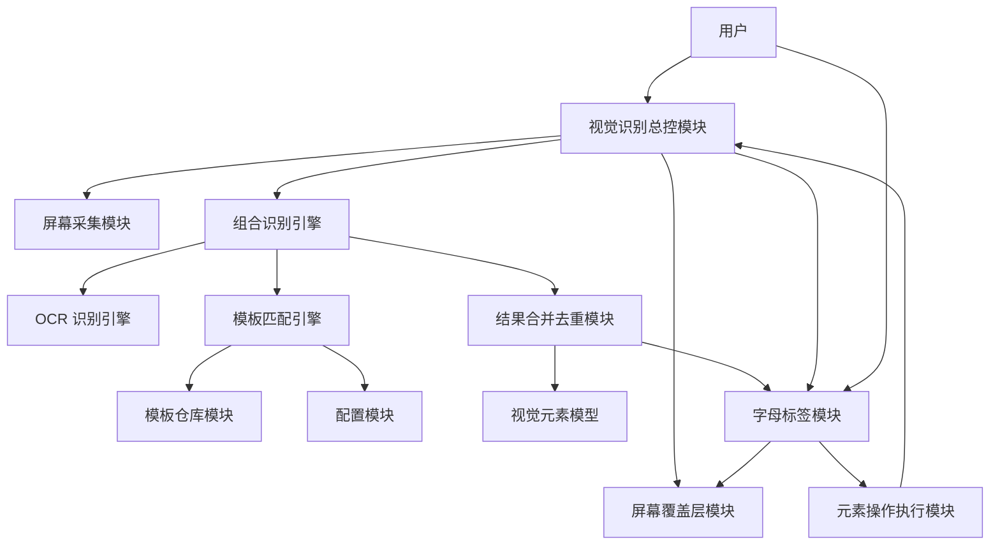
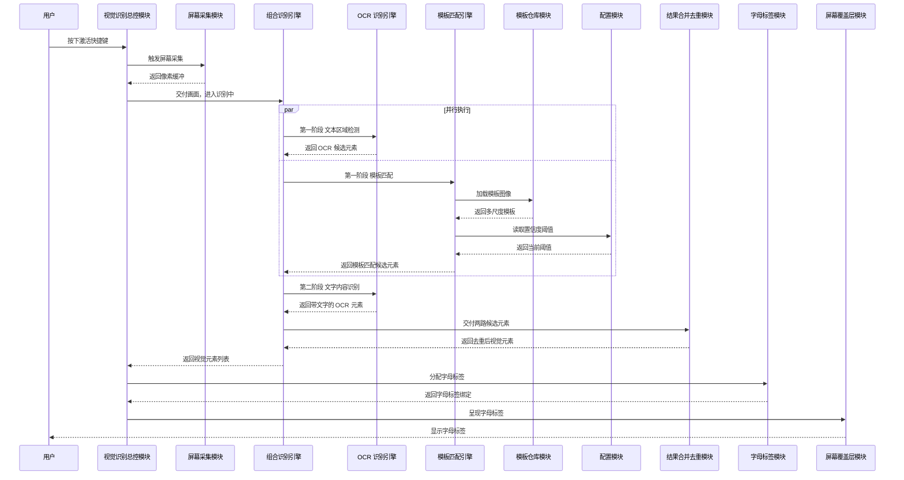
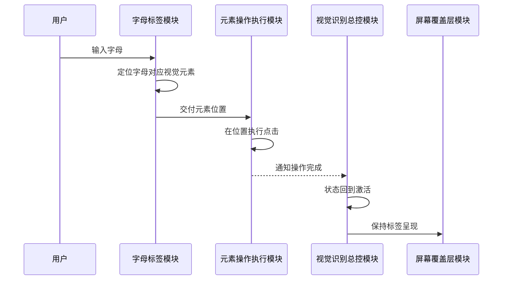
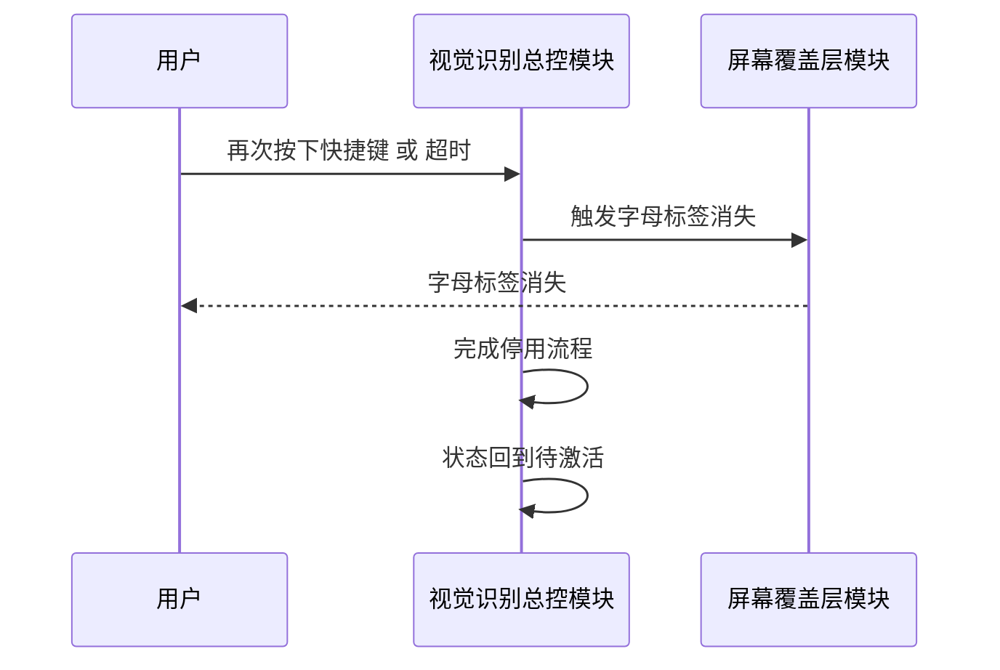
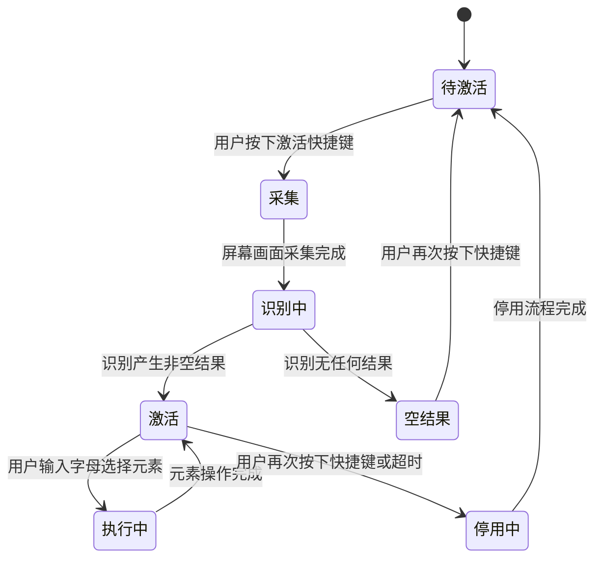

# 视觉识别 F3.2 模板匹配设计文档

> 最后更新：2026-07-16 | 版本：v1.0

## 1. 文档定位

本文档是视觉识别 F3.2 模板匹配功能的架构契约，描述系统内部"由谁负责什么"。以 Requirements 文档为唯一需求来源，采用 FR/NFR/AC/Constraints 编号引用，不复制需求原文。

本文档回答五个问题：有哪些模块、职责如何划分、数据如何流动、状态如何变化、为什么这样划分。本文档不回答"用户为什么需要"（由 Requirements 回答），也不回答"具体怎么实现"（由 Implementation Plan 回答）。

本文档不含类名、协议名、方法签名、字段类型、枚举值、文件路径、并发原语、框架 API、实现语言选型、完整代码块。即使后续实现语言、框架、类名全部重构，本文档基本不需要修改。

## 2. 模块划分

系统划分为以下 12 个模块，全部使用中文业务术语命名：

| 序号 | 模块名 | 核心职责 |
|------|--------|---------|
| M1 | 视觉识别总控模块 | 状态机管理、快捷键激活、整体流程协调 |
| M2 | 屏幕采集模块 | 采集屏幕画面，输出像素缓冲 |
| M3 | 组合识别引擎 | 协调 OCR 与模板匹配两路并行执行、两阶段调度 |
| M4 | OCR 识别引擎 | 文本区域检测与文字识别 |
| M5 | 模板匹配引擎 | 多尺度模板匹配、归一化互相关、置信度过滤 |
| M6 | 模板仓库模块 | 模板图像加载、缓存、按尺度提供 |
| M7 | 配置模块 | 模板匹配置信度阈值管理、运行时生效 |
| M8 | 结果合并去重模块 | OCR 与模板匹配结果合并、按重叠度去重 |
| M9 | 视觉元素模型 | 承载位置、识别来源等属性的数据契约 |
| M10 | 字母标签模块 | 字母标签分配、按区域查询 |
| M11 | 屏幕覆盖层模块 | 字母标签在屏幕上的呈现与消失 |
| M12 | 元素操作执行模块 | 按字母定位元素并执行点击 |

### 模块结构图

## 3. 职责边界

### M1 视觉识别总控模块

**负责：**
- 维护识别流程状态机（根据 FR-011、Constraints-6）
- 处理激活快捷键按下与再次按下（根据 FR-001、Constraints-7）
- 协调屏幕采集、组合识别、覆盖层显示的整体流程
- 触发停用流程（根据 FR-001、AC-14）

**不负责：** 具体识别算法、模板加载、字母标签分配、点击操作执行

### M2 屏幕采集模块

**负责：**
- 采集屏幕画面，输出像素缓冲供识别使用（根据 FR-001、AC-1）

**不负责：** 识别、合并去重、标签呈现

### M3 组合识别引擎

**负责：**
- 协调 OCR 识别引擎与模板匹配引擎并行执行（根据 FR-002、NFR-003）
- 调度两阶段识别流程：第一阶段并行文本区域检测与模板匹配，第二阶段对 OCR 候选元素识别文字内容（根据 FR-010、AC-10）
- 收集两路识别结果并交付合并去重

**不负责：** 具体识别算法、合并去重规则、状态机管理

### M4 OCR 识别引擎

**负责：**
- 第一阶段：检测屏幕画面中的文本区域，输出候选元素位置（根据 FR-010）
- 第二阶段：对候选元素识别文字内容（根据 FR-010）
- 为识别出的元素标记"OCR 来源"（根据 FR-007）

**不负责：** 模板匹配、合并去重、标签分配

### M5 模板匹配引擎

**负责：**
- 在原始尺寸、半尺寸、四分之一尺寸三个尺度下执行模板匹配（根据 FR-003、Constraints-5、AC-3）
- 采用归一化互相关方法衡量模板与画面区域的相似度（根据 FR-004、AC-4）
- 从配置模块读取置信度阈值，过滤相似度低于阈值的候选（根据 FR-005、NFR-006、AC-4、AC-5）
- 为识别出的元素标记"模板匹配来源"（根据 FR-007）
- 保证模板匹配部分耗时 ≤ 200ms（根据 NFR-001）

**不负责：** 模板加载与缓存、合并去重、OCR 文字识别、标签分配

### M6 模板仓库模块

**负责：**
- 加载预置模板图像（根据 FR-003）
- 缓存模板图像，按尺度提供（根据 NFR-002）
- 管理模板图像缓存内存占用（根据 NFR-002）

**不负责：** 模板匹配算法、模板编辑增删（根据 Out of Scope）

### M7 配置模块

**负责：**
- 管理模板匹配置信度阈值，默认 0.8（根据 FR-005、AC-5）
- 阈值运行时修改后下次识别立即生效（根据 NFR-006、AC-5）

**不负责：** 重叠度阈值管理（根据 Constraints-4 固定不可配置）

### M8 结果合并去重模块

**负责：**
- 合并 OCR 与模板匹配两路识别结果（根据 FR-006）
- 按重叠度 0.5 阈值去重，对两类来源一视同仁（根据 FR-006、Constraints-4、AC-6）
- 输出去重后的视觉元素列表

**不负责：** 识别算法、标签分配、点击操作

### M9 视觉元素模型

**负责：**
- 承载视觉元素的位置属性、识别来源属性（根据 FR-007、Constraints-3、AC-7）
- 识别来源取值固定为三类：OCR 来源、模板匹配来源、机器学习模型来源（根据 FR-007、Constraints-3）

**不负责：** 识别、合并、标签分配（仅承载属性）

### M10 字母标签模块

**负责：**
- 为合并去重后的视觉元素统一分配字母标签（根据 FR-008、AC-8）
- OCR 来源与模板匹配来源统一编号，不区分来源类别显示样式（根据 FR-008、AC-8）
- 按屏幕区域查询模板匹配元素的字母标签（根据 FR-009、AC-9）
- 接收用户输入字母，定位对应视觉元素（根据 FR-012、AC-13）

**不负责：** 标签的视觉呈现、点击操作执行

### M11 屏幕覆盖层模块

**负责：**
- 在屏幕最上层呈现字母标签（根据 FR-008、AC-1）
- 识别完成后 150ms 内呈现标签（根据 NFR-005）
- 停用流程中使字母标签消失（根据 AC-14）

**不负责：** 标签分配、识别、点击操作

### M12 元素操作执行模块

**负责：**
- 在字母对应视觉元素位置执行点击操作（根据 FR-012、AC-13）
- 点击操作在 100ms 内执行（根据 NFR-005）
- 操作完成后通知总控模块返回激活状态（根据 FR-012、AC-13）

**不负责：** 元素定位、标签分配、状态机管理

## 4. 数据流

### 4.1 激活与识别主流程

### 4.2 用户输入字母执行点击

### 4.3 停用流程

### 4.4 数据流关键约束

- 模板匹配与 OCR 两条路径并行执行，无共享可变状态（根据 NFR-003）
- 合并去重在主流程上同步执行，避免用户感知延迟抖动（根据 NFR-003）
- 阈值从配置模块读取，运行时修改后下次识别立即生效（根据 NFR-006）

## 5. 状态变化

识别流程状态机的状态集合与转换规则固定（根据 FR-011、Constraints-6、AC-11）。状态全部使用中文业务术语命名。

### 状态机图

### 状态责任归属

| 状态 | 责任模块 | 说明 |
|------|---------|------|
| 待激活 | 视觉识别总控模块 | 等待用户按下激活快捷键（根据 FR-011） |
| 采集 | 视觉识别总控模块 + 屏幕采集模块 | 总控触发采集，采集模块执行采集（根据 FR-001、FR-011） |
| 识别中 | 组合识别引擎 | 协调两路并行识别（根据 FR-002、FR-010、FR-011） |
| 激活 | 视觉识别总控模块 + 字母标签模块 + 屏幕覆盖层模块 | 标签已呈现，等待用户输入（根据 FR-008、FR-011） |
| 空结果 | 视觉识别总控模块 | 不呈现标签，等待再次激活（根据 FR-011、AC-12） |
| 执行中 | 元素操作执行模块 | 执行点击操作（根据 FR-012、FR-011） |
| 停用中 | 视觉识别总控模块 + 屏幕覆盖层模块 | 标签消失，完成停用（根据 FR-001、AC-14） |

## 6. 协作关系

### 6.1 协作矩阵

| 模块 | M1 | M2 | M3 | M4 | M5 | M6 | M7 | M8 | M9 | M10 | M11 | M12 |
|------|----|----|----|----|----|----|----|----|----|----|----|-----|
| M1 视觉识别总控 | - | 触发 | 调度 | | | | | | | 查询标签 | 显示/消失 | 接收完成 |
| M2 屏幕采集 | | - | 输出 | | | | | | | | | |
| M3 组合识别 | | | - | 调度 | 调度 | | | 交付 | | | | |
| M4 OCR 识别 | | | 返回 | - | | | | | | | | |
| M5 模板匹配 | | | 返回 | | - | 加载 | 读阈值 | | | | | |
| M6 模板仓库 | | | | | 提供 | - | | | | | | |
| M7 配置 | | | | | 提供 | | - | | | | | |
| M8 合并去重 | | | 返回 | | | | | - | 输出 | | | |
| M9 视觉元素 | | | | | | | | 承载 | - | | | |
| M10 字母标签 | 查询 | | | | | | | | 绑定 | - | 呈现 | 交付位置 |
| M11 屏幕覆盖层 | 显示 | | | | | | | | | 接收 | - | |
| M12 元素操作 | 完成 | | | | | | | | | 接收位置 | | - |

### 6.2 关键协作场景

**场景一：识别主流程**

视觉识别总控模块触发屏幕采集模块，将画面交付组合识别引擎。组合识别引擎并行调度 OCR 识别引擎与模板匹配引擎，模板匹配引擎从模板仓库模块加载多尺度模板，从配置模块读取置信度阈值。两路结果汇总到结果合并去重模块，输出去重后的视觉元素列表（承载于视觉元素模型）。字母标签模块为元素分配标签，屏幕覆盖层模块呈现标签。

**场景二：用户输入字母**

字母标签模块接收用户输入字母，定位对应视觉元素位置，交付元素操作执行模块执行点击。操作完成后通知总控模块，状态回到激活。

**场景三：阈值运行时修改**

用户修改配置模块中的置信度阈值。下次识别时模板匹配引擎从配置模块读取最新阈值，立即生效，无需重启。

**场景四：停用流程**

用户再次按下快捷键或超时，总控模块触发屏幕覆盖层模块使标签消失，完成停用流程后状态回到待激活。

## 7. 关键设计决策

### 决策 1：模板匹配与 OCR 并行而非串行

- **决策：** 由组合识别引擎协调两路识别路径并行执行
- **原因：** 根据 FR-002、AC-2，整体识别耗时接近较慢一路而非两者之和；根据 NFR-001 端到端 ≤ 500ms
- **代价：** 需要协调两条路径的并发与结果汇总
- **为何可接受：** 根据 NFR-003，两条路径无共享可变状态，互不阻塞，合并阶段在主流程同步执行避免抖动

### 决策 2：模板匹配独立成模块，不复用 OCR 引擎

- **决策：** 模板匹配引擎与 OCR 识别引擎作为两个独立模块
- **原因：** 根据 FR-004、FR-005，模板匹配使用归一化互相关方法与置信度阈值过滤，与 OCR 文字识别算法本质不同
- **代价：** 两个模块各自维护识别逻辑
- **为何可接受：** 职责清晰，未来扩展机器学习模型识别路径时可平滑加入第三条路径（根据 Future Considerations）

### 决策 3：识别来源作为视觉元素的固定属性

- **决策：** 视觉元素模型承载"识别来源"属性，取值固定为三类
- **原因：** 根据 FR-007、Constraints-3、AC-7，每个元素必须可追溯其识别路径
- **代价：** 新增类别需变更需求文档
- **为何可接受：** 三类已覆盖当前与近期扩展需求，固定类别有利于排查与扩展

### 决策 4：合并去重对两类来源一视同仁

- **决策：** 结果合并去重模块对 OCR 来源与模板匹配来源采用相同去重规则
- **原因：** 根据 FR-006、AC-6，不偏袒任一来源，重叠度阈值固定 0.5（根据 Constraints-4）
- **代价：** 极端情况下可能丢弃高置信度结果
- **为何可接受：** 同一区域出现多个标签对用户无意义，统一规则简化实现与排查

### 决策 5：字母标签统一编号，不区分来源样式

- **决策：** 字母标签模块对 OCR 来源与模板匹配来源统一编号
- **原因：** 根据 FR-008、AC-8，用户操作方式不因来源不同而不同
- **代价：** 用户无法通过标签样式区分来源
- **为何可接受：** 用户关心的是定位元素而非区分来源，来源属性保留在视觉元素模型供需要时查询

### 决策 6：状态机由总控模块集中管理

- **决策：** 识别流程状态机由视觉识别总控模块维护
- **原因：** 根据 FR-011、Constraints-6、AC-11，状态集合与转换规则固定，需要单一权威管理
- **代价：** 总控模块承担较多协调职责
- **为何可接受：** 集中管理避免状态分散导致的转换冲突，便于排查状态流转问题

### 决策 7：配置模块独立，阈值运行时生效

- **决策：** 配置模块独立管理置信度阈值，运行时修改立即生效
- **原因：** 根据 FR-005、NFR-006、AC-5，阈值修改后下次识别立即生效
- **代价：** 模板匹配引擎每次识别需读取最新阈值
- **为何可接受：** 读取代价远低于重启识别流程的代价

### 决策 8：模板仓库模块独立于模板匹配引擎

- **决策：** 模板图像加载与缓存由独立模块承担
- **原因：** 根据 NFR-002，模板图像缓存内存占用需受控；模板加载与匹配算法职责不同
- **代价：** 多一个模块协作
- **为何可接受：** 职责分离便于独立优化缓存策略与匹配算法

## 8. 非功能约束落地

| NFR / Constraints | 负责模块 | 落地方式 |
|------------------|---------|---------|
| NFR-001 端到端 ≤ 500ms | 视觉识别总控模块 | 协调全流程保证总耗时 |
| NFR-001 模板匹配 ≤ 200ms | 模板匹配引擎 | 保证匹配部分耗时 |
| NFR-002 常驻内存 ≤ 150MB | 模板仓库模块 + 屏幕采集模块 | 管理模板与画面缓存占用 |
| NFR-003 并行无共享可变状态 | 组合识别引擎 | 协调两路并行，合并阶段同步 |
| NFR-004 连续 100 次无崩溃无泄漏 | 全部模块 | 各模块保证自身稳定性 |
| NFR-005 标签 150ms 内呈现 | 屏幕覆盖层模块 | 识别完成后及时呈现 |
| NFR-005 点击 100ms 内执行 | 元素操作执行模块 | 接收位置后及时执行 |
| NFR-006 阈值运行时生效 | 配置模块 + 模板匹配引擎 | 配置模块管理，匹配引擎读取 |
| Constraints-1 macOS 13+ | 全部模块 | 基于系统能力实现 |
| Constraints-2 不新增第三方依赖 | 全部模块 | 基于系统内置能力 |
| Constraints-3 来源类别固定 | 视觉元素模型 | 承载固定三类来源 |
| Constraints-4 重叠度阈值固定 | 结果合并去重模块 | 固定 0.5 阈值 |
| Constraints-5 多尺度层级固定 | 模板匹配引擎 | 固定三级尺度 |
| Constraints-6 状态集合固定 | 视觉识别总控模块 | 维护固定状态集合 |
| Constraints-7 快捷键固定 | 视觉识别总控模块 | 固定 ⌘⇧V |

## 9. 与 Requirements 的映射

### 9.1 FR 到模块映射

| FR 编号 | 功能 | 主责模块 | 协作模块 |
|--------|------|---------|---------|
| FR-001 | 快捷键激活 | 视觉识别总控模块 | 屏幕采集模块、屏幕覆盖层模块 |
| FR-002 | 模板匹配与 OCR 并行 | 组合识别引擎 | OCR 识别引擎、模板匹配引擎 |
| FR-003 | 多尺度模板匹配 | 模板匹配引擎 | 模板仓库模块 |
| FR-004 | 归一化互相关匹配 | 模板匹配引擎 | - |
| FR-005 | 置信度阈值过滤 | 模板匹配引擎 | 配置模块 |
| FR-006 | 合并去重 | 结果合并去重模块 | - |
| FR-007 | 视觉元素标记来源 | 视觉元素模型 | OCR 识别引擎、模板匹配引擎 |
| FR-008 | 统一字母标签呈现 | 字母标签模块 | 屏幕覆盖层模块 |
| FR-009 | 模板标签查询 | 字母标签模块 | - |
| FR-010 | 两阶段执行 | 组合识别引擎 | OCR 识别引擎、模板匹配引擎 |
| FR-011 | 状态机 | 视觉识别总控模块 | - |
| FR-012 | 元素点击操作 | 元素操作执行模块 | 字母标签模块 |

### 9.2 AC 到模块映射

| AC 编号 | 主责模块 |
|--------|---------|
| AC-1 | 视觉识别总控模块 |
| AC-2 | 组合识别引擎 |
| AC-3 | 模板匹配引擎 |
| AC-4 | 模板匹配引擎 |
| AC-5 | 配置模块、模板匹配引擎 |
| AC-6 | 结果合并去重模块 |
| AC-7 | 视觉元素模型 |
| AC-8 | 字母标签模块 |
| AC-9 | 字母标签模块 |
| AC-10 | 组合识别引擎 |
| AC-11 | 视觉识别总控模块 |
| AC-12 | 视觉识别总控模块 |
| AC-13 | 元素操作执行模块 |
| AC-14 | 视觉识别总控模块、屏幕覆盖层模块 |

### 9.3 覆盖性检查

全部 FR-001 至 FR-012、NFR-001 至 NFR-006、Constraints-1 至 Constraints-7、AC-1 至 AC-14 均已映射到具体模块，无遗漏。

---

## 版本记录

| 版本 | 日期 | 变更说明 |
|------|------|---------|
| v1.0 | 2026-07-16 | 初版，定义 F3.2 模板匹配功能架构契约 |

---

## 自查

执行 skill 中定义的 Output Review 12 步扫描。

### 步骤 1：CamelCase 词扫描

扫描全文，检查首字母大写连写的词（类名/协议名/类型名）。

- **扫描结果：** 通过。未发现 CamelCase 词。所有模块名均为中文业务术语（视觉识别总控模块、模板匹配引擎、组合识别引擎等）。OCR 作为英文缩写保持原文，属于业务术语定义，非类名。

### 步骤 2：xxx() 含括号扫描

扫描全文，检查方法/函数调用形式。

- **扫描结果：** 通过。未发现 `xxx()` 形式的方法调用。所有动作均用业务动作描述（"执行识别"、"加载模板"、"读取阈值"、"执行点击"等）。

### 步骤 3：xxx: Yyy 含冒号类型标注扫描

扫描全文，检查字段类型定义。

- **扫描结果：** 通过。未发现 `xxx: Yyy` 形式的字段类型标注。所有属性均用业务属性描述（"位置属性"、"识别来源属性"、"像素缓冲"等）。表格中出现的冒号均为中文标点或表格分隔符，非类型标注。

### 步骤 4：protocol/func/class/struct/enum 关键字扫描

扫描全文，检查代码定义关键字。

- **扫描结果：** 通过。未发现 `protocol`、`func`、`class`、`struct`、`enum` 等代码定义关键字。

### 步骤 5：英文状态值扫描

扫描全文，检查 idle/capturing/recognizing 等英文枚举状态。

- **扫描结果：** 通过。未发现英文状态枚举值。所有状态均用中文业务术语（待激活、采集、识别中、激活、空结果、执行中、停用中）。

### 步骤 6：并发原语扫描

扫描全文，检查 async let/TaskGroup/DispatchQueue/NSLock/actor 等并发原语。

- **扫描结果：** 通过。未发现并发原语。并发行为用业务术语描述（"并行执行"、"无共享可变状态"、"同步执行"、"主流程"等）。

### 步骤 7：实现语言扫描

扫描全文，检查 Swift/Rust/C++/Python 等语言名。

- **扫描结果：** 通过。未发现实现语言名。实现语言选型留给 Implementation Plan。

### 步骤 8：框架 API/类型扫描

扫描全文，检查 vDSP/Accelerate/CVPixelBuffer/CGRect/CGImage 等框架 API 与类型。

- **扫描结果：** 通过。未发现框架 API 或类型。所有能力均用业务术语描述（"像素缓冲"、"矩形区域"、"向量运算"等）。"像素缓冲"作为业务术语使用，未出现具体框架类型名。

### 步骤 9：算法/框架常量前缀扫描

扫描全文，检查 TM_/CV_/kCG 等常量前缀。

- **扫描结果：** 通过。未发现算法或框架常量前缀。"归一化互相关"作为业务算法名使用，未出现算法枚举常量。

### 步骤 10：反引号代码符号扫描

扫描全文，检查 `xxx` 加反引号的代码符号。

- **扫描结果：** 通过。反引号仅用于 mermaid 图表中的语法标记与自查章节中描述扫描模式本身，未用于标记代码符号。

### 步骤 11：文件扩展名扫描

扫描全文，检查 .swift/.ts/.py 等文件扩展名。

- **扫描结果：** 通过。未发现代码文件扩展名。文件路径留给 Implementation Plan。文档中出现的"01_Requirements.md"、"02_Design.md"为文档名称引用，非代码文件路径。

### 步骤 12：复制 Requirements 原文扫描

扫描全文，检查是否复制 Requirements 原文而非编号引用。

- **扫描结果：** 通过。未发现复制 Requirements 原文的情况。所有需求引用均使用编号（FR-xxx、NFR-xxx、AC-xxx、Constraints-xxx），并配合"根据"语句说明由谁负责。模块职责描述使用业务动作语言，非需求原文复述。

### 自查结论

12 步扫描全部通过，文档符合 skill 中 P0 铁律与 P1 写作规则要求。
