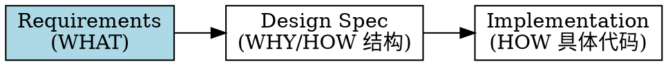
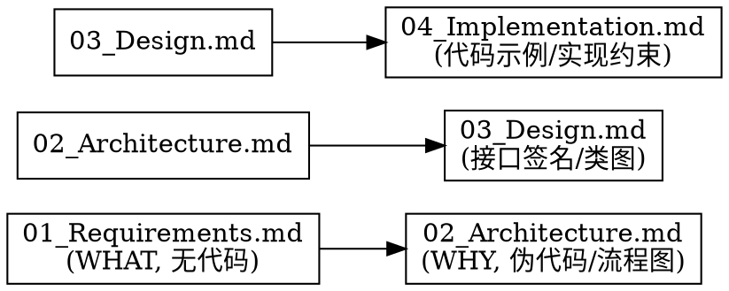

# 编写需求文档（01_Requirements.md）

## 概述

**Requirements 只描述"系统应该是什么"（WHAT），绝不描述"系统怎么实现"（HOW）。**

Requirements 是整个 AI Coding 项目的"产品合同"与"唯一真实需求来源"。它回答四个问题：要解决什么问题、最终必须达到什么效果、有哪些边界不能突破、哪些地方允许 AI 自主设计。即使后续架构、类名、设计模式全部重构，Requirements 基本不需要改。

**违反规则的字面意思就是违反规则的精神。**

## 何时使用

- 新功能、重大重构、API 迁移前，先写 Requirements
- 用户提到"需求文档"、"Requirements"、"01_Requirements"、"写需求"、"产品合同"
- dd-feature-development-workflow / dd-writing-design-specs 之前的需求层
- 团队把含代码的设计规范当 Requirements 用
- 用户问"设计规范要不要写代码"

**不适用：** bug 修复（用 dd-bug-fix-workflow）、设计规范（用 dd-writing-design-specs）、实现指南、纯文档修改

## 核心原则：WHAT 不是 HOW



| 层次 | 回答 | 是否写代码 | AI 是否遵守 |
|------|------|-----------|-----------|
| Requirements | 做什么 | ❌ 绝不 | ✅ 必须遵守 |
| Design Spec | 为什么这样设计 | ⚠️ 仅伪代码/流程图/接口签名 | ✅ 必须遵守 |
| Implementation | 怎么实现 | ✅ 可写代码 | ❌ 可参考可优化 |

## 禁止清单（铁律）

Requirements 文档中**绝不**出现以下内容：

| 禁止类别 | 示例（禁止） | 替代表述（允许） |
|---------|-------------|----------------|
| 类名 | `TemplateMatchingEngine`、`VisionModeController`、`VisualElement` | 模板匹配引擎、视觉模式控制器、视觉元素 |
| 协议名 | `VisualRecognitionEngine`、`OverlayContentProviding` | 视觉识别引擎接口、覆盖层内容提供方接口 |
| 方法名 | `detectTextRectangles()`、`cachedTemplateLabels()`、`render()` | 检测文本区域、查询模板标签缓存、渲染 |
| 字段名 | `source: VisualSource`、`templateConfidenceThreshold` | 识别来源属性、模板匹配置信度阈值 |
| 枚举值 | `.ocr`、`.template`、`.coreML`、`idle`、`capturing`、`recognizing` | OCR 来源、模板匹配来源、机器学习模型来源；待激活、采集、识别中 |
| 状态机英文状态名 | `idle`、`capturing`、`recognizing`、`active`、`emptyResult`、`executing`、`deactivating` | 待激活、采集、识别中、已激活、空结果、执行中、停用中 |
| 算法枚举名 | `TM_CCOEFF_NORMED`、`CV_8UC1`、`kCGEventFlagsMask` | 业务术语"归一化互相关"（不写 OpenCV 常量名） |
| 模块名 | MacimCore、`com.macim.visual.*` | （不写，留给 Design/Implementation） |
| 配置键名 | `com.macim.visual.templateConfidenceThreshold` | 模板匹配置信度阈值配置项 |
| 并发原语 | `async let`、`TaskGroup`、`DispatchQueue.main`、`NSLock` | 并行执行、并发协调、主线程 |
| 实现技术 | Accelerate framework、vDSP、NCC 算法、Metal | （除非属于业务约束，否则不写；技术选型放 Design） |
| 文件路径 | `MacimCore/TemplateMatchingEngine.swift` | （不写） |
| 框架 API | `vDSP.meanv`、`vImageMatrixMultiply`、`CGEvent` | 向量运算、图像处理、系统事件 |

**判定方法：** 如果一个词出现在代码里能被编译器识别为符号（类/协议/方法/字段/枚举/模块），它就不能出现在 Requirements。**包括英文枚举值**——即使团队习惯用 `idle`/`capturing`，Requirements 中也要用中文业务术语"待激活"/"采集"，在 Terminology 章节建立映射。

## 必须包含的 12 章节

按项目模板优先；无模板时使用以下默认 12 章节。**每章都不可跳过**。

1. **Background（背景）**：为什么做。只描述事实与业务上下文，不提方案
2. **Problem Statement（问题定义）**：现状哪里不好。每条可验证，不写"代码太乱"
3. **Goals（目标）**：成功是什么样。描述结果，不描述实现
4. **Scope（范围）**：本次包含什么/不包含什么。防止 AI 顺手改一百个文件
5. **Functional Requirements（功能需求）**：编号 FR-001 起。只描述可观察行为，绝不出现类名/方法名
6. **Non-functional Requirements（非功能需求）**：性能/内存/线程/稳定性/用户体验。用可测量描述
7. **Constraints（约束）**：兼容性、依赖、不可改的 API。**业务约束可写，技术实现约束放 Design**
8. **Acceptance Criteria（验收标准）**：编号 AC-1 起。用 Given/When/Then。每个 FR 至少一个 AC
9. **Out of Scope（明确不做）**：防止 AI"顺便帮你改一下"
10. **Terminology（术语）**：定义业务术语，**不是代码符号**。防止 Label/Text/TextBox/Region 混用
11. **Decision Freedom（实现自由度）**：告诉 AI 哪些可自由发挥（架构/拆类/命名）、哪些禁止改（公共 API/数据格式/协议语义）
12. **Future Considerations（未来扩展）**：未来可能增加什么。让 AI 设计时避免堵死路

## 写作规则

每条 Requirements 应该是：
- **可观察**：用户/外部能感知的行为，不是内部状态
- **可测试**：能写出 Given/When/Then
- **无歧义**：只有一种理解方式
- **技术无关**：换语言/换框架，Requirements 不需要改

**禁止的模糊词：** optimize、improve、better、cleaner、modern、优化、改进、更好

**替换为可测量：**
- ❌ "提升 OCR 性能"
- ✅ "OCR 结果应在识别完成后 150ms 内呈现"

## 好示例 vs 坏示例

### 坏示例（混入代码细节）

```markdown
FR-001：TemplateMatchingEngine 必须实现 VisualRecognitionEngine 协议（位于 MacimCore）。
FR-002：CompositeRecognitionEngine 使用 async let 并行调用 ocrEngine 与 templateEngine。
FR-003：VisionModeController 通过 recognitionEngine.cachedTemplateLabels()[rect] 填充 label。
NFR-001：NCC 计算必须使用 Accelerate framework 的 vDSP.meanv API。
Constraints-1：配置项 com.macim.visual.templateConfidenceThreshold 默认 0.8。
```

**问题：** 类名、协议名、方法签名、并发原语、API 名、配置键名全部混入。换 Swift→Rust 全要重写。

### 好示例（纯业务描述）

```markdown
FR-001：识别启动后，识别结果展示层必须立即出现。
FR-002：OCR 识别与模板匹配必须并行执行，总耗时接近较慢一路，而非两者之和。
FR-003：模板匹配产生的元素必须能展示与 OCR 元素统一的字母标签。
NFR-001：单次识别端到端延迟 ≤ 500ms，其中模板匹配部分 ≤ 200ms。
Constraints-1：模板匹配置信度阈值默认 0.8，支持运行时修改即时生效。
```

**优点：** 换语言、换框架、换类名，Requirements 不需要改。AI 有实现自由度。

## AC 写作模板

```markdown
### AC-1：识别启动后展示层出现

**Given** 视觉识别模式未激活
**When** 用户按下激活快捷键
**Then** 识别完成后，识别结果展示层立即出现，展示层内每个可识别元素对应一个字母标签
```

**禁止：** 在 Then 里写"调用 `XXXManager.render()` 渲染 Overlay"。

## 12 章节速查

| 章节 | 核心问题 | 代码细节 | 篇幅 |
|------|---------|---------|------|
| Background | 为什么做 | ❌ | 短 |
| Problem | 现状哪里不好 | ❌ | 短，可验证 |
| Goals | 成功是什么样 | ❌ | 短，结果导向 |
| Scope | 做什么/不做什么 | ❌ | 清单 |
| FR | 系统应做什么 | ❌ 绝不 | 编号，可观察 |
| NFR | 质量要求 | ❌ | 可测量 |
| Constraints | 边界 | ⚠️ 仅业务约束 | 清单 |
| AC | 如何验证 | ❌ | Given/When/Then |
| Out of Scope | 明确不做 | ❌ | 清单 |
| Terminology | 业务术语 | ❌ 绝不写代码符号 | 字典 |
| Decision Freedom | AI 自由度 | ❌（描述边界） | 允许/禁止清单 |
| Future | 未来可能 | ❌ | 信息性 |

## 红线 — 停下来重写

- FR/NFR/AC 章节出现类名、协议名、方法名、字段名、枚举值、配置键名、并发原语、框架 API
- Goals/Scope/Constraints 章节出现实现技术选型（如"使用 vDSP"、"用 async let"）
- Terminology 章节把类名/协议名当术语定义
- 跳过 Terminology 或 Decision Freedom 章节
- 用"优化"、"改进"、"更好"等模糊词
- 把含代码的设计规范直接改名当 Requirements
- FR 描述内部状态而非可观察行为
- **保留英文状态机枚举值**（idle/capturing/recognizing 等）而非中文业务术语
- **保留算法常量名**（`TM_CCOEFF_NORMED` 等）而非业务术语
- 用"团队习惯"/"行业标准"/"AI 更明确"为由保留代码符号

**以上任一情况发生时，停止写作，删除违规内容，用业务术语重写。**

## 合理化借口表

| 借口 | 现实 |
|------|------|
| "AI 看不懂抽象描述，需要类名才能知道复用什么" | AI 看得懂业务术语。类名属于 Design 层，放 Requirements 会过早绑定实现，后续重构全要改 Requirements。 |
| "实现技术（vDSP/Accelerate）是约束，应该写进 Constraints" | 业务约束（macOS 13+、不新增依赖）可写。技术选型（用哪个向量运算库）属于 Design 决策，放 Requirements 会锁死方案。 |
| "类名是术语，应该写进 Terminology" | Terminology 定义业务术语（识别会话、视觉元素、展示层），不是代码符号表。把类名当术语会让 Requirements 变成 API 文档。 |
| "配置键名（com.macim.xxx）是 FR 的一部分" | FR 描述行为（"阈值可配置且运行时生效"），配置键名属于实现。写键名让 Requirements 绑定到具体配置系统。 |
| "方法名（detectTextRectangles）是流程描述" | 流程用业务动作描述（"检测文本区域"）。方法名是 Design 层的接口契约，写进 Requirements 等于锁死 API 签名。 |
| "时间紧，直接复用设计规范当 Requirements" | 含代码的设计规范当 Requirements 等于跳过需求层。下游 Design/Implementation 基于错误前提，返工成本是重写的 10 倍。 |
| "Terminology 和 Decision Freedom 不重要，跳过" | Terminology 防止术语混用（Label/Text/TextBox），Decision Freedom 是 AI Coding 的核心章节（告诉 AI 哪些可自由发挥）。跳过 = AI 跑偏。 |
| "资深工程师说要加类名，得听" | 资深工程师的真正痛点（AI 不知道复用什么）应在 Design Spec 解决，而非降级 Requirements。坚持分层，主动承诺在 Design Spec 写类名。 |
| "团队习惯用英文状态名（idle/capturing），保留更亲切" | 英文枚举值是代码符号。Requirements 用中文业务术语（待激活/采集），在 Terminology 建立映射。Design Spec 可以用英文枚举名。 |
| "算法枚举名（TM_CCOEFF_NORMED）是行业标准，写进去 AI 更明确" | 行业标准常量名是代码符号。用业务术语"归一化互相关"描述算法，常量名放 Design/Implementation。 |
| "快捷键符号 ⌘⇧V 是代码细节吗" | 不是。快捷键是用户交互方式，属于业务需求，可以保留。但 `kVK_Command` 等键码常量是代码符号，禁止。 |
| "这个情况不同，因为是……" | 规则无例外。如果你认为情况特殊，用 AskUserQuestion 提出，由用户决定。 |
| "我遵循的是精神而非字面" | 违反规则的字面意思就是违反规则的精神。 |

## 常见错误

| 错误 | 修复 |
|------|------|
| FR 写"XXXManager 调用 XXXAPI" | 改为业务动作："识别启动后展示层出现" |
| Goals 写"使用 vDSP 实现 NCC" | 改为结果："模板匹配引擎能在 200ms 内识别预置模板" |
| Constraints 写"必须使用 async let" | 改为业务约束："OCR 与模板匹配必须并行，总耗时接近较慢一路" |
| AC 的 Then 写"调用 render() 渲染" | 改为可观察结果："展示层出现，每个元素显示字母标签" |
| Terminology 定义"TemplateMatchingEngine：模板匹配引擎类" | 改为业务术语："模板匹配：通过预置图像匹配屏幕元素的技术" |
| Decision Freedom 只写"允许"不写"禁止" | 必须双向：允许（架构/拆类/命名）+ 禁止（改公共 API/数据格式/协议语义） |
| 把设计规范的 12 章节直接复制到 Requirements | 重写：去除所有代码细节，只保留业务描述 |
| FR-011 写"状态机包含 idle/capturing/recognizing 状态" | 改为中文业务术语："状态机包含待激活、采集、识别中等状态"，Terminology 建立映射 |
| NFR 写"使用 NCC 算法（等价于 TM_CCOEFF_NORMED）" | 改为业务术语："使用归一化互相关方法衡量相似度"，常量名放 Design |
| AC 的 Then 写"source 字段等于 .ocr" | 改为业务描述："该元素的识别来源属性为 OCR 来源" |

## 与其他文档的关系



- **Requirements**：本 skill，纯业务，无代码
- **Design Spec**：用 dd-writing-design-specs，允许接口签名、类图、伪代码
- **Implementation**：允许完整代码示例，但明确标注"推荐实现，非约束"

## 输出要求

- 文件名：`01_Requirements.md`
- 格式：Markdown，层级标题
- FR 编号：FR-001 起
- AC 编号：AC-1 起
- 文档头部：`> 最后更新：YYYY-MM-DD | 版本：vX.Y`
- 文末：版本记录列表
- 中文标点（，。！？：；），英文术语保持原文
- 不使用 emoji（除非用户明确要求）

## 验证清单

完成前自查：

- [ ] 全文搜索类名/协议名/方法名/字段名/枚举值/配置键名/并发原语/框架 API — 应为 0
- [ ] 每条 FR 是可观察行为，不是内部状态
- [ ] 每条 NFR 可测量
- [ ] 每个 FR 至少一个 AC
- [ ] AC 用 Given/When/Then
- [ ] 12 章节全部存在
- [ ] Terminology 只定义业务术语，无代码符号
- [ ] Decision Freedom 双向（允许 + 禁止）
- [ ] 无"优化/改进/更好"等模糊词
- [ ] 文档换语言/换框架不需要改

**任一项失败，修订后重新验证。**

## Git 工作流合规

本技能涉及 Git 操作时，遵循 [dd-git-workflow](../dd-git-workflow/SKILL.md) 系列子技能。分支命名 `docs/{主题}`，merge-only，禁止 rebase。修改公共文件加 `PublicFile` tag。
