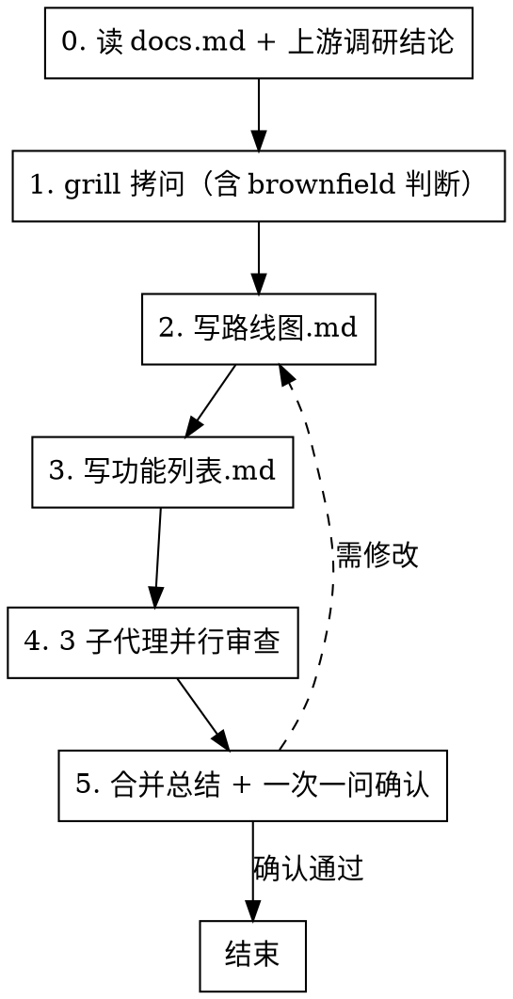
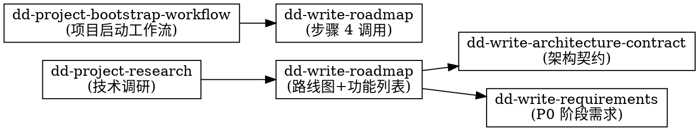

# 编写路线图与功能列表（dd-write-roadmap）

## 概述

**路线图描述"项目分几步走、每步走到哪算完"，功能列表描述"每步里包含哪些功能、它们如何排序"，两者都不描述"代码怎么写"。**

路线图与功能列表是 AI Coding 项目级规划的"阶段合同"与"功能版图"。它们回答五个问题：项目要做什么、分几个阶段、每阶段的进入与退出标准、功能如何按优先级排序、功能之间如何依赖。即使后续架构、类名、实现语言全部重构，两者基本不需要改。

**路线图写的是"阶段目标与可观察的退出标准（Exit Gate）"，不写"模块职责/数据流/状态机"——后者属于 Design。** 功能列表写的是"功能编号 + 子功能分解 + 可观察的验证标准 + 依赖 + 状态"，不写接口签名、类定义、目录结构。

**违反规则的字面意思就是违反规则的精神。**

## Priority 分层（规则权重）

| 优先级 | 含义 | 示例 | 违反后果 |
|--------|------|------|---------|
| **P0** | 绝不能违反 | 不写代码符号（类名/协议名/方法签名/字段类型/枚举值/文件路径/并发原语/框架 API/实现语言选型） | 立即重写 |
| **P1** | 尽量遵守 | 阶段有 Goal/IN/OUT/Exit Gate、功能有编号与验证标准、brownfield 标注状态 | 补齐缺失项 |
| **P2** | 建议 | 中文标点、文档头部版本号、依赖图用 mermaid | 提醒修正 |

**冲突处理优先级：** User > Skill > Default behavior。与 P0 冲突时用 AskUserQuestion 提出。

## 何时使用

- 新项目创建、大规模迁移、产品定位调整、阶段重排
- 用户提到"路线图"、"roadmap"、"功能列表"、"P0/P1 阶段"、"Exit Gate"、"项目规划"
- dd-project-bootstrap-workflow 步骤 4 调用
- 上游 dd-project-research 完成技术调研后转入规划
- brownfield 项目纳入既有功能进行整体规划

**不适用：** 单个功能的需求/设计/实现（用 dd-writing-specs + dd-write-requirements + dd-write-design）、bug 修复、实现计划（接口/类/目录）、架构契约（用 dd-write-architecture-contract）

## 项目规则优先（强制首步）

写路线图前，**必须先读取项目的 docs.md**。docs.md 的规则优先于 skill 的默认规则。

```bash
test -f .trae/rules/docs.md && cat .trae/rules/docs.md
test -f docs/docs.md && cat docs/docs.md
test -f docs.md && cat docs.md
```

从 docs.md 提取并记录：规划文档存放路径、文件命名规则（`路线图.md`/`功能列表.md` 或 `Roadmap.md`/`FeatureList.md`）、文档头部格式、标点符号规则、mermaid 规则、同步更新规则、阶段命名规则（P0/P1/P2 或 MVP/V1/V2）。

**处理规则：** docs.md 存在则优先；不存在用默认规则；与 P0 冲突时 P0 优先，用 AskUserQuestion 提出冲突。

## 流程



### 工作环境前置询问

进入步骤 0 前，按 [dd-shared-ask](../dd-shared-ask/SKILL.md) 的「工作环境询问」模板询问。**被 dd-project-bootstrap-workflow 调度时不询问**（工作环境已由上游确定）。

### 步骤 0：读 docs.md + 上游调研结论

读取 docs.md，并读取上游 dd-project-research 的技术调研结论（如存在）。提取并记录：项目规则 7 项、调研结论中的技术栈与约束、brownfield 既有功能清单。

### 步骤 1：grill 拷问（一次一问）

**必需子技能：** 使用 [grilling](../../grilling) 进行拷问。**铁律：一次只问一个问题，等用户回答后再问下一个。** 每个问题提供推荐答案。能通过探索代码库回答的，自己探索而非问用户。

拷问范围（至少覆盖）：

1. **产品核心定位**：一句话核心目标（用户是谁、解决什么问题、关键差异点）
2. **最低系统要求与开发工具**：最低系统版本、开发语言/工具链、CI 环境
3. **阶段如何划分**：P0 MVP / P1 扩展 / P2 稳定性 / ... 每阶段定位
4. **每阶段的 Exit Gate 标准**：可观察的退出标准（不是内部状态）
5. **功能优先级如何排序**：哪些功能必须在 P0、哪些可延后
6. **功能依赖关系**：哪些功能依赖其他功能先完成
7. **brownfield 判断**：是否有已实现/部分实现/未实现的功能需要纳入

出口判定：输出规划摘要，用 `AskUserQuestion` 询问（选项 1 推荐：确认进入步骤 2；选项 2：补充 grill；选项 3：理解有误重新描述）。

### 步骤 2：写路线图.md

按"产出文件结构 - 路线图.md"章节执行。P0 铁律：不写代码符号。

### 步骤 3：写功能列表.md

按"产出文件结构 - 功能列表.md"章节执行。P0 铁律：不写代码符号；验证标准是可观察行为。

### 步骤 4：3 子代理并行审查

调度 3 个子代理并行（同一条消息发起 3 个 Task）。维度分配：

| 子代理 | 维度 | 检查要点 |
|--------|------|---------|
| **A** | 完整性 + 一致性 + docs.md 合规性 + P0 铁律 | 阶段/功能是否齐全；路线图与功能列表是否一致；docs.md 规则符合性；**全文搜索代码符号应为 0** |
| **B** | 阶段合理性 + 优先级 + YAGNI | 阶段划分是否合理；P0 是否过载；功能优先级是否站得住；是否塞入未请求功能 |
| **C** | 可验证性 + 依赖完整 | Exit Gate 是否可观察；功能验证标准是否可观察；依赖关系图是否完整无环；brownfield 状态标注是否完整 |

校准标准：只标记会在后续阶段造成实际问题的事项。

### 步骤 5：合并总结 + 一次一问确认

合并三份审查结果展示给用户。用 `AskUserQuestion` 询问**一个问题**：
- 选项 1（推荐）：确认路线图与功能列表，工作流结束
- 选项 2：需要修改，回到步骤 2 重写
- 选项 3：方向不对，回到步骤 1 重新 grill

确认通过后立即 `git add` + `git commit`（`docs(roadmap): confirm roadmap and feature list after 3-way review`）。

## 产出文件结构

### 路线图.md（必含）

文档头部 `> 最后更新：YYYY-MM-DD | 版本：vX.Y`，正文含 4 章：

1. **产品定位**：核心目标（一句话，用户是谁、解决什么问题、关键差异点）+ 最低系统要求 + 开发工具
2. **阶段划分**：每阶段含 Goal / IN（进入条件，含上游调研结论、依赖项）/ OUT（退出条件，本阶段产出的可观察结果）/ Exit Gate（可观察的退出标准列表，每条都能被验收）
3. **阶段依赖关系图**（mermaid `graph LR`，节点用阶段名 P0/P1/P2）
4. **版本记录**（表格：版本 / 日期 / 变更）

### 功能列表.md（必含）

文档头部 `> 最后更新：YYYY-MM-DD | 版本：vX.Y`，正文含 3 章：

1. **功能优先级分组**：按 P0/P1/P2 分组。每个功能条目含：
   - 编号（F0/F1/F2...）+ 功能名
   - 子功能分解（F0.1 / F0.2 ...）
   - 验证标准（可观察行为，每条可被验收）
   - 依赖（其他功能编号，或"无"）
   - 状态（未实现 / 部分实现 / 已实现，**brownfield 必填**）
2. **依赖关系图**（mermaid `graph LR`，节点用功能编号 F0/F1/F2）
3. **版本记录**（表格：版本 / 日期 / 变更）

### 阶段ExitGate.md（可选）

当 Exit Gate 内容较多、需跨多份文档引用时，从路线图抽出为独立文件，路线图中改用编号引用（如 `Exit Gate 见 阶段ExitGate.md#P0`）。

## 禁止清单（P0 铁律）

| 禁止类别 | 示例（禁止） | 替代表述（允许） |
|---------|-------------|----------------|
| 类名/协议名 | `RecognitionEngine`、`OverlayController` | 识别引擎、覆盖层控制器 |
| 方法签名 | `recognize(screen:)` | 执行识别 |
| 字段类型 | `rect: CGRect` | 位置属性 |
| 枚举值 | `idle`/`capturing` | 待激活/采集 |
| 实现语言 | "采用 Swift 实现" | （删除，留给实现计划） |
| 框架 API | `vDSP.meanv`、`Accelerate` | 向量运算、系统图像处理框架 |
| 并发原语 | `async let`、`TaskGroup` | 并行执行 |
| 文件路径/完整代码块/配置键名 | `Sources/Recognition/`、`struct VisualElement { ... }`、`com.xxx.threshold` | 删除 / 文字描述 / 配置项名 |

**判定方法：** 如果一个词出现在代码里能被编译器识别为符号，它就不能出现在路线图或功能列表。

## 红线 — 停下来重写

- 路线图或功能列表出现类名、协议名、方法签名、字段类型、枚举值、文件路径、并发原语、框架 API、实现语言
- 阶段没有 Exit Gate 或 Exit Gate 不可观察（描述内部状态而非可观察行为）
- 功能没有编号、验证标准或依赖标注
- brownfield 项目未标注"已实现/未实现/部分实现"状态
- 把路线图当设计文档写模块职责、数据流、状态机
- 把功能列表当实现计划写接口签名、类定义、目录结构
- 跳过 grill 直接写阶段
- 跳过 3 子代理审查或用 1 个子代理代替 3 个
- 用"团队习惯"/"行业标准"/"AI 更明确"为由保留代码符号

**以上任一情况发生时，停止写作，删除违规内容，重写。**

## 与其他 skill 的关系



- **上游**：[dd-project-research] 的技术调研结论作为路线图输入（最低系统要求、技术栈约束、brownfield 既有功能清单）
- **下游**：[dd-write-architecture-contract] 基于路线图设计架构契约；[dd-write-requirements] 的第一阶段需求与验收基于路线图 P0 阶段
- **被调度**：[dd-project-bootstrap-workflow] 步骤 4 调用本 skill
- **审查与确认**：复用 [dd-shared-subagent]（3 子代理并行审查）与 [dd-shared-ask]（结构化询问 + worktree 选择）
- **与 dd-writing-specs 的边界**：dd-writing-specs 是功能级规格套件工作流（需求+设计+原型+测试用例），本 skill 是项目级路线图，粒度更粗，不写单个功能的 FR/AC

## 输出要求

- 文件名：`路线图.md` / `功能列表.md`（按 docs.md 调整）
- 格式：Markdown，层级标题
- 文档头部：`> 最后更新：YYYY-MM-DD | 版本：vX.Y`
- 文末：版本记录列表
- 中文标点（，。！？：；），英文术语保持原文
- 图示用 mermaid，节点用中文模块名/阶段名/功能名
- 不使用 emoji（除非用户明确要求）
- 功能编号：F0/F1/F2...；阶段编号：P0/P1/P2...（按项目约定调整）

## Output Review（生成后自检扫描）

| 步骤 | 扫描模式 | 含义 | 发现时处理 |
|------|---------|------|-----------|
| 1 | CamelCase 词 | 类名/协议名/类型名 | 转换为业务术语 |
| 2 | `xxx()` 含括号 | 方法/函数调用 | 转换为业务动作 |
| 3 | `xxx: Yyy` 含冒号类型标注 | 字段类型定义 | 转换为业务属性 |
| 4 | `protocol`/`func`/`class`/`struct`/`enum` 关键字 | 代码定义 | 删除，改用业务描述 |
| 5 | `idle`/`capturing` 等英文状态 | 英文枚举 | 转换为中文业务术语 |
| 6 | `async let`/`TaskGroup`/`DispatchQueue`/`actor` | 并发原语 | 转换为业务行为 |
| 7 | `Swift`/`Rust`/`C++`/`Python` 等语言名 | 实现语言选型 | 删除，留给实现计划 |
| 8 | `vDSP`/`Accelerate`/`CVPixelBuffer`/`CGRect` | 框架 API/类型 | 转换为业务能力描述 |
| 9 | 复制设计文档的模块职责/数据流/状态机 | 越界内容 | 删除，改引用架构契约 |
| 10 | Exit Gate 描述内部状态而非可观察行为 | 不可验证 | 改为可观察的退出标准 |

**执行原则：** 扫描发现违规时，不要"修补"，直接重写违规段落。

## 验证清单

- [ ] 全文搜索类名/协议名/方法签名/字段类型/枚举值/文件路径/并发原语/框架 API/实现语言 — 应为 0
- [ ] 路线图含产品定位、最低系统要求、开发工具
- [ ] 每阶段含 Goal / IN / OUT / Exit Gate
- [ ] 每条 Exit Gate 是可观察行为，不是内部状态
- [ ] 阶段依赖关系图完整（mermaid）
- [ ] 功能列表按 P0/P1/P2 分组
- [ ] 每个功能含编号、子功能分解、验证标准、依赖、状态
- [ ] 每条验证标准是可观察行为
- [ ] brownfield 项目功能状态标注完整（已实现/部分实现/未实现）
- [ ] 功能依赖关系图完整无环（mermaid）
- [ ] 路线图未越界写模块职责/数据流/状态机（属于架构契约）
- [ ] 功能列表未越界写接口签名/类定义/目录结构（属于实现计划）
- [ ] 文档头部符合 `> 最后更新：YYYY-MM-DD | 版本：vX.Y`
- [ ] 中文标点，英文术语保持原文
- [ ] 不使用 emoji
- [ ] grill 摘要、3 子代理审查结果、合并总结已提交
- [ ] 文档换实现语言/换框架/换类名不需要改

**任一项失败，修订后重新验证。**

## Git 工作流合规

本技能涉及 Git 操作时，遵循 [dd-git-workflow](../dd-git-workflow/SKILL.md) 系列子技能。分支命名 `docs/roadmap` 或 `docs/{主题}`，merge-only，禁止 rebase。修改公共文件加 `PublicFile` tag。
