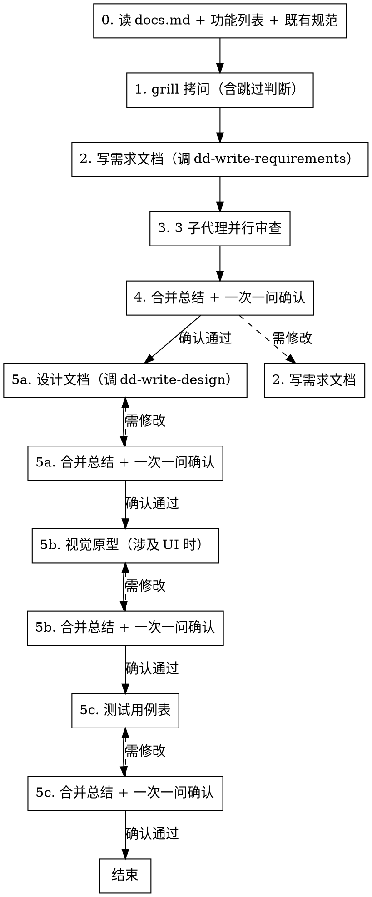

# 编写规格文档套件

## 概述

**先拷问再写规范，三审并行再确认，一份做完再做下一份。**

按"读规则 → grill → 写需求文档 → 3 子代理并行审查 → 合并总结 → 一次一问确认 → 逐份完成设计文档/视觉原型/测试用例表"严格顺序执行。**违反规则的字面意思就是违反规则的精神。**

本工作流产出 4 篇文档，分层清晰：
- **需求文档**（WHAT，无代码）：用 [dd-write-requirements](../dd-write-requirements/SKILL.md)，产品合同，单一需求来源
- **设计文档**（WHO/结构，无代码符号）：用 [dd-write-design](../dd-write-design/SKILL.md)，架构契约，模块边界/数据流/状态模型
- **视觉原型**（UI 可见）：`F{N}_{功能名}_视觉原型.html`
- **测试用例表**（HOW 验证）：`F{N}_{功能名}_测试用例表.md`

## 何时使用

- 新功能、大规模重构、API 迁移、设计驱动变更
- 用户提到"设计规范"、"规格套件"、"design spec"、"写规格"、"规格文档"、"需求文档+设计文档"
- dd-feature-development-workflow 步骤 2 调用
- 需要完整规格文档套件（需求+设计+原型+测试用例）的场景

**不适用：** bug 修复（用 dd-bug-fix-workflow）、纯文档修改、一次性小改动、已有规格文档只需微调

## 流程



<HARD-GATE>
严格按 0→1→2→3→4→5 顺序执行。步骤 4 确认通过后进入步骤 5，步骤 5 内部按"设计文档 → 视觉原型（涉及 UI 时）→ 测试用例表"顺序逐份完成（写 → 3 子代理审 → 合并 → 确认，确认选项见 5.2.1）。禁止跳步、禁止并行执行不同步骤、禁止跳过审查、禁止合并多文档一次确认、禁止跳过单篇文档确认直接提交。

**进入下一步前置断言**：每进入下一步前，必须自查"上一步产物已在 git 历史中"（`git log --oneline -1` 可见对应 commit）。未提交则禁止进入下一步，先补提交。
</HARD-GATE>

## 全局规则

**通用规则**（结构化询问、null 输入重问、文档规则优先、提交边界、**worktree 选择模板**）遵循 [dd-shared-ask](../dd-shared-ask/SKILL.md)（含 worktree 选择模板）。

## 工作环境前置询问（强制，先于步骤 0）

**进入步骤 0 前，必须按 [dd-shared-ask](../dd-shared-ask/SKILL.md) 的「工作环境询问」模板询问用户**：

- 选项 1（推荐）：新建隔离工作树（基于 `origin/develop` 最新提交，分支命名 `docs/{主题}`，遵循 [dd-git-branch](../dd-git-branch/SKILL.md) 与 [dd-git-worktree](../dd-git-worktree/SKILL.md)）
- 选项 2：在当前 worktree 工作（仅做验证：`git rev-parse --is-inside-work-tree` + 并发检查）

**处理规则**：

- **选「新建」** → 走 [dd-git-worktree](../dd-git-worktree/SKILL.md) 创建流程，调用 `../dd-ai-git-workflow/scripts/create-worktree.sh docs <主题>` 创建隔离工作树，cd 进入后开始步骤 0
- **选「当前 worktree」** → 仅做验证（确认当前目录在 worktree 中且无同类工作流并发），通过后开始步骤 0
- **null 输入** → 按 [dd-shared-ask](../dd-shared-ask/SKILL.md) 的「null 输入重问」规则重新询问，不得默认新建
- **特例（无需询问）**：纯只读探索（用户明确表示不写任何文件、不提交任何 commit）→ 不询问；**被 dd-feature-development-workflow 步骤 2 调用时** → 不询问（工作环境已由上游确定）

**选中工作环境后，后续所有步骤（0~5）的工作都在该 worktree 中执行**，不得中途切换 worktree。

> **为何此处要询问**：步骤 0 就会写"规则与参考摘要"到临时笔记文件，步骤 2 写需求文档，步骤 3 写审查结果——首步即修改文件。必须先确定工作环境，避免在错误分支上累积未提交变更。

- **一次一个文档**：需求文档、设计文档、视觉原型、测试用例表必须**逐份**完成（写 → 审 → 确认），禁止并行调度或一次写多份后批量确认。
- **没有拷问不写规范**：步骤 1 未完成（或未通过跳过判断）禁止进入步骤 2。
- **没有审查不进入下一篇**：步骤 3 未完成（3 个子代理全部返回）禁止进入步骤 4；步骤 5 每篇文档的审查未完成禁止进入确认。
- **每步必提交**：每个步骤产出可保存的工件后，**立即** `git add` + `git commit`，禁止跨步骤累积未提交变更。提交信息遵循 Conventional Commits（`<type>[scope]: <description>`，现在时+命令式，<72 字符）。**若本次提交修改了 `.trae/public-files.txt` 清单中的公共文件，commit message 末尾必须追加 `PublicFile` tag**（遵循 [dd-git-conflict](../dd-git-conflict/SKILL.md)）。禁止 `--no-verify`、`--force`、提交敏感文件、提交无关脏文件。
  - 步骤 0：提交"规则与参考摘要"到临时笔记文件（如 `docs/planning/P{n}/F{m}/.step0-rules-summary.md`）
  - 步骤 1：提交"grill 需求摘要"或"跳过判断记录"到临时笔记文件（如 `docs/planning/P{n}/F{m}/.step1-requirements-summary.md` 或 `.step1-requirements-confirmed.md`）
  - 步骤 2：提交需求文档文件
  - 步骤 3：提交 3 份审查结果（保存到 `<feature-name>_需求文档_审查结果.md`）
  - 步骤 4：提交合并总结 + 需求文档修复（如有）
  - 步骤 5：每篇文档（设计文档/视觉原型/测试用例表）+ 该文档的审查结果与合并总结
  - 工作流结束：删除步骤 0、1 的临时笔记文件并提交清理

---

## 步骤 0：读项目 docs.md + 参考已有规范与功能列表（强制首步）

**这是不可跳过的第一步。** 不是"在 grill 间隙扫一眼"，不是"写规范时再查"，而是开始任何设计工作前的独立强制步骤。

### 0.1 读取项目规则文件

```bash
test -f .trae/rules/docs.md && cat .trae/rules/docs.md
test -f docs/CODING_STANDARDS.md && cat docs/CODING_STANDARDS.md
test -f docs/AI/trae-xctest-rules.md && cat docs/AI/trae-xctest-rules.md
```

从 docs.md 提取并记录（扩展为涵盖 4 篇文档）：
1. **需求文档章节列表**（无 docs.md 时用 [dd-write-requirements](../dd-write-requirements/SKILL.md) 默认 12 章节）
2. **设计文档章节列表**（无 docs.md 时用 [dd-write-design](../dd-write-design/SKILL.md) 默认 10 章节，含风险章）
3. **文档编写顺序**：需求文档 → 设计文档 → 视觉原型（涉及 UI 时）→ 测试用例表
4. **4 篇文档的文件命名规则**（无 docs.md 时用 `F{N}_{功能名}_需求文档.md` / `F{N}_{功能名}_设计文档.md` / `F{N}_{功能名}_视觉原型.html` / `F{N}_{功能名}_测试用例表.md`）
5. **文档存放路径**（如 `docs/planning/P{n}/F{m}/`）
6. **版本号和最后更新日期规则**（文档头部 `> 最后更新：YYYY-MM-DD | 版本：vX.Y`）
7. **是否要求视觉原型、测试用例表等其他文档**
8. **标点符号规则**（中文标点/英文术语保持原文）
9. **mermaid/流程图规则**（格式兼容版本、是否允许中文标点）
10. **同步更新规则**（修改需求文档/设计文档时是否需要同步更新其他文档）

### 0.2 读取 app 功能列表

读取项目根目录或 `docs/` 下的 `app 功能列表.md`（按存在情况尝试）：

```bash
test -f "app 功能列表.md" && cat "app 功能列表.md"
test -f "docs/app 功能列表.md" && cat "docs/app 功能列表.md"
test -f "docs/app功能列表.md" && cat "docs/app功能列表.md"
```

从功能列表提取并记录：
- 本特性在功能列表中的编号（如 `F1.10`）和优先级（如 `P0`）
- 与本特性相关或可能冲突的其他功能编号
- 功能列表中本特性的简述（用于 grill 时核对范围）
- 整体功能版图（避免本特性与既有/规划功能重复或冲突）

**文件不存在** → 用 `AskUserQuestion` 询问功能列表路径；用户确认不存在则跳过本子步，但需在步骤 1 grill 时向用户确认功能编号和优先级。

### 0.3 参考最近提交的规格文档

**目的**：学习项目既有规格文档的风格、章节深度、AC 粒度、命名习惯，保持一致性。

搜索最近提交的规格文档文件（按修改时间倒序）：

```bash
# 在 docs/planning/ 下找最近 3 份需求文档/设计文档
find docs/planning \( -name "*需求文档*.md" -o -name "*设计文档*.md" -o -name "*设计规范*.md" \) -type f -print0 \
  | xargs -0 ls -t 2>/dev/null | head -3

# 备用：在 docs/ 全量搜索
find docs \( -name "*需求文档*.md" -o -name "*设计文档*.md" -o -name "*设计规范*.md" \) -type f -print0 \
  | xargs -0 ls -t 2>/dev/null | head -3
```

对找到的最近 1-3 份规格文档：
- 完整阅读最近 1 份，记录其章节结构、AC 写法、mermaid 用法、版本记录格式
- 浏览其他 1-2 份的目录结构和 AC 粒度
- 提取可复用的写作模式（非复用文本）

**未找到任何既有规格文档** → 跳过本子步，按步骤 2 调用 dd-write-requirements 默认 12 章节、步骤 5 调用 dd-write-design 默认 10 章节编写。

### 0.4 产出与提交

将步骤 0.1-0.3 的记录写入临时笔记文件 `docs/planning/P{n}/F{m}/.step0-rules-summary.md`（路径按步骤 0.1 读取的规则；无规则时用 `docs/superpowers/specs/.step0-rules-summary.md`），包含：
- docs.md 10 项提取结果
- 功能列表中本特性编号、相关功能、简述
- 既有规格文档的可复用写作模式

立即提交：

```bash
git add docs/planning/P{n}/F{m}/.step0-rules-summary.md
git commit -m "docs(spec): record rules and references for F{m}"
```

**成功标准**：已完成 0.1-0.3 的读取与记录，并提交临时笔记。
**失败**：docs.md 不存在 → 询问用户文档规则路径，或使用默认规则。

---

## 步骤 1：grill 拷问（含跳过判断）

**必需子技能：** 使用 grilling 技能进行拷问。

### 1.0 跳过判断（被上游调用时）

**检查上游需求摘要文件是否存在**：

```bash
test -f docs/planning/P{n}/F{m}/.feature-step0-requirements-summary.md && echo "UPSTREAM_EXISTS"
```

- **文件存在**（被 dd-feature-development-workflow 步骤 2 调用）→ **跳过 grill**，直接复用上游需求摘要：
  1. 读取 `.feature-step0-requirements-summary.md` 内容
  2. 核对需求摘要与步骤 0 读取的功能列表、既有规范是否一致（如不一致，用 `AskUserQuestion` 询问用户是否补充 grill）
  3. 将"跳过判断记录 + 复用来源 + 核对结果"写入 `.step1-requirements-confirmed.md`
  4. 直接进入 1.4 提交
- **文件不存在**（独立使用 dd-writing-specs）→ **正常 grill**，走 1.1-1.4 完整流程

### 1.1 拷问范围

仅聚焦**需求本身**，不做技术方案设计。至少覆盖：

1. **用户问题和业务目标**：这个特性解决什么问题？
2. **成功标准**：用户如何判断它完成？
3. **范围边界**：必须做什么？明确不做什么？
4. **用户流程**：入口、主要路径、失败路径、退出条件
5. **数据和接口**：新增或修改哪些模型、配置、协议、API、持久化格式？
6. **兼容和迁移**：是否影响旧行为、旧数据、旧配置？
7. **验收标准 AC**：可测试的 AC 列表（场景+预期+验证方式）
8. **阶段拆分**：按功能需求分成哪些 Phase（注：阶段拆分结果不写入需求文档，作为后续实现规划的输入）
9. **UI 证据**（涉及 UI 时）：哪些 AC 需要真实 UI 交互验证
10. **文档位置与编号**：功能编号 `F{m}` 和优先级 `P{n}`

### 1.2 一次一个问题

**铁律：一次只问一个问题，等用户回答后再问下一个。**

- 每个问题提供你的推荐答案
- 用户回答后，下一题基于该回答展开（走下设计树的每个分支）
- 禁止一次抛多个问题（"一次问 5 个问题提高效率"是违规）
- 能通过探索代码库回答的问题，自己探索而非问用户

### 1.3 出口判定

输出需求摘要（含上述 10 项的确认结果），用 `AskUserQuestion` 询问：

- 选项 1（推荐）：确认理解正确，进入步骤 2
- 选项 2：需要补充细节，继续 grill
- 选项 3：理解有误，重新描述需求

### 1.4 提交

确认通过后（或跳过判断核对通过后），将需求摘要写入临时笔记文件：

- **正常 grill 模式**：写入 `docs/planning/P{n}/F{m}/.step1-requirements-summary.md`
- **跳过判断模式**：写入 `docs/planning/P{n}/F{m}/.step1-requirements-confirmed.md`

立即提交：

```bash
# 正常 grill 模式
git add docs/planning/P{n}/F{m}/.step1-requirements-summary.md
git commit -m "docs(spec): confirm requirements for F{m} via grilling"

# 跳过判断模式
git add docs/planning/P{n}/F{m}/.step1-requirements-confirmed.md
git commit -m "docs(spec): reuse upstream requirements for F{m}"
```

**禁止**：跳过本次提交直接进入步骤 2。

---

## 步骤 2：写需求文档

**通过子代理编写**：需求文档是全文最长文档之一，直接在主线程编写会消耗大量 context。调度子代理，**子代理执行时调用 [dd-write-requirements](../dd-write-requirements/SKILL.md) skill**，传入步骤 0 的规则摘要、步骤 1 的需求摘要（或跳过判断复用的上游需求摘要），由子代理按 dd-write-requirements 的 12 章节和 P0 铁律生成需求文档文件。

### 2.1 文件命名与位置

按步骤 0 读取的 docs.md 规则；无规则时使用 `F{N}_{功能名}_需求文档.md`，存放于 `docs/planning/P{n}/F{m}/` 或 `docs/superpowers/specs/`。

### 2.2 必须包含的章节

按 [dd-write-requirements](../dd-write-requirements/SKILL.md) 的 12 章节执行（项目 docs.md 优先）：

1. **Background（背景）**
2. **Problem Statement（问题定义）**
3. **Goals（目标）**
4. **Scope（范围）**
5. **Functional Requirements（功能需求）**：编号 FR-001 起
6. **Non-functional Requirements（非功能需求）**：可测量
7. **Constraints（约束）**：仅业务约束
8. **Acceptance Criteria（验收标准）**：编号 AC-1 起，Given/When/Then
9. **Out of Scope（明确不做）**
10. **Terminology（术语）**：业务术语，不写代码符号
11. **Decision Freedom（实现自由度）**：允许 + 禁止双向
12. **Future Considerations（未来扩展）**

### 2.3 P0 铁律（遵守 dd-write-requirements）

需求文档中**绝不**出现类名、协议名、方法名、字段名、枚举值、配置键名、并发原语、框架 API、文件路径。违反时按 dd-write-requirements 的 Rewrite Strategy 转换为业务术语。

### 2.4 文档头部

```markdown
> 最后更新：YYYY-MM-DD | 版本：vX.Y
```

每次修改同步更新版本号和最后更新日期，文末添加版本记录列表。

### 2.5 红线

**绝不：**
- 在步骤 1 grill 未完成（或跳过判断未通过）时开始写需求文档
- 使用 TODO、TBD、占位符、"待定"、"后续补充"
- 引用未在 grill 中确认的需求（或上游需求摘要中未包含的内容）
- 跳过任何必须章节
- 违反 dd-write-requirements 的 P0 铁律（写代码符号）

### 2.6 提交

需求文档写完后立即提交：

```bash
git add <requirements-path>
git commit -m "docs(spec): add F{m} requirements document draft"
```

**禁止**：跳过本次提交直接进入审查。

---

## 步骤 3：3 子代理并行审查

**铁律：必须调度 3 个子代理并行审查，每个负责不同维度。**

**禁止：**
- 用 1 个子代理审查所有维度（"省时间"、"一个智能体足够"）
- 用人工快速浏览代替子代理审查
- 串行调度 3 个子代理（必须并行）
- 跳过审查

### 3.1 三个子代理的维度分配（针对需求文档）

| 子代理 | 审查维度 | 检查要点 |
|--------|---------|---------|
| **审查员 A** | 完整性 + 一致性 + **docs.md 合规性** + **dd-write-requirements P0 铁律合规性** | TODO/占位符/不完整章节；需求、AC、Phase、测试策略是否互相冲突；内部矛盾；**文档是否符合 docs.md（或默认规则）提取的 10 项规则**；**全文搜索代码符号（类名/协议名/方法名/字段名/枚举值/配置键名/并发原语/框架 API）应为 0**；审查报告中标注规则基准来源；详见 3.5 |
| **审查员 B** | **可设计性** + 范围 + YAGNI | 需求是否足够清晰能被 Design 实现的依据；是否混入多个独立特性；是否加入未请求功能或过度设计 |
| **审查员 C** | 可验证性 + UI 可观测性 | 每条 FR 至少一个 AC，AC 用 Given/When/Then；UI AC 是否有用户可见证据；是否把内部状态误当成 UI 已验证 |

### 3.2 调度方式

在**同一条消息中**发起 3 个 Task 调用（并行）：

```
Task(审查员 A) + Task(审查员 B) + Task(审查员 C)
```

每个子代理获得：
- 待审查文档路径
- 步骤 0 读取的 docs.md 规则摘要
- 步骤 1 的需求摘要（或跳过判断复用的上游需求摘要）
- 该子代理负责的审查维度和检查要点
- 输出格式要求（状态 + 问题 + 建议）

### 3.3 校准标准

只标记会在计划编写阶段造成实际问题的事项。缺失章节、矛盾之处、模糊到可能被两种方式理解的需求才是问题。措辞小改进、风格偏好不是。

### 3.4 审查员提示词模板

```
你是一名需求文档审查员，负责审查维度：[维度名称]。

待审查文档：[REQUIREMENTS_PATH]
项目规则摘要：[DOCS_MD_SUMMARY]
需求摘要：[REQUIREMENTS_SUMMARY]

检查要点：
[该维度的具体检查项]

注：审查员 A 的 docs.md 合规性检查项详见 3.5，P0 铁律检查项详见 3.6

校准标准：只标记会在计划编写阶段造成实际问题的事项。

输出格式：
## 审查结果（[维度名称]）
**状态：** 通过 | 发现问题
**问题（如有）：**
- [章节 X]：[具体问题] - [为什么这对计划编写很重要]
**建议（仅供参考，不阻止通过）：**
- [改进建议]
```

### 3.5 审查员 A 的 docs.md 合规性检查要点

审查员 A 除完整性 + 一致性外，必须额外检查 docs.md 合规性，覆盖步骤 0.1 从 docs.md 提取的 10 项：

1. **需求文档章节列表**：是否符合 docs.md 定义的章节列表（无 docs.md 时用 dd-write-requirements 默认 12 章节）
2. **设计文档章节列表**：确认步骤 5 将使用的章节列表（无 docs.md 时用 dd-write-design 默认 10 章节）
3. **文档编写顺序**：是否按需求文档 → 设计文档 → 视觉原型 → 测试用例表顺序产出
4. **4 篇文档命名规则**：需求文档命名是否符合（无 docs.md 时用 `F{N}_{功能名}_需求文档.md`）
5. **文档存放路径**：是否符合 docs.md 路径规则（无 docs.md 时用 `docs/planning/P{n}/F{m}/` 或 `docs/superpowers/specs/`）
6. **版本号和最后更新日期**：文档头部是否符合 `> 最后更新：YYYY-MM-DD | 版本：vX.Y` 格式
7. **其他文档要求**：是否按 docs.md 要求产出视觉原型/测试用例表等其他文档
8. **标点符号规则**：是否符合 docs.md 标点规则
9. **mermaid 规则**：是否符合 docs.md mermaid 规则
10. **同步更新规则**：是否符合 docs.md 同步更新规则

**规则基准来源标注**：审查员 A 必须在审查报告中明确"使用了哪个规则基准"：
- 有 docs.md 时：标注 docs.md 路径（如 `.trae/rules/docs.md`）
- 无 docs.md 时：标注"默认规则（dd-write-requirements 12 章节 + dd-write-design 10 章节）"
- 同时存在 CODING_STANDARDS.md / trae-xctest-rules.md 时：一并标注

**校准**：无 docs.md 不等于跳过 docs.md 合规性检查——改用默认规则基准执行检查并标注来源。

### 3.6 审查员 A 的 dd-write-requirements P0 铁律检查

审查员 A 必须额外检查需求文档是否违反 dd-write-requirements 的 P0 铁律：

- 全文搜索类名（CamelCase 词）→ 应为 0
- 全文搜索方法调用 `xxx()` → 应为 0
- 全文搜索 API 调用 `xxx.yyy` → 应为 0
- 全文搜索枚举值 `.ocr`/`.template`/`.coreML` 等 `.小写` 开头 → 应为 0
- 全文搜索英文状态枚举 `idle`/`capturing`/`recognizing` 等 → 应为 0
- 全文搜索并发原语 `async let`/`TaskGroup`/`DispatchQueue`/`NSLock` → 应为 0
- 全文搜索配置键名 `com.xxx.xxx` 格式 → 应为 0
- 全文搜索算法常量 `TM_`/`CV_`/`kCG` 等前缀 → 应为 0
- 全文搜索 `protocol`/`func`/`class`/`struct`/`enum` 关键字 → 应为 0

发现违规时，标记为"必须修复"，按 dd-write-requirements 的 Rewrite Strategy 转换为业务术语。

### 3.7 提交

3 个子代理全部返回后，将三份审查结果合并保存到 `<feature-name>_需求文档_审查结果.md`（与需求文档同目录），立即提交：

```bash
git add <review-path>
git commit -m "docs(spec): record 3-way review for F{m} requirements document"
```

**禁止**：跳过本次提交直接进入步骤 4。

---

## 步骤 4：合并总结 + 一次一问确认

### 4.1 合并三份审查结果

3 个子代理全部返回后，主线程合并输出：

```markdown
## 需求文档审查总结

### 审查员 A（完整性 + 一致性 + docs.md + P0 铁律）
- 状态：[通过 | 发现问题]
- 问题：[列表或无]
- 建议：[列表或无]

### 审查员 B（可设计性 + 范围 + YAGNI）
- 状态：[通过 | 发现问题]
- 问题：[列表或无]
- 建议：[列表或无]

### 审查员 C（可验证性 + UI 可观测性）
- 状态：[通过 | 发现问题]
- 问题：[列表或无]
- 建议：[列表或无]

### 综合结论
- 是否通过：[是 | 否]
- 必须修复的问题：[列表]
- 可选改进：[列表]
```

### 4.2 处理审查结果

- **三审全通过且无必须修复问题** → 进入 4.3 确认
- **任一审查员发现必须修复问题** → 自动修复需求文档（直接修改文件），重新调度 3 个子代理审查，直到通过
- **只有建议无必须修复问题** → 记录建议，进入 4.3 确认

### 4.3 一次一问确认

用 `AskUserQuestion` 询问**一个问题**：

- 选项 1（推荐）：确认需求文档，可以进入步骤 5 写设计文档
- 选项 2：需要修改，回到步骤 2 修改后重新审查
- 选项 3：方向不对，回到步骤 1 重新 grill（或重新核对上游需求摘要）

**禁止**：一次问多个问题（如"是否确认？是否要改 AC？是否要加章节？"）。

### 4.4 出口判定

- 确认通过 → 进入步骤 5，按"设计文档 → 视觉原型（涉及 UI 时）→ 测试用例表"顺序逐份完成

### 4.5 提交

用户确认通过后立即提交（含合并总结 + 需求文档修复，如有）：

```bash
git add <requirements-path> <review-path> <summary-path>
git commit -m "docs(spec): confirm F{m} requirements document after 3-way review"
```

**禁止**：跳过本次提交直接进入步骤 5。

---

## 步骤 5：逐份完成设计文档、视觉原型、测试用例表

### 5.1 文档编写顺序

完整规格文档套件 4 篇顺序（参考清单）：
1. **需求文档**（已在步骤 2-4 完成）
2. **设计文档**（本步骤第一篇）：`F{N}_{功能名}_设计文档.md`，调用 [dd-write-design](../dd-write-design/SKILL.md)
3. **视觉原型**（涉及 UI 时）：`F{N}_{功能名}_视觉原型.html`
4. **测试用例表**：`F{N}_{功能名}_测试用例表.md`

本步骤只逐份完成后续 3 篇（需求文档已在步骤 2 完成，不重复写）。

### 5.2 每篇文档的固定节奏

**一次一篇，每篇都走完整流程：**

1. 写该文档（设计文档调度子代理调用 dd-write-design；视觉原型/测试用例表调度子代理）
2. 调度 3 个子代理并行审查（维度按 5.3 表分配）
3. 合并审查总结
4. 一次一问确认
5. 确认通过后立即提交该文档 + 审查结果 + 合并总结
6. 确认通过后才进入下一篇

提交模板：

```bash
git add <doc-path> <review-path> <summary-path>
git commit -m "docs(spec): confirm F{m} <doc-type> after 3-way review"
```

其中 `<doc-type>` 为 `design document` / `visual prototype` / `test cases` 等。

**禁止：**
- 一次写多篇文档后批量确认
- 并行调度子代理同时写多篇文档
- 跳过某篇文档的审查步骤
- 用"省交互轮次"为由合并确认
- 跳过该文档的确认直接提交（见 5.2.1，每篇文档必须用 AskUserQuestion 显式确认）
- 跳过该文档的提交直接进入下一篇

### 5.2.1 各篇文档的确认选项（强制显式 AskUserQuestion）

**铁律：每篇文档的确认必须用 `AskUserQuestion` 询问一个问题，提供 3 个显式选项（含至少一个拒绝/修改选项）。**

**确认前置条件**：确认前必须把 3 子代理审查的合并总结完整展示给用户，用户未看到总结内容前不得发起确认询问。

**最后一篇文档也必须确认**：即使测试用例表是步骤 5 的最后一篇文档（无下游），也必须执行确认——确认的目的是让用户在知情下接受文档质量，不仅是 gate 下游错误。

#### 设计文档确认选项

用 `AskUserQuestion` 询问：

- 选项 1（推荐）：确认设计文档，进入下一篇（视觉原型或测试用例表）
- 选项 2：需要修改，回到设计文档编写重新走"写 → 3 子代理审 → 确认"
- 选项 3：方向不对，回到步骤 4 重新确认需求文档

**出口**：选 1 → 进入下一篇；选 2 → 重写设计文档并重新审查；选 3 → 回到步骤 4。

#### 视觉原型确认选项（涉及 UI 时）

用 `AskUserQuestion` 询问：

- 选项 1（推荐）：确认视觉原型，进入测试用例表
- 选项 2：需要修改，回到视觉原型编写重新走"写 → 3 子代理审 → 确认"
- 选项 3：方向不对，回到设计文档重新确认

**出口**：选 1 → 进入测试用例表；选 2 → 重写视觉原型并重新审查；选 3 → 回到设计文档确认。

#### 测试用例表确认选项

用 `AskUserQuestion` 询问：

- 选项 1（推荐）：确认测试用例表，工作流进入结束清理（步骤 5.7）
- 选项 2：需要修改，回到测试用例表编写重新走"写 → 3 子代理审 → 确认"
- 选项 3：方向不对，回到需求文档或设计文档重新确认

**出口**：选 1 → 进入结束清理；选 2 → 重写测试用例表并重新审查；选 3 → 回到步骤 4 或设计文档确认。

#### 用户主动要求跳过确认的处理

**即使用户口头要求"直接提交吧，减少确认轮次"，也必须用 `AskUserQuestion` 提供显式选项（含"坚持走完确认流程"选项），让用户在知情下决定。** 不得把用户口头指令单方面解读为"跳过确认的授权"。

### 5.3 各篇文档的审查维度

#### 5.3.1 设计文档（dd-write-design）审查维度

| 审查员 | 维度 | 检查要点 |
|--------|------|---------|
| **A** | 与需求文档一致性 + 完整性 + **docs.md 合规性** + **dd-write-design P0 铁律** | Design 是否引用 FR 编号而非复制需求；章节完整；**全文搜索代码符号（类名/协议名/方法签名/字段类型/枚举值/文件路径/并发原语/框架 API/实现语言）应为 0**；无完整代码块（struct/enum/protocol 定义） |
| **B** | **架构质量** + 职责边界无冲突 | **模块职责是否合理 + 是否耦合 + 是否容易扩展 + 是否容易测试**；每个模块写"负责/不负责"；职责边界无冲突 |
| **C** | 状态机/数据流可验证性 + **与 FR 映射完整** | 状态机用中文状态名，数据流用 mermaid 序列图；**每个 FR 有负责模块（FR 到模块映射表全覆盖）**；关键设计决策说明"为什么" |

#### 5.3.2 视觉原型审查维度

| 审查员 | 维度 |
|--------|------|
| **A** | 与设计文档一致性 + 完整性 + **docs.md 合规性** |
| **B** | 交互可操作性 + 边界状态 |
| **C** | UI 可观测性 + 与 AC 对应 |

#### 5.3.3 测试用例表审查维度

| 审查员 | 维度 |
|--------|------|
| **A** | AC 覆盖完整性 + 编号规范 + **docs.md 合规性** |
| **B** | 测试策略完整 + 证据对应 |
| **C** | UI 可观测性矩阵完整 + 与代码已有测试对照 + 缺失项识别 |

### 5.4 测试用例表的特殊要求

- 对照代码中已有测试标注覆盖状态（✅ COVERED / 🟡 PARTIAL / ❌ MISSING / ⏸️ DEFERRED）
- 文档头部版本号须注明对应的需求文档与设计文档版本：`> 最后更新：YYYY-MM-DD | 版本：vX.Y（基于需求文档 vA.B + 设计文档 vC.D）`
- 修改需求文档中的目标、范围、流程、接口、验收标准时，必须同步更新测试用例表
- 修改设计文档中的模块划分、数据流、状态机时，必须同步更新测试用例表
- 测试用例表包含原"设计规范"中的测试策略、UI 可观测性矩阵内容（AC/测试策略/UI 可观测性矩阵已从设计文档迁移到测试用例表）

### 5.5 视觉原型的特殊要求

- 文件命名：`F{N}_{功能名}_视觉原型.html`，浏览器直接打开
- 涉及 UI 行为变化时，必须同步更新视觉原型
- 页面头部显示最后更新时间与版本信息
- 视觉原型应与设计文档中的模块划分、状态机、用户流程保持一致

### 5.6 设计文档（dd-write-design）的特殊要求

- 调度子代理编写时，**子代理执行时调用 [dd-write-design](../dd-write-design/SKILL.md) skill**
- 子代理获得：需求文档路径、步骤 0 规则摘要、dd-write-design 的章节要求
- 设计文档按 dd-write-design 的 10 章节执行（含风险章）：
  1. 文档定位
  2. 模块划分
  3. 职责边界
  4. 数据流
  5. 状态变化
  6. 协作关系
  7. 关键设计决策
  8. 非功能约束落地
  9. 与 Requirements 的映射
  10. 风险和待确认问题
- 设计文档不包含 AC、测试策略、UI 可观测性矩阵、分阶段设计（这些已迁移到测试用例表或实现规划）
- 文档头部：`> 最后更新：YYYY-MM-DD | 版本：vX.Y`

### 5.7 工作流结束清理

所有文档确认并提交后，删除步骤 0、1 的临时笔记文件并提交清理：

```bash
git rm docs/planning/P{n}/F{m}/.step0-rules-summary.md \
       docs/planning/P{n}/F{m}/.step1-requirements-summary.md
# 或跳过判断模式
git rm docs/planning/P{n}/F{m}/.step0-rules-summary.md \
       docs/planning/P{n}/F{m}/.step1-requirements-confirmed.md
git commit -m "chore(spec): clean up temporary notes for F{m}"
```

**注意**：`.feature-step0-requirements-summary.md` 由上游 dd-feature-development-workflow 写入和清理，不归本技能清理。

**禁止**：保留临时笔记文件不清理（会污染 docs 目录）。

---

## 违规补救路径

破红线后不要"从头全部删除重做"——按违规类型精准补救：

| 违规类型 | 补救方式 | 已产出物的处理 |
|---------|---------|--------------|
| 跳过步骤 0（没读 docs.md） | 立即读 docs.md，对照检查已产出物是否符合规则 | 已产出物可保留，按规则修正不符合项 |
| 跳过步骤 1（没 grill 且未通过跳过判断） | 先核验步骤 0 是否完成（未完成则先读 docs.md），再 grill（一次一问），grill 后重写需求文档 | 旧需求文档**仅可作思路参考**，不得复用文本 |
| 步骤 2 需求文档有占位符/漏章节/违反 P0 铁律 | 补齐缺失章节，移除占位符，按 Rewrite Strategy 重写违规段落 | 保留已写好的章节，仅修补问题部分 |
| 步骤 3 用 1 个子代理审 | 重新调度 3 个子代理并行审（无需重写需求文档） | 旧审查结果作废，以新 3 审为准 |
| 步骤 3 串行调度 3 个子代理 | 重新在同一消息中并行调度 3 个 | 旧审查结果作废 |
| 步骤 4 一次问多个问题 | 改为一次一问，重新走确认 | 已回答的内容可记录，但确认流程重走 |
| 任一步骤未提交就进入下一步 | 立即对当前步骤产出执行 `git add` + `git commit`，再进入下一步。**多步漏提交时按步骤顺序逐个补提交，禁止合并成单次 commit** | 已产出物保留，补提交即可 |
| 步骤 2 需求文档未提交就进入步骤 3 审查 | 步骤 3 审查结果**无效**（审查基线不可追溯）。先补提交需求文档（2.6），再重新调度 3 子代理审查 | 旧审查结果作废 |
| 步骤 5 并行写多篇/批量确认 | **丢弃**未确认的下游文档，回到首个未确认文档走完整流程 | 下游文档作废（基于未确认上游，等于赌对） |
| 步骤 5 跳过单篇文档确认直接提交 | 回到该文档走"确认 → 提交"流程（用 AskUserQuestion 提供显式选项，见 5.2.1）；若已进入下游文档，**丢弃**下游文档，回到未确认文档重新确认 | 未确认文档保留但需补确认；下游文档作废 |
| 步骤 5 用户口头要求跳过确认时未提供 AskUserQuestion | 立即用 AskUserQuestion 提供显式选项（含"坚持走完确认流程"选项），让用户在知情下决定 | 已产出文档保留，补走确认流程 |
| 步骤 5 确认前未展示合并总结 | 先把合并总结完整展示给用户，再走确认流程 | 已产出文档和审查结果保留 |
| 步骤 5 设计文档违反 dd-write-design P0 铁律 | 按 dd-write-design 的 Rewrite Strategy 重写违规段落 | 保留已写好的章节，仅修补问题部分 |
| 工作流结束未清理临时笔记 | 立即 `git rm` 步骤 0、1 临时笔记并提交清理 | 已产出文档不受影响 |

**关键原则：**
- 违规产物的"思路"可参考，"文本"不可复用（避免把错误前提固化）
- 下游文档基于未确认上游时必须作废——cascade 正确性比省时间重要
- 补救后必须从违规步骤重新走完整流程，不得跳到后续步骤

## 合理化借口表

| 借口 | 现实 |
|------|------|
| "1 个子代理审全维度更高效" | 1 个子代理上下文有限，会顾此失彼。3 个并行各专一域，问题发现率更高。省下的 5 分钟换不来规范质量。 |
| "时间紧，先写需求文档再补 grill" | 没 grill 锁定需求，写出的需求文档基于猜测，返工成本是 grill 的 10 倍。 |
| "在 grill 间隙扫一眼 docs.md 就行" | docs.md 是规则源头，不完整阅读会漏掉命名、路径、章节要求。必须独立首步。 |
| "一次问 5 个问题提高效率" | 一次多问会让用户浅答，且后续问题无法基于前答展开。一次一问才能走下设计树。 |
| "三份文档一次写完最后批量确认" | 设计文档/视觉原型/测试用例表基于需求文档，需求文档未确认就写下游等于赌。一次一篇才能 cascade 正确性。 |
| "同事扫一眼比子代理审查快" | 同事扫一眼只能发现表面问题，子代理按维度系统检查才能发现深层矛盾和遗漏。 |
| "审查只有建议，不用改" | 建议可记录，但必须修复的问题必须改。混淆二者会让规范带病进入计划阶段。 |
| "这个情况不同，因为是……" | 规则无例外。如果你认为情况特殊，用 AskUserQuestion 提出，由用户决定。 |
| "我遵循的是精神而非字面" | 违反规则的字面意思就是违反规则的精神。 |
| "破红线后从头重做太重，旧需求文档可复用" | 跳过 grill 写的需求文档基于未确认假设，复用文本会污染下游。思路可参考，文本必须重写。见"违规补救路径"。 |
| "下游文档已写好，作废太浪费" | 下游基于未确认上游等于赌对，cascade 错误比重写更浪费。必须作废。 |
| "grill 后确认旧需求文档某段落前提无误，可酌情复用该段文本" | "酌情"是合理化后门——agent 会倾向认为所有段落都"前提无误"。绝对禁止复用文本，仅允许思路参考，安全且无歧义。 |
| "等几步一起提交更高效" | 每步提交是审计单元，跨步累积会让审查回溯困难，且任一步骤失败时丢失已验证成果。每步即提，不可累积。 |
| "步骤 0/1 只是笔记，不用提交" | 笔记是步骤 0/1 的工件，提交才能在步骤 3 审查时被引用，并在结束时被清理。不提交等于没产出。 |
| "docs.md 我熟，功能列表和既有规范扫一眼就行" | 0.1-0.3 三子步缺一不可。功能列表决定编号和范围，既有规范决定风格一致性。完整读三类文件后产出摘要并提交。 |
| "被上游调用时 grill 跳过判断可省略" | 跳过判断必须检查 `.feature-step0-requirements-summary.md` 存在并核对一致性。省略跳过判断会导致重复 grill 或漏 confirm。 |
| "需求文档的 P0 铁律可宽松，因为后面还有设计文档" | 需求文档的 P0 铁律（不写代码符号）是 dd-write-requirements 的核心规则，违反会让需求文档绑定到具体实现，失去"产品合同"的稳定性。 |
| "设计文档可以包含 AC/测试策略，反正原设计规范有" | 设计文档用 dd-write-design，只写架构契约。AC/测试策略已迁移到测试用例表，设计文档包含会违反分层原则。 |

## Git 工作流合规（强制）

本技能涉及 Git 操作，必须遵循 [dd-git-workflow](../dd-git-workflow/SKILL.md) 系列子技能：

| 子技能 | 职责 | 本技能相关 |
|--------|------|-----------|
| [dd-git-workflow](../dd-git-workflow/SKILL.md) | 入口导航、分支模型 | 总览 |
| [dd-git-branch](../dd-git-branch/SKILL.md) | 分支命名、创建 | `docs/{主题}` 分支命名 |
| [dd-git-merge](../dd-git-merge/SKILL.md) | merge-only、Commit 规范 | merge-only，禁止 rebase |
| [dd-git-conflict](../dd-git-conflict/SKILL.md) | 冲突处理、公共文件锁 | PublicFile tag |
| [dd-git-worktree](../dd-git-worktree/SKILL.md) | worktree 管理 | 隔离环境 |
| [dd-git-health](../dd-git-health/SKILL.md) | 健康度、每日同步 | 24h 合并窗口 |
| [dd-git-cleanup](../dd-git-cleanup/SKILL.md) | 废弃清理 | 合并后清理 |
| [dd-git-ci](../dd-git-ci/SKILL.md) | 合并前检查、CI | 5 步检查脚本 |

**本技能特有约束**：
- 禁止使用 `git rebase`（必须 merge-only）
- 禁止在 docs 分支夹带公共文件修改
- 禁止跳过合并前检查

---

## 红线 — 停下来重新开始

- 没读 docs.md 就开始 grill 或写需求文档
- 跳过读取 app 功能列表和最近规格文档的参考（步骤 0.2、0.3）
- grill 未完成（且未通过跳过判断）就写需求文档
- 一次问多个问题
- 用 1 个子代理审查代替 3 个并行
- 串行调度 3 个子代理（非并行）
- 跳过审查直接确认
- 一次写多篇文档后批量确认
- **跳过单篇文档的确认直接提交**（步骤 5 每篇文档必须用 AskUserQuestion 显式确认，见 5.2.1）
- **用户口头要求跳过确认时未提供显式 AskUserQuestion 选项**（不得单方面解读为跳过授权，见 5.2.1）
- **确认前未把合并总结完整展示给用户**（见 5.2.1 前置条件）
- 审查发现必须修复问题但继续下一步
- 任一步骤未提交 git 就进入下一步
- 工作流结束未清理步骤 0、1 临时笔记
- 审查时未检查 docs.md 合规性（审查员 A 漏查 10 项规则）
- 审查时未检查 dd-write-requirements/dd-write-design P0 铁律（审查员 A 漏查代码符号）
- **被上游调用时跳过判断未检查 `.feature-step0-requirements-summary.md`**（必须检查存在性 + 核对一致性）
- **需求文档/设计文档违反 P0 铁律**（写代码符号）
- **设计文档包含 AC/测试策略/UI 可观测性矩阵/分阶段设计**（已迁移到测试用例表或实现规划）
- **使用 `git rebase`**（必须 merge-only，禁止 rebase、rebase -i、pull --rebase）
- **在 docs 分支夹带与规格文档无关的公共文件修改**（公共文件修改必须单独分支 + PublicFile tag）
- **跳过合并前检查直接合并**（必须执行 5 步检查脚本）
- 用"省时间/省交互"为由违反上述任一规则

**以上任一情况发生时，停止当前步骤，回到违规步骤重新执行。**

## 常见错误

| 错误 | 修复 |
|------|------|
| 忘记读 docs.md，直接用默认章节 | 步骤 0 是强制首步，先读再用默认章节补齐 |
| 步骤 0 只读 docs.md，忽略功能列表和既有规范 | 0.1-0.3 三类文件都要读，缺一不可 |
| grill 时一次抛多个问题 | 严格一次一个，等回答再问下一个 |
| 被上游调用时不检查 `.feature-step0-requirements-summary.md` 直接 grill | 必须先检查文件存在性，存在则跳过 grill 并核对一致性 |
| 用 1 个子代理审所有维度 | 必须调度 3 个并行，按 3.1 表分配维度 |
| 三份文档并行调度子代理写 | 一次一篇，每篇走完整流程 |
| 审查结果只有建议就强制修改 | 区分"必须修复"和"建议"，建议可记录但不阻止通过 |
| 确认时一次问多个问题 | 一次一问，用 AskUserQuestion 单问题 |
| 步骤 5 跳过单篇文档确认直接提交 | 步骤 5 每篇文档必须用 AskUserQuestion 显式确认（见 5.2.1），即使审查已通过且无必须修复问题 |
| 步骤 5 用户要求跳过确认时直接服从 | 必须用 AskUserQuestion 提供显式选项（含拒绝项），不得单方面解读为跳过授权 |
| 跨步骤累积未提交变更 | 每步即提，步骤末尾必有 `git commit` |
| 忘记让审查员 A 检查 docs.md 合规性 | 步骤 3 必须由审查员 A 检查 docs.md 合规性 10 项，无 docs.md 时用默认规则基准并标注来源 |
| 忘记让审查员 A 检查 P0 铁律 | 步骤 3 审查员 A 必须全文搜索代码符号，违反 P0 铁律标记为"必须修复" |
| 设计文档包含 AC/测试策略 | 设计文档用 dd-write-design，只写架构契约。AC/测试策略已迁移到测试用例表 |
| 步骤 5 设计文档审查漏查架构质量 | 审查员 B 必须检查模块职责合理/耦合/易扩展/易测试 4 项架构质量 |
| 步骤 5 设计文档审查漏查 FR 映射 | 审查员 C 必须检查每个 FR 有负责模块（FR 到模块映射表全覆盖） |

## 快速参考

| 步骤 | 关键动作 | 提交 | 红线 |
|------|---------|------|------|
| 0. 读规则+参考 | 0.1 docs.md / 0.2 app 功能列表 / 0.3 既有规格文档 | 提交 `.step0-rules-summary.md` | 漏读任一子项 |
| 1. grill（含跳过判断） | 检查 `.feature-step0-requirements-summary.md` 存在则跳过 grill；否则一次一问，覆盖 10 项 | 提交 `.step1-requirements-summary.md` 或 `.step1-requirements-confirmed.md` | 一次多问、跳过 grill 且未通过跳过判断 |
| 2. 写需求文档 | 子代理调用 dd-write-requirements，12 章节无占位符，遵守 P0 铁律 | 提交需求文档文件 | grill 未完成就写、违反 P0 铁律 |
| 3. 3 子代理审 | 同一消息并行调度 3 个（审查员 A 含 docs.md + P0 铁律检查） | 提交审查结果文件 | 1 个代替 3 个、串行、漏查 docs.md/P0 铁律 |
| 4. 合并确认 | 合并总结 + 一次一问 | 提交总结+需求文档修复 | 一次多问、批量确认多篇 |
| 5a. 设计文档 | 子代理调用 dd-write-design，10 章节无占位符，遵守 P0 铁律 | 每篇确认后提交该文档+审查+总结 | 并行写多篇、跳过审查、包含 AC/测试策略 |
| 5b. 视觉原型 | 涉及 UI 时，与设计文档一致 | 同上 | 跳过审查 |
| 5c. 测试用例表 | AC 覆盖完整，含测试策略/UI 可观测性矩阵 | 同上 | 跳过审查 |
| 结束 | 清理临时笔记 | `git rm` + 提交清理 | 保留临时笔记不清理 |
| Git 合规 | `docs/{主题}` 分支 + worktree + merge-only + 合并前 5 步检查 + 公共文件锁 | 修改公共文件加 `PublicFile` tag | rebase、夹带公共文件、跳过合并前检查 |
