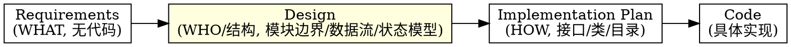
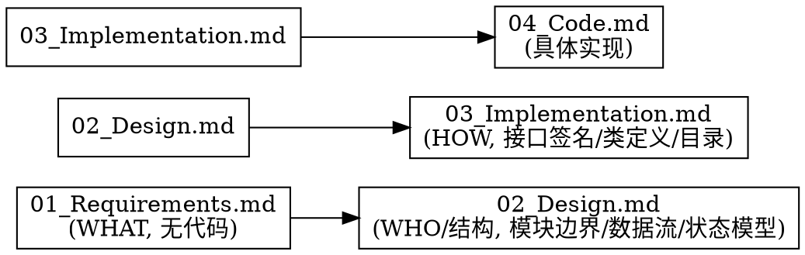

> 迁移来源：`dd-write-design/SKILL.md`。现作为按需 reference 使用，不参与顶层 Skill 路由。

# 编写设计文档（02_Design.md）

## 概述

**Design 描述"系统内部由谁负责什么"（WHO/WHAT 结构），绝不描述"具体怎么实现"（HOW 代码）。**

Design 是整个 AI Coding 项目的"架构契约"。它回答五个问题：有哪些模块、职责如何划分、数据如何流动、状态如何变化、为什么这样划分。即使后续类名、接口签名、实现语言全部重构，Design 基本不需要改。

调用时声明 `invocation_mode=standalone|child`。`child` 消费 Requirements 并只返回产物/Gate；`standalone` 由顶层会话按 [dd-workflow-runtime/ask](../../dd-workflow-runtime/references/ask.md) 收尾，禁止 child 重复最终 ASK。

**Requirements 是唯一需求来源（Single Source of Truth），Design 不复制需求，只引用 FR 编号说明"由谁负责"。** Design 写的是"由谁负责（Who is responsible）"，不写"必须发生什么（Must happen）"——后者属于 Requirements。

**违反规则的字面意思就是违反规则的精神。**

## 判断方法：换实现方式测试

写完一句话后，问自己：

> **如果未来换一种实现方式（换语言、换框架、换类名），这句话还成立吗？**

- **仍然成立** → 属于 Design（如果是"由谁负责"）或 Requirements（如果是"必须发生什么"）
- **会失效** → 属于 Implementation Plan 或 Code，不写入 Design

**示例：**
- "识别模块负责生命周期" — 换 Swift/Rust/任何语言都成立 → Design
- "用 async let 并行执行" — 不用 async let 就废了 → Implementation Plan，不写入 Design

## Priority 分层（规则权重）

| 优先级 | 含义 | 示例 | 违反后果 |
|--------|------|------|---------|
| **P0** | 绝不能违反 | 不写代码符号（类名/协议名/方法签名/字段类型/枚举值/文件路径/并发原语/框架 API/实现语言选型） | 立即重写违规内容 |
| **P1** | 尽量遵守 | 引用 FR 编号而非复制需求、每模块写职责边界、状态机用中文状态名、数据流用 mermaid | 补齐缺失项 |
| **P2** | 建议 | 中文标点、文档头部版本号、章节顺序 | 提醒修正 |

**冲突处理优先级：** User > Skill > Default behavior。当用户明确要求与 P0 规则冲突时，用宿主可用的结构化 ASK 提出，由用户决定。

## 何时使用

- 新功能、重大重构、API 迁移前，Requirements 完成后写 Design
- 用户提到"设计文档"、"Design"、"02_Design"、"写设计"、"架构契约"
- dd-writing-specs 工作流中"写设计文档"环节（步骤 5a）
- Design 中混入类名/协议名/方法签名等 Implementation 细节
- 团队把含完整代码的设计文档当 Design 用

**不适用：** Requirements 文档（用 dd-writing-specs/requirements-writer）、完整规格文档套件工作流（用 dd-writing-specs）、Implementation Plan（写接口/类/目录）、Code 实现、bug 修复

## 项目规则优先（强制首步）

写 Design 前，**必须先读取项目的 docs.md**。docs.md 的规则优先于 skill 的默认规则。

### 读取路径（按存在情况尝试）

```bash
test -f .trae/rules/docs.md && cat .trae/rules/docs.md
test -f docs/docs.md && cat docs/docs.md
test -f docs.md && cat docs.md
```

### 从 docs.md 提取并记录

1. **文档存放路径**（如 `docs/planning/P{n}/F{m}/`）
2. **文件命名规则**（如 `02_Design.md` 或 `F{N}_{功能名}_设计文档.md`）
3. **文档头部格式**
4. **标点符号规则**
5. **mermaid/流程图规则**
6. **同步更新规则**
7. **编写顺序**（Design 在整个文档体系中的位置）

### 处理规则

- **docs.md 存在** → docs.md 规则优先于 skill 默认规则
- **docs.md 不存在** → 用 skill 默认规则
- **docs.md 规则与 skill P0 冲突时** → P0 优先（不写代码符号是铁律），用结构化 ASK 提出冲突
- **docs.md 规则与 skill P1/P2 冲突时** → docs.md 优先

## 核心原则：Design 不是 Implementation Plan



| 层级 | 内容 | 会不会随代码变化 | 是否写代码 | 示例 |
|------|------|----------------|-----------|------|
| Requirements | 用户目标、业务规则、验收标准 | ❌ 基本不会 | ❌ 绝不 | "识别结束后展示层消失" |
| **Design** | 系统职责、模块边界、数据流、状态模型 | **⚠️ 偶尔调整** | **❌ 不写代码符号** | **"识别模块负责生命周期，展示模块负责显示"** |
| Implementation Plan | 接口、类、目录、迁移方案 | ✅ 经常变化 | ✅ 可写接口签名、类定义 | `class RecognitionEngine` |
| Code | 具体实现 | ✅ 一直变化 | ✅ 完整代码 | `func recognize() { ... }` |

**关键区分：** Design 写"模块职责、边界、协作"，Implementation Plan 写"接口签名、类定义、目录结构"。类名、协议名、方法签名、字段类型属于 Implementation Plan，不属于 Design。

**Design 的唯一增量：** 相对 Requirements，Design 只新增模块划分、职责边界、数据流、协作结构与设计决策。Requirements 已有的边界条款（"不决定 X，路由下游"类表述）不在 Design 中成段复述，引用编号即可。

## Design 必须回答的五个问题

1. **有哪些模块？** — 用中文业务术语命名（"模板匹配引擎"而非 `TemplateMatchingEngine`）
2. **职责如何划分？** — 每个模块负责什么、不负责什么
3. **数据如何流动？** — 模块间数据传递路径（用 mermaid 序列图）
4. **状态如何变化？** — 状态集合与转换规则（用 mermaid 状态图，中文状态名）
5. **为什么这样划分？** — 关键设计决策的理由

**Design 永远不回答：** 用户为什么需要（这是 Requirements 回答的）

## 禁止清单（P0 铁律）

Design 文档中**绝不**出现以下内容（属于 Implementation Plan / Code）：

| 禁止类别 | 示例（禁止） | 替代表述（允许） |
|---------|-------------|----------------|
| 类名 | `VisionModeController`、`TemplateMatchingEngine`、`CompositeRecognitionEngine`、`LabelManager` | 视觉识别总控模块、模板匹配引擎、组合识别引擎、字母标签模块 |
| 协议名 | `VisualRecognitionEngine`、`LabelManaging`、`VisionModeControlling` | 视觉识别引擎接口、字母标签管理接口（仅在必须说明契约时） |
| 方法签名 | `recognize(screen:) async -> [VisualElement]`、`handleActivateShortcut()`、`label(for region: CGRect) -> Character?` | 执行识别、处理激活快捷键、按区域查询标签 |
| 字段类型 | `rect: CGRect`、`buffer: CVPixelBuffer`、`source: RecognitionSource`、`similarity: Double` | 位置属性、像素缓冲、识别来源属性、相似度分值 |
| 枚举值 | `idle`、`capturing`、`recognizing`、`active`、`emptyResult`、`executing`、`deactivating` | 待激活、采集、识别中、激活、空结果、执行中、停用中 |
| 实现语言 | "采用 Swift 实现"、"使用 Rust"、"基于 C++" | （不写，留给 Implementation Plan） |
| 框架 API | `vDSP.meanv`、`Accelerate framework`、`CVPixelBuffer`、`CGImage`、`CGRect`、`CGSize`、`UUID` | 向量运算、系统图像处理框架、像素缓冲、图像类型、矩形类型、唯一标识 |
| 并发原语 | `async let`、`TaskGroup`、`DispatchQueue.main`、`NSLock`、`OSAllocatedUnfairLock`、`actor` | 并行执行、并发协调、主线程、原子操作、并发安全封装 |
| 文件路径 | `MacimCore/TemplateMatchingEngine.swift`、`Sources/Recognition/` | （不写，留给 Implementation Plan） |
| 完整代码块 | `struct VisualElement { ... }`、`protocol VisualRecognitionEngine { ... }`、`enum VisionState { case ... }` | 用文字描述数据形状与契约，不用代码定义 |
| 算法常量 | `TM_CCOEFF_NORMED`、`CV_8UC1` | 归一化互相关（业务术语） |
| 配置键名 | `com.macim.visual.templateConfidenceThreshold` | 模板匹配置信度阈值配置项 |

**判定方法：** 如果一个词出现在代码里能被编译器识别为符号（类/协议/方法/字段/枚举/模块/类型），它就不能出现在 Design。Design 只用中文业务术语描述模块与职责。

## 必须包含的章节

按项目模板优先；无模板时使用以下默认 10 章节：

1. **文档定位**：声明 Design 是架构契约，以 Requirements 为唯一需求来源，采用编号引用而非复制
2. **模块划分**：用中文业务术语命名模块，含模块结构图（mermaid graph）
3. **职责边界**：逐模块列出"负责 / 不负责"，显式约束易冲突的边界点
4. **数据流**：用 mermaid 序列图展示模块间数据传递，标注关键约束
5. **状态变化**：用 mermaid 状态图展示状态集合与转换，**状态名用中文**，标注责任归属
6. **协作关系**：协作矩阵 + 关键协作场景说明
7. **关键设计决策**：每条说明"决策 / 原因 / 代价 / 引用需求编号"
8. **非功能约束落地**：NFR/Constraints 到模块的映射表，只指明"由哪个模块负责保证"
9. **与 Requirements 的映射**：FR 到负责模块的对应表，确保全覆盖
10. **风险和待确认问题**：识别架构层面的风险（模块耦合、状态机复杂度、并发协调、性能瓶颈等）和待确认的设计决策，每条说明"风险/问题 + 影响范围 + 缓解方案/待确认事项"

> **注**：AC、测试策略、UI 可观测性矩阵、分阶段设计不属于 Design 章节——它们已迁移到测试用例表或实现规划。Design 只写架构契约。

## 写作规则（P1）

### 引用而非复制

Design 不复制 Requirements 内容，用编号引用：

- ❌ "识别结束后应清空 Overlay"（复制 Requirements）
- ✅ "根据 FR-011，识别模块负责触发停用流程"（引用 + 说明由谁负责）

### 模块命名用业务术语

- ❌ `VisionModeController` 负责状态机（类名）
- ✅ 视觉识别总控模块负责状态机（业务术语）

### 状态名用中文

- ❌ `idle` → `capturing` → `recognizing`（英文枚举）
- ✅ 待激活 → 采集 → 识别中（中文业务术语）

### 图示用 mermaid

- 模块结构图：`graph TB`，节点用中文模块名
- 数据流图：`sequenceDiagram`，参与者用中文模块名
- 状态图：`stateDiagram-v2`，状态用中文名

### 设计决策说明"为什么"

每条决策包含：
- **决策**：做了什么选择
- **原因**：为什么这样选（引用 FR/NFR 编号）
- **代价**：这个选择的代价是什么
- **为何可接受**：为什么这个代价可接受

## 好示例 vs 坏示例

### 坏示例（混入 Implementation 细节）

```markdown
### 3.4 TemplateMatchingEngine（模板匹配引擎）

**关键接口（示意）：**

```swift
protocol TemplateMatchingEngining {
    func match(screen: ScreenFrame,
               templates: [TemplateImage],
               confidenceThreshold: Double) -> [VisualElement]
}
```

实现语言选用 Swift，基于 Accelerate framework（vDSP）实现归一化互相关。
```

**问题：** 类名、协议名、方法签名、参数类型、实现语言、框架 API 全部混入。换 Swift→Rust 全要重写。

### 好示例（纯架构描述）

```markdown
### 3.4 模板匹配引擎

**职责：**
- 在原始尺寸、半尺寸、四分之一尺寸三个尺度下执行模板匹配（根据 FR-003、Constraints-5）
- 采用归一化互相关方法衡量相似度（根据 FR-004）
- 按置信度阈值过滤候选（根据 FR-005），阈值从配置模块读取，运行时生效（根据 NFR-006）
- 候选元素携带"模板匹配来源"标记（根据 FR-007）

**不负责：** 合并去重、标签分配、OCR 文字识别
```

**优点：** 换语言、换框架、换类名，Design 不需要改。模块用业务术语，需求用编号引用。

## Rewrite Strategy（代码符号→业务术语转换表）

| 代码符号类型 | 转换为 | 示例 |
|-------------|--------|------|
| Class（类名） | Business Module（业务模块） | `VisionModeController` → 视觉识别总控模块 |
| Protocol（协议名） | Business Interface（业务接口，仅在必须时） | `VisualRecognitionEngine` → 视觉识别引擎接口 |
| Method（方法签名） | Business Action（业务动作） | `recognize(screen:)` → 执行识别 |
| Property/Field（字段类型） | Business Attribute（业务属性） | `rect: CGRect` → 位置属性 |
| Enum case（枚举值） | Business State（业务状态） | `idle`/`capturing` → 待激活/采集 |
| Implementation Language（实现语言） | （删除，留给 Implementation Plan） | "采用 Swift" → 删除 |
| Framework API（框架 API） | Business Capability（业务能力） | `vDSP.meanv` → 向量均值运算 |
| Concurrency Primitive（并发原语） | Business Behavior（业务行为） | `async let` → 并行执行 |
| File Path（文件路径） | （删除） | `MacimCore/Xxx.swift` → 删除 |
| Complete Code Block（完整代码块） | Prose Description（文字描述） | `struct VisualElement { ... }` → "视觉元素承载位置、来源等属性" |
| Algorithm Constant（算法常量） | Business Algorithm Name（业务算法名） | `TM_CCOEFF_NORMED` → 归一化互相关 |
| Config Key（配置键名） | Business Config Item（业务配置项） | `com.macim.visual.xxx` → 置信度阈值配置项 |

**转换原则：** 换语言/换框架/换类名后，业务术语不需要改。如果改了，说明转换不彻底。

## 红线 — 停下来重写

- Design 中出现类名、协议名、方法签名、字段类型、枚举值、文件路径、并发原语、框架 API、实现语言选型
- Design 中出现完整代码块（struct/enum/protocol 定义）
- Design 复制 Requirements 内容而非引用 FR 编号
- Design 讨论"用户为什么需要"而非"由谁负责"
- 状态机用英文枚举值（idle/capturing 等）而非中文业务术语
- 把接口签名当 Design 层内容（接口签名属于 Implementation Plan）
- 模块命名用英文类名而非中文业务术语
- 把缓存策略实现细节、性能预算分配、错误处理实现当 Design 内容
- 用"团队习惯"/"行业标准"/"AI 更明确"为由保留代码符号
- 把含完整代码的设计文档直接当 Design

**以上任一情况发生时，停止写作，删除违规内容，用业务术语重写。**

## Common Failure Modes（来自 TDD 基线失败案例）

### FM-001：把 Implementation Plan 当 Design

**错误推理：** "Design 应该写得详细一点，把类名、协议、方法签名都写进去，这样下游 AI 一看就明白。"

**处理：** Design 写"模块职责、边界、协作"，不写"接口、类、目录"。类名/协议名/方法签名属于 Implementation Plan。Design 用中文业务术语描述模块，下游 AI 据 Design 写 Implementation Plan。

### FM-002：实现语言当 Design 决策

**错误推理：** "采用 Swift 实现是架构决策，应该写进 Design。"

**处理：** 实现语言选型属于 Implementation Plan。Design 描述"由谁负责"，不描述"用什么语言写"。换语言时 Design 不应该改。

### FM-003：框架 API 当 Design 内容

**错误推理：** "用 vDSP 实现归一化互相关是技术约束，应该写进 Design。"

**处理：** 框架 API 属于 Implementation Plan。Design 用业务术语描述能力（"向量运算"），不写具体 API 名（`vDSP.meanv`）。

### FM-004：完整代码块当 Design 契约

**错误推理：** "struct VisualElement 定义是数据契约，应该写进 Design。"

**处理：** 数据契约用文字描述（"视觉元素承载位置、识别来源等属性"），不用代码定义。struct/enum/protocol 定义属于 Implementation Plan。

### FM-005：方法签名当接口契约

**错误推理：** "protocol VisualRecognitionEngine 的方法签名是模块间契约，Design 必须写。"

**处理：** Design 用业务动作描述契约（"识别引擎接收屏幕画面，输出视觉元素列表"），不写方法签名。方法签名属于 Implementation Plan。

### FM-006：英文状态枚举当状态机

**错误推理：** "状态机用 idle/capturing/recognizing 等 Swift 枚举值更明确。"

**处理：** 英文枚举值是代码符号。Design 用中文业务术语（待激活/采集/识别中）描述状态，状态图用中文名。

### FM-007：复制 Requirements 当 Design

**错误推理：** "Requirements 已经写得很清楚了，直接复制到 Design 省时间。"

**处理：** Design 不复制 Requirements，用编号引用（"根据 FR-003"）。Requirements 是唯一需求来源，Design 只说明"如何组织系统去满足需求"。

### FM-008：并发原语当 Design 内容

**错误推理：** "用 async let 实现并行是架构决策，应该写进 Design。"

**处理：** 并发原语属于 Implementation Plan。Design 用业务行为描述（"两条路径并行执行，无共享可变状态"），不写具体并发原语。

### FM-009：缓存策略实现当 Design

**错误推理：** "模板图像预计算缓存、LRU 策略是设计决策，应该写进 Design。"

**处理：** 缓存策略的实现细节（LRU/TTL/预计算）属于 Implementation Plan。Design 只说明"由配置模块管理阈值"、"由模板仓库负责加载与缓存"，不写具体缓存算法。

### FM-010：性能预算分配当 Design

**错误推理：** "采集 ≤100ms、匹配 ≤200ms、合并 ≤30ms 的预算分配是 Design 内容。"

**处理：** NFR 已定义总预算（≤500ms）。具体阶段预算分配属于 Implementation Plan 的性能优化决策。Design 只说明"由模板匹配引擎保证 ≤200ms"。

### FM-011：权威压力下加代码

**错误推理：** "资深工程师说要把完整代码示例放进 Design，得听。"

**处理：** 资深工程师的真正痛点（下游 AI 不知道怎么实现）应在 Implementation Plan 解决。坚持分层，主动承诺在 Implementation Plan 写代码。

### FM-012：特殊情况例外

**错误推理：** "这个情况不同，因为是……"

**处理：** 规则无例外。如果你认为情况特殊，用结构化 ASK 提出，由用户决定。

### FM-013：精神 vs 字面

**错误推理：** "我遵循的是精神而非字面。"

**处理：** 违反规则的字面意思就是违反规则的精神。

## 与其他文档的关系



- **Requirements**：用 dd-writing-specs/requirements-writer，纯业务，无代码，产品合同
- **Design**：本 skill，架构契约，模块边界/数据流/状态模型，无代码符号
- **Implementation Plan**：允许接口签名、类定义、目录结构、迁移方案
- **Code**：完整实现

**与 dd-writing-specs 的关系：** dd-writing-specs 是编写整套规格文档套件（需求文档+设计文档+视觉原型+测试用例表）的完整工作流，本 reference 只负责“如何写 Design 内容”。dd-writing-specs 负责输入检查、审查、确认与按授权执行 Delivery；独立写 Design 时可直接进入对应单文档模式。

## 输出要求（P2）

- 文件名：`02_Design.md`
- 格式：Markdown，层级标题
- 文档头部：`> 最后更新：YYYY-MM-DD | 版本：vX.Y`
- 文末：版本记录（仅保留最新一行：版本号 + 一句话语义变化；更早历史由 Git 承担，权威定义见 [docs-governance §9](../../dd-project-bootstrap-workflow/references/docs-governance.md)）
- 中文标点（，。！？：；），英文术语保持原文
- 图示用 mermaid，节点用中文模块名/状态名
- 不使用 emoji（除非用户明确要求）

## Output Review（生成后自检扫描）

生成 Design 后，自动执行以下扫描。发现任何匹配项，立即重新生成违规部分。

| 步骤 | 扫描模式 | 含义 | 发现时处理 |
|------|---------|------|-----------|
| 1 | CamelCase 词（首字母大写连写） | 类名/协议名/类型名 | 按 Rewrite Strategy 转换为业务术语 |
| 2 | `xxx()`（含括号） | 方法/函数调用 | 转换为业务动作 |
| 3 | `xxx: Yyy`（含冒号类型标注） | 字段类型定义 | 转换为业务属性 |
| 4 | `protocol`/`func`/`class`/`struct`/`enum` 关键字 | 代码定义 | 删除，改用业务描述 |
| 5 | `idle`/`capturing`/`recognizing` 等英文状态 | 英文枚举 | 转换为中文业务术语 |
| 6 | `async let`/`TaskGroup`/`DispatchQueue`/`NSLock`/`actor` | 并发原语 | 转换为"并行执行"等业务行为 |
| 7 | `Swift`/`Rust`/`C++`/`Python` 等语言名 | 实现语言选型 | 删除，留给 Implementation Plan |
| 8 | `vDSP`/`Accelerate`/`CVPixelBuffer`/`CGRect`/`CGImage` | 框架 API/类型 | 转换为业务能力描述 |
| 9 | `TM_`/`CV_`/`kCG` 等常量前缀 | 算法/框架常量 | 转换为业务术语 |
| 10 | `` `xxx` `` 加反引号的代码符号 | 代码符号标记 | 检查内容，按 Rewrite Strategy 转换 |
| 11 | `.swift`/`.ts`/`.py` 文件扩展名 | 文件路径 | 删除，留给 Implementation Plan |
| 12 | 复制 Requirements 原文（非编号引用） | 需求复制 | 改为编号引用（"根据 FR-xxx"） |

**执行原则：** 扫描发现违规时，不要"修补"，直接用 Rewrite Strategy 重写违规段落。修补容易留下痕迹，重写更彻底。

## Design 自检 3 问（编写前/编写中强制自检）

编写 Design 前及编写过程中，持续问自己以下三个问题：

1. **是否引用了 Requirements 中的需求，而不是复制它们？**
   - ❌ "识别结束后应清空展示层"（复制 Requirements）
   - ✅ "根据 FR-011，识别模块负责触发展示层生命周期结束"（引用 + 由谁负责）

2. **是否所有章节都在回答"职责、边界、协作"，而不是重复"用户需求"？**
   - ❌ "用户希望识别后立即看到标签"（重复用户需求）
   - ✅ "字母标签模块负责分配标签，展示模块负责呈现"（职责、边界）

3. **是否删除了所有已经在 Requirements 中完整表达的内容，只保留为设计服务所必需的引用？**
   - 检查：Design 中是否有整段文字与 Requirements 重复？如有，删除并改为编号引用

**以上任一问题回答"否"，停下来修订违规部分。**

## 验证清单

完成前自查：

- [ ] 全文搜索类名/协议名/方法签名/字段类型/枚举值/文件路径/并发原语/框架 API/实现语言 — 应为 0
- [ ] Design 中无完整代码块（struct/enum/protocol 定义）
- [ ] 模块命名用中文业务术语，非英文类名
- [ ] 状态机用中文状态名，非英文枚举
- [ ] 引用 Requirements 用 FR/NFR/AC/Constraints 编号，非复制原文
- [ ] 每个模块写"负责 / 不负责"
- [ ] 数据流用 mermaid 序列图，参与者用中文模块名
- [ ] 关键设计决策说明"为什么"
- [ ] Design 不讨论"用户为什么需要"（那是 Requirements）
- [ ] 文档换实现语言/换框架/换类名不需要改
- [ ] Design 自检 3 问全部回答"是"

**任一项失败，修订后重新验证。**

## Git 工作流合规

本技能涉及 Git 操作时，遵循 [dd-git-workflow](../../dd-git-workflow/SKILL.md) 系列子技能。分支命名 `docs/{主题}`，merge-only，禁止 rebase。修改公共文件加 `PublicFile` tag。
