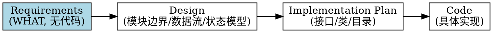
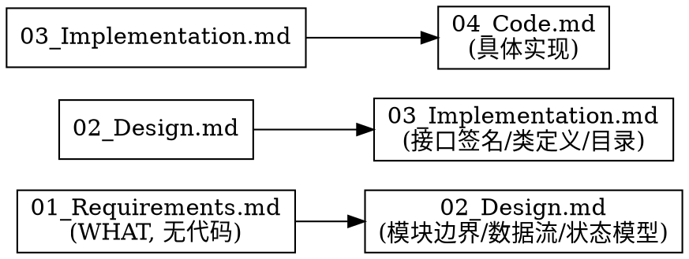

> 迁移来源：`dd-writing-specs/requirements-writer/SKILL.md`。现作为按需 reference 使用，不参与顶层 Skill 路由。

# 编写需求文档（01_Requirements.md）

## 概述

**Requirements 只描述"系统应该是什么"（WHAT），绝不描述"系统怎么实现"（HOW）。**

Requirements 是整个 AI Coding 项目的"产品合同"与"唯一真实需求来源（Single Source of Truth）"。它回答五个问题：为什么做、解决什么问题、用户看到什么、系统必须做到什么、成功标准是什么。即使后续架构、类名、设计模式全部重构，Requirements 基本不需要改。

调用时声明 `invocation_mode=standalone|child`。`child` 消费上游 seed 并只返回产物/Gate；`standalone` 由顶层会话按 [dd-workflow-runtime/ask](../../dd-workflow-runtime/references/ask.md) 收尾，禁止 child 重复最终 ASK。

**Requirements 写的是"必须发生什么（Must happen）"，不关心"由谁负责"。** 例如"识别结束后必须清空展示层"是 Requirements；"识别模块负责触发清空"是 Design。

**违反规则的字面意思就是违反规则的精神。**

## Priority 分层（规则权重）

规则按重要性分为三级，AI 执行时按优先级处理：

| 优先级 | 含义 | 示例 | 违反后果 |
|--------|------|------|---------|
| **P0** | 绝不能违反 | 不写代码符号（类名/协议名/方法名/字段名/枚举值/配置键名/并发原语/框架 API） | 立即重写违规内容 |
| **P1** | 尽量遵守 | 12 章节齐全、FR 可观察、NFR 可测量、AC 用 Given/When/Then、每个 FR 至少一个 AC | 补齐缺失项 |
| **P2** | 建议 | 中文标点、无模糊词（优化/改进/更好）、文档头部版本号 | 提醒修正 |

**冲突处理优先级：** User > Skill > Default behavior。当用户明确要求与 P0 规则冲突时，用宿主可用的结构化 ASK 提出，由用户决定。

## 何时使用

- 新功能、重大重构、API 迁移前，先写 Requirements
- 用户提到"需求文档"、"Requirements"、"01_Requirements"、"写需求"、"产品合同"
- dd-writing-specs 工作流中"写需求文档"环节（步骤 2）
- 团队把含代码的设计文档当 Requirements 用
- 用户问"设计文档要不要写代码"

**不适用：** bug 修复（用 dd-bug-fix-workflow）、独立写设计文档（用 dd-writing-specs/design-writer）、完整规格文档套件工作流（用 dd-writing-specs）、实现指南、纯文档修改

## 项目规则优先（强制首步）

写 Requirements 前，**必须先读取项目的 docs.md**。docs.md 的规则优先于 skill 的默认规则。这与 dd-writing-specs 步骤 0 的机制一致。

### 读取路径（按存在情况尝试）

```bash
test -f .trae/rules/docs.md && cat .trae/rules/docs.md
test -f docs/docs.md && cat docs/docs.md
test -f docs.md && cat docs.md
```

### 从 docs.md 提取并记录

1. **文档存放路径**（如 `docs/planning/P{n}/F{m}/`）
2. **文件命名规则**（如 `01_Requirements.md` 或 `F{N}_{功能名}_需求文档.md`）
3. **文档头部格式**（如 `> 最后更新：YYYY-MM-DD | 版本：vX.Y`）
4. **标点符号规则**（中文标点/英文术语保持原文）
5. **mermaid/流程图规则**（格式兼容版本、是否允许中文标点）
6. **同步更新规则**（修改 Requirements 时是否需要同步更新其他文档）
7. **编写顺序**（Requirements 在整个文档体系中的位置）

### 处理规则

- **docs.md 存在** → docs.md 规则优先于 skill 默认规则（路径/命名/头部格式等）
- **docs.md 不存在** → 用 skill 默认规则
- **docs.md 规则与 skill P0 冲突时** → P0 优先（不写代码符号是铁律），用结构化 ASK 提出冲突
- **docs.md 规则与 skill P1/P2 冲突时** → docs.md 优先（项目约定 > 通用建议）

### 注意

skill 保持通用性，不固化任何项目特定规则。项目规则由 docs.md 动态提供，skill 只提供默认规则与读取机制。

## 核心原则：WHAT 不是 HOW



| 层级 | 内容 | 会不会随代码变化 | 是否写代码 | AI 是否遵守 |
|------|------|----------------|-----------|-----------|
| Requirements | 用户目标、业务规则、验收标准 | ❌ 基本不会 | ❌ 绝不 | ✅ 必须遵守 |
| Design | 系统职责、模块边界、数据流、状态模型 | ⚠️ 偶尔调整 | ❌ 不写代码符号 | ✅ 必须遵守 |
| Implementation Plan | 接口、类、目录、迁移方案 | ✅ 经常变化 | ✅ 可写接口签名/类定义 | ❌ 可参考可优化 |
| Code | 具体实现 | ✅ 一直变化 | ✅ 完整代码 | ❌ 可参考可优化 |

**关键区分：** Design 写"模块职责、边界、协作"，Implementation Plan 写"接口签名、类定义、目录结构"。接口签名属于 Implementation Plan，不属于 Design。

## 判断方法：换实现方式测试

写完一句话后，问自己：

> **如果未来换一种实现方式（换语言、换框架、换类名），这句话还成立吗？**

- **仍然成立** → 属于 Requirements 或 Design（视"Must happen vs Who is responsible"而定）
- **会失效** → 属于 Implementation Plan 或 Code，不写入 Requirements

**示例：**
- "Overlay 必须支持更新" — 换 Swift/Qt/Flutter 都成立 → Requirements
- "OverlayProvider 提供 render()" — 不用 Provider 或不用 render() 就废了 → Implementation Plan，不写入 Requirements

## 禁止清单（P0 铁律）

Requirements 文档中**绝不**出现以下内容：

| 禁止类别 | 示例（禁止） | 替代表述（允许） |
|---------|-------------|----------------|
| 类名 | `TemplateMatchingEngine`、`VisionModeController`、`VisualElement` | 模板匹配引擎、视觉模式控制器、视觉元素 |
| 协议名 | `VisualRecognitionEngine`、`OverlayContentProviding` | 视觉识别引擎接口、覆盖层内容提供方接口 |
| 方法名 | `detectTextRectangles()`、`cachedTemplateLabels()`、`render()` | 检测文本区域、查询模板标签缓存、渲染 |
| 字段名 | `source: VisualSource`、`templateConfidenceThreshold` | 识别来源属性、模板匹配置信度阈值 |
| 枚举值 | `.ocr`、`.template`、`.coreML`、`idle`、`capturing`、`recognizing` | OCR 来源、模板匹配来源、机器学习模型来源；待激活、采集、识别中 |
| 状态机英文状态名 | `idle`、`capturing`、`recognizing`、`active`、`emptyResult`、`executing`、`deactivating` | 待激活、采集、识别中、已激活、空结果、执行中、停用中 |
| 算法枚举名 | `TM_CCOEFF_NORMED`、`CV_8UC1`、`kCGEventFlagsMask` | 业务术语"归一化互相关"（不写 OpenCV 常量名） |
| 模块名 | MacimCore、`com.macim.visual.*` | （不写，留给 Design/Implementation） |
| 配置键名 | `com.macim.visual.templateConfidenceThreshold` | 模板匹配置信度阈值配置项 |
| 并发原语 | `async let`、`TaskGroup`、`DispatchQueue.main`、`NSLock` | 并行执行、并发协调、主线程 |
| 实现技术 | Accelerate framework、vDSP、NCC 算法、Metal | （除非属于业务约束，否则不写；技术选型放 Design） |
| 文件路径 | `MacimCore/TemplateMatchingEngine.swift` | （不写） |
| 框架 API | `vDSP.meanv`、`vImageMatrixMultiply`、`CGEvent` | 向量运算、图像处理、系统事件 |

**判定方法：** 如果一个词出现在代码里能被编译器识别为符号（类/协议/方法/字段/枚举/模块），它就不能出现在 Requirements。**包括英文枚举值**——即使团队习惯用 `idle`/`capturing`，Requirements 中也要用中文业务术语"待激活"/"采集"，在 Terminology 章节建立映射。

## 必须包含的 12 章节

按项目模板优先；无模板时使用以下默认 12 章节。**每章都不可跳过**。

1. **Background（背景）**：为什么做。只描述事实与业务上下文，不提方案
2. **Problem Statement（问题定义）**：现状哪里不好。每条可验证，不写"代码太乱"
3. **Goals（目标）**：成功是什么样。描述结果，不描述实现
4. **Scope（范围）**：本次包含什么（仅写"包含"，"不包含"的事项统一放第 9 节 Out of Scope，避免两节重复）。防止 AI 顺手改一百个文件
5. **Functional Requirements（功能需求）**：编号 FR-001 起。只描述可观察行为，绝不出现类名/方法名
6. **Non-functional Requirements（非功能需求）**：性能/内存/线程/稳定性/用户体验。用可测量描述
7. **Constraints（约束）**：兼容性、依赖、不可改的 API。**业务约束可写，技术实现约束放 Design**
8. **Acceptance Criteria（验收标准）**：编号 AC-1 起。用 Given/When/Then。每个 FR 至少被一个 AC 覆盖；AC 描述场景，可覆盖多个 FR（场景化 AC 优于一对一映射）
9. **Out of Scope（明确不做）**：明确不做的事项唯一清单（所有"不做"条目集中于此，与 Scope 不重复）。防止 AI"顺便帮你改一下"
10. **Terminology（术语）**：定义业务术语，**不是代码符号**。防止 Label/Text/TextBox/Region 混用
11. **Decision Freedom（实现自由度）**：告诉 AI 哪些可自由发挥（架构/拆类/命名）、哪些禁止改（公共 API/数据格式/协议语义）
12. **Future Considerations（未来扩展）**：未来可能增加什么。让 AI 设计时避免堵死路

## 写作规则（P1）

每条 Requirements 应该是：
- **可观察**：用户/外部能感知的行为，不是内部状态
- **可测试**：能写出 Given/When/Then
- **无歧义**：只有一种理解方式
- **技术无关**：换语言/换框架，Requirements 不需要改

**禁止的模糊词：** optimize、improve、better、cleaner、modern、优化、改进、更好

**替换为可测量：**
- ❌ "提升 OCR 性能"
- ✅ "OCR 结果应在识别完成后 150ms 内呈现"

**NFR 展缓机制（当指标依赖实测基线时）：**

当 NFR 指标门槛依赖实现期实测基线（如性能指标受新增功能运行时开销影响）时，允许展缓确定，但必须满足：

- 写明"展缓到 {阶段} 基于 {基线来源} 设定"
- 写明展缓原因（为什么现在不能确定）
- 写明负责确定的阶段（哪个阶段必须落地数值）
- 列出待确定的指标项（不空泛展缓整个 NFR 章节）

**示例：**

```markdown
NFR-001：排列完成时间 P95 展缓到 F1 实现期确定，基于 P0 探针实测基线设定门槛。
展缓原因：F1 新增的健壮性功能（Space/App 切换监听、超时计时器、session 快照）引入运行时开销，需实测后才能设定合理门槛。
待确定指标：2/5/9 窗口场景的排列时间 P95 门槛。
```

**禁止：** 用展缓逃避"可测量"要求。展缓只适用于确实依赖实测基线的指标，不适用于可靠性、兼容性等可当场确定的 NFR。

## 好示例 vs 坏示例

### 坏示例（混入代码细节）

```markdown
FR-001：TemplateMatchingEngine 必须实现 VisualRecognitionEngine 协议（位于 MacimCore）。
FR-002：CompositeRecognitionEngine 使用 async let 并行调用 ocrEngine 与 templateEngine。
FR-003：VisionModeController 通过 recognitionEngine.cachedTemplateLabels()[rect] 填充 label。
NFR-001：NCC 计算必须使用 Accelerate framework 的 vDSP.meanv API。
Constraints-1：配置项 com.macim.visual.templateConfidenceThreshold 默认 0.8。
```

**问题：** 类名、协议名、方法签名、并发原语、API 名、配置键名全部混入。换 Swift→Rust 全要重写。

### 好示例（纯业务描述）

```markdown
FR-001：识别启动后，识别结果展示层必须立即出现。
FR-002：OCR 识别与模板匹配必须并行执行，总耗时接近较慢一路，而非两者之和。
FR-003：模板匹配产生的元素必须能展示与 OCR 元素统一的字母标签。
NFR-001：单次识别端到端延迟 ≤ 500ms，其中模板匹配部分 ≤ 200ms。
Constraints-1：模板匹配置信度阈值默认 0.8，支持运行时修改即时生效。
```

**优点：** 换语言、换框架、换类名，Requirements 不需要改。AI 有实现自由度。

## Rewrite Strategy（代码符号→业务术语转换表）

遇到代码符号时，按以下策略转换。不仅说"不要写什么"，还说"怎么改"。

| 代码符号类型 | 转换为 | 示例 |
|-------------|--------|------|
| Class（类名） | Business Role（业务角色） | `TemplateMatchingEngine` → 模板匹配引擎 |
| Protocol（协议名） | Business Interface（业务接口） | `VisualRecognitionEngine` → 视觉识别引擎接口 |
| Function/Method（方法名） | Business Action（业务动作） | `detectTextRectangles()` → 检测文本区域 |
| Property/Field（字段名） | Business Attribute（业务属性） | `source: VisualSource` → 识别来源属性 |
| Enum case（枚举值） | Business State/Category（业务状态/类别） | `.ocr`/`.template` → OCR 来源/模板匹配来源 |
| English enum（英文枚举） | Chinese business term（中文业务术语） | `idle`/`capturing` → 待激活/采集 |
| Algorithm constant（算法常量） | Business algorithm name（业务算法名） | `TM_CCOEFF_NORMED` → 归一化互相关 |
| Config key（配置键名） | Business config item（业务配置项） | `com.macim.visual.xxx` → 模板匹配置信度阈值配置项 |
| Concurrency primitive（并发原语） | Business behavior（业务行为） | `async let` → 并行执行 |
| Framework API（框架 API） | Business capability（业务能力） | `vDSP.meanv` → 向量均值运算 |
| Module name（模块名） | （不写，留给 Design） | MacimCore → 删除 |
| File path（文件路径） | （不写） | `MacimCore/Xxx.swift` → 删除 |

**转换原则：** 换语言/换框架/换类名后，业务术语不需要改。如果改了，说明转换不彻底。

## AC 写作模板

```markdown
### AC-1：识别启动后展示层出现

**Given** 视觉识别模式未激活
**When** 用户按下激活快捷键
**Then** 识别完成后，识别结果展示层立即出现，展示层内每个可识别元素对应一个字母标签
```

**禁止：** 在 Then 里写"调用 `XXXManager.render()` 渲染 Overlay"。

## 12 章节速查

| 章节 | 核心问题 | 代码细节 | 篇幅 |
|------|---------|---------|------|
| Background | 为什么做 | ❌ | 短 |
| Problem | 现状哪里不好 | ❌ | 短，可验证 |
| Goals | 成功是什么样 | ❌ | 短，结果导向 |
| Scope | 做什么（仅包含） | ❌ | 清单 |
| FR | 系统应做什么 | ❌ 绝不 | 编号，可观察 |
| NFR | 质量要求 | ❌ | 可测量 |
| Constraints | 边界 | ⚠️ 仅业务约束 | 清单 |
| AC | 如何验证 | ❌ | Given/When/Then |
| Out of Scope | 明确不做（唯一清单，不与 Scope 重复） | ❌ | 清单 |
| Terminology | 业务术语 | ❌ 绝不写代码符号 | 字典 |
| Decision Freedom | AI 自由度 | ❌（描述边界） | 允许/禁止清单 |
| Future | 未来可能 | ❌ | 信息性 |

## 红线 — 停下来重写

- FR/NFR/AC 章节出现类名、协议名、方法名、字段名、枚举值、配置键名、并发原语、框架 API
- Goals/Scope/Constraints 章节出现实现技术选型（如"使用 vDSP"、"用 async let"）
- Terminology 章节把类名/协议名当术语定义
- 跳过 Terminology 或 Decision Freedom 章节
- 用"优化"、"改进"、"更好"等模糊词
- 把含代码的设计文档直接改名当 Requirements
- FR 描述内部状态而非可观察行为
- **保留英文状态机枚举值**（idle/capturing/recognizing 等）而非中文业务术语
- **保留算法常量名**（`TM_CCOEFF_NORMED` 等）而非业务术语
- 用"团队习惯"/"行业标准"/"AI 更明确"为由保留代码符号

**以上任一情况发生时，停止写作，删除违规内容，用业务术语重写。**

## Common Failure Modes（来自 TDD 基线失败案例）

每条来自真实压力测试中观察到的失败模式，作为回归知识库。Agent 匹配到"我现在正犯这个错"时，按处理方式修正。

### FM-001：类名当业务术语

**错误推理：** "类名（如 TemplateMatchingEngine）已经成为团队通用术语，写进 Requirements 更明确。"

**处理：** 仍视为代码符号，改写为业务角色（"模板匹配引擎"）。类名放 Design Spec。

### FM-002：实现技术当业务约束

**错误推理：** "使用 vDSP/Accelerate 是技术约束，应该写进 Constraints。"

**处理：** 业务约束（macOS 13+、不新增依赖）可写。技术选型（用哪个向量运算库）属于 Design 决策，不写。

### FM-003：类名当术语定义

**错误推理：** "TemplateMatchingEngine 是术语，应该写进 Terminology。"

**处理：** Terminology 定义业务术语（识别会话、视觉元素），不是代码符号表。改为"模板匹配：通过预置图像匹配屏幕元素的技术"。

### FM-004：配置键名当 FR

**错误推理：** "配置项 com.macim.visual.templateConfidenceThreshold 是 FR 的一部分。"

**处理：** FR 描述行为（"阈值可配置且运行时生效"），配置键名属于实现。写键名让 Requirements 绑定到具体配置系统。

### FM-005：方法名当流程描述

**错误推理：** "detectTextRectangles() 是流程描述，写进 FR 没问题。"

**处理：** 流程用业务动作描述（"检测文本区域"）。方法名是 Design 层的接口契约，写进 Requirements 等于锁死 API 签名。

### FM-006：复用设计文档当 Requirements

**错误推理：** "时间紧，这份含代码的设计文档直接改名当 Requirements 省时间。"

**处理：** 含代码的设计文档当 Requirements 等于跳过需求层。下游基于错误前提，返工成本是重写的 10 倍。重写纯业务描述。

### FM-007：跳过 Terminology/Decision Freedom

**错误推理：** "Terminology 和 Decision Freedom 不重要，跳过早点结束。"

**处理：** Terminology 防止术语混用（Label/Text/TextBox），Decision Freedom 是 AI Coding 核心章节（告诉 AI 哪些可自由发挥）。跳过 = AI 跑偏。必须写完 12 章节。

### FM-008：权威压力下加类名

**错误推理：** "资深工程师说要加类名，得听。"

**处理：** 资深工程师的真正痛点（AI 不知道复用什么）应在 Design Spec 解决。坚持分层，主动承诺在 Design Spec 写类名。

### FM-009：保留英文状态枚举

**错误推理：** "团队习惯用英文状态名（idle/capturing），保留更亲切。"

**处理：** 英文枚举值是代码符号。Requirements 用中文业务术语（待激活/采集），在 Terminology 建立映射。Design Spec 可以用英文枚举名。

### FM-010：算法常量名当行业标准

**错误推理：** "TM_CCOEFF_NORMED 是行业标准，写进去 AI 更明确。"

**处理：** 行业标准常量名是代码符号。用业务术语"归一化互相关"描述算法，常量名放 Design/Implementation。

### FM-011：快捷键符号混淆

**错误推理：** "快捷键符号 ⌘⇧V 是代码细节吗？"

**处理：** 不是。快捷键是用户交互方式，属于业务需求，可以保留。但 `kVK_Command` 等键码常量是代码符号，禁止。

### FM-012：特殊情况例外

**错误推理：** "这个情况不同，因为是……"

**处理：** 规则无例外。如果你认为情况特殊，用结构化 ASK 提出，由用户决定。

### FM-013：精神 vs 字面

**错误推理：** "我遵循的是精神而非字面。"

**处理：** 违反规则的字面意思就是违反规则的精神。

## 常见错误

| 错误 | 修复 |
|------|------|
| FR 写"XXXManager 调用 XXXAPI" | 改为业务动作："识别启动后展示层出现" |
| Goals 写"使用 vDSP 实现 NCC" | 改为结果："模板匹配引擎能在 200ms 内识别预置模板" |
| Constraints 写"必须使用 async let" | 改为业务约束："OCR 与模板匹配必须并行，总耗时接近较慢一路" |
| AC 的 Then 写"调用 render() 渲染" | 改为可观察结果："展示层出现，每个元素显示字母标签" |
| Terminology 定义"TemplateMatchingEngine：模板匹配引擎类" | 改为业务术语："模板匹配：通过预置图像匹配屏幕元素的技术" |
| Decision Freedom 只写"允许"不写"禁止" | 必须双向：允许（架构/拆类/命名）+ 禁止（改公共 API/数据格式/协议语义） |
| 把设计文档的章节直接复制到 Requirements | 重写：去除所有代码细节，只保留业务描述 |
| FR-011 写"状态机包含 idle/capturing/recognizing 状态" | 改为中文业务术语："状态机包含待激活、采集、识别中等状态"，Terminology 建立映射 |
| NFR 写"使用 NCC 算法（等价于 TM_CCOEFF_NORMED）" | 改为业务术语："使用归一化互相关方法衡量相似度"，常量名放 Design |
| AC 的 Then 写"source 字段等于 .ocr" | 改为业务描述："该元素的识别来源属性为 OCR 来源" |

## 与其他文档的关系



- **Requirements**：本 skill，纯业务，无代码，产品合同（Single Source of Truth）
- **Design**：用 dd-writing-specs/design-writer，架构契约，模块边界/数据流/状态模型，无代码符号
- **Implementation Plan**：允许接口签名、类定义、目录结构、迁移方案
- **Code**：完整实现，明确标注"推荐实现，非约束"

## 输出要求（P2）

- 文件名：`01_Requirements.md`
- 格式：Markdown，层级标题
- FR 编号：FR-001 起
- AC 编号：AC-1 起
- 文档头部：`> 最后更新：YYYY-MM-DD | 版本：vX.Y`
- 文末：版本记录列表
- 中文标点（，。！？：；），英文术语保持原文
- 不使用 emoji（除非用户明确要求）

## Output Review（生成后自检扫描）

生成 Requirements 后，自动执行以下扫描。发现任何匹配项，立即重新生成违规部分。**这一步比几十条 Rule 更有效——即使 AI 在写作时违规，自检扫描能兜底。**

| 步骤 | 扫描模式 | 含义 | 发现时处理 |
|------|---------|------|-----------|
| 1 | CamelCase 词（首字母大写连写） | 类名/协议名/类型名 | 按 Rewrite Strategy 转换为业务术语 |
| 2 | `xxx()`（含括号） | 方法/函数调用 | 转换为业务动作 |
| 3 | `xxx.yyy`（含点号调用） | API 调用/枚举值 | 转换为业务描述 |
| 4 | `protocol`/`func`/`class`/`struct`/`enum` 关键字 | 代码定义 | 删除，改用业务描述 |
| 5 | `.ocr`/`.template`/`.coreML` 等 `.小写` 开头 | 枚举值 | 转换为业务类别 |
| 6 | `idle`/`capturing`/`recognizing` 等英文状态 | 英文枚举 | 转换为中文业务术语 |
| 7 | `async let`/`TaskGroup`/`DispatchQueue`/`NSLock` | 并发原语 | 转换为"并行执行"等业务行为 |
| 8 | `com.xxx.xxx` 配置键名格式 | 配置键名 | 转换为业务配置项名 |
| 9 | `TM_`/`CV_`/`kCG` 等常量前缀 | 算法/框架常量 | 转换为业务术语 |
| 10 | 加反引号的代码符号 `` `xxx` `` | 代码符号标记 | 检查内容，按 Rewrite Strategy 转换 |

**执行原则：** 扫描发现违规时，不要"修补"，直接用 Rewrite Strategy 重写违规段落。修补容易留下痕迹，重写更彻底。

## 验证清单

完成前自查：

- [ ] 全文搜索类名/协议名/方法名/字段名/枚举值/配置键名/并发原语/框架 API — 应为 0
- [ ] 每条 FR 是可观察行为，不是内部状态
- [ ] 每条 NFR 可测量
- [ ] 每个 FR 至少被一个 AC 覆盖（AC 可跨 FR，描述场景而非一对一）
- [ ] AC 用 Given/When/Then
- [ ] 12 章节全部存在
- [ ] Terminology 只定义业务术语，无代码符号
- [ ] Decision Freedom 双向（允许 + 禁止）
- [ ] 无"优化/改进/更好"等模糊词
- [ ] 文档换语言/换框架不需要改
- [ ] Scope 不写"不包含"，所有"不做"条目集中在 Out of Scope（唯一清单，两节无重复）

**任一项失败，修订后重新验证。**

## Git 工作流合规

本技能涉及 Git 操作时，遵循 [dd-git-workflow](../../dd-git-workflow/SKILL.md) 系列子技能。分支命名 `docs/{主题}`，merge-only，禁止 rebase。修改公共文件加 `PublicFile` tag。
