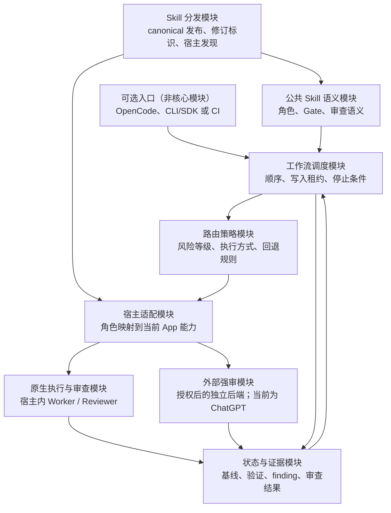
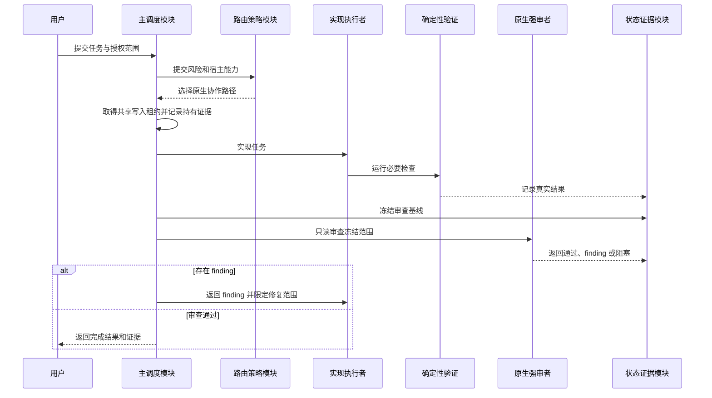
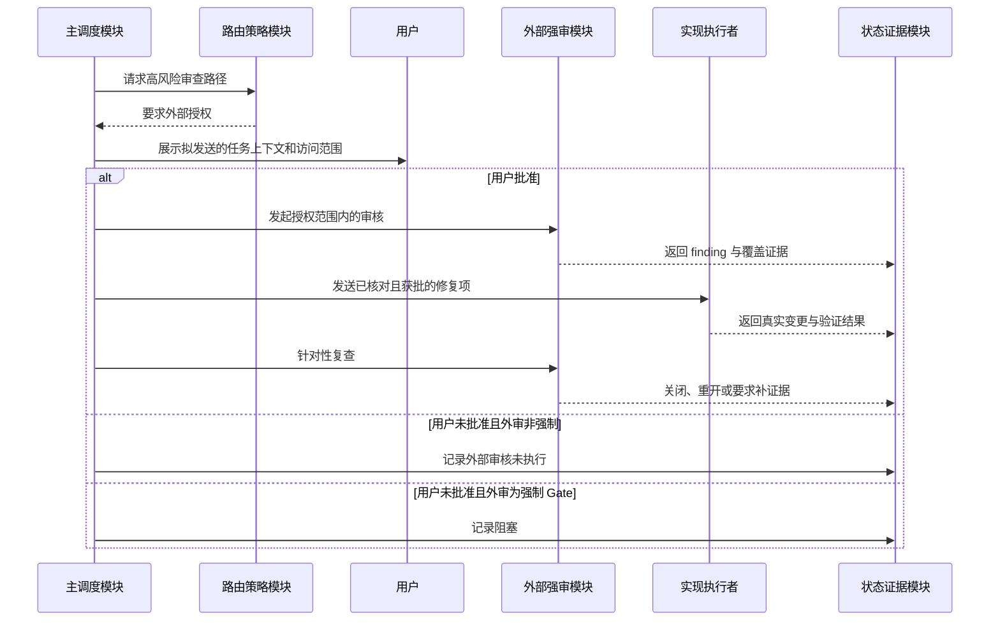
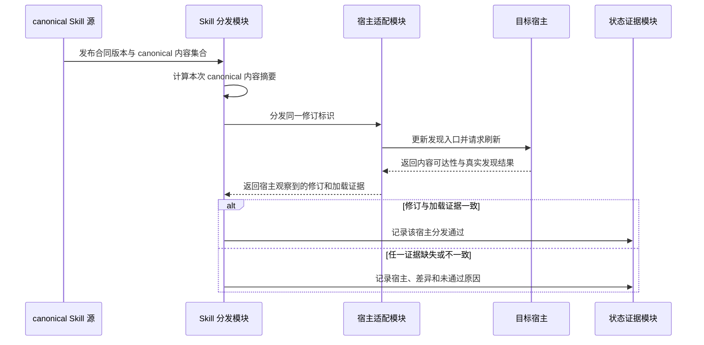
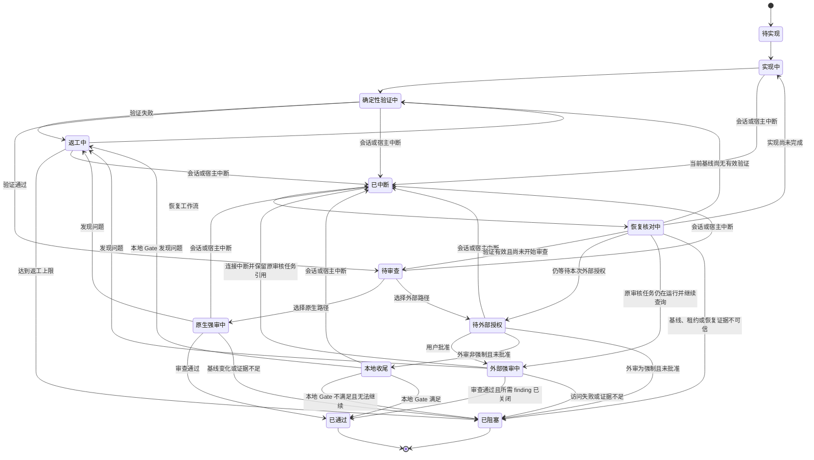

# 跨 App 强弱模型协作与路由设计

> 最后更新：2026-08-23 | 版本：v1.2（基于 Requirements v1.1） | 状态：已确认设计基线

## 1. 文档定位

本文定义 Codex、ZCode、Qoder、Trae、WorkBuddy 与 OpenCode 共用 Skills 时的强弱模型协作架构，回答各模块由谁负责、如何协作、状态如何流转，以及为什么采用组合方案。

本文以[跨 App 强弱模型协作与路由需求 v1.1](2026-08-23-strong-weak-model-routing-requirements.md)为唯一需求来源，只引用 FR/NFR/Constraints 编号说明架构责任，不复制需求正文。

本文不负责：

- 具体模型名称、模型参数和套餐选择；
- 各宿主配置文件格式与安装位置；
- 安装脚本、命令和迁移步骤；
- MCP 或中立调度服务的接口实现；
- 测试用例、验收标准与实施阶段划分。

### 1.1 Requirements 覆盖范围

| Requirements | Design 关注点 |
|---|---|
| FR-001～FR-002、FR-016 | 公共 Skill 语义、模型绑定边界和跨宿主分发责任。 |
| FR-003、FR-007～FR-012 | 强弱角色、验证、审查、返工、冻结基线和停止条件。 |
| FR-004～FR-006、FR-015 | 宿主独立绑定、审查路径、风险路由和能力降级。 |
| FR-013～FR-014 | 外部审核授权与未执行状态。 |
| FR-017 | 可替换编排入口。 |
| NFR-001～NFR-010、CON-001～CON-006 | 质量、成本、可移植性、证据、安全、恢复和产品边界。 |

### 1.2 权威依据

- 公共 A/B/C 审查语义：[共享审查规则](../../dd-workflow-runtime/references/review-gate.md)
- 外部 ChatGPT finding 生命周期与关闭权：[ChatGPT 文件 Grilling 审核](../../gpt-grilling-review/SKILL.md)
- 外部审核传输合同：[ChatGPT 审核闭环](../../gpt-grilling-review/references/transport.md)
- Skill 收敛与事实属主原则：[Skill 目录收敛迁移映射](../migrations/2026-08-23-skill-consolidation.md)

## 2. 架构总览

系统采用八模块组合架构：公共 Skill 语义、路由策略、宿主适配、工作流调度、原生执行与审查、外部强审、状态与证据、Skill 分发。OpenCode、独立 CLI/SDK 或 CI 是可选入口，不计入核心模块，也不拥有公共工作流的事实。

架构核心是“角色引用与模型绑定分离”：公共 Skill 只引用实现执行者、原生强审者和外部强审者等逻辑角色；宿主适配层负责把角色映射到当前 App 可用的模型与执行能力。

## 3. 模块划分

### 3.1 公共 Skill 语义模块

负责：

- 定义实现、确定性验证、审查、返工和完成 Gate 的共同语义；
- 定义实现执行者、强审者和主调度者的职责边界；
- 保留 A/B/C 审查视角以及风险升级条件；
- 在宿主能力缺失时声明需要回退，但不选择具体供应商或模型。

不负责：

- 选择具体模型、套餐或 reasoning effort；
- 保存各宿主的原生 Agent 配置；
- 直接实现跨进程调度或外部服务调用。

### 3.2 路由策略模块

负责：

- 根据风险、宿主能力和用户要求决定内联自检、原生强审或外部强审；
- 定义返工次数上限、失败升级和回退规则；
- 规定外部审核是否必需，以及缺少授权时的处置；
- 保持角色语义稳定，同时允许各宿主独立更换模型映射。

不负责：

- 执行代码修改；
- 复制外部审核的 finding 生命周期；
- 把“模型更强”作为跳过测试或证据的理由。

### 3.3 宿主适配模块

负责：

- 把逻辑角色映射到各 App 的原生 Agent、模型、权限和隔离能力；
- 把公共策略转换为宿主能够理解的配置；
- 检测宿主是否支持独立模型、只读审查、MCP、CLI/SDK 或工作区隔离；
- 对不支持的能力返回明确的降级结果。

不负责：

- 改写公共 Skill 语义；
- 让某个 App 的私有配置字段进入公共 Skill；
- 假定产品官方能力已经在当前机器完成配置和验证。

### 3.4 工作流调度模块

负责：

- 按“实现 → 验证 → 审查 → 返工或通过”的顺序推进；
- 在授予写入权前，通过所有宿主共享的写入租约完成不可分割的占有判定；租约作用域由任务标识和工作环境标识共同确定；
- 记录租约的当前持有者、宿主、获得时间和最近有效性证据，并保证任何时刻只有一个实现执行者拥有写入权；
- 当租约已被占用时，使后续入口保持只读、转入隔离环境或明确停止；恢复陈旧租约前必须重新核对当前工作环境和持有者事实；
- 在审查期间为当前任务保留租约但暂停所有实现写入，只在返工时重新授予原实现执行者；任务完成、阻塞或显式移交后才释放或转移租约；
- 在审查前冻结基线和变更证据；
- 根据审查结果决定返工、等待授权、阻塞或完成；
- 防止无限返工、重复提交和嵌套调度循环。

不负责：

- 自行替代 Reviewer 宣告 finding 已关闭；
- 在外部审核需要授权时静默发送上下文；
- 把 OpenCode 或 MCP 固化为唯一调度入口；
- 仅依赖单个宿主的进程内状态或普通状态标记来推导跨 App 写入排他性。

### 3.5 原生执行与审查模块

负责：

- 在支持独立 Agent 模型的宿主内完成低延迟协作；
- 让实现执行者拥有必要写入和测试能力；
- 让原生强审者保持只读，并基于冻结证据给出结构化结论；
- 在普通和中等风险任务中优先减少跨进程上下文传输。

不负责：

- 代替外部独立审查处理明确要求的高风险 Gate；
- 在多个 Agent 间共享并发写入权；
- 把当前宿主模型设置传播到其他 App。

### 3.6 外部强审模块

负责：

- 在获得明确授权后调用已配置的外部强审后端；当前后端实例为 ChatGPT 审核能力；
- 按对应后端合同处理 finding 分类、反证、复审和关闭权；当前 ChatGPT 后端沿用现有合同；
- 由提出涉及生产代码或测试语义 finding 的后端执行针对性复查；
- 返回可由工作流调度模块消费的结构化状态。

不负责：

- 在未授权时读取或发送仓库上下文；
- 直接修改本地文件；
- 代替本地主调度者完成整体任务验收；
- 成为低风险任务的无条件默认路径。

### 3.7 状态与证据模块

负责：

- 记录任务基线、变更标识、确定性验证结果、审查范围和 finding 状态；
- 记录写入租约引用、持有者和有效性证据，但不替代工作流调度模块作出占有判定；
- 区分“配置存在”“连接可用”“审核已执行”和“finding 已关闭”；
- 支持中断恢复，并检测审查期间基线变化；
- 为最终 Gate 提供可追溯证据。

不负责：

- 把历史状态当作当前仓库事实；
- 用旧的 PASS 覆盖新的变更；
- 保存供应商凭据或共享 OAuth token。

### 3.8 Skill 分发模块

负责：

- 维护一份 canonical Skill 源；
- 维护公共 Skill 修订标识：合同版本表达语义兼容关系，canonical 内容摘要机械标识本次发布内容；
- 通过宿主支持的发现目录、导入或符号链接进行分发；
- 检测失效链接、遗漏 Skill 和宿主缓存漂移；
- 为每个宿主分别报告观察到的合同版本、canonical 内容摘要和真实发现证据；
- 在 Skill 收敛或改名后同步更新发现入口。

不负责：

- 维护多份可独立编辑的 Skill 副本；
- 把模型路由配置混入 Skill 分发；
- 以“链接存在”或单一版本字段代替目标内容摘要和宿主发现验证。

## 4. 职责边界与事实属主

| 事实 | 唯一属主 | 其他模块如何使用 |
|---|---|---|
| A/B/C 审查语义 | 公共 Skill 语义模块 | 引用，不复制 |
| 风险等级与路由规则 | 路由策略模块 | 宿主适配和调度模块读取 |
| 具体模型与宿主权限 | 对应宿主适配配置 | 公共 Skill 只引用角色 |
| 外部 finding 生命周期 | 对应外部强审后端合同；当前为 ChatGPT 审核合同 | 调度模块保存引用与状态 |
| 当前任务状态与证据 | 状态与证据模块 | Reviewer 和最终 Gate 消费 |
| Skill 正文 | canonical Skill 源 | 各宿主只发现或链接 |
| 公共 Skill 修订标识 | Skill 分发模块维护的 canonical 发布记录 | 公共语义提供合同版本，分发模块计算内容摘要，宿主只报告观察结果 |
| 批处理入口 | 对应可选入口 | 只调用工作流调度模块，不拥有公共策略 |

Skill 包内的 Agent 元数据只负责该 Skill 在对应宿主中的展示和调用策略，不承担六家 App 的模型绑定单一事实源。跨宿主绑定配置应由独立的路由配置域拥有，再由适配机制生成或校验宿主原生配置。

## 5. 数据流

### 5.1 原生强弱协作

### 5.2 外部强审升级

### 5.3 跨 App 批处理

OpenCode、独立 CLI/SDK 调度器或 CI 可以作为批处理入口，但它们只发起同一个公共工作流，不重新定义路由和审核语义。批处理入口必须复用相同的状态、共享写入租约和冻结基线约束；未取得租约的入口只能保持只读、转入隔离环境或停止。

### 5.4 公共 Skill 分发验证

## 6. 状态变化

状态约束：

- 审查开始后若基线变化，本轮审查结果失效，必须重新冻结证据；
- 返工上限由路由策略拥有，所有宿主必须遵守有限停止条件；
- 外部审核未执行与外部审核通过是不同状态；
- finding 已处置与 finding 已关闭是不同状态；
- 中断恢复必须先核对当前基线、写入租约和已有审核任务，再进入第一个未满足 Gate；
- 已存在且仍有效的外部审核任务只能继续查询，不得因连接中断重复提交；
- 审查期间写入租约仍为当前任务保留，但所有实现写入暂停；任务完成、阻塞或显式移交后才释放或转移；
- 本地收尾可以进入通过、返工或阻塞，不得在本地 Gate 不满足时只有“已通过”出口；
- 只有整体 Workflow Gate 满足后，主调度模块才能宣告任务完成。

## 7. 宿主协作矩阵

下表是 2026-08-23 的能力基线，用于说明适配方向，不是永久产品事实；实施前必须重新核对官方文档和本机配置。

| 宿主 | 原生角色绑定 | 推荐日常路径 | 外部强审路径 |
|---|---|---|---|
| Codex | 支持独立模型、推理强度与只读 Agent | 主调度者协调弱 Worker 与原生强 Reviewer | 高风险或明确要求时调用现有 ChatGPT 审核 |
| OpenCode | 支持主 Agent、子 Agent、独立模型和任务权限 | 原生协作；也可作为批处理入口 | 调用现有 ChatGPT 审核 |
| Qoder | 支持独立模型、推理强度、Skills、MCP 与工作区隔离 | 原生协作 | 调用现有 ChatGPT 审核 |
| ZCode | 支持独立模型与思考强度，但子 Agent 不继续派生 | 主 Agent 负责全部编排 | 调用现有 ChatGPT 审核 |
| CodeBuddy 能力域 | 官方 IDE/CLI 文档提供独立 Agent 配置 | 实际使用该能力域时走原生协作 | 调用现有 ChatGPT 审核 |
| WorkBuddy App | 不直接继承 CodeBuddy CLI 的全部结论 | 按当前 App 实际暴露能力选择原生或降级 | 调用现有 ChatGPT 审核 |
| Trae | 当前不能可靠固定不同子 Agent 模型 | 主会话实现，或交给中立调度能力 | 调用现有 ChatGPT 审核 |

## 8. 关键设计决策

### DD-001：三个方案采用分层组合，而非三选一

- 决策：各 App 原生协作是日常执行路径，MCP 是公共外部审核入口，OpenCode 或中立调度能力是可选入口。
- 原因：三者解决的问题分别是本地低延迟、跨宿主能力复用和批处理调度。
- 替代方案：固定选择单一 App 或单一协议承担全部职责；这会放大宿主锁定和能力缺口。
- 代价：需要维护清晰的层级与状态合同。
- 为何可接受：职责拆分能够避免任何单一 App 成为不可替换的流程真源。
- 依据：FR-005、FR-017、NFR-003。

### DD-002：公共 Skill 不绑定具体模型

- 决策：公共 Skill 只引用逻辑角色，具体模型由宿主适配配置拥有。
- 原因：六家 App 没有统一的 Skill 模型路由字段；宿主私有字段会破坏可移植性。
- 替代方案：在每份 Skill 中写入各宿主模型字段；这会制造多份配置事实并增加迁移成本。
- 代价：需要宿主适配配置和漂移校验。
- 为何可接受：更换模型或套餐时不需要修改业务工作流。
- 依据：FR-001、FR-002、FR-004、NFR-009。

### DD-003：原生优先，外部强审按风险升级

- 决策：需要独立强审的 standard 任务优先使用宿主原生 Reviewer；low 默认 inline 自检、零强审消耗；high 按风险和宿主能力选择 native 专项审或 external；宿主能力不足或用户明确要求时升级到外部强审。
- 原因：原生路径上下文损耗和延迟较低，外部审核提供更强独立性但成本和授权要求更高。
- 替代方案：所有任务都外部强审，或所有任务只做本地自检；前者成本过高，后者无法满足独立审核需求。
- 代价：相同风险在不同宿主可能走不同执行路径。
- 为何可接受：公共审查语义和完成 Gate 不变，变化只限执行者。
- 依据：FR-005、FR-006、FR-013、NFR-002。

### DD-004：MCP 是访问接口，不是工作流调度器

- 决策：MCP 只暴露外部审核能力；循环、状态、授权和停止条件由工作流调度模块负责。
- 原因：工具协议本身不拥有业务状态机，也不负责 Skill 分发。
- 替代方案：让 MCP 工具内部隐式推进完整工作流；这会隐藏授权、状态和失败边界。
- 代价：调用方必须实现或复用统一调度合同。
- 为何可接受：避免把协议连接成功误判为审核闭环完成。
- 依据：FR-005、FR-010、FR-011、CON-004。

### DD-005：OpenCode 不拥有核心策略

- 决策：OpenCode 可以承担批处理或交互入口，但路由策略和状态合同保持宿主中立。
- 原因：避免日常工作流被某一 App 锁定，并允许 Codex、Qoder 等原生入口直接工作。
- 替代方案：把 OpenCode 定义为唯一总调度器；这会让其他原生入口依赖额外进程和配置。
- 代价：OpenCode 配置不能单独表达全部流程事实。
- 为何可接受：OpenCode 仍能通过相同适配和调度合同获得完整能力。
- 依据：FR-017、NFR-003。

### DD-006：单写者与冻结证据是硬边界

- 决策：工作流调度模块通过跨宿主共享的写入租约授予唯一写入权；Reviewer 只读；审查必须绑定冻结基线和真实验证证据。
- 原因：跨 Agent 或跨 App 并发写入会造成竞态、审查失效和责任不清。
- 替代方案：允许 Worker 与 Reviewer 同时修复，或由每个宿主各自维护普通进行中标记；前者会使审查对象持续变化，后者无法排除同时检查后并发写入。
- 代价：写入前需要取得租约；中断恢复时需要核对持有者、工作环境和租约有效性；审查期间的新修改需要重新进入验证与审查。
- 为何可接受：可追溯性和结论可信度高于并发写入带来的速度收益。
- 依据：FR-007、FR-008、FR-009、NFR-007。

### DD-007：外部上下文必须显式授权

- 决策：调用任何外部强审后端前，主调度模块展示具体任务上下文和访问范围并取得批准；当前 ChatGPT 后端也遵循相同授权边界。
- 原因：外部审核涉及出站任务上下文和代码访问边界。
- 替代方案：把外部审核设为后台默认动作；这会绕过用户对出站上下文的控制。
- 代价：外部强审不能完全静默自动化。
- 为何可接受：普通任务仍可走原生路径；授权 Gate 只出现在真正的外部调用边界。
- 依据：FR-013、FR-014、NFR-006。

### DD-008：适配配置生成或校验，不维护独立副本

- 决策：模型绑定策略集中维护，各宿主原生配置通过生成、安装或一致性检查保持同步。
- 原因：六套手工配置会随着模型名称、配置格式和 Skill 收敛而漂移。
- 替代方案：分别手工维护六套配置；这会使差异无法区分为有意覆盖或意外漂移。
- 代价：需要维护轻量适配工具和宿主兼容性检查。
- 为何可接受：它把重复劳动转化为可验证的机械过程，并保护 canonical Skill。
- 依据：FR-001、FR-004、FR-016、NFR-009、NFR-010。

### DD-009：公共 Skill 发布使用双重修订标识

- 决策：Skill 分发模块以合同版本表达语义兼容关系，并以 canonical 内容摘要标识实际发布内容；宿主分发报告必须同时携带两者和真实发现证据。
- 原因：仅有人工版本无法发现漏文件或缓存漂移，仅有内容摘要又无法表达语义兼容关系；多数宿主也不会从公共 Skill 元数据中统一报告版本。
- 替代方案：给每个 Skill 单独维护版本，或只比较链接数量；前者增加多点维护，后者不能证明目标内容和宿主加载结果一致。
- 代价：每次公共 Skill 发布都需要刷新修订标识，并为每个宿主生成分发报告。
- 为何可接受：修订标识由 canonical 发布记录统一拥有，不要求六家 App 支持相同的原生版本字段。
- 依据：FR-001、FR-016、NFR-003、NFR-010。

## 9. 非功能约束落地

| 约束 | 负责模块 | 设计落实 |
|---|---|---|
| 可移植性 | 公共 Skill 语义模块、宿主适配模块、Skill 分发模块 | 公共语义不包含供应商模型绑定，差异下沉到适配层；分发报告统一使用合同版本和 canonical 内容摘要。 |
| Token 成本 | 路由策略模块 | 低风险内联、中风险原生强审、高风险按需升级，不删除确定性验证。 |
| 正确性 | 原生执行与审查模块、外部强审模块 | Worker 与 Reviewer 分权，finding 必须返工和复验。 |
| 安全与隐私 | 外部强审模块、状态与证据模块 | 最小上下文、明确授权、不共享供应商凭据。 |
| 可追溯性 | 状态与证据模块、Skill 分发模块 | 基线、验证、审查覆盖、finding 生命周期和公共 Skill 修订标识分开记录。 |
| 并发安全 | 工作流调度模块、状态与证据模块 | 共享写入租约限制唯一写入者；审查绑定冻结证据，基线变化即失效。 |
| 可恢复性 | 工作流调度模块、状态与证据模块 | 持久化当前状态、失败原因、租约和外部任务引用，恢复时从首个未满足 Gate 继续。 |
| 可替换性 | 路由策略模块、工作流调度模块 | OpenCode、MCP 和任一宿主都不是唯一策略属主。 |

## 10. 与 Requirements 的映射

| Requirements | 负责模块 | 主要决策 |
|---|---|---|
| FR-001、FR-002、FR-016 | 公共 Skill 语义模块、Skill 分发模块 | DD-002、DD-008、DD-009 |
| FR-003、FR-007、FR-008 | 工作流调度模块、原生执行与审查模块 | DD-003、DD-006 |
| FR-009、FR-010、FR-011、FR-012 | 工作流调度模块、状态与证据模块、外部强审模块 | DD-004、DD-006 |
| FR-004、FR-015 | 宿主适配模块 | DD-002、DD-008 |
| FR-005、FR-006 | 路由策略模块、原生执行与审查模块、外部强审模块 | DD-001、DD-003、DD-004 |
| FR-013、FR-014 | 外部强审模块、状态与证据模块 | DD-007 |
| FR-017 | 工作流调度模块、公共 Skill 语义模块 | DD-001、DD-005 |
| NFR-001、NFR-002 | 路由策略模块、工作流调度模块 | DD-003、DD-006 |
| NFR-003、NFR-009、NFR-010 | 公共 Skill 语义模块、宿主适配模块、Skill 分发模块 | DD-002、DD-005、DD-008、DD-009 |
| NFR-004、NFR-005、NFR-008 | 状态与证据模块 | DD-004、DD-006 |
| NFR-006、NFR-007 | 外部强审模块、工作流调度模块 | DD-006、DD-007 |

## 11. 当前环境基线快照

本节仅记录 2026-08-23 的只读核对结果，不构成永久设计事实；实施前必须重新验证。

- Codex 已采用 Sol 主模型和 Luna Worker，但当前没有独立只读强 Reviewer；主模型推理强度为中等，Luna Worker 推理强度为最高档。
- `chatgpt-review` 已出现在六类 App 的本地配置中；Trae CN 与 TRAE SOLO CN 均有配置。
- 当前 `chatgpt-review` 服务可响应 MCP 初始化请求；本轮只验证了 Codex 到服务端的实时握手，其他宿主仅确认配置存在。
- 通用发现目录、Codex 和 WorkBuddy 的 16 个 canonical Skill 链接有效；通用发现目录同时属于 ZCode 的用户级发现入口。
- OpenCode 仍保留 59 个指向旧 Skill 源的失效链接，当前自定义 Skill 分发不可依赖。
- ZCode 已配置上述 16 个 canonical Skill 的用户级发现入口；真实加载仍需 Settings → Skills 或显式调用证据。ZCode 原生自定义 Agent 角色绑定尚未落地。
- Qoder/Qoder CN 尚未看到已落地的原生 Skill 和 Agent 配置。
- 当前仅 Codex 已存在自定义 Worker 配置；其他宿主的原生角色绑定仍待实施。

## 12. 风险与待确认问题

| ID | 风险或问题 | 影响 | 缓解或待确认事项 |
|---|---|---|---|
| R-001 | 各厂商配置格式和能力持续变化 | 适配配置可能失效 | 实施前读取当前官方文档，并对生成结果做宿主级发现验证。 |
| R-002 | WorkBuddy App 与 CodeBuddy IDE/CLI 能力边界混淆 | 可能设计出 App 实际不支持的原生路径 | 分别建立能力档案，不用一个产品的文档替另一个产品背书。 |
| R-003 | Qoder CN 的实际配置根与国际版文档不同 | 原生 Agent 或 Skill 可能写入错误位置 | 实施前通过当前客户端产生一份最小配置，确认权威目录。 |
| R-004 | 跨进程传输丢失上下文 | Reviewer 可能漏读关键依赖 | 使用冻结基线、范围清单和 reviewed/unreadable 证据；不能只传摘要。 |
| R-005 | 外部审核被误设为静默自动步骤 | 违反授权边界 | 把等待外部授权建模为显式状态。 |
| R-006 | 多个 App 同时修改同一工作区 | 产生竞态和不可审查变更 | 写入前取得跨宿主共享租约；冲突入口保持只读、转隔离环境或停止；恢复陈旧租约前重新核对持有者和工作环境。 |
| R-007 | “强/弱”仅按模型名称静态判断 | 成本和质量可能不符合预期 | 路由策略同时考虑任务风险、推理强度、实际证据和失败历史。 |
| R-008 | 配置存在被误报为集成可用 | Gate 可能调用失败 | 分开记录配置、连接、工具发现、真实调用和结果验证。 |
| R-009 | 外部 finding 状态与公共审查状态重复维护 | 产生关闭权冲突 | 每个外部后端继续拥有自身 finding 生命周期；当前 ChatGPT finding 由 `gpt-grilling-review` 拥有，运行时只保存引用。 |
| R-010 | 中立 Router 过早建设 | 在合同未稳定前增加维护成本 | 先验证公共语义和原生适配；Router 是否实现留给后续 Implementation Plan。 |
| R-011 | 宿主不提供统一的 Skill 版本字段或缓存状态 | 可能把同版本号、旧缓存或漏文件误报为一致 | 以合同版本、canonical 内容摘要和宿主真实发现证据组成分发报告，不依赖宿主原生版本字段。 |

当前没有阻塞本设计成立的未决问题。具体模型组合、宿主配置位置、默认返工上限和是否建设中立 Router，属于后续配置或 Implementation Plan 决策。

## 13. 官方能力参考

- [Codex Subagents](https://developers.openai.com/codex/subagents)
- [Codex Config Reference](https://developers.openai.com/codex/config-reference/)
- [OpenCode Agents](https://opencode.ai/docs/agents/)
- [OpenCode Skills](https://opencode.ai/docs/skills/)
- [OpenCode Server](https://opencode.ai/docs/server/)
- [Qoder Subagents](https://docs.qoder.com/cli/subagent)
- [Qoder Skills](https://docs.qoder.com/cli/Skills)
- [ZCode Subagents](https://zcode.z.ai/en/docs/subagents)
- [ZCode Skills](https://zcode.z.ai/en/docs/skill)
- [WorkBuddy MCP](https://www.workbuddy.ai/docs/zh/workbuddy/From-Beginner-to-Expert-Guide/Function-Description/MCP-Guide)
- [CodeBuddy CLI](https://www.workbuddy.ai/docs/zh/cli/cli-reference)
- [TRAE 官方技术支持答复](https://forum.trae.cn/t/topic/173144)

## 14. 版本记录

- v1.2（2026-08-23）：基于 Requirements v1.1 增加共享写入租约、公共 Skill 双重修订标识与中断恢复路径；统一八模块架构；修正 ZCode 分发基线并将外部强审合同改为供应商中立。
- v1.1（2026-08-23）：建立 Requirements v1.0 上游引用，以正式 FR/NFR/Constraints 替换临时设计输入编号；架构决策不变。
- v1.0（2026-08-23）：保存经本机配置核对后确认的分层组合架构；修正 Qoder、TRAE、MCP 覆盖、Codex Reviewer 与 Skill 元数据边界。
