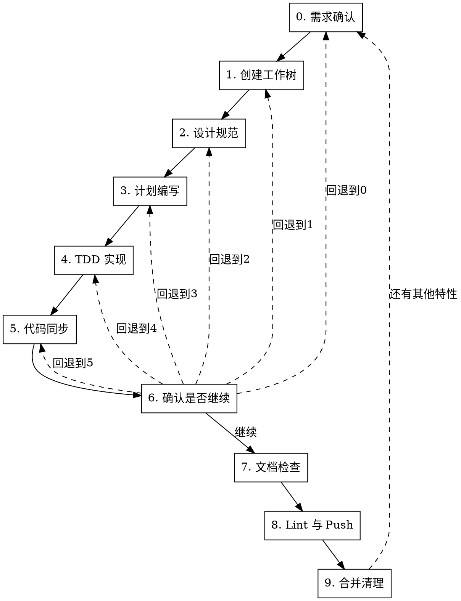

# 新特性实现工作流

## 概述

10 步严格顺序工作流：需求确认 → 创建工作树 → 设计规范 → 计划编写 → TDD 实现 → 代码同步(含提交) → 确认是否继续 → 文档检查 → Lint与Push → 合并清理。每步必须在前一步成功后才能继续。

## 何时使用

- 所有设计驱动变更：新功能、大规模重构、API 迁移
- 用户提到"新特性流程"、"feature development workflow"、"设计规范先行"、"分阶段计划"
- 需要先写设计规范，再拆计划、审查计划、按子计划执行

**不适用：** bug 修复、简单文本修改、纯文档修改、一次性小改动

## 流程



<HARD-GATE>
严格按 0→1→2→3→4→5→6→7→8→9 顺序执行。禁止跳步、禁止先写代码、禁止未确认就提交、禁止未通过检查就开始下一步。步骤 6 可回退到任意步骤(0-5)。任一步骤失败自动回退到上一步骤重新执行。
</HARD-GATE>

## 上下文恢复机制

会话上下文压缩后可能遗忘当前 worktree 路径、`BASE_BRANCH`、`FEATURE_BRANCH`、设计规范路径、计划目录、已完成阶段等关键状态。通过**状态文件持久化**解决。

### 状态文件位置

`$(git rev-parse --git-common-dir)/feature-development-state.json`

存放在 git common dir 下，不被 `git status` 检测，任何工作树均可通过该命令定位。

### 状态文件内容

```json
{
  "feature_name": "short feature name",
  "worktree_path": "/absolute/path/to/worktree",
  "base_branch": "main",
  "feature_branch": "feature/xxx",
  "main_root": "/absolute/path/to/main/repo",
  "worktree_dir": "/absolute/path/to/project-worktrees",
  "spec_path": "docs/.../feature-design-spec.md",
  "review_path": "docs/.../feature-design-review.md",
  "test_case_path": "docs/.../feature-test-cases.md",
  "plan_dir": "docs/.../plans/feature-name",
  "current_step": "4",
  "current_phase": "phase-1",
  "total_phases": "3",
  "commits": {
    "design_spec": "abc1234",
    "design_review": "def5678",
    "plans": "987abcd"
  },
  "created_at": "2026-06-30T10:00:00Z"
}
```

### 恢复流程

每个步骤开始前，若不确定当前工作上下文，执行以下恢复：

```bash
common_dir=$(git rev-parse --git-common-dir)
state_file="$common_dir/feature-development-state.json"

if [ -f "$state_file" ]; then
    # 一次读取所有关键变量
    eval $(python3 -c "
import json
d = json.load(open('$state_file'))
for k in ['worktree_path','base_branch','feature_branch','main_root','worktree_dir','spec_path','plan_dir','current_phase']:
    print(f'{k.upper()}=\"{d.get(k,\"\")}\"')
")
    cd "$WORKTREE_PATH"
else
    echo "未找到状态文件，可能尚未创建工作树或已清理"
fi
```

### 写入时机

- **写入**：步骤 1（工作树创建/验证成功后）
- **更新 `current_step`**：每完成一个步骤，更新此字段
- **更新 `current_phase`**：每完成一个子计划，更新此字段
- **删除**：步骤 9 清理工作树时一并删除

## 全局规则

- **结构化询问**：需要用户决策时，在 Trae 中使用 `AskUserQuestion`；在 Codex 中使用 `request_user_input`（如可用）或带清晰选项的简短文本问题。
- **文档规则优先**：项目存在 `.trae/rules/docs.md`、`docs/CODING_STANDARDS.md`、`docs/AI/trae-xctest-rules.md` 时，写设计规范、计划、检查前先阅读并遵守。
- **UI 可观测性优先**：UI 相关功能必须定义用户可见证据。内部状态、ViewModel、reducer、buffer、layer count 或日志只能作为辅助证据，不能单独证明 UI 已完成。
- **提交边界**：每次 commit 只包含当前阶段的相关文件。不得暂存无关脏文件，不得提交秘密文件，不得使用 `--no-verify`，不得 force push。
- **确认后提交**：用户确认该阶段产物后才能提交。提交失败必须修复后重试，不得跳过提交继续下一步。
- **没有设计不写代码**：步骤 4 之前禁止修改生产代码。若为验证设计临时探索，必须丢弃探索改动后回到当前步骤。

## UI 可观测性门禁

任何涉及 UI、桌面 app、Web app、可视化、快捷键交互、窗口/浮层/菜单/表单/画布的特性，都必须通过此门禁。

### 证据分层

优先级从高到低：

1. **真实路径自动化证据**：E2E、XCUITest、Playwright、Appium、真实浏览器或真实 app 流程，断言用户可见结果。
2. **稳定可观测标记**：可访问性树、DOM、窗口层级、截图像素、canvas pixel、状态日志、activation marker、ready hook；必须能证明用户可见行为。
3. **组件级 UI 证据**：渲染测试、快照、视觉回归、故事书截图；只能覆盖组件边界。
4. **手动验收证据**：明确步骤、预期画面、截图/录屏/日志路径、执行时间和执行人；只能用于自动化不可行的部分。
5. **内部状态证据**：单元测试、ViewModel 状态、Core 状态机、日志；只能证明支撑逻辑，不能单独关闭 UI AC。

### 关闭规则

- 每个 UI AC 至少需要一种 1-4 层证据；只有第 5 层证据时，状态必须标为"未完成 UI 验证"或"存在 UI 风险"。
- 自动化不可行时，必须在设计规范和子计划中写明原因、手动验收步骤、证据保存位置和剩余风险。
- 任何"测试不到但应该没问题"的结论都必须升级为风险项，不能作为完成依据。

---

## 步骤 0：需求确认

### 0.1 调用 grill-me

开始时宣布：

```
我正在使用 feature-development-workflow，并先进行需求拷问确定新特性需求。
```

进行需求质询，仅聚焦于**需求本身**，不做技术方案设计。

### 0.2 至少确认的问题

一次性收敛以下信息，避免后续设计返工：

1. **用户问题和业务目标**：这个特性解决什么问题？
2. **成功标准**：用户如何判断它完成？
3. **范围边界**：必须做什么？明确不做什么？
4. **用户流程**：入口、主要路径、失败路径、退出条件是什么？
5. **数据和接口**：新增或修改哪些模型、配置、协议、API、持久化格式？
6. **兼容和迁移**：是否影响旧行为、旧数据、旧快捷键、旧配置？
7. **验收标准**：可测试的 AC 列表。
8. **阶段拆分**：按功能需求分成哪些 Phase，每个 Phase 的可交付结果是什么？
9. **UI 证据**（涉及 UI 时）：哪些 AC 需要真实 UI 交互验证？用 E2E/XCUITest/Playwright、截图、日志 marker、手动录屏还是组合证据？
10. **文档位置**：按项目规则写在哪里；若无规则，使用 `docs/superpowers/specs/` 和 `docs/superpowers/plans/`。

### 0.3 出口判定

输出需求摘要并要求用户确认。

- 选项 1（推荐）：确认理解正确
- 选项 2：需要补充细节
- 选项 3：理解有误，重新描述

确认正确 → 进入步骤 1。需要补充 → 继续质询。理解有误 → 重述需求，重新执行 0.2。

---

## 步骤 1：创建工作树

### 1.1 询问工作环境

**AskUserQuestion**：

- 选项 1（推荐）：新建隔离工作树
- 选项 2：在当前 worktree 工作

- 用户选"新建" → 走 1.2 完整创建流程
- 用户选"当前 worktree" → 走 1.3 仅验证

### 1.2 新建工作树

#### 1.2.1 记录基线分支

```bash
BASE_BRANCH=$(git rev-parse --abbrev-ref HEAD)
```

#### 1.2.2 计算工作树路径

基于主仓库位置计算（避免在 worktree 内调用时项目名识别错误）：

```bash
common_dir=$(git rev-parse --git-common-dir)
main_root=$(cd "$(dirname "$common_dir")" && pwd)
project=$(basename "$main_root")
worktree_dir=$(dirname "$main_root")/${project}-worktrees
```

**关键**：必须基于主仓库，而非当前工作树——否则项目名会被误识别为分支名，导致工作树目录嵌套。

#### 1.2.3 创建工作树

```bash
BRANCH="feature/<简短描述>"
path="$worktree_dir/$BRANCH"
git worktree add "$path" -b "$BRANCH"
cd "$path"
```

#### 1.2.4 运行项目设置

自动检测并运行相应设置命令：

```bash
# Node.js
[ -f package.json ] && npm install

# Rust
[ -f Cargo.toml ] && cargo build

# Python
[ -f requirements.txt ] && pip install -r requirements.txt
[ -f pyproject.toml ] && poetry install

# Go
[ -f go.mod ] && go mod download

# Swift (Xcode 项目)
[ -f Package.swift ] && swift build
```

#### 1.2.5 验证基线测试干净

运行项目对应的测试命令，确保工作树初始状态干净。

- 测试失败：报告失败情况，询问是否继续或排查
- 测试通过：报告就绪

#### 1.2.6 报告位置

```
工作树已就绪：<full-path>
测试通过（<N> 个测试，0 个失败）
准备实现 <feature-name>
```

**重要**：调用后会话工作目录必须始终位于该工作树路径下，不得切换回主仓库目录。

#### 1.2.7 红线

**绝不：**
- 跳过基线测试验证
- 不询问就带着失败的测试继续
- 在项目内部创建工作树目录（污染 git status）

### 1.3 当前 worktree 验证

跳过创建，仅做验证：

```bash
# 记录基线分支
BASE_BRANCH=$(git rev-parse --abbrev-ref HEAD)

# 验证工作区状态
git status  # 必须干净，有未提交变更需先处理

# 验证基线测试干净
# 运行项目对应的测试命令
```

- 成功标准：工作区干净 + 基线测试通过
- 失败：报错并停止

### 1.4 写入状态文件

工作树创建/验证成功后，持久化关键状态供上下文恢复：

```bash
common_dir=$(git rev-parse --git-common-dir)
main_root=$(cd "$(dirname "$common_dir")" && pwd)
project=$(basename "$main_root")
worktree_dir=$(dirname "$main_root")/${project}-worktrees

cat > "$common_dir/feature-development-state.json" <<EOF
{
  "feature_name": "<简短特性名>",
  "worktree_path": "$(pwd)",
  "base_branch": "$BASE_BRANCH",
  "feature_branch": "$(git rev-parse --abbrev-ref HEAD)",
  "main_root": "$main_root",
  "worktree_dir": "$worktree_dir",
  "spec_path": "<设计规范路径>",
  "review_path": "<设计评审摘要路径>",
  "test_case_path": "<测试用例表路径>",
  "plan_dir": "<计划目录路径>",
  "current_step": "1",
  "current_phase": "",
  "total_phases": "<Phase总数>",
  "commits": {
    "design_spec": "<commit-sha>",
    "design_review": "<commit-sha>",
    "plans": "<commit-sha>"
  },
  "created_at": "$(date -u +%Y-%m-%dT%H:%M:%SZ)"
}
EOF
```

---

## 步骤 2：设计规范

### 2.1 前置读取

按项目存在情况读取：

```bash
test -f .trae/rules/docs.md && cat .trae/rules/docs.md
test -f docs/CODING_STANDARDS.md && cat docs/CODING_STANDARDS.md
test -f docs/AI/trae-xctest-rules.md && cat docs/AI/trae-xctest-rules.md
test -f docs/ai/trae-xctest-rules.md && cat docs/ai/trae-xctest-rules.md
```

如规则文件很长，必须完整阅读与设计规范、验收标准、测试和回归相关的章节。

### 2.2 设计规范

按项目模板优先；无模板时按 `.trae/rules/docs.md` 规定的格式编写。设计规范文件命名：`F{N}_{功能名}_设计规范.md`。

必须包含以下章节：

1. **背景与目标**：做什么
2. **非目标**：明确不做什么
3. **用户流程和交互入口**（mermaid）
4. **行为规则和状态机**
5. **数据模型、接口、配置、持久化影响**
6. **兼容性、迁移和回滚策略**
7. **可观测性**：日志、埋点、调试开关
8. **验收标准 AC**：每条必须可验证（场景+预期+验证方式，必须有 XCTest/XCUITest 或对应测试框架）
9. **测试策略**：单元、集成、UI、回归范围
10. **UI 可观测性矩阵**（涉及 UI 时）：每个 UI AC 对应真实入口、操作路径、可见结果、证据类型、自动化可行性、手动验收步骤和剩余风险
11. **分阶段设计**：Phase 0..N，每个 Phase 有目标、范围、交付物、验证方式
12. **风险和待确认问题**

文档头部必须包含：`> 最后更新：YYYY-MM-DD | 版本：vX.Y`

每次修改同步更新版本号和最后更新日期，最后添加列表格式版本记录。

### 2.3 视觉原型（涉及 UI 时）

**仅当特性涉及 UI 时执行**，不涉及 UI 时跳过本子步。

- 文件命名：`F{N}_{功能名}_视觉原型.html`
- 浏览器直接打开
- 编写时调用 `brainstorming` skill 的视觉原型辅助（如当前环境不可用，使用同等方式生成）
- 页面头部显示最后更新时间与版本信息

涉及 UI 行为变化时，必须同步更新视觉原型。

### 2.4 测试用例表

基于设计规范验收标准按功能分类生成测试用例矩阵。

- 文件命名：`F{N}_{功能名}_测试用例表.md`
- 对照代码中已有测试标注覆盖状态（✅ COVERED / 🟡 PARTIAL / ❌ MISSING / ⏸️ DEFERRED）
- 文档头部版本号须注明对应的设计规范版本：`> 最后更新：YYYY-MM-DD | 版本：vX.Y（基于设计规范 vA.B）`

修改设计规范中的目标、范围、流程、接口、验收标准时，必须同步更新测试用例表。

### 2.5 子代理审核 + 自动修复

调度独立子代理审核设计规范。审核检查项：

| 类别 | 检查要点 |
|------|----------|
| 完整性 | TODO、TBD、占位符、不完整章节 |
| 一致性 | 需求、AC、Phase、测试策略是否互相冲突 |
| 可计划性 | 是否足够具体，能被拆成任务 |
| 范围 | 是否混入多个独立特性，是否需要拆成多个规格 |
| YAGNI | 是否加入未请求功能或过度设计 |
| 可验证性 | 每个 AC 和 Phase 是否有明确验证方式 |
| UI 可观测性 | UI AC 是否有用户可见证据，是否把内部状态误当成 UI 已验证 |

**校准标准**：只标记会在计划编写阶段造成实际问题的事项。缺失的章节、矛盾之处、模糊到可能被两种不同方式理解的需求才是问题。措辞小改进、风格偏好不是。

#### 处理审核结果

- **通过且无建议** → 记录审核通过
- **通过但有建议** → 判断是否影响计划；影响则修改规范，不影响则记录为建议
- **发现问题** → 自动修复设计规范（直接修改文件），重新请子代理审核，直到通过

设计评审摘要保存到设计规范同目录的 `<feature-name>_设计评审摘要.md`。

### 2.6 用户确认

展示设计规范路径、视觉原型路径（如有）、测试用例表路径、审核结论和修改摘要，询问用户确认：

- 选项 1（推荐）：确认设计规范，可以提交
- 选项 2：需要补充或修改
- 选项 3：方向不对，回到步骤 0

### 2.7 提交

确认后只暂存设计规范相关文件：

```bash
git status --short
git diff -- <spec-path> <visual-path> <test-case-path> <review-path>
git add <spec-path> <visual-path> <test-case-path> <review-path>
git commit -m "$(cat <<'EOF'
docs: add <feature-name> design spec

- 设计规范: F{N}_{功能名}_设计规范.md
- 视觉原型: F{N}_{功能名}_视觉原型.html (如有)
- 测试用例表: F{N}_{功能名}_测试用例表.md
- 设计评审摘要: <feature-name>_设计评审摘要.md
EOF
)"
```

提交信息格式遵循 Conventional Commits：

- `<type>[scope]: <description>`，描述用现在时+命令式，<72 字符
- 类型表：`feat` 新功能 | `fix` 修复 | `docs` 文档 | `style` 格式 | `refactor` 重构 | `perf` 性能 | `test` 测试 | `build` 构建 | `ci` CI | `chore` 维护 | `revert` 回退

**Git 安全协议**：
- 禁止更新 git config
- 禁止 `--force`、hard reset（除非用户明确要求）
- 禁止 `--no-verify` 跳过 hooks
- 禁止 force push 到 main/master
- hooks 失败 → 修复后新建 commit，不 amend

提交成功后进入步骤 3。

---

## 步骤 3：计划编写

### 3.1 读取设计规范和评审摘要

必须读取已提交的设计规范、设计评审摘要和测试用例表，再编写实现计划。

### 3.2 按功能需求划分阶段

设计规范中已按功能需求划分 Phase。计划按 Phase 拆分为子计划。

### 3.3 先写总计划，动态拆子计划

**先写一个总实现计划**，定义整体目标、架构、Phase 列表和依赖关系。然后根据复杂度动态决定是否拆分子计划：

- **简单特性**（1-2 个 Phase，每个 Phase 任务数 ≤ 5）：总计划已足够，无需拆子计划
- **中等特性**（2-3 个 Phase，任务数 > 5）：按 Phase 拆子计划，每个 Phase 一个子计划文件
- **复杂特性**（4+ Phase 或有跨 Phase 依赖）：按 Phase 拆子计划，额外补充跨 Phase 依赖和集成验证计划

### 3.4 计划结构

按项目文档规则优先；无规则时使用：

```text
docs/superpowers/plans/YYYY-MM-DD-<feature-name>/
  README.md                  # 总实现计划
  phase-0-<name>.md          # Phase 0 子计划（如需拆分）
  phase-1-<name>.md          # Phase 1 子计划
  phase-2-<name>.md          # Phase 2 子计划
```

#### README.md（总实现计划）必须包含：

```markdown
# [功能名称] 实现计划

> **面向 AI 代理的工作者：** 必需子技能：使用 subagent-driven-development（推荐）或 executing-plans 逐任务实现此计划。步骤使用复选框（`- [ ]`）语法来跟踪进度。

**目标：** [一句话描述要构建什么]

**架构：** [2-3 句话描述方案]

**技术栈：** [关键技术/库]

**设计规范：** [设计规范路径]

**设计评审摘要：** [评审摘要路径]

---

## Phase 列表

| Phase | 目标 | 子计划文件 | 依赖 |
|-------|------|-----------|------|
| 0 | ... | phase-0-xxx.md | 无 |
| 1 | ... | phase-1-xxx.md | Phase 0 |
| 2 | ... | phase-2-xxx.md | Phase 0, 1 |

## 全局验证命令

[运行所有测试的命令]

## 最终验收方式

[如何确认整个特性已完成]
```

#### Phase 子计划必须包含：

- 本 Phase 的目标、范围和非目标
- 涉及文件和职责
- 小步骤任务，粒度为 2-5 分钟
- TDD 步骤：失败测试 → 验证失败 → 最小实现 → 验证通过 → 重构
- 精确命令和预期结果
- UI 证据任务（涉及 UI 时）：真实交互验证命令，或手动验收脚本、截图/录屏/日志证据路径和风险记录
- commit 建议信息

#### 禁止占位符

每个步骤都必须包含工程师需要的实际内容。以下是**计划缺陷**——绝不要写出来：

- "待定"、"TODO"、"后续实现"、"补充细节"
- "添加适当的错误处理" / "添加验证" / "处理边界情况"
- "为上述代码编写测试"（没有实际测试代码）
- "类似任务 N"（重复代码——工程师可能不按顺序阅读任务）
- 只描述做什么而不展示怎么做的步骤（代码步骤必须有代码块）
- 引用了未在任何任务中定义的类型、函数或方法

### 3.5 check-plan

计划写完后，必须核对实施计划：

**核对内容**：

1. 是否遵循设计规范和设计评审摘要
2. 是否遵循 `docs/CODING_STANDARDS.md`
3. 是否遵循 `.trae/rules/docs.md`
4. 是否遵循 `docs/AI/trae-xctest-rules.md` 或 `docs/ai/trae-xctest-rules.md`
5. 主计划和 Phase 子计划是否一致
6. 每个子计划是否有明确的测试、验证和提交步骤
7. UI 子计划是否包含真实入口、真实操作、用户可见断言和证据保存方式
8. 是否存在"只测内部状态却声称 UI 已验证"的计划缺陷

**自检**（计划编写者自行执行）：

1. **规格覆盖度**：设计规范每个 AC 是否映射到一个或多个计划任务
2. **占位符扫描**：搜索计划中的红旗——"禁止占位符"章节中的任何模式
3. **类型一致性**：后续任务中使用的类型、方法签名和属性名是否与前面任务中定义的一致

**处理结果**：

- 通过 → 进入 3.6
- 有问题 → 修正计划，重新执行 check-plan，直到通过

### 3.6 用户确认并提交

展示主计划路径、子计划列表和自检结论，询问用户确认：

- 选项 1（推荐）：确认计划，可以提交
- 选项 2：需要调整计划
- 选项 3：计划方向不对，回到步骤 2

确认后提交：

```bash
git add <plan-dir>
git commit -m "$(cat <<'EOF'
docs: add <feature-name> implementation plans

- 总计划: README.md
- Phase 子计划: phase-0-xxx.md, phase-1-xxx.md, ...
EOF
)"
```

提交成功后进入步骤 4。

---

## 步骤 4：TDD 实现

### 4.1 选择执行方式

**AskUserQuestion**：

- 选项 1（推荐）：子代理驱动执行（每个任务调度新子代理，任务间审查）
- 选项 2：内联执行（当前会话中批量执行，设检查点）
- 选项 3：暂停，等待调整计划

### 4.2 每个子计划的固定节奏

对每个 Phase 子计划按顺序执行：

1. 读取主计划、当前子计划、设计规范和评审摘要
2. 按子计划中的任务顺序执行，遵循 TDD 循环
3. 当前子计划全部任务完成后，执行 check-code
4. 根据 check-code 结果修复问题，直到通过
5. 对 UI 子计划执行真实路径验证或手动验收，保存截图/录屏/日志/测试输出
6. 运行子计划要求的验证命令
7. 提交当前子计划相关代码、测试、文档、证据记录
8. 更新状态文件的 `current_phase`
9. 进入下一个子计划

### 4.3 TDD 循环

对每个任务，严格遵循 TDD 四步循环：

#### 第一步：编写失败测试（红灯）

**目标：用测试用例定义期望行为。**

- 阅读设计规范的 AC 和子计划的任务描述
- 编写最小测试（只测一件事，使用真实代码，避免不必要 mock）
- 验证因正确原因失败（失败信息反映功能缺失，非拼写错误）
- 测试通过？说明测了已有行为，需修改测试

#### 第二步：实现设计（绿灯）

**目标：实现设计规范定义的行为，让测试通过。**

- 严格按子计划步骤实现（不做"顺便改改"的优化，不捆绑重构）
- 验证测试通过 + 其他测试未被破坏 + 输出干净
- **回归测试失败需修改时**：必须使用 `AskUserQuestion` 说明失败原因和修改理由，获得用户确认后方可修改
- 如果实现不起作用：
  - 少于 3 次：回到第二步，用新信息重新分析
  - 3 次或以上：停下来质疑设计 → **AskUserQuestion**：
    - 选项 1（推荐）：继续实现（回到第二步）
    - 选项 2：回到步骤 3 重新编写计划
    - 选项 3：放弃并清理工作树

#### 第三步：重构

**目标：在绿灯基础上清理代码。**

- 消除重复
- 改善命名
- 提取辅助函数
- 保持测试绿灯，不添加行为

#### 第四步：提交

每完成一个任务或一组相关任务，提交变更：

```bash
git add <files-for-current-task>
git commit -m "<type>[scope]: <description>"
```

### 4.4 check-code

每个子计划完成后必须核对代码实现：

**核对内容**：

1. 代码是否符合设计规范和当前 Phase 子计划
2. 是否遗漏 AC 或实现了超范围功能
3. 是否符合 `docs/CODING_STANDARDS.md`
4. 测试是否覆盖新增行为和受影响旧行为
5. 日志、错误处理、边界条件是否完整
6. UI 行为是否有用户可见证据：E2E/XCUITest/Playwright、截图像素、AX/DOM/window marker、录屏或手动验收记录
7. 是否错误地把内部状态、mock、日志、layer count 或组件渲染测试当成完整 UI 验证
8. 是否存在临时调试代码、未清理 TODO、未解释的跳过测试

**UI 可观测性门禁**：涉及 UI 的特性必须通过（详见全局章节），检查是否把内部状态/mock/日志误当成完整 UI 验证

**处理结果**：

- 通过 → 提交当前子计划成果
- 不通过 → 修复问题，重新执行 check-code

### 4.5 子计划提交

check-code 通过后提交：

```bash
git status --short
git diff
git add <files-for-current-phase>
git commit -m "$(cat <<'EOF'
feat(<feature-name>): complete phase <N> - <phase-name>

- 实现: <简述实现内容>
- 测试: <简述测试覆盖>
- 证据: <UI证据类型，如有>
EOF
)"
```

如果实现任务已经按计划产生了多个 commit，确保当前子计划结束时没有未提交变更；如 check-code 后没有新增变更，记录最后一个属于该子计划的 commit SHA 作为完成点，不创建空提交。

更新状态文件的 `current_phase`。

### 4.6 出口判定

- 所有子计划完成、check-code 通过、工作区干净 → 进入步骤 5
- 任一子计划阻塞 → 停止并报告阻塞点、已验证事实和建议选项
- 设计或计划在实现中被证明错误 → 回到步骤 2 或步骤 3，按顺序重新推进

---

## 步骤 5：代码同步

### 5.1 变基到 BASE_BRANCH 并解决冲突

#### 5.1.1 前置检查：对比本地与远端 BASE_BRANCH 新旧

```bash
# 精确拉取 BASE_BRANCH
git fetch origin "$BASE_BRANCH"

LOCAL_SHA=$(git rev-parse "$BASE_BRANCH")
REMOTE_SHA=$(git rev-parse "origin/$BASE_BRANCH")

if [ "$LOCAL_SHA" = "$REMOTE_SHA" ]; then
    # 本地与远端一致，无需变基
    SKIP_REBASE=true
elif git merge-base --is-ancestor "$LOCAL_SHA" "$REMOTE_SHA"; then
    # 远端更新，推荐 rebase 到 origin/<BASE_BRANCH>
    RECOMMEND="origin/$BASE_BRANCH"
else
    # 本地更新，推荐 rebase 到 <BASE_BRANCH>
    RECOMMEND="$BASE_BRANCH"
fi
```

- `SKIP_REBASE=true` → **跳过 5.1.2**，直接进入 5.2
- 否则进入 5.1.2 询问变基策略

#### 5.1.2 询问变基策略（仅当需要变基时）

**AskUserQuestion**：

- 选项 1（推荐）：变基到较新的一方（自动判定本地/远端）
- 选项 2：变基到 `origin/<BASE_BRANCH>`（强制远端）
- 选项 3：变基到 `<BASE_BRANCH>`（强制本地）
- 选项 4：不变基，跳过本子步

#### 5.1.3 执行变基

选择变基时：

```bash
git rebase <目标分支>
```

**冲突处理流程**：

1. `git status` 查看冲突文件列表
2. 手动逐个文件解决冲突（保留正确逻辑、删除冲突标记）
3. `git add <已解决文件>` 标记冲突已解决
4. `git rebase --continue` 继续 rebase
5. 若有多个冲突 commit，重复步骤 1-4
6. **成功标准**：`git status` 显示 rebase 已结束，无冲突文件

**冲突无法解决** → **AskUserQuestion**：

- 选项 1（推荐）：`git rebase --abort` 中止，回到步骤 4 在 BASE_BRANCH 最新代码上重新实现
- 选项 2：继续手动解决冲突
- 选项 3：放弃本次实现，清理工作树

**禁止**：强制 `--no-edit` 跳过冲突处理、使用 `git rebase --skip` 丢弃提交

### 5.2 添加详细日志

给相关代码添加正式运行日志，带功能标签前缀（如 `[F1.10]`）便于检索。

**格式**：`[<功能编号>] <级别> | <位置> | <信息> | <上下文>`，级别用 DEBUG/INFO/WARN/ERROR。

**添加原则**：函数入口记参数、关键分支记走向、异步操作记始末、错误处理记详情、状态变更记前后值。

如果项目 `CODING_STANDARDS.md` 中定义了日志规范，以项目规范为准。

### 5.3 编写流程图和时序图

- **流程图**：描述特性涉及的代码执行流程，标注关键节点与分支条件
- **时序图**：描述特性涉及的组件交互顺序，标注关键消息与状态转换

使用 mermaid 格式，兼容 9.1.2，不使用中文标点、符号。

### 5.4 提交变更

无论是否变基，均提交当前变更（含代码 + 日志 + 文档）。提交流程同步骤 2.7（分析 diff → 智能暂存 → Conventional Commits → Git 安全协议）。

```bash
git add <files-for-current-sync>
git commit -m "<type>[scope]: <description>"
```

**成功** → 进入步骤 6

**失败** → 回到步骤 4 修复问题，不跳过

---

## 步骤 6：确认是否继续

在代码同步完成后、进入文档检查之前，询问用户是否需要回到之前的步骤。

**AskUserQuestion**：

- 选项 1（推荐）：继续进入步骤 7 检查文档
- 选项 2：回到步骤 0 重新确认需求
- 选项 3：回到步骤 2 重新设计
- 选项 4：回到步骤 3 重新编写计划
- 选项 5：回到步骤 1 重新创建工作树
- 选项 6：回到步骤 4 重新实现
- 选项 7：回到步骤 5 重新代码同步

**分支处理**：

- 选"继续" → 进入步骤 7
- 选任意回退选项 → 跳转到对应步骤重新执行，后续步骤顺序推进

---

## 步骤 7：文档检查

确保文档与代码变更保持一致。

### 7.1 读取测试规则并识别变更

先阅读 `docs/AI/trae-xctest-rules.md`（或 `docs/ai/trae-xctest-rules.md`），严格遵守测试和回归规则。然后获取变更：

```bash
git diff "$BASE_BRANCH"...HEAD
git log --oneline "$BASE_BRANCH"..HEAD
```

分析变更内容：新增/修改的行为、直接修改的文件和符号、直接调用方与被调用方、共享模型/协议/配置/持久化格式、可能受影响的用户流程。

输出变更影响分析表（直接修改行为 / 直接依赖 / 间接依赖 / 高风险路径 / 必须新增的测试 / 必须更新的测试 / 必须执行的测试 / 可暂缓自动化）。

- 规则文件不存在 → 报错并停止
- `git diff` 为空 → 提示"无代码变更，无需更新文档"，结束步骤 7

### 7.2 定位并检查目标文档

根据步骤 0 确认的功能编号（如 F1.10），定位设计规范和测试用例表（路径模式 `docs/planning/P0/{功能编号}/`）。

- 目录不存在 → **AskUserQuestion**：新建目录 / 重新输入功能编号 / 终止
- 无法推断功能编号 → 询问用户

#### 检查设计规范

对照代码变更逐项检查：AC 是否需要新增/修改、行为描述是否一致、数据模型是否需要记录、状态机是否有变化、已解决问题是否需要移除。需要更新时直接修改并递增版本号。

#### 检查测试用例表

对照代码变更逐项检查：新增用例、状态更新（❌/🟡 → ✅）、现有证据、AC 映射、统计更新。需要更新时直接修改并递增版本号。

格式约定：`状态` 列用 ✅ COVERED / 🟡 PARTIAL / ❌ MISSING / ⏸️ DEFERRED；`AC` 列对应验收标准编号。

#### 检查代码中测试

步骤 4 的 TDD 已为新增行为写过测试，本步仅检查：已有测试断言是否需要更新、测试名称是否符合规范、测试替身是否需要更新。

### 7.3 输出摘要与自检

```markdown
## 文档更新摘要
- 设计规范：[已更新 / 无需更新] — 原因
- 测试用例表：[已更新 / 无需更新] — 原因
- 代码测试：[已更新 / 无需更新] — 原因

## 自检结果
- 是否遗漏受影响的旧行为？是否错误修改了旧测试预期？是否适合进入 CI？
```

### 7.4 重要约束

1. 不得仅根据修改文件列表决定回归范围——必须结合调用关系、数据流、共享模型和用户流程判断
2. 不得为了让测试通过而随意修改旧测试预期——必须先确认需求是否真的改变
3. 每次更新设计规范或测试用例表时，必须递增版本号

### 7.5 出口判定

- 完成或无需更新 → 进入步骤 8
- 失败 → **AskUserQuestion**：重试 / 跳过继续 / 停止工作流

---

## 步骤 8：Lint 与 Push

**流程顺序：lint → push → 同步 AI-test，缺一不可。**

### 8.1 代码质量检查

按项目类型执行：

- **Swift 项目**：`swiftlint lint --strict`
- **其他项目**：项目对应的 lint / typecheck 命令

- **成功** → 进入 8.2
- **失败** → 修复 lint 错误后重新检查，不得跳过（循环直到通过）

### 8.2 Push 到远端

```bash
# 确认远端仓库存在
git remote -v

# 推送分支
# 无 upstream
git push -u origin <当前分支>

# 有 upstream
git push
```

- **成功** → 进入 8.3
- **失败** → **AskUserQuestion**：
  - 选项 1（推荐）：重试
  - 选项 2：跳过 push 继续
  - 选项 3：停止工作流

**禁止**：
- 使用 `git push --force` / `git push -f`（除非用户明确要求）
- 推送到 main/master（除非用户明确要求）

### 8.3 同步 AI-test 测试工作树

push 完成后同步 AI-test 工作树，确保其复位到最新特性分支。

**AskUserQuestion**：是否同步 AI-test 工作树

- 选项 1（推荐）：同步
- 选项 2：不同步，结束步骤 8

选择同步时：

```bash
FEATURE_BRANCH=$(git rev-parse --abbrev-ref HEAD)
AI_TEST_PATH="$worktree_dir/AI-test"

if [ ! -d "$AI_TEST_PATH" ]; then
    git worktree add "$AI_TEST_PATH" -b AI/test "$FEATURE_BRANCH"
else
    if [ -n "$(git -C "$AI_TEST_PATH" status --porcelain)" ]; then
        echo "AI-test 工作树存在未提交变更，必须先询问用户"
    fi
    git -C "$AI_TEST_PATH" reset --hard "$FEATURE_BRANCH"
fi
```

- **成功标准**：AI-test 工作树 HEAD 等于当前特性分支最新 commit，工作区干净
- **安全规则**：AI-test 工作树干净时直接同步；只有检测到未提交变更时才询问用户确认
- **失败** → **AskUserQuestion**：
  - 选项 1（推荐）：重试
  - 选项 2：跳过继续
  - 选项 3：停止工作流

选择不同步 → 直接进入步骤 9

---

## 步骤 9：合并清理

**AskUserQuestion**：

- 选项 1：合并到原分支
- 选项 2：不合并，仅清理工作树
- 选项 3：还有其他特性（反馈新需求）
- 选项 4：暂不处理，保留工作树

### 9.1 选"合并到原分支"

```bash
# 以下命令必须在主仓库路径执行
cd "$main_root"

# 变基到原分支最新
git rebase "$BASE_BRANCH" <工作树分支>

# 切回原分支并合并（保留合并记录）
git checkout "$BASE_BRANCH"
git merge --no-ff <工作树分支>
```

清理工作树：删除工作树目录。

**删除状态文件**：

```bash
common_dir=$(git rev-parse --git-common-dir)
rm -f "$common_dir/feature-development-state.json"
```

工作流结束。

### 9.2 选"不合并，仅清理工作树"

- 保留原分支不变
- 清理工作树：删除工作树目录

**删除状态文件**：

```bash
common_dir=$(git rev-parse --git-common-dir)
rm -f "$common_dir/feature-development-state.json"
```

工作流结束。

### 9.3 选"还有其他特性"

- 接收用户提出的新特性需求
- **重新从步骤 0 开始**
- 工作流循环执行

### 9.4 选"暂不处理，保留工作树"

- 不合并、不清理
- 工作流结束，工作树保留供后续继续

### 9.5 中途中断处理

用户在任何步骤中断本工作流 → **AskUserQuestion**：

- 选项 1（推荐）：保留工作树（便于后续继续）
- 选项 2：立即清理工作树

### 9.6 步骤 1 选"当前 worktree"时的特殊处理

- 选"合并" → 执行 rebase + merge --no-ff
- 选"不合并"/"暂不处理" → **不删除工作树**（因工作树非本流程创建）
- 选"还有其他特性" → 在当前工作树继续新一轮

---

## 红线 — 停下来重新开始

- 没有执行需求拷问就写设计规范
- 用户未确认设计规范就提交或进入审核
- 未经子代理审核就进入计划编写
- 没有主计划和 Phase 子计划就开始实现
- check-plan 未通过仍开始写代码
- 子计划完成后跳过 check-code
- UI AC 只有内部状态测试，却标记为完成
- 没有启动真实 app/浏览器或没有手动验收证据，却声称 UI 已验证
- 审查发现问题但继续下一个子计划
- 将多个阶段的无关变更混在同一个 commit

**以上任一情况发生时，停止当前步骤，回到违规步骤重新执行。**
