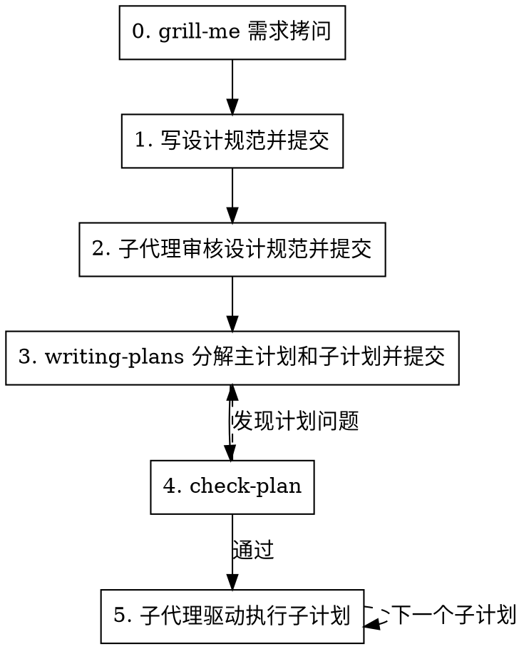

# 新特性实现工作流

## 概述

6 步严格顺序工作流：需求拷问 → 设计规范 → 规格评审 → 分阶段计划 → 计划检查 → 子计划执行。每个阶段必须在前一阶段通过确认、验证和 git 提交后才能继续。

## 何时使用

- 实现新特性、新功能、新模块或较大的行为变更
- 用户提到"新特性流程"、"feature development workflow"、"设计规范先行"、"分阶段计划"
- 需要先写设计规范，再拆计划、审查计划、按子计划执行

**不适用：** bug 修复、简单文本修改、纯文档修订、一次性小改动。

## 流程



<HARD-GATE>
严格按 0→1→2→3→4→5 顺序执行。禁止跳步、禁止先写代码、禁止未确认就提交、禁止未通过 check-plan 就开始实现。步骤 4 发现问题时只能回到步骤 3 修正计划后再检查。
</HARD-GATE>

## 上下文恢复机制

会话压缩后可能遗忘当前特性、工作树路径、设计规范路径、计划目录、已完成阶段和提交 SHA。每个步骤开始前，如不确定当前上下文，先检查状态文件；若状态文件记录了 `worktree_path`，必须先 `cd` 到该路径再继续。

### 状态文件位置

`$(git rev-parse --git-dir)/feature-development-state.json`

存放在 git dir（worktree 私有目录）下，不被 `git status` 检测。每个 worktree 拥有独立状态文件，支持多会话并行开发。

### 状态文件内容

```json
{
  "feature_name": "short feature name",
  "worktree_path": "/path/to/project-worktrees/feature-name",
  "worktree_branch": "feature/feature-name",
  "spec_path": "docs/.../feature-design-spec.md",
  "review_path": "docs/.../feature-design-review.md",
  "plan_dir": "docs/.../plans/feature-name",
  "current_step": "3",
  "current_phase": "phase-1",
  "commits": {
    "design_spec": "abc1234",
    "design_review": "def5678",
    "plans": "987abcd"
  },
  "created_at": "2026-06-30T10:00:00Z"
}
```

### 写入时机

- 步骤 0.4 建立工作树后创建状态文件，记录 `worktree_path` 和 `worktree_branch`
- 每完成一个步骤，更新 `current_step` 和对应 commit SHA
- 每完成一个子计划，更新 `current_phase`

## 全局规则

- **结构化询问：** 需要用户决策时，在 Trae 中使用 `AskUserQuestion`；在 Codex 中使用 `request_user_input`（如可用）或带清晰选项的简短文本问题。
- **文档规则优先：** 如果项目存在 `.trae/rules/docs.md`、`docs/CODING_STANDARDS.md`、`docs/AI/trae-xctest-rules.md` 或 `docs/ai/trae-xctest-rules.md`，在写设计规范、计划、检查计划或检查代码前先阅读并遵守。
- **UI 可观测性优先：** UI 相关功能必须定义用户可见证据。内部状态、ViewModel、reducer、buffer、layer count 或日志只能作为辅助证据，不能单独证明 UI 已完成。
- **提交边界：** 每次 commit 只包含当前阶段的相关文件。不得暂存无关脏文件，不得提交秘密文件，不得使用 `--no-verify`，不得 force push。
- **确认后提交：** 用户确认该阶段产物后才能提交。提交失败必须修复后重试，不得跳过提交继续下一步。
- **没有设计不写代码：** 步骤 5 之前禁止修改生产代码。若为验证设计临时探索，必须丢弃探索改动后回到当前步骤。

## UI 可观测性门禁

任何涉及 UI、桌面 app、Web app、可视化、快捷键交互、窗口/浮层/菜单/表单/画布的特性，都必须通过此门禁。

### 证据分层

优先级从高到低：

1. **真实路径自动化证据**：E2E、XCUITest、Playwright、Appium、真实浏览器或真实 app 流程，断言用户可见结果。
2. **稳定可观测标记**：可访问性树、DOM、窗口层级、截图像素、canvas pixel、状态日志、activation marker、ready hook；必须能证明用户可见行为。
3. **组件级 UI 证据**：渲染测试、快照、视觉回归、故事书截图；只能覆盖组件边界。
4. **手动验收证据**：明确步骤、预期画面、截图/录屏/日志路径、执行时间和执行人；只能用于自动化不可行的部分。
5. **内部状态证据**：单元测试、ViewModel 状态、Core 状态机、日志；只能证明支撑逻辑，不能单独关闭 UI AC。

### 关闭规则

- 每个 UI AC 至少需要一种 1-4 层证据；只有第 5 层证据时，状态必须标为“未完成 UI 验证”或“存在 UI 风险”。
- 自动化不可行时，必须在设计规范和子计划中写明原因、手动验收步骤、证据保存位置和剩余风险。
- 任何“测试不到但应该没问题”的结论都必须升级为风险项，不能作为完成依据。

---

## 步骤 0：grill-me 需求拷问

### 0.1 调用 grill-me

开始时宣布：

```
我正在使用 feature-development-workflow，并先调用 grill-me 确定新特性需求。
```

必须使用 `grill-me` 进行需求拷问。如果当前环境不能直接调用 `/grilling`，用同等强度的问题替代，并明确说明。

### 0.2 至少确认的问题

一次性收敛以下信息，避免后续设计返工：

1. 用户问题和业务目标：这个特性解决什么问题？
2. 成功标准：用户如何判断它完成？
3. 范围边界：必须做什么？明确不做什么？
4. 用户流程：入口、主要路径、失败路径、退出条件是什么？
5. 数据和接口：新增或修改哪些模型、配置、协议、API、持久化格式？
6. 兼容和迁移：是否影响旧行为、旧数据、旧快捷键、旧配置？
7. 验收标准：可测试的 AC 列表。
8. 阶段拆分：设计规范中要分成哪些 Phase，每个 Phase 的可交付结果是什么？
9. UI 证据：哪些 AC 需要真实 UI 交互验证？用 E2E/XCUITest/Playwright、截图、日志 marker、手动录屏还是组合证据？
10. 文档位置：按项目规则写在哪里；若无规则，使用 `docs/superpowers/specs/` 和 `docs/superpowers/plans/`。

### 0.3 出口判定

输出需求摘要并要求用户确认。

- 确认正确 → 进入 0.4 建立工作树隔离
- 需要补充 → 继续 grill-me，直到确认
- 理解有误 → 重述需求，重新执行 0.2

---

### 0.4 建立工作树隔离

需求确认后，必须使用 `using-git-worktrees` 技能建立隔离工作区，再进入步骤 1。后续所有设计规范、计划、代码、测试和提交均在该工作树内完成，不得切换回主仓库目录。

**默认约束（除非用户明确说明，否则必须遵守）：**

- **必须新建 worktree**：不得复用已有工作树。即使存在同名或相关分支的 worktree，也必须创建新的工作树，保证隔离环境干净。
- **仅参考当前 worktree**：设计规范、计划和实现只能参考当前 worktree 上的文档和代码，不得引用主仓库或其他工作树的内容。前置读取（步骤 1.1）的规则文件也以当前 worktree 内的为准。

开始时宣布：

```
我正在使用 using-git-worktrees 技能来建立一个隔离的工作区。
```

#### 0.4.1 计算工作树路径

基于**主仓库**位置计算工作树目录（非当前工作树），避免在 worktree 内调用时项目名识别错误：

```bash
common_dir=$(git rev-parse --git-common-dir)
main_root=$(cd "$(dirname "$common_dir")" && pwd)
project=$(basename "$main_root")
worktree_dir=$(dirname "$main_root")/${project}-worktrees
```

工作树目录固定位于主仓库的**上级目录**，命名为 `<project-name>-worktrees`，与主仓库同级。工作树目录位于项目之外，无需 `.gitignore` 验证，不会污染 git status。

#### 0.4.2 创建工作树

分支名基于特性名命名，例如 `feature/<feature-name>`，每个分支作为工作树目录的子目录：

```bash
BRANCH_NAME="feature/<feature-name>"
path="$worktree_dir/$BRANCH_NAME"
git worktree add "$path" -b "$BRANCH_NAME"
cd "$path"
```

#### 0.4.3 运行项目设置

自动检测并运行项目对应的依赖安装命令：

```bash
# Node.js
[ -f package.json ] && npm install
# Rust
[ -f Cargo.toml ] && cargo build
# Python
[ -f requirements.txt ] && pip install -r requirements.txt
[ -f pyproject.toml ] && poetry install
# Go
[ -f go.mod ] && go mod download
```

#### 0.4.4 验证基线

运行项目测试确保工作树初始状态干净：

```bash
# 使用项目对应的测试命令，如 npm test / cargo test / pytest / go test ./...
```

- **基线测试失败**：报告失败情况，询问是否继续或排查；不得带着失败测试继续
- **基线测试通过**：报告就绪

#### 0.4.5 报告与状态记录

```
工作树已就绪：<full-path>
分支：<branch-name>
测试通过（<N> 个测试，0 个失败）
准备实现 <feature-name>
```

将工作树路径和分支名写入状态文件（见「上下文恢复机制」）。

#### 0.4.6 出口判定

- 工作树就绪、基线通过 → 进入步骤 1
- 基线失败且无法排查 → 停止并向用户报告，不得继续

**重要：** 调用 `using-git-worktrees` 后，当前会话的工作目录必须始终位于该工作树路径下。后续每次会话开始时必须宣布当前所在工作树和分支。

---

## 步骤 1：写设计规范并提交

### 1.1 前置读取

按项目存在情况读取：

```bash
test -f .trae/rules/docs.md && sed -n '1,240p' .trae/rules/docs.md
test -f docs/CODING_STANDARDS.md && sed -n '1,240p' docs/CODING_STANDARDS.md
test -f docs/AI/trae-xctest-rules.md && sed -n '1,240p' docs/AI/trae-xctest-rules.md
test -f docs/ai/trae-xctest-rules.md && sed -n '1,240p' docs/ai/trae-xctest-rules.md
```

如规则文件很长，必须完整阅读与设计规范、验收标准、测试和回归相关的章节。

### 1.2 设计规范必须包含

**通过子代理编写**：设计规范是全文最长文档，直接在主线程编写会消耗大量 context。调度子代理，传入步骤 0 的需求摘要、步骤 1.1 读取的规则文件和以下章节要求，由子代理生成设计规范文件。

设计规范按项目模板优先；无模板时包含以下章节：

- 背景与目标
- 非目标
- 用户流程和交互入口
- 行为规则和状态机
- 数据模型、接口、配置、持久化影响
- 兼容性、迁移和回滚策略
- 可观测性：日志、埋点、调试开关
- 验收标准 AC：每条必须可验证
- 测试策略：单元、集成、UI、回归范围
- UI 可观测性矩阵：每个 UI AC 对应真实入口、操作路径、可见结果、证据类型、自动化可行性、手动验收步骤和剩余风险
- 分阶段设计：Phase 0..N，每个 Phase 有目标、范围、交付物、验证方式
- 风险和待确认问题

### 1.3 用户确认

展示设计规范路径和摘要，询问用户：

- 选项 1（推荐）：确认设计规范，可以提交
- 选项 2：需要补充或修改
- 选项 3：方向不对，回到步骤 0

### 1.4 提交

确认后只暂存设计规范及必要的状态文件：

```bash
git status --short
git diff -- <spec-path>
git add <spec-path>
git commit -m "docs: add <feature-name> design spec"
```

提交成功后记录 commit SHA 到状态文件，并进入步骤 2。

---

## 步骤 2：子代理审核设计规范并提交

### 2.1 调度规格审查子代理

必须调度独立子代理审核设计规范。可使用 `brainstorming/spec-document-reviewer-prompt.md` 作为模板；如果该模板不存在，使用以下检查项：

- 完整性：是否有 TODO、TBD、占位符、不完整章节
- 一致性：需求、AC、Phase、测试策略是否互相冲突
- 可计划性：是否足够具体，能被 `writing-plans` 拆成任务
- 范围：是否混入多个独立特性，是否需要拆成多个规格
- YAGNI：是否加入未请求功能或过度设计
- 可验证性：每个 AC 和 Phase 是否有明确验证方式
- UI 可观测性：UI AC 是否有用户可见证据，是否把内部状态误当成 UI 已验证

### 2.2 处理审查结果

- 通过且无建议 → 写入设计评审摘要
- 通过但有建议 → 判断是否影响计划；影响则修规范，不影响则记录为建议
- 发现问题 → 修设计规范，重新请子代理审核，直到通过

设计评审摘要保存到项目约定位置；无约定时保存为设计规范同目录的 `<feature-name>_设计评审摘要.md`。

### 2.3 用户确认并提交

展示审查结论和修改摘要，询问用户确认。确认后提交设计规范修订和设计评审摘要：

```bash
git add <spec-path> <review-path>
git commit -m "docs: review <feature-name> design spec"
```

提交成功后记录 commit SHA，并进入步骤 3。

---

## 步骤 3：writing-plans 分解主计划和子计划并提交

### 3.1 调用 writing-plans

**通过子代理编写**：主计划 + 多个 Phase 子计划是 token 量最大的文档产出。调度子代理（使用 `writing-plans` 技能），传入设计规范、设计评审摘要和测试用例表路径，由子代理生成全部计划文件。

开始时宣布：

```
我正在使用 writing-plans 技能，按设计规范的 Phase 拆分主实现计划和子计划。
```

必须读取已提交的设计规范和设计评审摘要，再调用 `writing-plans`。

### 3.2 计划结构

按项目文档规则优先；无规则时使用：

```text
docs/superpowers/plans/YYYY-MM-DD-<feature-name>/
  README.md
  phase-0-<name>.md
  phase-1-<name>.md
  phase-2-<name>.md
```

`README.md` 是主实现计划，必须包含：

- 目标和架构摘要
- 设计规范路径和评审摘要路径
- Phase 列表、依赖关系、执行顺序
- 每个 Phase 对应的子计划文件
- 全局验证命令和最终验收方式

每个 Phase 子计划必须包含：

- 本 Phase 的目标、范围和非目标
- 涉及文件和职责
- 小步骤任务，粒度为 2-5 分钟
- TDD 步骤：失败测试、验证失败、最小实现、验证通过、重构
- 精确命令和预期结果
- 本 Phase 的 `check-code` 标准
- UI 证据任务：涉及 UI 时必须写出真实交互验证命令，或手动验收脚本、截图/录屏/日志证据路径和风险记录
- commit 建议信息

### 3.3 自检

提交前必须自检：

- 设计规范每个 AC 是否映射到一个或多个计划任务
- 设计规范每个 Phase 是否有独立子计划
- 子计划之间依赖是否清晰
- 是否有 TODO、TBD、"后续补充"、"适当处理"等占位符
- 是否引用了未定义的类型、函数、路径或命令
- UI 相关 AC 是否都有 1-4 层证据计划；如果只有内部状态测试，必须标记为风险并补充真实 UI 验证或手动验收
- 是否符合 DRY、YAGNI、TDD、频繁 commit

### 3.4 用户确认并提交

展示主计划路径、子计划列表和自检结论，询问用户确认。确认后提交：

```bash
git add <plan-dir>
git commit -m "docs: add <feature-name> implementation plans"
```

提交成功后记录 commit SHA，并进入步骤 4。

---

## 步骤 4：check-plan

### 4.1 调用 check-plan

**通过独立子代理核对**：计划检查需要 fresh context 避免编写者自审偏见。调度独立子代理（非编写计划的子代理），传入计划目录、设计规范和评审摘要路径，由子代理执行核对并返回结论。

必须使用 `check-plan` 核对实施计划，重点检查：

- 是否遵循设计规范和设计评审摘要
- 是否遵循 `docs/CODING_STANDARDS.md`
- 是否遵循 `.trae/rules/docs.md`
- 是否遵循 `docs/AI/trae-xctest-rules.md` 或 `docs/ai/trae-xctest-rules.md`
- 主计划和 Phase 子计划是否一致
- 每个子计划是否有明确的测试、验证和提交步骤
- UI 子计划是否包含真实入口、真实操作、用户可见断言和证据保存方式
- 是否存在“只测内部状态却声称 UI 已验证”的计划缺陷

### 4.2 处理结果

- 通过 → 进入步骤 5
- 有问题 → 回到步骤 3 修正计划，再重新执行步骤 4
- UI 证据缺失 → 必须视为有问题；补充自动化验证或手动验收记录后才能通过

如果修正计划产生文件变更，必须在用户确认后提交：

```bash
git add <plan-dir>
git commit -m "docs: refine <feature-name> implementation plans"
```

---

## 步骤 5：子代理驱动执行子计划

### 5.1 选择执行方式

默认选择子代理驱动方式：

- 选项 1（推荐）：使用 `subagent-driven-development` 执行每个子计划
- 选项 2：子代理不可用时，使用 `executing-plans` 内联执行
- 选项 3：暂停，等待用户调整计划

用户没有明确反对时，选择选项 1。

### 5.2 每个子计划的固定节奏

对每个 Phase 子计划按顺序执行：

1. 读取主计划、当前子计划、设计规范和评审摘要
2. 使用 `subagent-driven-development` 分派实现子代理
3. 实现子代理按子计划执行任务，遵循 TDD
4. 每个实现任务完成后进行规格合规审查和代码质量审查
5. 当前子计划全部任务完成后，调用 `check-code`
6. 根据 `check-code` 结果修复问题，并重新检查，直到通过
7. 对 UI 子计划执行真实路径验证或手动验收脚本，并保存截图、录屏、日志或测试输出
8. 运行子计划要求的验证命令
9. 提交当前子计划相关代码、测试、文档、证据记录和计划进度
10. 更新状态文件的 `current_phase`
11. 进入下一个子计划

### 5.3 check-code 要求

**通过独立子代理核对**：代码检查需要 fresh context 避免实现者偏见。调度独立子代理（非实现该子计划的子代理），传入设计规范、当前 Phase 子计划和代码变更路径，由子代理执行核对并返回结论。

每个子计划完成后必须使用 `check-code`，核对：

- 代码是否符合设计规范和当前 Phase 子计划
- 是否遗漏 AC 或实现了超范围功能
- 是否符合 `docs/CODING_STANDARDS.md`
- 测试是否覆盖新增行为和受影响旧行为
- 日志、错误处理、边界条件是否完整
- UI 行为是否有用户可见证据：E2E/XCUITest/Playwright、截图像素、AX/DOM/window marker、录屏或手动验收记录
- 是否错误地把内部状态、mock、日志、layer count 或组件渲染测试当成完整 UI 验证
- 是否存在临时调试代码、未清理 TODO、未解释的跳过测试

### 5.4 子计划提交

`check-code` 通过并完成验证后提交：

```bash
git status --short
git diff
git add <files-for-current-phase>
git commit -m "feat: complete <feature-name> phase <N>"
```

如果实现任务已经按计划产生了多个 commit，仍需确保当前子计划结束时没有未提交变更；如 `check-code` 后没有新增变更，则记录最后一个属于该子计划的 commit SHA 作为完成点，不创建空提交，除非用户明确要求。

### 5.5 出口判定

- 所有子计划完成、`check-code` 通过、验证命令通过、工作区干净 → 工作流完成
- 任一子计划阻塞 → 停止并向用户报告阻塞点、已验证事实和建议选项
- 设计或计划在实现中被证明错误 → 回到步骤 1 或步骤 3，按顺序重新推进并提交修正
- UI 自动化无法覆盖的行为 → 必须交付手动验收记录和风险说明；否则不能声称该 UI AC 完成

## 红线

- 没有执行 grill-me 就写设计规范
- 需求确认后未建立 worktree 隔离就进入步骤 1
- 未经用户明确同意，复用已有 worktree 而非新建
- 设计规范参考了主仓库或其他 worktree 的文档和代码（用户未明确说明）
- 用户未确认设计规范就提交或进入评审
- 未经子代理审核就进入 writing-plans
- 没有主计划和 Phase 子计划就开始实现
- check-plan 未通过仍开始写代码
- 子计划完成后跳过 check-code
- UI AC 只有内部状态测试，却标记为完成
- 没有启动真实 app/浏览器或没有手动验收证据，却声称 UI 已验证
- 自动化不可行但未记录手动验收步骤、证据和剩余风险
- 审查发现问题但继续下一个子计划
- 将多个阶段的无关变更混在同一个 commit

**以上任一情况发生时，停止当前步骤，回到违规步骤重新执行。**
