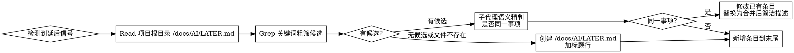

# later-tracking

## 概述

把跨会话的延后事项持久化到项目根目录的 `/docs/AI/LATER.md`，不是会话级 TodoWrite。记录前必须查现有 LATER.md 去重：同一事项修改，独立事项新增。每行一条，简要不展开。

**核心原则：** 会话内的任务用 TodoWrite；明确延后到未来会话的事项用 LATER。会话结束 TodoWrite 即失效，LATER 跨会话留存。

## 何时使用

触发条件（任一即触发）：
- 用户说"稍后"、"以后"、"回头"、"晚点"、"先跳过"、"先不做这个"、"下个版本"、"这次先不弄"、"LATER"
- 调试/审查中发现的不属于当前任务范围但有价值的事项（bug、优化点、技术债）
- 用户要求回顾 LATER 项
- Claude 在工作中发现某 LATER 项可能已解决

**不适用：**

- 当前会话内会立即处理的任务 → 用 TodoWrite
- 用户明确要求立即修复的问题
- 已标记完成 `- [x]` 的事项

## 与 TodoWrite 的边界

| 维度 | TodoWrite | LATER |
|------|-----------|-------|
| 生命周期 | 当前会话 | 跨会话持久化 |
| 用途 | 当前任务进度跟踪 | 延后到未来会话的事项 |
| 存储 | 工具内存 | 项目根目录 /docs/AI/LATER.md 文件 |
| 触发 | 任何多步骤任务 | 用户明确延后 / 范围外发现 |

**红线：** 用户说"以后再说"时用 TodoWrite 记录 = 失败。TodoWrite 会话结束即丢失，延后事项会无声消失。

## 核心流程



## 行格式

```
- [ ] LATER1. 简要描述 #模块标签
```

- 状态：`- [ ]` 待办 / `- [x]` 完成
- LATER前缀 + 序号：`LATER1.`（序号递增，与 Logseq TODO 格式对齐）
- 描述：≤80 个中文字符，不展开细节，一行一条
- 标签：模块/功能区域，允许多标签，`#通用` 兜底
- 多标签示例：`- [ ] LATER1. 修复 token 失效时的重定向逻辑 #登录 #安全`

## LATER.md 结构与位置

**文件位置**：项目根目录的 `/docs/AI/LATER.md`

不分节，所有条目平铺。完成的条目原地改 `- [x]`，不移动不删除。

首次创建时加标题行：
```markdown
# LATER - 延后事项记录

- [ ] LATER1. 第一条事项 #模块
```

## 去重判断

**两步法：**

1. **主代理粗筛**：Read `/docs/AI/LATER.md`，Grep 新事项的关键名词/动词，找出候选条目
2. **子代理精判**：把候选条目 + 新事项交给子代理，判断是否指向同一待解决事项

**决策标准：**
- 同一待解决事项（同一 bug、同一优化目标、同一功能点）→ **修改**已有条目
- 相关但独立（同模块的不同问题）→ **新增**

**修改方式：** 替换为合并后的简洁描述，保持单行 ≤80 字符。不追加、不嵌套、不保留原文。

## 完成标记

- 用户明确说某项完成了 → 标记 `- [x]`（保留 LATER 前缀和序号）
- Claude 在工作中发现某 LATER 项已解决 → **主动建议**用户确认，不直接标记（避免误判）

## 红线 - 以下行为都是失败

- 用户说"以后再说"时用 TodoWrite 记录而非 `/docs/AI/LATER.md`
- 不查 `/docs/AI/LATER.md` 就直接新增（导致重复）
- 新增条目描述超过 80 字符或展开成段落
- 因为"不主动建文档"的原则而不创建 `/docs/AI/LATER.md`
- 把 LATER 项记到全局位置或其他目录而非项目根目录的 `/docs/AI/`
- 标签用类型（#bug #优化）而非模块/功能
- 把"相关但独立"的事项合并成一条
- LATER 格式不带序号或前缀（如 `- [ ] 事项` 而非 `- [ ] LATER1. 事项`）

## 合理化借口表

| 借口 | 现实 |
|------|------|
| "TodoWrite 就是用来记这些的" | TodoWrite 会话结束即失效。跨会话延后事项会丢失。`/docs/AI/LATER.md` 才是持久化。 |
| "不主动建文档是我的默认原则" | `/docs/AI/LATER.md` 不是可选文档，是跨会话任务追踪的必需持久化文件。此原则不适用于 `/docs/AI/LATER.md`。 |
| "用户没明确要求建文件" | 用户说"以后再说"本身就是要求持久化。会话结束即丢等于没记。 |
| "查询去重太繁琐，直接加就行" | 不去重导致 `/docs/AI/LATER.md` 膨胀重复，最终无法使用。15 秒查询省下后续混乱。 |
| "描述详细点更清楚" | LATER 是索引不是文档。详细上下文在会话历史中可查。超 80 字必须压缩。 |
| "用全局 LATER.md 方便聚合" | 项目隔离。全局 LATER.md 无法区分来源，且污染非项目上下文。必须放在项目根目录的 `/docs/AI/`。 |
| "相关就合并到一条" | 相关 ≠ 同一事项。同模块的两个 bug 是独立的。只有同一待解决事项才合并。 |
| "子代理精判太慢" | 主代理 Grep 已粗筛，子代理只判断少量候选。比处理重复条目的后续混乱快得多。 |

## 常见错误

**错误 1：用 TodoWrite 代替 LATER**
```
# 错误
用户："这个优化以后再说"
→ TodoWrite 添加 pending 任务

# 正确
用户："这个优化以后再说"
→ Read `/docs/AI/LATER.md` → Grep → 子代理精判 → 修改或新增
```

**错误 2：不去重直接新增**
```
# 错误
`/docs/AI/LATER.md` 已有：- [ ] LATER1. 修复登录 token 失效 #登录
新事项：登录 token 偶尔过期
→ 直接追加新行

# 正确
→ Grep "token" 找到候选 → 子代理判断同一事项 → 修改原条目为合并描述
```

**错误 3：描述展开成段落**
```
# 错误
- [ ] LATER1. 用户反馈登录后 token 偶尔失效，可能是并发场景下 token 存储不一致，需要在 login.py 的 token 签发逻辑中排查，优先检查缓存和过期时间 #登录

# 正确
- [ ] LATER1. 排查登录 token 偶尔失效 #登录
```

**错误 4：把相关当同一事项合并**
```
# 错误
已有：- [ ] LATER1. 修复登录 token 失效 #登录
新事项：登录页面 UI 加载慢
→ 合并成：- [ ] LATER1. 修复登录 token 失效和 UI 加载慢 #登录

# 正确
→ 相关但独立 → 新增：- [ ] LATER2. 排查登录页 UI 加载慢 #登录 #UI
```

## 快速参考

| 操作 | 步骤 |
|------|------|
| 记录延后事项 | Read `/docs/AI/LATER.md` → Grep 关键词 → 有候选则子代理精判 → 修改或新增 `- [ ] LATER1. 事项 #标签` |
| 首次创建 | 创建 `/docs/AI/LATER.md`，加 `# LATER - 延后事项记录` 标题，写入第一条 `- [ ] LATER1. 事项 #标签` |
| 标记完成 | 用户确认后改 `- [x] LATER1.`，原地不动（保留序号） |
| 发现已解决 | 主动建议用户确认，不直接标记 |
| 回顾 LATER | Read `/docs/AI/LATER.md`，列出未完成项，等待用户指示 |
