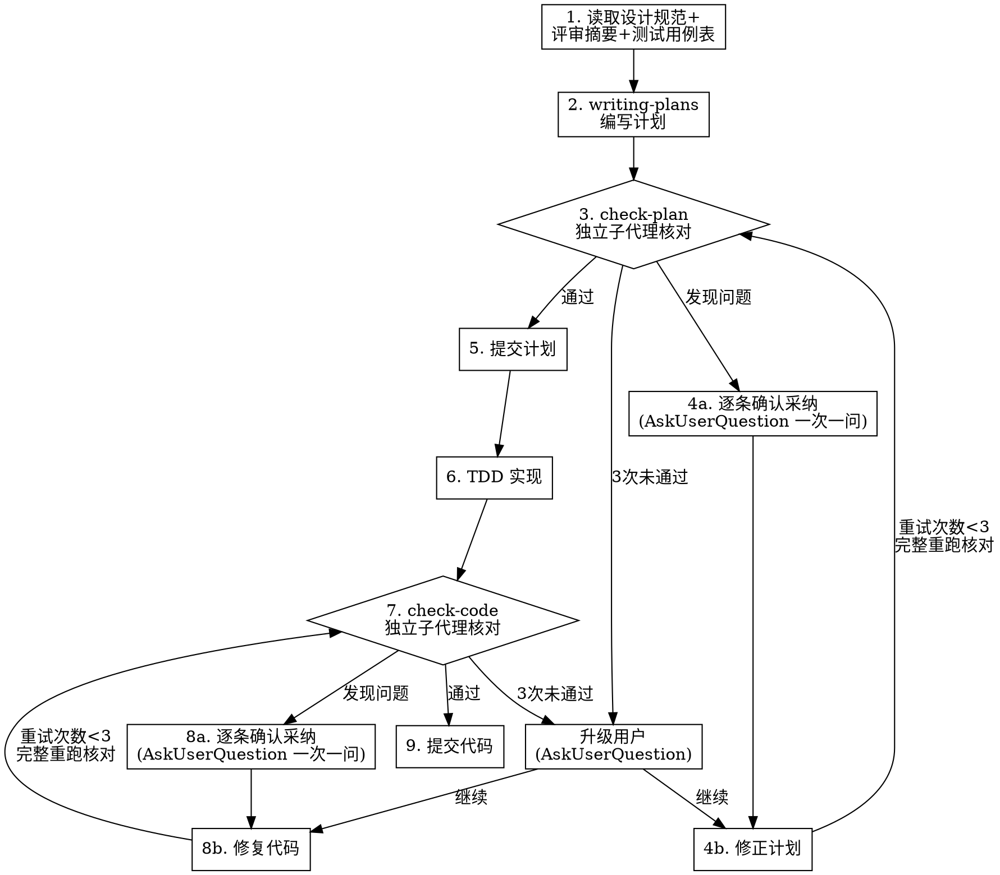

# 计划与代码核对

## 概述

统一的"写计划 → 核对计划 → 实现 → 核对代码"工作流，整合 writing-plans、check-plan、check-code 三个子技能。**铁律：核对必须由独立子代理执行，禁止自审；核对清单不能因压力省略；UI 可观测性门禁不可放宽。**

**开始时宣布：** "我正在使用 plan-and-code-verification 技能，将调度独立子代理执行核对。"

## 何时使用

- 设计规范已确认，需要编写实现计划并核对
- 实现阶段每完成一个 Phase/子计划，需要核对代码
- 用户提到"写计划"、"核对计划"、"核对代码"、"check-plan"、"check-code"
- 在 feature-development-workflow 的步骤 3-4 中作为子技能使用

**不适用：** bug 修复、简单文本修改、纯文档修改、一次性小改动

## 流程



<HARD-GATE>
核对阶段必须由独立子代理执行（非编写者/实现者自审）。每个核对建议通过 AskUserQuestion 逐条确认采纳（一次一问，10 条建议就问 10 次）。采纳任一建议并修改计划/代码后，必须重新调度子代理**完整重跑**核对流程（不增量核对）。任一核对阶段连续 3 次未通过，必须 AskUserQuestion 升级用户决策。禁止跳过任何检查项，禁止用"如适用"软化强制检查。
</HARD-GATE>

## 全局规则

- **禁止自审**：check-plan 和 check-code 必须调度独立子代理。编写者/实现者存在确认偏误，会忽略自己的盲点。"我熟悉内容"正是需要独立视角的理由，不是省略的理由。
- **完整核对清单**：不能因时间压力、疲惫、沉没成本省略任何检查项。"风险导向"不能用于省略强制检查项。
- **3 次重试上限**：每轮核对最多重试 3 次。第 4 次仍未通过 → AskUserQuestion 升级用户（继续修正 / 跳过该问题并记录 / 终止）。
- **逐条确认采纳**：核对子代理返回多条建议时，通过 AskUserQuestion **一次一问**逐条确认是否采纳。不得批量采纳，不得跳过任何建议的确认。
- **采纳后完整重跑**：采纳任一建议并修改计划/代码后，重新调度子代理**完整重跑**核对流程（不增量核对）。修改可能引入新问题。
- **禁止"实现时再发现"**：核对不能推迟到实现阶段。"实现时再发现"意味着已经写了基于错误假设的代码，返工成本远高于核对成本。
- **null 输入重问**：AskUserQuestion 返回 null（空值、取消）时，以原问题重新询问，不得假设默认值继续。
- **文档规则优先**：项目存在 `.trae/rules/docs.md`、`docs/CODING_STANDARDS.md`、`docs/AI/trae-xctest-rules.md` 时，写计划和核对前必须先阅读并遵守。

## UI 可观测性门禁

涉及 UI、桌面 app、Web app、可视化、快捷键交互、窗口/浮层/菜单/表单/画布的特性，必须通过此门禁。

**证据分层（优先级从高到低）：**

1. **真实路径自动化证据**：E2E、XCUITest、Playwright、Appium，断言用户可见结果
2. **稳定可观测标记**：可访问性树、DOM、窗口层级、截图像素、canvas pixel、状态日志、activation marker
3. **组件级 UI 证据**：渲染测试、快照、视觉回归、故事书截图
4. **手动验收证据**：明确步骤、预期画面、截图/录屏/日志路径、执行时间和执行人
5. **内部状态证据**：单元测试、ViewModel 状态、Core 状态机、日志——**只能证明支撑逻辑，不能单独关闭 UI AC**

**关闭规则：**
- 每个 UI AC 至少需要一种 1-4 层证据；只有第 5 层证据时，状态必须标为"未完成 UI 验证"或"存在 UI 风险"
- 自动化不可行时，必须在设计规范和子计划中写明原因、手动验收步骤、证据保存位置和剩余风险
- "测试不到但应该没问题"必须升级为风险项，不能作为完成依据

---

## 步骤 1：前置读取

读取已确认的设计规范、设计评审摘要、测试用例表，以及项目规则文件：

```bash
test -f .trae/rules/docs.md && cat .trae/rules/docs.md
test -f docs/CODING_STANDARDS.md && cat docs/CODING_STANDARDS.md
test -f docs/AI/trae-xctest-rules.md && cat docs/AI/trae-xctest-rules.md
```

规则文件不存在不报错，但存在时必须遵守。

## 步骤 2：writing-plans（编写计划）

**通过子代理编写**：主计划 + 多个 Phase 子计划是 token 量最大的文档产出。调度子代理，传入设计规范、评审摘要、测试用例表和项目规则文件路径，由子代理生成全部计划文件。

### 计划结构

```text
docs/superpowers/plans/YYYY-MM-DD-<feature-name>/
  README.md                  # 总实现计划
  phase-0-<name>.md          # Phase 0 子计划（如需拆分）
  phase-1-<name>.md          # Phase 1 子计划
```

按复杂度动态决定是否拆分子计划：
- **简单特性**（1-2 个 Phase，每个 Phase 任务数 ≤ 5）：总计划已足够
- **中等特性**（2-3 个 Phase，任务数 > 5）：按 Phase 拆子计划
- **复杂特性**（4+ Phase 或有跨 Phase 依赖）：按 Phase 拆 + 跨 Phase 依赖和集成验证计划

### README.md（总实现计划）必须包含

```markdown
# [功能名称] 实现计划

> **面向 AI 代理的工作者：** 必需子技能：使用 subagent-driven-development（推荐）或 executing-plans 逐任务实现此计划。步骤使用复选框（`- [ ]`）语法来跟踪进度。

**目标：** [一句话描述要构建什么]
**架构：** [2-3 句话描述方案]
**技术栈：** [关键技术/库]
**设计规范：** [路径]
**设计评审摘要：** [路径]

## Phase 列表
| Phase | 目标 | 子计划文件 | 依赖 |
|-------|------|-----------|------|
| 0 | ... | phase-0-xxx.md | 无 |

## 全局验证命令
[运行所有测试的命令]

## 最终验收方式
[如何确认整个特性已完成]
```

### Phase 子计划必须包含

- 本 Phase 的目标、范围和非目标
- 涉及文件和职责（设计边界清晰、接口定义良好）
- 小步骤任务，粒度 2-5 分钟（"编写失败测试"是一步，"运行验证失败"是一步，"实现最少代码"是一步，"运行验证通过"是一步，"Commit"是一步）
- TDD 步骤：失败测试 → 验证失败 → 最小实现 → 验证通过 → 重构
- 精确命令和预期结果
- UI 证据任务（涉及 UI 时）：真实交互验证命令，或手动验收脚本、截图/录屏/日志证据路径和风险记录
- commit 建议信息

### 任务结构示例

````markdown
### 任务 N：[组件名称]

**文件：**
- 创建：`exact/path/to/file.py`
- 修改：`exact/path/to/existing.py:123-145`
- 测试：`tests/exact/path/to/test.py`

- [ ] **步骤 1：编写失败的测试**

```python
def test_specific_behavior():
    result = function(input)
    assert result == expected
```

- [ ] **步骤 2：运行测试验证失败**
运行：`pytest tests/path/test.py::test_name -v`
预期：FAIL，报错 "function not defined"

- [ ] **步骤 3：编写最少实现代码**

```python
def function(input):
    return expected
```

- [ ] **步骤 4：运行测试验证通过**
运行：`pytest tests/path/test.py::test_name -v`
预期：PASS

- [ ] **步骤 5：Commit**
```bash
git add tests/path/test.py src/path/file.py
git commit -m "feat: add specific feature"
```
````

### 禁止占位符

每个步骤都必须包含工程师需要的实际内容。以下是**计划缺陷**——绝不要写出来：

- "待定"、"TODO"、"后续实现"、"补充细节"
- "添加适当的错误处理" / "添加验证" / "处理边界情况"
- "为上述代码编写测试"（没有实际测试代码）
- "类似任务 N"（重复代码——工程师可能不按顺序阅读任务）
- 只描述做什么而不展示怎么做的步骤（代码步骤必须有代码块）
- 引用了未在任何任务中定义的类型、函数或方法

## 步骤 3：check-plan（计划核对）

**通过独立子代理核对**：计划检查需要 fresh context 避免编写者自审偏见。调度独立子代理（**非编写计划的子代理**），传入计划目录、设计规范、评审摘要、测试用例表和项目规则文件路径，由子代理执行核对并返回结论。

### 子代理提示词模板

```
你是一名独立的计划核对员。请核对以下计划是否完备、可执行。

**待核对计划：** [PLAN_DIR]
**参考设计规范：** [SPEC_PATH]
**参考评审摘要：** [REVIEW_PATH]
**参考测试用例表：** [TEST_CASE_PATH]
**项目规则文件：** .trae/rules/docs.md, docs/CODING_STANDARDS.md, docs/AI/trae-xctest-rules.md（如存在）

## 核对检查表

逐项报告 PASS / FAIL（FAIL 需给出位置、问题和建议）：

| 类别 | 检查要点 |
|------|----------|
| 设计规范对齐 | 计划覆盖了设计规范中每个功能点和 AC，无遗漏、无超范围 |
| 评审摘要落实 | 评审摘要中的每条建议都在计划中得到了体现 |
| AC 覆盖度 | 每条验收标准都映射到一个或多个计划任务 |
| 占位符扫描 | 无 TODO/FIXME/待定/.../类似前面/待补充 |
| 类型一致性 | 跨任务/Phase 的接口签名、返回类型、属性名一致 |
| CODING_STANDARDS | 实现描述符合项目编码规范（命名、错误处理、日志） |
| docs.md 规则 | 计划文档结构符合项目文档规则 |
| trae-xctest-rules | 测试步骤符合项目测试规则 |
| UI 可观测性 | UI 相关功能有真实路径验证或手动验收+证据保存方式 |
| Phase 依赖 | Phase 间依赖显式声明，顺序合理 |
| 任务粒度 | 步骤可执行，2-5 分钟粒度，有精确命令和预期结果 |
| 可构建性 | 工程师能否按此计划执行而不会卡住 |

## 校准标准

**只标记会在实现阶段造成实际问题的事项。** 实现者构建了错误的东西或卡住了——这是问题。措辞小改进、风格偏好不是。除非存在严重缺陷——规格需求遗漏、矛盾的步骤、占位内容、模糊到无法执行的任务——否则应予以通过。

## 输出格式

## 计划核对

**状态：** 通过 | 发现问题

**问题（如有）：**
- [任务 X，步骤 Y]：[具体问题] - [为什么这对实现很重要]

**建议（仅供参考，不阻止通过）：**
- [改进建议]
```

### 处理核对结果

1. **通过且无建议** → 记录核对通过，进入步骤 5 提交计划
2. **通过但有建议** → 判断是否影响实现；影响则进入逐条确认流程，不影响则记录为建议
3. **发现问题** → 进入逐条确认流程

### 逐条确认流程

对核对子代理返回的**每一条**问题/建议：

1. 通过 AskUserQuestion 一次一问：是否采纳此条建议？
   - 选项 1（推荐）：采纳，修正计划
   - 选项 2：不采纳，记录原因
   - 选项 3：跳过此条，继续下一条
2. null 输入 → 以原问题重新询问
3. 10 条建议就问 10 次，不得批量采纳

**采纳任一建议并修正计划后**：重新调度子代理**完整重跑**核对流程（不增量核对）。重试计数 +1。

### 3 次重试上限

- 重试次数 < 3：继续逐条确认 + 修正 + 完整重跑
- 重试次数 = 3 仍未通过 → AskUserQuestion 升级用户：
  - 选项 1（推荐）：继续修正（重置计数为 0，继续逐条确认）
  - 选项 2：跳过剩余问题并记录为已知缺陷，继续下一步
  - 选项 3：终止工作流

## 步骤 5：提交计划

check-plan 通过后自动提交计划（设计规范确认后到代码同步前，按推荐路径自动执行）。

```bash
git add <plan-dir>
git commit -m "$(cat <<'EOF'
docs: add <feature-name> implementation plans

- 总计划: README.md
- Phase 子计划: phase-0-xxx.md, phase-1-xxx.md, ...
EOF
)"
```

提交成功后进入 TDD 实现阶段。

## 步骤 6：TDD 实现

按 Phase 子计划顺序执行，遵循 TDD 循环（失败测试 → 验证失败 → 最小实现 → 验证通过 → 重构 → Commit）。详细 TDD 流程参见 superpowers:test-driven-development。

每个子计划全部任务完成后，进入步骤 7 check-code。

## 步骤 7：check-code（代码核对）

**通过独立子代理核对**：代码检查需要 fresh context 避免实现者偏见。调度独立子代理（**非实现该子计划的子代理**），传入设计规范、当前 Phase 子计划、代码变更路径和项目规则文件路径，由子代理执行核对并返回结论。

### 子代理提示词模板

```
你是一名独立的代码核对员。请核对当前 Phase 的代码实现是否符合设计规范和计划。

**设计规范：** [SPEC_PATH]
**当前 Phase 子计划：** [PHASE_PLAN_PATH]
**代码变更：** git diff <BASE_BRANCH>...HEAD
**项目规则文件：** docs/CODING_STANDARDS.md, docs/AI/trae-xctest-rules.md（如存在）

## 核对检查表

逐项报告 PASS / FAIL（FAIL 需给出位置、问题和建议）：

| 类别 | 检查要点 |
|------|----------|
| 设计规范符合 | 代码符合设计规范和当前 Phase 子计划 |
| AC 覆盖 | 是否遗漏 AC 或实现了超范围功能 |
| CODING_STANDARDS | 代码符合项目编码规范 |
| 测试覆盖 | 测试覆盖新增行为和受影响旧行为 |
| 日志/错误处理/边界 | 日志、错误处理、边界条件完整 |
| UI 可观测性 | UI 行为是否有用户可见证据（E2E/XCUITest/Playwright/截图像素/AX/DOM/window marker/录屏/手动验收记录） |
| UI 证据误用 | 是否错误地把内部状态、mock、日志、layer count 或组件渲染测试当成完整 UI 验证 |
| 临时调试代码 | 是否存在临时调试代码、未清理 TODO、未解释的跳过测试 |

## UI 可观测性门禁

涉及 UI 的特性必须通过此门禁：
- 每个 UI AC 至少需要一种 1-4 层证据
- 只有第 5 层证据（内部状态/单元测试/ViewModel/mock/日志）时，状态必须标为"未完成 UI 验证"
- "测试不到但应该没问题"必须升级为风险项

## 输出格式

## 代码核对

**状态：** 通过 | 发现问题

**问题（如有）：**
- [文件:行号]：[具体问题] - [为什么这对实现很重要]

**建议（仅供参考，不阻止通过）：**
- [改进建议]
```

### 处理核对结果

处理流程与 check-plan 相同：

1. **通过且无建议** → 记录核对通过，进入步骤 9 提交代码
2. **通过但有建议** → 判断是否影响实现；影响则进入逐条确认流程，不影响则记录为建议
3. **发现问题** → 进入逐条确认流程

### 逐条确认流程

与 check-plan 的逐条确认流程相同：一次一问，采纳后完整重跑，3 次重试上限。

## 步骤 9：提交代码

check-code 通过后提交当前子计划成果：

```bash
git status --short
git diff
git add <files-for-current-phase>
git commit -m "$(cat <<'EOF'
feat(<feature-name>): complete phase <N> - <phase-name>

- 实现: <简述实现内容>
- 测试: <简述测试覆盖>
- 证据: <UI证据类型，如有>
EOF
)"
```

如实现任务已产生多个 commit，确保子计划结束时无未提交变更；如 check-code 后无新增变更，记录最后一个属于该子计划的 commit SHA 作为完成点，不创建空提交。

## 自检（计划编写者/代码实现者自行执行，**补充而非替代独立子代理核对**）

**重要：自检是补充，不是替代。** 自检发现问题直接内联修复。自检通过不等于核对通过——仍必须调度独立子代理执行 check-plan / check-code。

核对子代理之外，计划编写者/代码实现者也需自检：

**计划自检：**
1. **规格覆盖度**：设计规范每个 AC 是否映射到一个或多个计划任务
2. **占位符扫描**：搜索计划中的红旗——"禁止占位符"章节中的任何模式
3. **类型一致性**：后续任务中使用的类型、方法签名和属性名是否与前面任务中定义的一致

**代码自检：**
1. 是否所有 AC 都有对应测试
2. 是否所有受影响的旧行为都有回归测试
3. 是否有未清理的调试代码

自检发现问题直接内联修复，无需重新审查。

## 合理化借口表

| 借口 | 现实 |
|------|------|
| "时间紧，自检就行" | 自审有盲点。返工成本 = 已写代码工时 + 修复工时，远高于核对成本 |
| "我自己写的，我熟悉" | 熟悉 = 确认偏误 = 看不见自己盲点。这正是需要独立子代理的理由 |
| "调度子代理太耗 token" | 子代理的 token 开销 << 基于错误计划/代码返工的 token 开销 |
| "风险导向，省略低风险项" | 强制检查项不能用风险导向省略。"低风险"=未验证的假设 |
| "实现时再发现也来得及" | 实现时发现 = 已写了一批基于错误假设的代码，返工成本指数级 |
| "UI 是声明式的，ViewModel 对了 UI 就对" | ViewModel 正确 ≠ 绑定/样式/布局/交互正确。第 5 层证据不能单独关闭 UI AC |
| "如适用"软化强制检查 | 强制检查项不能用"如适用"软化。涉及 UI 就必须过 UI 可观测性门禁 |
| "诚实承认折中" | 承认折中 ≠ 允许折中。承认后仍必须遵守铁律 |
| "差不多行了" | 不是子代理说通过就不算通过。3 次未通过就升级用户 |
| "后写测试效果一样" | 后写测试 = "这做了什么？" 先写测试 = "这应该做什么？" |
| "计划/代码已经很长了，疲惫" | 疲惫时自审质量最差。独立子代理不受主线程疲惫影响 |
| "采纳小建议不用完整重跑" | 修改可能引入新问题。完整重跑是唯一可靠验证 |
| "自检通过就不用独立子代理核对了" | 自检是补充，不是替代。自检有盲点，独立子代理有 fresh context |
| "子代理提示词简单写就行" | 提示词必须包含完整核对检查表（见步骤 3/7 模板），否则子代理核对会遗漏检查项 |

## 红线 - 停下来重新开始

- 跳过 check-plan 直接开始实现
- 用自审替代独立子代理核对（check-plan 或 check-code）
- 因时间压力/疲惫/沉没成本省略检查项
- 用"如适用"软化强制检查
- 把核对推迟到实现阶段（"实现时再发现"）
- UI AC 只有第 5 层证据（内部状态/单元测试/mock/日志）就标记为完成
- 没有启动真实 app/浏览器或没有手动验收证据，却声称 UI 已验证
- 采纳建议后不完整重跑核对就继续
- 批量采纳核对建议而不逐条确认
- 核对 3 次未通过不升级用户就继续
- 将多个阶段的无关变更混在同一个 commit

**以上任一情况发生时，停止当前步骤，回到违规步骤重新执行。**

## 常见错误

| 错误 | 修复 |
|------|------|
| 调度编写计划的子代理核对同一计划 | 必须调度**新的独立子代理**，不共享上下文 |
| 子代理提示词只写"核对计划" | 必须传入完整核对检查表（见步骤 3/7 模板） |
| 核对子代理返回多条建议，主线程批量采纳 | 必须一次一问，10 条问 10 次 |
| 采纳建议后增量核对（只核对修改部分） | 必须**完整重跑**核对流程 |
| UI AC 只有单元测试就关闭 | 必须升级为"未完成 UI 验证"或补充 1-4 层证据 |
| 计划中出现"待定"/"TODO"/"类似前面" | 必须替换为实际内容，否则视为计划缺陷 |
| 跨任务类型/方法名不一致（如 task3 `clearLayers()` vs task7 `clearFullLayers()`） | 修正为一致命名 |
| 3 次未通过仍继续重试 | 必须 AskUserQuestion 升级用户决策 |

## 快速参考

| 阶段 | 谁执行 | 关键规则 |
|------|--------|---------|
| writing-plans | 子代理（编写） | 禁止占位符，TDD 步骤，精确命令 |
| check-plan | **独立子代理**（非编写者） | 完整核对检查表，逐条确认，3 次上限 |
| TDD 实现 | 子代理（实现） | 失败测试→实现→重构→Commit |
| check-code | **独立子代理**（非实现者） | UI 可观测性门禁，逐条确认，3 次上限 |

## 与 feature-development-workflow 的关系

本技能是 feature-development-workflow 步骤 3（计划编写）和步骤 4（TDD 实现）中"核对"部分的独立化抽取。可在 feature-development-workflow 内作为子技能使用，也可单独用于任何需要"写计划+核对+实现+核对"的场景。
