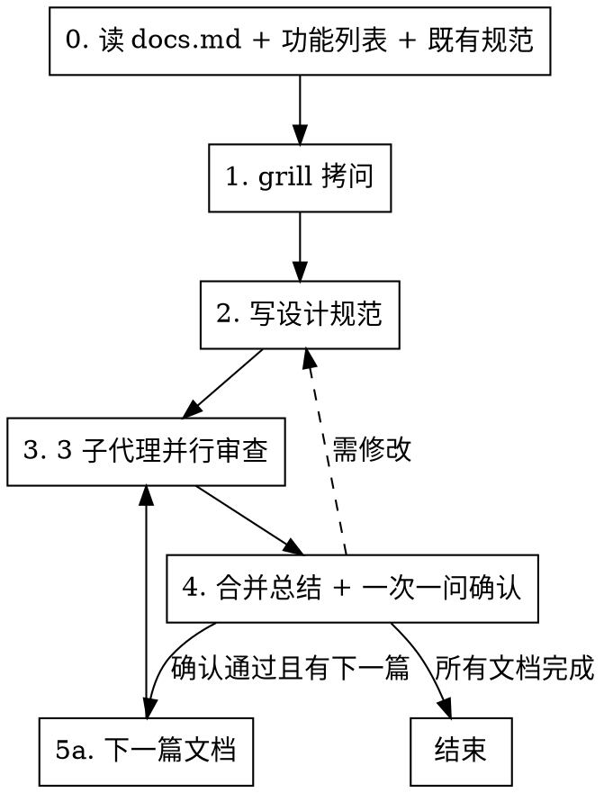

# 编写设计规范

## 概述

**先拷问再写规范，三审并行再确认，一份做完再做下一份。**

按"读规则 → grill → 写规范 → 3 子代理并行审查 → 合并总结 → 一次一问确认 → 下一篇文档"严格顺序执行。**违反规则的字面意思就是违反规则的精神。**

## 何时使用

- 新功能、大规模重构、API 迁移、设计驱动变更
- 用户提到"设计规范"、"design spec"、"写规格"、"规格文档"
- feature-development-workflow 步骤 2、bug-fix-workflow 之外的设计文档场景

**不适用：** bug 修复（用 bug-fix-workflow）、纯文档修改、一次性小改动、已有设计规范只需微调

## 流程



<HARD-GATE>
严格按 0→1→2→3→4 顺序执行。步骤 4 确认通过后若有下一篇文档，回到步骤 2 起始（针对新文档），但审查（步骤 3）仍必须是 3 子代理并行。禁止跳步、禁止并行执行不同步骤、禁止跳过审查、禁止合并多文档一次确认。

**进入下一步前置断言**：每进入下一步前，必须自查"上一步产物已在 git 历史中"（`git log --oneline -1` 可见对应 commit）。未提交则禁止进入下一步，先补提交。
</HARD-GATE>

## 全局规则

- **结构化询问**：需要用户决策时使用 `AskUserQuestion`（Trae）或对应工具，**一次只问一个问题**。
- **null 输入重问**：调用 `AskUserQuestion` 后，若返回结果为 null（含空值、空字符串、用户取消、未选择任何选项），视为未获取有效决策。必须以原问题重新询问用户，重复直到获取有效输入，不得自行假设默认值继续。
- **项目规则优先**：项目存在 `.trae/rules/docs.md`、`docs/CODING_STANDARDS.md`、`docs/AI/trae-xctest-rules.md` 时，必须先完整阅读再开始任何写作。
- **一次一个文档**：设计规范、视觉原型、测试用例表必须**逐份**完成（写 → 审 → 确认），禁止并行调度或一次写多份后批量确认。
- **没有拷问不写规范**：步骤 1 未完成禁止进入步骤 2。
- **没有审查不进入下一篇**：步骤 3 未完成（3 个子代理全部返回）禁止进入步骤 4。
- **每步必提交**：每个步骤产出可保存的工件后，**立即** `git add` + `git commit`，禁止跨步骤累积未提交变更。提交信息遵循 Conventional Commits（`<type>[scope]: <description>`，现在时+命令式，<72 字符）。禁止 `--no-verify`、`--force`、提交敏感文件、提交无关脏文件。
  - 步骤 0：提交"规则与参考摘要"到临时笔记文件（如 `docs/planning/P{n}/F{m}/.step0-rules-summary.md`）
  - 步骤 1：提交"grill 需求摘要"到临时笔记文件（如 `docs/planning/P{n}/F{m}/.step1-requirements-summary.md`）
  - 步骤 2：提交设计规范文件
  - 步骤 3：提交 3 份审查结果（保存到 `<feature-name>_审查结果.md`）
  - 步骤 4：提交合并总结 + 规范修复（如有）
  - 步骤 5：提交当前文档（视觉原型/测试用例表）+ 该文档的审查结果与合并总结
  - 工作流结束：删除步骤 0、1 的临时笔记文件并提交清理

---

## 步骤 0：读项目 docs.md + 参考已有规范与功能列表（强制首步）

**这是不可跳过的第一步。** 不是"在 grill 间隙扫一眼"，不是"写规范时再查"，而是开始任何设计工作前的独立强制步骤。

### 0.1 读取项目规则文件

```bash
test -f .trae/rules/docs.md && cat .trae/rules/docs.md
test -f docs/CODING_STANDARDS.md && cat docs/CODING_STANDARDS.md
test -f docs/AI/trae-xctest-rules.md && cat docs/AI/trae-xctest-rules.md
```

从 docs.md 提取并记录：
1. 设计规范必须包含的章节列表
2. 文档编写顺序（如"设计规范 → 视觉原型 → 测试用例表"）
3. 文件命名规则（如 `F{N}_{功能名}_设计规范.md`）
4. 文档存放路径（如 `docs/planning/P{n}/F{m}/`）
5. 版本号和最后更新日期规则
6. 是否要求视觉原型、测试用例表等其他文档

### 0.2 读取 app 功能列表

读取项目根目录或 `docs/` 下的 `app 功能列表.md`（按存在情况尝试）：

```bash
test -f "app 功能列表.md" && cat "app 功能列表.md"
test -f "docs/app 功能列表.md" && cat "docs/app 功能列表.md"
test -f "docs/app功能列表.md" && cat "docs/app功能列表.md"
```

从功能列表提取并记录：
- 本特性在功能列表中的编号（如 `F1.10`）和优先级（如 `P0`）
- 与本特性相关或可能冲突的其他功能编号
- 功能列表中本特性的简述（用于 grill 时核对范围）
- 整体功能版图（避免本特性与既有/规划功能重复或冲突）

**文件不存在** → 用 `AskUserQuestion` 询问功能列表路径；用户确认不存在则跳过本子步，但需在步骤 1 grill 时向用户确认功能编号和优先级。

### 0.3 参考最近提交的设计规范

**目的**：学习项目既有规范的风格、章节深度、AC 粒度、命名习惯，保持一致性。

搜索最近提交的设计规范文件（按修改时间倒序）：

```bash
# 在 docs/planning/ 下找最近 3 份设计规范
find docs/planning -name "*设计规范*.md" -type f -print0 \
  | xargs -0 ls -t 2>/dev/null | head -3

# 备用：在 docs/ 全量搜索
find docs -name "*设计规范*.md" -type f -print0 \
  | xargs -0 ls -t 2>/dev/null | head -3
```

对找到的最近 1-3 份设计规范：
- 完整阅读最近 1 份，记录其章节结构、AC 写法、mermaid 用法、版本记录格式
- 浏览其他 1-2 份的目录结构和 AC 粒度
- 提取可复用的写作模式（非复用文本）

**未找到任何既有规范** → 跳过本子步，按步骤 2 默认 12 章节编写。

### 0.4 产出与提交

将步骤 0.1-0.3 的记录写入临时笔记文件 `docs/planning/P{n}/F{m}/.step0-rules-summary.md`（路径按步骤 0.1 读取的规则；无规则时用 `docs/superpowers/specs/.step0-rules-summary.md`），包含：
- docs.md 6 项提取结果
- 功能列表中本特性编号、相关功能、简述
- 既有规范的可复用写作模式

立即提交：

```bash
git add docs/planning/P{n}/F{m}/.step0-rules-summary.md
git commit -m "docs(spec): record rules and references for F{m}"
```

**成功标准**：已完成 0.1-0.3 的读取与记录，并提交临时笔记。
**失败**：docs.md 不存在 → 询问用户文档规则路径，或使用默认规则（见步骤 2 默认章节）。

---

## 步骤 1：grill 拷问

**必需子技能：** 使用 grilling 技能进行拷问。

### 1.1 拷问范围

仅聚焦**需求本身**，不做技术方案设计。至少覆盖：

1. **用户问题和业务目标**：这个特性解决什么问题？
2. **成功标准**：用户如何判断它完成？
3. **范围边界**：必须做什么？明确不做什么？
4. **用户流程**：入口、主要路径、失败路径、退出条件
5. **数据和接口**：新增或修改哪些模型、配置、协议、API、持久化格式？
6. **兼容和迁移**：是否影响旧行为、旧数据、旧配置？
7. **验收标准 AC**：可测试的 AC 列表（场景+预期+验证方式）
8. **阶段拆分**：按功能需求分成哪些 Phase
9. **UI 证据**（涉及 UI 时）：哪些 AC 需要真实 UI 交互验证
10. **文档位置与编号**：功能编号 `F{m}` 和优先级 `P{n}`

### 1.2 一次一个问题

**铁律：一次只问一个问题，等用户回答后再问下一个。**

- 每个问题提供你的推荐答案
- 用户回答后，下一题基于该回答展开（走下设计树的每个分支）
- 禁止一次抛多个问题（"一次问 5 个问题提高效率"是违规）
- 能通过探索代码库回答的问题，自己探索而非问用户

### 1.3 出口判定

输出需求摘要（含上述 10 项的确认结果），用 `AskUserQuestion` 询问：

- 选项 1（推荐）：确认理解正确，进入步骤 2
- 选项 2：需要补充细节，继续 grill
- 选项 3：理解有误，重新描述需求

### 1.4 提交

确认通过后，将需求摘要写入 `docs/planning/P{n}/F{m}/.step1-requirements-summary.md`，立即提交：

```bash
git add docs/planning/P{n}/F{m}/.step1-requirements-summary.md
git commit -m "docs(spec): confirm requirements for F{m} via grilling"
```

**禁止**：跳过本次提交直接进入步骤 2。

---

## 步骤 2：写设计规范

**通过子代理编写**：设计规范是全文最长文档，直接在主线程编写会消耗大量 context。调度子代理，传入步骤 0 的规则摘要、步骤 1 的需求摘要和下方章节要求，由子代理生成设计规范文件。

### 2.1 文件命名与位置

按步骤 0 读取的 docs.md 规则；无规则时使用 `docs/superpowers/specs/F{N}_{功能名}_设计规范.md`。

### 2.2 必须包含的章节

按项目模板优先；无模板时使用以下默认 12 章节（参考 feature-development-workflow）：

1. **背景与目标**
2. **非目标**：明确不做什么
3. **用户流程和交互入口**（mermaid）
4. **行为规则和状态机**
5. **数据模型、接口、配置、持久化影响**
6. **兼容性、迁移和回滚策略**
7. **可观测性**：日志、埋点、调试开关
8. **验收标准 AC**：每条必须可验证（场景+预期+验证方式，必须有测试框架）
9. **测试策略**：单元、集成、UI、回归范围
10. **UI 可观测性矩阵**（涉及 UI 时）：每个 UI AC 对应真实入口、操作路径、可见结果、证据类型
11. **分阶段设计**：Phase 0..N，每个 Phase 有目标、范围、交付物、验证方式
12. **风险和待确认问题**

### 2.3 文档头部

```markdown
> 最后更新：YYYY-MM-DD | 版本：vX.Y
```

每次修改同步更新版本号和最后更新日期，文末添加版本记录列表。

### 2.4 红线

**绝不：**
- 在步骤 1 grill 未完成时开始写规范
- 使用 TODO、TBD、占位符、"待定"、"后续补充"
- 引用未在 grill 中确认的需求
- 跳过任何必须章节

### 2.5 提交

设计规范写完后立即提交：

```bash
git add <spec-path>
git commit -m "docs(spec): add F{m} design spec draft"
```

**禁止**：跳过本次提交直接进入审查。

---

## 步骤 3：3 子代理并行审查

**铁律：必须调度 3 个子代理并行审查，每个负责不同维度。**

**禁止：**
- 用 1 个子代理审查所有维度（"省时间"、"一个智能体足够"）
- 用人工快速浏览代替子代理审查
- 串行调度 3 个子代理（必须并行）
- 跳过审查

### 3.1 三个子代理的维度分配

| 子代理 | 审查维度 | 检查要点 |
|--------|---------|---------|
| **审查员 A** | 完整性 + 一致性 + **docs.md 合规性** | TODO/占位符/不完整章节；需求、AC、Phase、测试策略是否互相冲突；内部矛盾；**文档是否符合 docs.md（或默认规则）提取的 6 项规则（章节列表/编写顺序/命名规则/存放路径/版本号和最后更新日期/其他文档要求）；无 docs.md 时检查是否符合默认 12 章节及默认规则；审查报告中标注规则基准来源；详见 3.5** |
| **审查员 B** | 可计划性 + 范围 + YAGNI | 是否足够具体能被拆成任务；是否混入多个独立特性；是否加入未请求功能或过度设计 |
| **审查员 C** | 可验证性 + UI 可观测性 | 每个 AC 和 Phase 是否有明确验证方式；UI AC 是否有用户可见证据；是否把内部状态误当成 UI 已验证 |

### 3.2 调度方式

在**同一条消息中**发起 3 个 Task 调用（并行）：

```
Task(审查员 A) + Task(审查员 B) + Task(审查员 C)
```

每个子代理获得：
- 待审查文档路径
- 步骤 0 读取的 docs.md 规则摘要
- 步骤 1 的需求摘要
- 该子代理负责的审查维度和检查要点
- 输出格式要求（状态 + 问题 + 建议）

### 3.3 校准标准

只标记会在计划编写阶段造成实际问题的事项。缺失章节、矛盾之处、模糊到可能被两种方式理解的需求才是问题。措辞小改进、风格偏好不是。

### 3.4 审查员提示词模板

```
你是一名设计规范审查员，负责审查维度：[维度名称]。

待审查文档：[SPEC_PATH]
项目规则摘要：[DOCS_MD_SUMMARY]
需求摘要：[REQUIREMENTS_SUMMARY]

检查要点：
[该维度的具体检查项]

注：审查员 A 的 docs.md 合规性检查项详见 3.5

校准标准：只标记会在计划编写阶段造成实际问题的事项。

输出格式：
## 审查结果（[维度名称]）
**状态：** 通过 | 发现问题
**问题（如有）：**
- [章节 X]：[具体问题] - [为什么这对计划编写很重要]
**建议（仅供参考，不阻止通过）：**
- [改进建议]
```

### 3.5 审查员 A 的 docs.md 合规性检查要点

审查员 A 除完整性 + 一致性外，必须额外检查 docs.md 合规性，覆盖步骤 0.1 从 docs.md 提取的 6 项：

1. **章节列表**：目标文档章节是否符合 docs.md 定义的章节列表（无 docs.md 时用步骤 2.2 默认 12 章节）
2. **文档编写顺序**：是否按 docs.md 要求的顺序产出（设计规范 → 视觉原型 → 测试用例表）
3. **文件命名规则**：是否符合 docs.md 命名规则（无 docs.md 时用 `F{N}_{功能名}_设计规范.md`）
4. **文档存放路径**：是否符合 docs.md 路径规则（无 docs.md 时用 `docs/superpowers/specs/`）
5. **版本号和最后更新日期**：文档头部是否符合 `> 最后更新：YYYY-MM-DD | 版本：vX.Y` 格式
6. **其他文档要求**：是否按 docs.md 要求产出视觉原型/测试用例表等其他文档（对应 0.1 第 6 项）

**规则基准来源标注**：审查员 A 必须在审查报告中明确"使用了哪个规则基准"：
- 有 docs.md 时：标注 docs.md 路径（如 `.trae/rules/docs.md`）
- 无 docs.md 时：标注"默认规则（步骤 2.2 默认 12 章节）"
- 同时存在 CODING_STANDARDS.md / trae-xctest-rules.md 时：一并标注

**校准**：无 docs.md 不等于跳过 docs.md 合规性检查——改用默认规则基准执行检查并标注来源。

### 3.6 提交

3 个子代理全部返回后，将三份审查结果合并保存到 `<feature-name>_审查结果.md`（与设计规范同目录），立即提交：

```bash
git add <review-path>
git commit -m "docs(spec): record 3-way review for F{m} design spec"
```

**禁止**：跳过本次提交直接进入步骤 4。

---

## 步骤 4：合并总结 + 一次一问确认

### 4.1 合并三份审查结果

3 个子代理全部返回后，主线程合并输出：

```markdown
## 设计规范审查总结

### 审查员 A（完整性 + 一致性）
- 状态：[通过 | 发现问题]
- 问题：[列表或无]
- 建议：[列表或无]

### 审查员 B（可计划性 + 范围 + YAGNI）
- 状态：[通过 | 发现问题]
- 问题：[列表或无]
- 建议：[列表或无]

### 审查员 C（可验证性 + UI 可观测性）
- 状态：[通过 | 发现问题]
- 问题：[列表或无]
- 建议：[列表或无]

### 综合结论
- 是否通过：[是 | 否]
- 必须修复的问题：[列表]
- 可选改进：[列表]
```

### 4.2 处理审查结果

- **三审全通过且无必须修复问题** → 进入 4.3 确认
- **任一审查员发现必须修复问题** → 自动修复设计规范（直接修改文件），重新调度 3 个子代理审查，直到通过
- **只有建议无必须修复问题** → 记录建议，进入 4.3 确认

### 4.3 一次一问确认

用 `AskUserQuestion` 询问**一个问题**：

- 选项 1（推荐）：确认设计规范，可以进入下一篇文档
- 选项 2：需要修改，回到步骤 2 修改后重新审查
- 选项 3：方向不对，回到步骤 1 重新 grill

**禁止**：一次问多个问题（如"是否确认？是否要改 AC？是否要加章节？"）。

### 4.4 出口判定

- 确认通过 → 检查步骤 0 记录的"文档编写顺序"，若有下一篇文档，回到步骤 2 针对下一篇文档执行（写 → 3 子代理审 → 合并 → 确认）
- 所有文档完成 → 工作流结束

### 4.5 提交

用户确认通过后立即提交（含合并总结 + 规范修复，如有）：

```bash
git add <spec-path> <review-path> <summary-path>
git commit -m "docs(spec): confirm F{m} design spec after 3-way review"
```

**禁止**：跳过本次提交直接进入下一篇文档或结束工作流。

---

## 步骤 5：逐份完成其他文档

### 5.1 文档编写顺序

按步骤 0 从 docs.md 读取的顺序。常见顺序：

1. 设计规范（已在步骤 2-4 完成）
2. 视觉原型（涉及 UI 时）：`F{N}_{功能名}_视觉原型.html`
3. 测试用例表：`F{N}_{功能名}_测试用例表.md`

### 5.2 每篇文档的固定节奏

**一次一篇，每篇都走完整流程：**

1. 写该文档（调度子代理）
2. 调度 3 个子代理并行审查（维度可调整，见下表）
3. 合并审查总结
4. 一次一问确认
5. 确认通过后立即提交该文档 + 审查结果 + 合并总结
6. 确认通过后才进入下一篇

提交模板：

```bash
git add <doc-path> <review-path> <summary-path>
git commit -m "docs(spec): confirm F{m} <doc-type> after 3-way review"
```

其中 `<doc-type>` 为 `visual prototype` / `test cases` 等。

**禁止：**
- 一次写多篇文档后批量确认
- 并行调度子代理同时写多篇文档
- 跳过某篇文档的审查步骤
- 用"省交互轮次"为由合并确认
- 跳过该文档的提交直接进入下一篇

### 5.3 其他文档的审查维度

| 文档 | 审查员 A | 审查员 B | 审查员 C |
|------|---------|---------|---------|
| 视觉原型 | 与设计规范一致性 + 完整性 + **docs.md 合规性** | 交互可操作性 + 边界状态 | UI 可观测性 + 与 AC 对应 |
| 测试用例表 | AC 覆盖完整性 + 编号规范 + **docs.md 合规性** | 状态标注准确性 + 证据对应 | 与代码已有测试对照 + 缺失项识别 |

### 5.4 测试用例表的特殊要求

- 对照代码中已有测试标注覆盖状态（✅ COVERED / 🟡 PARTIAL / ❌ MISSING / ⏸️ DEFERRED）
- 文档头部版本号须注明对应的设计规范版本：`> 最后更新：YYYY-MM-DD | 版本：vX.Y（基于设计规范 vA.B）`
- 修改设计规范中的目标、范围、流程、接口、验收标准时，必须同步更新测试用例表

### 5.5 视觉原型的特殊要求

- 文件命名：`F{N}_{功能名}_视觉原型.html`，浏览器直接打开
- 涉及 UI 行为变化时，必须同步更新视觉原型
- 页面头部显示最后更新时间与版本信息

### 5.6 工作流结束清理

所有文档确认并提交后，删除步骤 0、1 的临时笔记文件并提交清理：

```bash
git rm docs/planning/P{n}/F{m}/.step0-rules-summary.md \
       docs/planning/P{n}/F{m}/.step1-requirements-summary.md
git commit -m "chore(spec): clean up temporary notes for F{m}"
```

**禁止**：保留临时笔记文件不清理（会污染 docs 目录）。

---

## 违规补救路径

破红线后不要"从头全部删除重做"——按违规类型精准补救：

| 违规类型 | 补救方式 | 已产出物的处理 |
|---------|---------|--------------|
| 跳过步骤 0（没读 docs.md） | 立即读 docs.md，对照检查已产出物是否符合规则 | 已产出物可保留，按规则修正不符合项 |
| 跳过步骤 1（没 grill） | 先核验步骤 0 是否完成（未完成则先读 docs.md），再 grill（一次一问），grill 后重写规范 | 旧规范**仅可作思路参考**，不得复用文本（基于未确认假设，会污染下游） |
| 步骤 2 规范有占位符/漏章节 | 补齐缺失章节，移除占位符 | 保留已写好的章节，仅修补问题部分 |
| 步骤 3 用 1 个子代理审 | 重新调度 3 个子代理并行审（无需重写规范） | 旧审查结果作废，以新 3 审为准 |
| 步骤 3 串行调度 3 个子代理 | 重新在同一消息中并行调度 3 个 | 旧审查结果作废 |
| 步骤 4 一次问多个问题 | 改为一次一问，重新走确认 | 已回答的内容可记录，但确认流程重走 |
| 任一步骤未提交就进入下一步 | 立即对当前步骤产出执行 `git add` + `git commit`，再进入下一步。**多步漏提交时按步骤顺序逐个补提交，禁止合并成单次 commit** | 已产出物保留，补提交即可 |
| 步骤 2 规范未提交就进入步骤 3 审查 | 步骤 3 审查结果**无效**（审查基线不可追溯）。先补提交规范（2.5），再重新调度 3 子代理审查 | 旧审查结果作废 |
| 步骤 5 并行写多篇/批量确认 | **丢弃**未确认的下游文档，回到首个未确认文档走完整流程 | 下游文档作废（基于未确认上游，等于赌对） |
| 工作流结束未清理临时笔记 | 立即 `git rm` 步骤 0、1 的临时笔记并提交清理 | 已产出文档不受影响 |

**关键原则：**
- 违规产物的"思路"可参考，"文本"不可复用（避免把错误前提固化）
- 下游文档基于未确认上游时必须作废——cascade 正确性比省时间重要
- 补救后必须从违规步骤重新走完整流程，不得跳到后续步骤

## 合理化借口表

| 借口 | 现实 |
|------|------|
| "1 个子代理审全维度更高效" | 1 个子代理上下文有限，会顾此失彼。3 个并行各专一域，问题发现率更高。省下的 5 分钟换不来规范质量。 |
| "时间紧，先写规范再补 grill" | 没 grill 锁定需求，写出的规范基于猜测，返工成本是 grill 的 10 倍。 |
| "在 grill 间隙扫一眼 docs.md 就行" | docs.md 是规则源头，不完整阅读会漏掉命名、路径、章节要求。必须独立首步。 |
| "一次问 5 个问题提高效率" | 一次多问会让用户浅答，且后续问题无法基于前答展开。一次一问才能走下设计树。 |
| "三份文档一次写完最后批量确认" | 视觉原型/测试用例表基于设计规范，规范未确认就写下游等于赌。一次一篇才能 cascade 正确性。 |
| "同事扫一眼比子代理审查快" | 同事扫一眼只能发现表面问题，子代理按维度系统检查才能发现深层矛盾和遗漏。 |
| "审查只有建议，不用改" | 建议可记录，但必须修复的问题必须改。混淆二者会让规范带病进入计划阶段。 |
| "这个情况不同，因为是……" | 规则无例外。如果你认为情况特殊，用 AskUserQuestion 提出，由用户决定。 |
| "我遵循的是精神而非字面" | 违反规则的字面意思就是违反规则的精神。 |
| "破红线后从头重做太重，旧规范可复用" | 跳过 grill 写的规范基于未确认假设，复用文本会污染下游。思路可参考，文本必须重写。见"违规补救路径"。 |
| "下游文档已写好，作废太浪费" | 下游基于未确认上游等于赌对，cascade 错误比重写更浪费。必须作废。 |
| "grill 后确认旧规范某段落前提无误，可酌情复用该段文本" | "酌情"是合理化后门——agent 会倾向认为所有段落都"前提无误"。绝对禁止复用文本，仅允许思路参考，安全且无歧义。 |
| "等几步一起提交更高效" | 每步提交是审计单元，跨步累积会让审查回溯困难，且任一步骤失败时丢失已验证成果。每步即提，不可累积。 |
| "步骤 0/1 只是笔记，不用提交" | 笔记是步骤 0/1 的工件，提交才能在步骤 3 审查时被引用，并在结束时被清理。不提交等于没产出。 |
| "docs.md 我熟，功能列表和既有规范扫一眼就行" | 0.1-0.3 三子步缺一不可。功能列表决定编号和范围，既有规范决定风格一致性。"扫一眼"会漏关键信息。完整读三类文件后产出摘要并提交。 |
| “规范+审查+总结一起提交省事” | 每步提交是审计单元。合并提交让审查回溯困难，且任一步失败时丢失已验证成果。按步骤顺序逐个提交。 |
| “docs.md 合规性检查可跳过，反正步骤 0 已读过” | 步骤 0 读规则不等于步骤 3 验证合规。读取是输入，验证是输出。没有审查员 A 的 docs.md 合规性检查，目标文档可能偏离项目规则而不被发现，导致下游计划基于错误前提。 |

## 红线 — 停下来重新开始

- 没读 docs.md 就开始 grill 或写规范
- 跳过读取 app 功能列表和最近设计规范的参考（步骤 0.2、0.3）
- grill 未完成就写规范
- 一次问多个问题
- 用 1 个子代理审查代替 3 个并行
- 串行调度 3 个子代理（非并行）
- 跳过审查直接确认
- 一次写多篇文档后批量确认
- 审查发现必须修复问题但继续下一步
- 任一步骤未提交 git 就进入下一步
- 工作流结束未清理步骤 0、1 临时笔记
- 审查时未检查 docs.md 合规性（审查员 A 漏查 6 项规则）
- 用"省时间/省交互"为由违反上述任一规则

**以上任一情况发生时，停止当前步骤，回到违规步骤重新执行。**

## 常见错误

| 错误 | 修复 |
|------|------|
| 忘记读 docs.md，直接用默认 12 章节 | 步骤 0 是强制首步，先读再用默认章节补齐 |
| 步骤 0 只读 docs.md，忽略功能列表和既有规范 | 0.1-0.3 三类文件都要读，缺一不可 |
| grill 时一次抛多个问题 | 严格一次一个，等回答再问下一个 |
| 用 1 个子代理审所有维度 | 必须调度 3 个并行，按 3.1 表分配维度 |
| 三份文档并行调度子代理写 | 一次一篇，每篇走完整流程 |
| 审查结果只有建议就强制修改 | 区分"必须修复"和"建议"，建议可记录但不阻止通过 |
| 确认时一次问多个问题 | 一次一问，用 AskUserQuestion 单问题 |
| 跨步骤累积未提交变更 | 每步即提，步骤末尾必有 `git commit` |
| 忘记让审查员 A 检查 docs.md 合规性 | 步骤 3 必须由审查员 A 检查 docs.md 合规性 6 项（章节/顺序/命名/路径/版本号/其他文档），无 docs.md 时用默认规则基准并标注来源 |

## 快速参考

| 步骤 | 关键动作 | 提交 | 红线 |
|------|---------|------|------|
| 0. 读规则+参考 | 0.1 docs.md / 0.2 app 功能列表 / 0.3 既有规范 | 提交 `.step0-rules-summary.md` | 漏读任一子项 |
| 1. grill | 一次一问，覆盖 10 项 | 提交 `.step1-requirements-summary.md` | 一次多问、跳过 grill |
| 2. 写规范 | 子代理生成，12 章节无占位符 | 提交规范文件 | grill 未完成就写 |
| 3. 3 子代理审 | 同一消息并行调度 3 个（审查员 A 含 docs.md 合规性检查） | 提交审查结果文件 | 1 个代替 3 个、串行、**漏查 docs.md 合规性** |
| 4. 合并确认 | 合并总结 + 一次一问 | 提交总结+规范修复 | 一次多问、批量确认多篇 |
| 5. 下一篇 | 一次一篇，每篇走 2-4 | 每篇确认后提交该文档+审查+总结 | 并行写多篇、跳过审查 |
| 结束 | 清理临时笔记 | `git rm` + 提交清理 | 保留临时笔记不清理 |
