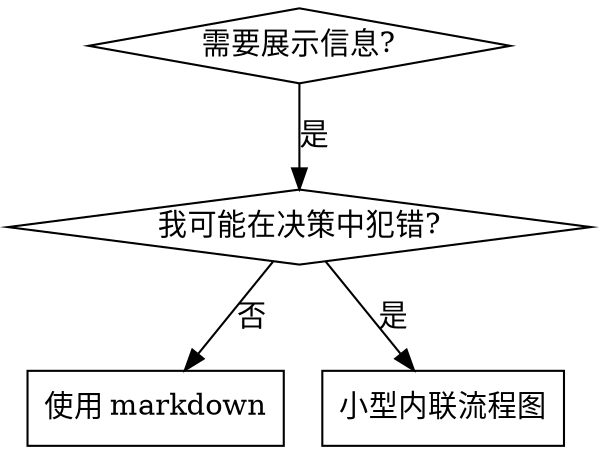

# 编写技能

## 概述

**编写技能就是将测试驱动开发应用于流程文档。**

**个人技能存放在智能体特定的目录中（Claude Code 用 `~/.claude/skills`，Codex 用 `~/.agents/skills/`）**

你编写测试用例（带子智能体的压力场景），观察它们失败（基线行为），编写技能（文档），观察测试通过（智能体遵守规则），然后重构（堵住漏洞）。

**核心原则：** 如果你没有观察到智能体在没有该技能时失败，你就不知道这个技能是否教了正确的东西。

**内置前提：** 本技能自包含红-绿-重构（红 = 无技能基线失败，绿 = 技能让场景通过，重构 = 新压力场景堵漏洞），无需依赖外部 Superpowers 技能。

**官方指南：** Anthropic 官方最佳实践见 [anthropic-best-practices.md](anthropic-best-practices.md)，是本技能 TDD 导向方法的补充。

## 什么是技能？

**技能**是经过验证的技术、模式或工具的参考指南，帮助未来的智能体找到并应用有效的方法。

**技能是：** 可复用的技术、模式、工具、参考指南。**技能不是：** 关于你某次如何解决问题的叙事。

三种类型：**技术类**（有具体步骤的方法）、**模式类**（思考问题的方式）、**参考类**（API 文档、语法指南、工具文档）。

## TDD 映射到技能

| TDD 概念 | 技能创建 |
|----------|---------|
| **测试用例** | 带子智能体的压力场景 |
| **生产代码** | 技能文档（SKILL.md） |
| **测试失败（红）** | 智能体在没有技能时违反规则（基线） |
| **测试通过（绿）** | 智能体在有技能时遵守规则 |
| **重构** | 在保持合规的同时堵住漏洞 |
| **先写测试** | 在编写技能之前先运行基线场景 |
| **观察失败** | 记录智能体使用的确切合理化借口 |
| **最小代码** | 编写针对那些具体违规行为的技能 |
| **观察通过** | 验证智能体现在遵守规则 |
| **重构循环** | 发现新的合理化借口 → 堵住 → 重新验证 |

## 何时创建技能

**创建条件：** 非直觉上显而易见；会在不同项目中反复引用；模式广泛适用（非项目特定）；他人也受益。

**不要创建：** 一次性解决方案；其他地方已充分文档的标准实践；项目特定约定（放 CLAUDE.md）；机械性约束（能用正则/验证强制执行的就自动化——文档留给需要判断的场景）。

## 目录结构与文件组织

```
skills/
  skill-name/
    SKILL.md              # 主参考文档（必需）
    supporting-file.*     # 仅在需要时
```

**扁平命名空间** —— 所有技能在一个可搜索的命名空间中。

三种布局：

- **自包含**（如 `defense-in-depth/`）：所有内容内联，适用于内容放得下、无需大量参考；
- **带可复用工具**（如 `condition-based-waiting/`）：SKILL.md 放概述与模式，`example.ts` 是可适配的工作代码；
- **带大量参考**（如 `pptx/`）：SKILL.md 放概述与工作流，另有 600 行级 API 参考（`pptxgenjs.md`）和 `scripts/` 可执行工具。

**分离文件的情况：** 大量参考内容（100+ 行，API 文档、全面语法说明）；可复用工具（脚本、实用程序、模板）。
**保持内联：** 原则和概念；代码模式（< 50 行）；其他所有内容。

## SKILL.md 结构

**Frontmatter（YAML）：**

- 必需字段：`name` 和 `description`（完整支持字段参见 [agentskills.io/specification](https://agentskills.io/specification)）；总计最多 1024 字符
- `name`：只使用字母、数字和连字符（不要用括号、特殊字符）
- `description`：第三人称，仅描述何时使用（不是做什么）；以 "Use when..." 开头，聚焦触发条件，含具体症状、场景和上下文；**绝不总结技能的流程或工作流**（原因见 CSO）；尽量控制在 500 字符以内

```markdown
---
name: Skill-Name-With-Hyphens
description: Use when [具体的触发条件和症状]
---

# 技能名称

## 概述
这是什么？用 1-2 句话说明核心原则。

## 何时使用
[如果决策不明显，使用小型内联流程图]

症状和用例的要点列表
不适用的场景

## 核心模式（技术/模式类）
前后代码对比

## 快速参考
用于快速浏览常见操作的表格或要点

## 实现
简单模式内联代码
大量参考或可复用工具链接到文件

## 常见错误
常见问题 + 修复方法

## 实际效果（可选）
具体结果
```

## Claude 搜索优化（CSO）

**发现至关重要：** Claude 读取描述来决定为当前任务加载哪些技能；描述必须能回答"我现在应该读这个技能吗？"

**核心规则：描述只写触发条件，绝不总结工作流。** 测试表明：总结工作流的描述会成为 Claude 的捷径——一个写着"任务间进行代码审查"的描述导致 Claude 只做一次审查，跳过了技能流程图规定的两阶段审查；改为纯触发条件后，Claude 正确阅读流程图并遵循了两阶段流程。

```yaml
# 错误：总结了工作流 / 流程细节太多
description: Use when executing plans - dispatches subagent per task with code review between tasks
description: Use for TDD - write test first, watch it fail, write minimal code, refactor

# 错误：太抽象、第一人称、提到技能并非其特定的技术
description: For async testing
description: Use when tests use setTimeout/sleep and are flaky

# 正确：只有触发条件，描述问题而非语言特定症状
description: Use when executing implementation plans with independent tasks in the current session
description: Use when tests have race conditions, timing dependencies, or pass/fail inconsistently

# 正确：技术特定的技能在触发条件中明确点名技术
description: Use when using React Router and handling authentication redirects
```

- **关键词覆盖**：全文写入 Claude 会搜索的词——错误信息（"Hook timed out"、ENOTEMPTY）、症状（flaky、hanging、zombie、pollution）、同义词（timeout/hang/freeze、cleanup/teardown/afterEach）、真实工具/命令/库名。
- **描述性命名**：动词优先、主动语态、用"你做的事或核心洞察"命名：`creating-skills` 优于 `skill-creation`；`condition-based-waiting` 优于 `async-test-helpers`；`flatten-with-flags` 优于 `data-structure-refactoring`；`root-cause-tracing` 优于 `debugging-techniques`。动名词适合描述流程（`testing-skills`、`debugging-with-logs`）。

### Token 效率（关键）

getting-started 和频繁引用的技能会加载到每个对话，每个 token 都重要。目标字数：getting-started 工作流每个 <150 词；频繁加载的技能总计 <200 词；其他技能 <500 词。

- **细节移到工具帮助**：不列出全部参数，写"运行 `--help` 查看详情"。
- **交叉引用其他技能**：只写技能名 + 明确必需标记（如 `**必需规则：** 先建立失败基线，再修改并重跑压力场景`）；**不用 `@` 链接外部技能**——`@` 会立即强制加载文件，提前消耗 200k+ 上下文；不重复被引用技能已有的内容。
- **一个优秀的示例胜过多个平庸的**：完整可运行、注释良好并解释为什么、清晰展示目标模式、来自真实场景、可直接适配（不是通用模板）；选择最相关语言（测试技术 → TS/JS，系统调试 → Shell/Python，数据处理 → Python）；不要 5 种语言各写一遍、不要填空模板、不要为同一模式提供多个示例。
- 验证：`wc -w skills/path/SKILL.md`。

## 流程图使用



**仅在以下情况使用流程图：** 非显而易见的决策点；你可能过早停止的流程循环；"何时使用 A vs B"的决策。
**绝不使用流程图用于：** 参考资料（用表格、列表）；代码示例（用 Markdown 代码块）；线性指令（用编号列表）；无语义意义的标签（step1、helper2）。

graphviz 样式规则见 [graphviz-conventions.dot](graphviz-conventions.dot)。可用本目录的 `render-graphs.js` 把技能流程图渲染为 SVG：`./render-graphs.js ../some-skill`（`--combine` 合并为一个 SVG）。

## 技能的红-绿-重构

### 红：编写失败的测试（基线）

在没有技能的情况下运行压力场景，逐字记录：它们做了什么选择？使用了什么合理化借口（原文）？哪些压力触发了违规？——这就是"观察测试失败"，编写技能之前必须看到智能体自然会怎么做。

### 绿：编写最小技能

编写针对那些具体合理化借口的技能，不为假设情况添加额外内容。用技能运行相同场景，智能体应该现在遵守。

### 重构：堵住漏洞

智能体找到新的合理化借口？添加明确的反驳，重新测试直到无懈可击。

**测试方法论：** 如何编写压力场景、压力类型（时间、沉没成本、权威、疲惫）、系统性堵漏与元测试技巧，见 [testing-skills-with-subagents.md](testing-skills-with-subagents.md)。

## 让技能经受住合理化的考验

执行纪律的技能（如 TDD）需要抵抗合理化——智能体很聪明，在压力下会找到漏洞。

**心理学说明：** 说服技巧的研究基础（Cialdini, 2021; Meincke et al., 2025：权威、承诺、稀缺、社会认同、归属）见 [persuasion-principles.md](persuasion-principles.md)。

### 明确堵住每个漏洞

不要只是陈述规则——禁止具体的变通方法：

<Bad>
```markdown
先写代码再写测试？删掉它。
```
</Bad>

<Good>
```markdown
先写代码再写测试？删掉它。重新开始。

**无例外：**
- 不要保留作为"参考"
- 不要在写测试时"调整"它
- 不要看它
- 删除就是删除
```
</Good>

### 应对"精神 vs 字面"的辩论

在规则前加入基础原则：**违反规则的字面意思就是违反规则的精神。** 这切断整类"我遵循的是精神"的合理化借口。

### 构建合理化借口表与红线列表

从基线测试中捕获的每个借口都进表（写法示例）：

```markdown
| 借口 | 现实 |
|------|------|
| "太简单不值得测试" | 简单的代码也会出错。测试只需 30 秒。 |
| "后写测试效果一样" | 后写测试 = "这做了什么？" 先写测试 = "这应该做什么？" |
```

并创建红线列表让智能体容易自查：

```markdown
## 红线 - 停下来重新开始

- 先写代码再写测试
- "我已经手动测试过了"
- "后写测试效果一样"
- "重要的是精神不是仪式"
- "这个情况不同，因为……"

**以上所有都意味着：删除代码。用 TDD 重新开始。**
```

在描述中加入违规时的症状（如 `use when implementing any feature or bugfix, before writing implementation code`）。

## 测试所有技能类型

| 类型 | 例 | 测试方式 | 成功标准 |
|------|------|------|------|
| 纪律执行类（规则/要求） | TDD、完成前验证、编码前设计 | 学术性问题；压力场景；组合压力（时间 + 沉没成本 + 疲惫）；识别合理化借口并明确反驳 | 智能体在最大压力下遵循规则 |
| 技术类（操作指南） | condition-based-waiting、root-cause-tracing | 应用场景；变体/边界场景；缺失信息测试 | 成功将技术应用到新场景 |
| 模式类（心智模型） | reducing-complexity、information-hiding | 识别场景；应用场景；反例（知道何时不应用） | 正确识别何时/如何应用模式 |
| 参考类（文档/API） | API 文档、命令参考、库指南 | 检索场景；应用场景；覆盖测试（常见用例） | 找到并正确应用参考信息 |

## 跳过测试的常见合理化借口

| 借口 | 现实 |
|------|------|
| "技能显然很清晰" | 对你清晰 ≠ 对其他智能体清晰。测试它。 |
| "这只是参考资料" | 参考资料可能有遗漏、不清楚的地方。测试检索。 |
| "测试太过了" | 未测试的技能总有问题。15 分钟测试省下数小时。 |
| "有问题再测试" | 问题 = 智能体无法使用技能。在部署前测试。 |
| "测试太繁琐" | 测试比在生产中调试坏技能少繁琐得多。 |
| "我有信心它很好" | 过度自信保证出问题。无论如何都要测试。 |
| "学术审查就够了" | 阅读 ≠ 使用。测试应用场景。 |
| "没时间测试" | 部署未测试的技能比后面修复浪费更多时间。 |

**以上所有都意味着：部署前测试。无例外。**

## 铁律（与 TDD 相同）

```
没有失败的测试就不写技能
```

适用于新技能和对现有技能的编辑。先写技能再测试？删掉它，重新开始。编辑技能不测试？同样违规。

**无例外：** 不存在"简单的添加""只是加一个章节""文档更新"的豁免；不要保留未测试的更改作为"参考"；不要在运行测试时"调整"；删除就是删除。

**原则：** 技能文档也必须先看到基线失败，再修改规则并验证压力场景通过；不能只凭文字看起来合理就宣布有效。

## 反模式

- **叙事式示例**："在 2025-10-03 的会话中，我们发现空的 projectDir 导致了……"——太具体，不可复用。
- **多语言稀释**：example-js.js、example-py.py、example-go.go——质量平庸，维护负担重。
- **流程图中的代码**：节点放 `import fs` 这类语句——无法复制粘贴，难以阅读。
- **通用标签**：helper1、helper2、step3、pattern4——标签应有语义意义。

## 停下：进入下一个技能之前

**编写任何技能后，你必须停下来完成下方部署清单。** 不要批量创建多个技能而不逐个测试；不要在当前技能验证前进入下一个；不要因为"批量处理更高效"跳过测试。部署未测试的技能 = 部署未测试的代码。

## 技能创建清单（TDD 适配版）

**使用 TodoWrite 为下面每个清单项创建待办。**

**红色阶段 - 编写失败的测试：**
- [ ] 创建压力场景（纪律类技能需 3 个以上组合压力）
- [ ] 在没有技能的情况下运行场景 - 逐字记录基线行为
- [ ] 识别合理化借口中的模式

**绿色阶段 - 编写最小技能：**
- [ ] 名称只使用字母、数字、连字符（无括号/特殊字符）
- [ ] YAML frontmatter 包含必需的 `name` 和 `description` 字段（最多 1024 字符；参见 [spec](https://agentskills.io/specification)）
- [ ] 描述以 "Use when..." 开头、第三人称、含具体触发条件/症状
- [ ] 全文包含搜索关键词（错误、症状、工具）
- [ ] 带有核心原则的清晰概述；解决红色阶段识别出的具体基线失败
- [ ] 代码内联或链接到独立文件；一个优秀的示例（非多语言）
- [ ] 用技能运行场景 - 验证智能体现在遵守

**重构阶段 - 堵住漏洞：**
- [ ] 从测试中识别新的合理化借口；添加明确的反驳（纪律类技能）
- [ ] 从所有测试迭代中构建合理化借口表；创建红线列表
- [ ] 重新测试直到无懈可击

**质量检查：**
- [ ] 仅在决策不明显时使用小流程图
- [ ] 快速参考表；常见错误章节；无叙事性故事
- [ ] 支持文件仅用于工具或大量参考

**部署：**
- [ ] 将技能提交到 git 并推送到你的 fork（如果已配置）
- [ ] 考虑通过 PR 贡献回去（如果具有广泛用途）

## 发现工作流

未来的智能体如何找到你的技能：**遇到问题**（"测试不稳定"）→ **描述匹配**找到技能 → **浏览概述**确认相关 → **阅读快速参考** → **仅在实现时加载示例**。为此把可搜索的术语放在前面和各处。
